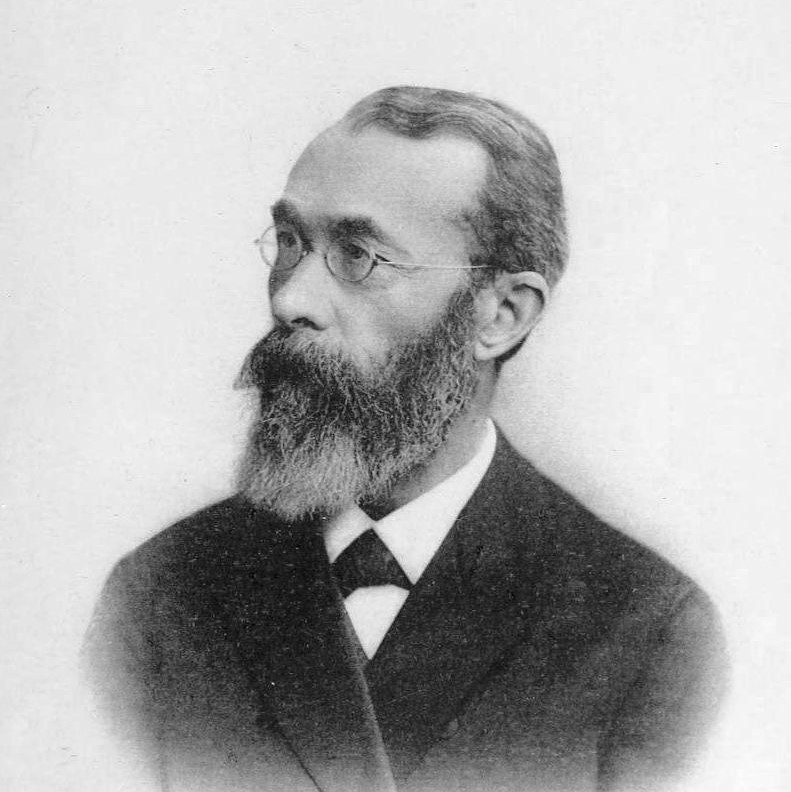
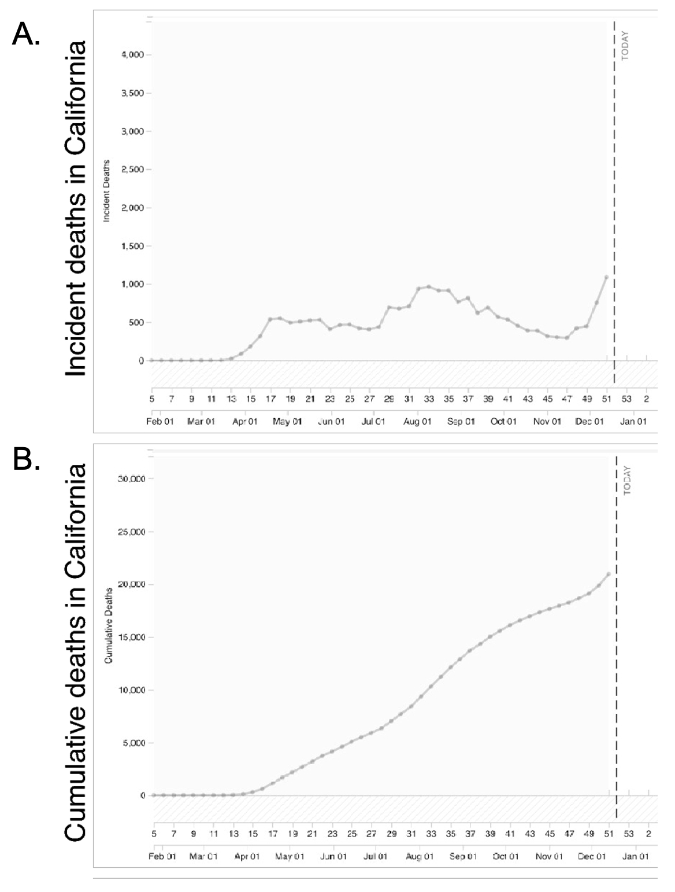

# History and Research Methods

```{r lan2000, echo = FALSE, out.width='100%', fig.align = 'center', fig.cap = 'Around the turn of the 20th century, futurists imagined what a classroom might look like in the year 2000. *Illustration by Jean-Marc Côté, Wikimedia Commons.*'}
knitr::include_graphics("images/ch1/lan2000.png")
```

Philosophers have wondered about the mind at least as far back as Socrates. Yet the scientific study of the mind only began much more recently. What changed, and what tools can we use to study the mind?

:::learningobjectives
##### LEARNING OBJECTIVES {-}
1. Describe the precursors to the establishment of the science of cognitive psychology.
2. Identify key individuals and events in the history of cognitive psychology.
3. Articulate the difference between correlational and experimental designs.
4. Understand how experiments help us to infer causality.
5. List a strength and weakness of different research designs.
:::

## Rise of Cognitive Psychology

Precursors to American psychology can be found in philosophy and physiology. Philosophers such as John Locke (1632–1704) and Thomas Reid (1710–1796) promoted [empiricism], the idea that all knowledge comes from experience. The work of Locke, Reid, and others emphasized the role of the human observer and the primacy of the senses in defining how the mind comes to acquire knowledge. In American colleges and universities in the early 1800s, these principles were taught as courses on mental and moral philosophy. Most often these courses taught about the mind based on the faculties of intellect, will, and the senses [@fuchs2000].

```{r pharoah, echo = FALSE, out.width='40%', fig.align = 'center', fig.cap = 'The earliest records of a psychological experiment go all the way back to the Pharaoh Psamtik I of Egypt in the 7th Century B.C. *Image: Neithsabes, [CC0 Public Domain](https://goo.gl/m25gce)'}
knitr::include_graphics("images/ch1/pharoah.png")
```

### Analytic introspection {-}

The formal development of modern psychology is usually credited to the work of German physician, physiologist, and philosopher Wilhelm Wundt (1832–1920). Wundt helped to establish the field of experimental psychology by serving as a strong promoter of the idea that psychology could be an experimental field and by providing classes, textbooks, and a laboratory for training students. In 1875, he joined the faculty at the University of Leipzig and quickly began to make plans for the creation of a program of experimental psychology. In 1879, he complemented his lectures on experimental psychology with a laboratory experience: an event that has served as the popular date for the establishment of the science of psychology.

```{r wundt, echo = FALSE, out.width='40%', fig.align = 'center', fig.cap = 'Wilhelm Wundt is considered one of the founding figures of modern psychology. [CC0 Public Domain](https://goo.gl/m25gce)'}

```

The response to the new science was immediate and global. Wundt attracted students from around the world to study the new experimental psychology and work in his lab. Students were trained to offer detailed self-reports of their reactions to various stimuli, a procedure known as [introspection]. The goal was to identify the elements of [consciousness]. In addition to the study of sensation and perception, research was done on mental chronometry, more commonly known as reaction time. The work of Wundt and his students demonstrated that the mind could be measured and the nature of consciousness could be revealed through scientific means. It was an exciting proposition, and one that found great interest in America. After the opening of Wundt’s lab in 1879, it took just four years for the first psychology laboratory to open in the United States [@benjamin2007].

### The Growth of Psychology {-}

Throughout the first half of the 20th century, psychology continued to grow and flourish in America. It was large enough to accommodate varying points of view on the nature of mind and behavior. Gestalt psychology is a good example. The Gestalt movement began in Germany with the work of Max Wertheimer (1880–1943). Opposed to the reductionist approach of Wundt’s laboratory psychology, Wertheimer and his colleagues Kurt Koffka (1886–1941), Wolfgang Kohler (1887–1967), and Kurt Lewin (1890–1947) believed that studying the whole of any experience was richer than studying individual aspects of that experience. The saying “the whole is greater than the sum of its parts” is a Gestalt perspective. Consider that a melody is an additional element beyond the collection of notes that comprise it. The Gestalt psychologists proposed that the mind often processes information simultaneously rather than sequentially. For instance, when you look at a photograph, you see a whole image, not just a collection of pixels of color. Using Gestalt principles, Wertheimer and his colleagues also explored the nature of learning and thinking. Most of the German Gestalt psychologists were Jewish and were forced to flee the Nazi regime due to the threats posed on both academic and personal freedoms. In America, they were able to introduce a new audience to the Gestalt perspective, demonstrating how it could be applied to perception and learning [@wertheimer1938]. In many ways, the work of the Gestalt psychologists served as a precursor to the rise of cognitive psychology in America [@benjamin2007].

Behaviorism emerged early in the 20th century and became a major force in American psychology. Championed by psychologists such as John B. Watson (1878–1958) and B. F. Skinner (1904–1990), behaviorism rejected any reference to mind and viewed overt and observable behavior as the proper subject matter of psychology. Through the scientific study of behavior, it was hoped that laws of learning could be derived that would promote the prediction and control of behavior. Russian physiologist Ivan Pavlov (1849–1936) influenced early behaviorism in America. His work on conditioned learning, popularly referred to as classical conditioning, provided support for the notion that learning and behavior were controlled by events in the environment and could be explained with no reference to mind or consciousness [@fancher1987].

### Cognitive Revolution {-}

Behaviorism’s emphasis on objectivity and focus on external behavior had pulled psychologists’ attention away from the mind for a prolonged period of time. The early work of the humanistic psychologists redirected attention to the individual human as a whole, and as a conscious and self-aware being. By the 1950s, new disciplinary perspectives in linguistics, neuroscience, and computer science were emerging, and these areas revived interest in the mind as a focus of scientific inquiry. This particular perspective has come to be known as the cognitive revolution [@miller2003]. By 1967, Ulric Neisser published the first textbook entitled Cognitive Psychology, which served as a core text in cognitive psychology courses around the country [@henley2005lost]. Cognitive psychology is the study of mental processes such as attention, memory, perception, language use, problem solving, creativity, and thinking. Much of the work derived from cognitive psychology has been integrated into various other modern disciplines of psychological study including social psychology, personality psychology, abnormal psychology, developmental psychology, educational psychology, and economics.

Although no one person is entirely responsible for starting the cognitive revolution, Noam Chomsky was very influential in the early days of this movement. Chomsky (1928–), an American linguist, was dissatisfied with the influence that behaviorism had had on psychology. He believed that psychology’s focus on behavior was short-sighted and that the field had to re-incorporate mental functioning into its purview if it were to offer any meaningful contributions to understanding behavior [@miller2003].

European psychology had never really been as influenced by behaviorism as had American psychology; and thus, the cognitive revolution helped reestablish lines of communication between European psychologists and their American counterparts. Furthermore, psychologists began to cooperate with scientists in other fields, like anthropology, linguistics, computer science, and neuroscience, among others. This interdisciplinary approach often was referred to as the cognitive sciences, and the influence and prominence of this particular perspective resonates in modern-day psychology [@miller2003].

The field of cognitive psychology continues to grow and improve; for example, researchers such as Ayanna Thomas are working to confront a foundational assumption in cognitive psychology, shaped by a history of scientific racism, that cognition can be understood without respect to context and culture [@thomas2023color]. As new generations of cognitive psychologists enter the field, our understanding of the human mind will continue to improve.  As philosopher of science Naomi Oreskes explains, "How is it that science is self-correcting? — It is not so much that science corrects itself, but that scientists correct each other" [@oreskes2019trust, p. 51]. According to Lee McIntyre, scientists accomplish this by "a commitment to two principles: (1) We care about empirical evidence. (2) We are willing to change our theories in light of new evidence" [@mcintyre2019scientific, pp. 47-48]. Throughout this book you will see examples of how our scientific understanding of the mind has evolved over time; indeed, future editions of this textbook will surely update our current knowledge as new evidence emerges through scientific inquiry. Next, we will look at the research methods psychologists use to ask questions about the world.

## Research Methods in Psychology

One of the important steps in scientific inquiry is to test our research questions, otherwise known as hypotheses. However, there are many ways to test hypotheses in psychological research. Which method you choose will depend on the type of questions you are asking, as well as what resources are available to you. All methods have limitations, which is why the best research uses a variety of methods.

Most psychological research can be divided into two types: experimental and correlational research.

### Experimental Research {-}

Imagine you work for a state health authority during the COVID-19 pandemic. You want to create a graph that will visualize COVID-19 mortality data in order to help people make judgments about pandemic risks. You have can choose between two ways to display the same information: you can create a graph that shows how many people have died each week from COVID-19 during the pandemic, or you can create a graph that shows, *cumulatively*, how many people have died from COVID-19 over the same time period (Figure \@ref(fig:covid)). Which method of displaying information will help people understand their risk? As long as you’re giving people the information, does it really matter?

```{r covid, echo = FALSE, out.width='60%', fig.align = 'center', fig.cap = 'Two ways of displaying the same information. Graph A shows how many people died each week from COVID-19. Graph B shows cumulative deaths from COVID-19 over the same time period. Does the method of displaying information matter? Experiments can help us find out. *Figures from @padilla2022impact; CC-BY 4.0.*'}

```

During the height of the COVID-19 pandemic, Lace Padilla, a psychology researcher at Northeastern University, set out with her colleagues to test the difference between these graphing methods [@padilla2022impact]. Participants in her experiment were shown a COVID-19 data visualization. Half of the participants were shown a visualization that showed deaths per week, and the other half saw a visualization that showed cumulative deaths. Afterward, participants answered questions about their perception of their risks during the pandemic.

In an experiment, researchers manipulate, or cause changes, in the [independent variable], and observe or measure any impact of those changes in the [dependent variable]. The independent variable is the one under the experimenter’s control, or the variable that is intentionally altered between groups. In the case of Professor Padilla's experiment, the independent variable was whether participants saw a graph that showed deaths per week or cumulative deaths. The dependent variable is the variable that is not manipulated at all, or the one where the effect happens. One way to help remember this is that the dependent variable “depends” on what happens to the independent variable. In our example, the participants’ risk perception (the dependent variable in this experiment) depends on the type of data visualization they see (the independent variable). Thus, any observed changes or group differences in risk perception can be attributed to data visualization method. What Professor Padilla and her colleagues found was that the people who saw a graph with cumulative deaths perceived greater pandemic risks than those that saw a graph that showed deaths per week. In other words, the data visualization method causes a difference in risk perception Do you find this surprising? 

But wait! Doesn’t risk perception depend on a lot of different factors—for instance, how cautious a person is in general, or how much background knowledge they have? How can we accurately conclude that the data visualization method causes differences in risk perception, as in the case of Professor Padilla's experiment? The most important thing about experiments is [random assignment]. Participants don’t get to pick which condition they are in (e.g., participants didn’t choose what type of graph they saw). The experimenter assigns them to a particular condition based on the flip of a coin or any other random method. Why do researchers do this? Random assignment makes it so the groups, on average, are similar on all characteristics except what the experimenter manipulates.

By randomly assigning people to conditions (deaths per week vs. cumulative deaths), some people who are naturally very cautious already should end up in each condition, as should some people who like to take risks. Likewise, some people who pay a lot of attention to pandemic news should end up in each condition, as should some people who are less informed. As a result, the distribution of all these factors will generally be consistent across the two groups, and this means that on average the two groups will be relatively equivalent on all these factors. Random assignment is critical to experimentation because if the only difference between the two groups is the independent variable, we can infer that the independent variable is the cause of any observable difference (e.g., in their perception of risk).

#### Other considerations {-}

In addition to using random assignment, you should avoid introducing confounds into your experiments. [Confounds] are things that could undermine your ability to draw causal inferences. For example, if you wanted to test if a new happy pill will make people happier, you could randomly assign participants to take the happy pill or not (the independent variable) and compare these two groups on their self-reported happiness (the dependent variable). However, if some participants know they are getting the happy pill, they might develop expectations that influence their self-reported happiness. This is sometimes known as a [placebo effect]. Sometimes a person just knowing that he or she is receiving special treatment or something new is enough to actually cause changes in behavior or perception: In other words, even if the participants in the happy pill condition were to report being happier, we wouldn’t know if the pill was actually making them happier or if it was the placebo effect—an example of a confound. A related idea is [participant demand]. This occurs when participants try to behave in a way they think the experimenter wants them to behave. Placebo effects and participant demand often occur unintentionally. Even [experimenter expectations] can influence the outcome of a study. For example, if the experimenter knows who took the happy pill and who did not, and the dependent variable is the experimenter’s observations of people’s happiness, then the experimenter might perceive improvements in the happy pill group that are not really there.

One way to prevent these confounds from affecting the results of a study is to use a double-blind procedure. In a double-blind procedure, neither the participant nor the experimenter knows which condition the participant is in. For example, when participants are given the happy pill or the fake pill, they don’t know which one they are receiving. This way the participants shouldn’t experience the placebo effect, and will be unable to behave as the researcher expects (participant demand). Likewise, the researcher doesn’t know which pill each participant is taking (at least in the beginning—later, the researcher will get the results for data-analysis purposes), which means the researcher’s expectations can’t influence his or her observations. Therefore, because both parties are “blind” to the condition, neither will be able to behave in a way that introduces a confound. At the end of the day, the only difference between groups will be which pills the participants received, allowing the researcher to determine if the happy pill actually caused people to be happier.

### Correlational Designs {-}

When scientists passively observe and measure phenomena it is called correlational research. Here, we do not intervene and change behavior, as we do in experiments. In correlational research, we identify patterns of relationships, but we usually cannot infer what causes what. Importantly, with correlational research, you can examine only two variables at a time, no more and no less.

So, what if you wanted to test whether spending on others is related to happiness, but you don’t have $20 to give to each participant? You could use a correlational design—which is exactly what Elizabeth Dunn, a professor at the University of British Columbia, did in a study [@dunn2008]. She asked people how much of their income they spent on others or donated to charity, and later she asked them how happy they were. Do you think these two variables were related? Yes, they were! The more money people reported spending on others, the happier they were.

#### More details about the correlation {-}

To find out how well two variables correspond, we can plot the relation between the two scores on what is known as a scatterplot (Figure \@ref(fig:scatter)). In the scatterplot, each dot represents a data point. (In this case it’s individuals, but it could be some other unit.) Importantly, each dot provides us with two pieces of information—in this case, information about how good the person rated the past month (x-axis) and how happy the person felt in the past month (y-axis). Which variable is plotted on which axis does not matter. 

```{r scatter, echo = FALSE, out.width='80%', fig.align = 'center', fig.cap='Scatterplot of the association between happiness and ratings of the past month, a positive correlation (*r* = .81). Each dot represents an individual.'}
y <- c(2,2,3,4,3,4,5,5)
x <- c(2,3,3,3,4,4,4,5)
plot(x, y, type = "p", xlab = "Rating of the past month", ylab = "Happiness", ylim = c(1.5,5.5), xlim = c(1.5,5.5), pch = 19, col = "#117EA7")
grid(nx = NULL, ny = NULL,
     lty = 2,      # Grid line type
     col = "#7F7F7F40", # Grid line color
     lwd = 1)      # Grid line width
```

The association between two variables can be summarized statistically using the correlation coefficient (abbreviated as r). A [correlation] coefficient provides information about the direction and strength of the association between two variables. For the example above, the direction of the association is positive. This means that people who perceived the past month as being good reported feeling more happy, whereas people who perceived the month as being bad reported feeling less happy.

With a positive correlation, the two variables go up or down together. In a scatterplot, the dots form a pattern that extends from the bottom left to the upper right (just as they do in Figure 1). The r value for a positive correlation is indicated by a positive number (although, the positive sign is usually omitted). Here, the r value is .81.

A negative correlation is one in which the two variables move in opposite directions. That is, as one variable goes up, the other goes down. Figure \@ref(fig:scatter2) shows the association between the average height of males in a country (y-axis) and the pathogen prevalence (or commonness of disease; x-axis) of that country. In this scatterplot, each dot represents a country. Notice how the dots extend from the top left to the bottom right. What does this mean in real-world terms? It means that people are shorter in parts of the world where there is more disease. The r value for a negative correlation is indicated by a negative number—that is, it has a minus (–) sign in front of it. Here, it is –.83.

```{r scatter2, echo = FALSE, out.width='80%', fig.align = 'center', fig.cap='Scatterplot showing the association between average male height and pathogen prevalence, a negative correlation (r = –.83). Each dot represents a country. [@chiao2009]'}
y <- c(176,184,180,179.5,179,177.5,175,5,177.7,178,173,177,173,174,169,168,172,175,166,170,169,169.5,175,165,164,169)
x <- c(-1.3,-1,-.95,-.95,-.95,-.95,-.95,-.9,-.8,-.6,-.5,-.2,-.1,-.05,0,.05,.1,.15,.2,.3,.4,.5,.6,.9,.95,1)
plot(x, y, type = "p", xlab = "Pathogen prevalence", ylab = "Average male height (cm)", ylim = c(160,185), xlim = c(-1.5,1.5), pch = 19, col = "#117EA7")
grid(nx = NULL, ny = NULL,
     lty = 2,      # Grid line type
     col = "#7F7F7F40", # Grid line color
     lwd = 1)      # Grid line width
```

The strength of a correlation has to do with how well the two variables align. Recall that in Professor Dunn’s correlational study, spending on others positively correlated with happiness: The more money people reported spending on others, the happier they reported to be. At this point you may be thinking to yourself, I know a very generous person who gave away lots of money to other people but is miserable! Or maybe you know of a very stingy person who is happy as can be. Yes, there might be exceptions. If an association has many exceptions, it is considered a weak correlation. If an association has few or no exceptions, it is considered a strong correlation. A strong correlation is one in which the two variables always, or almost always, go together. In the example of happiness and how good the month has been, the association is strong. The stronger a correlation is, the tighter the dots in the scatterplot will be arranged along a sloped line.

#### Problems with the correlation {-}

If generosity and happiness are positively correlated, should we conclude that being generous causes happiness? Similarly, if height and pathogen prevalence are negatively correlated, should we conclude that disease causes shortness? From a correlation alone, we can’t be certain. For example, in the first case it may be that happiness causes generosity, or that generosity causes happiness. Or, a third variable might cause both happiness and generosity, creating the illusion of a direct link between the two. For example, wealth could be the third variable that causes both greater happiness and greater generosity. This is why correlation does not mean causation—an often repeated phrase among psychologists.

### Qualitative Designs {-}

Just as correlational research allows us to study topics we can’t experimentally manipulate (e.g., whether you have a large or small income), there are other types of research designs that allow us to investigate these harder-to-study topics. Qualitative designs, including participant observation, case studies, and narrative analysis are examples of such methodologies. 

### Quasi-Experimental Designs {-}

What if you want to study the effects of marriage on a variable? For example, does marriage make people happier? Can you randomly assign some people to get married and others to remain single? Of course not. So how can you study these important variables? You can use a [quasi-experimental design].

A quasi-experimental design is similar to experimental research, except that random assignment to conditions is not used. Instead, we rely on existing group memberships (e.g., married vs. single). We treat these as the independent variables, even though we don’t assign people to the conditions and don’t manipulate the variables. As a result, with quasi-experimental designs causal inference is more difficult. For example, married people might differ on a variety of characteristics from unmarried people. If we find that married participants are happier than single participants, it will be hard to say that marriage causes happiness, because the people who got married might have already been happier than the people who have remained single.

```{r love, echo = FALSE, out.width='40%', fig.align = 'center', fig.cap = 'What is a reasonable way to study the effects of marriage on happiness? *Image: Nina Matthews Photography, https://goo.gl/IcmLqg, CC BY-NC-SA, https://goo.gl/HSisdg*'}
knitr::include_graphics("images/ch1/love.png")
```

### Longitudinal Studies {-}

Another powerful research design is the [longitudinal study]. Longitudinal studies track the same people over time. Some longitudinal studies last a few weeks, some a few months, some a year or more. Some studies that have contributed a lot to psychology followed the same people over decades. For example, one study followed more than 20,000 Germans for two decades. From these longitudinal data, psychologist Rich @lucas2003 was able to determine that people who end up getting married indeed start off a bit happier than their peers who never marry. Longitudinal studies like this provide valuable evidence for testing many theories in psychology, but they can be quite costly to conduct, especially if they follow many people for many years.

### Tradeoffs in Research {-}

Even though there are serious limitations to correlational and quasi-experimental research, they are not poor cousins to experiments and longitudinal designs. In addition to selecting a method that is appropriate to the question, many practical concerns may influence the decision to use one method over another. One of these factors is simply resource availability—how much time and money do you have to invest in the research? (Tip: If you’re doing a senior honor’s thesis, do not embark on a lengthy longitudinal study unless you are prepared to delay graduation!) Often, we survey people even though it would be more precise—but much more difficult—to track them longitudinally. Especially in the case of exploratory research, it may make sense to opt for a cheaper and faster method first. Then, if results from the initial study are promising, the researcher can follow up with a more intensive method.

Beyond these practical concerns, another consideration in selecting a research design is the ethics of the study. For example, in cases of brain injury or other neurological abnormalities, it would be unethical for researchers to inflict these impairments on healthy participants. Nonetheless, studying people with these injuries can provide great insight into human psychology (e.g., if we learn that damage to a particular region of the brain interferes with emotions, we may be able to develop treatments for emotional irregularities). In addition to brain injuries, there are numerous other areas of research that could be useful in understanding the human mind but which pose challenges to a true experimental design—such as the experiences of war, long-term isolation, abusive parenting, or prolonged drug use. However, none of these are conditions we could ethically experimentally manipulate and randomly assign people to. Therefore, ethical considerations are another crucial factor in determining an appropriate research design.

:::takeaways
##### Key Takeaways {-}
- People have asked questions about the mind for centuries, but only relatively recently took a scientific approach. Psychology, and cognitive psychology especially, is a young science.
- In order to be a savvy consumer of research, you need to understand the pros and cons of different methods and the distinctions among them. Plus, understanding how psychologists systematically go about answering research questions will help you to solve problems in other domains, both personal and professional, not just in psychology.
:::

:::exercises
##### Exercises {-}
1. Discussion: How were early researchers important to the development of psychology as a science?
2. Practice: Make a list of the schools of thought that preceded the cognitive revolution and write a short description of each.
3. Compare: What are some key differences between experimental and correlational research?
:::

## Glossary

##### behaviorism {-}

The study of behavior.

##### confounds {-}

Factors that undermine the ability to draw causal inferences from an experiment.

##### consciousness {-}

Awareness of ourselves and our environment.

##### correlation {-}

Measures the association between two variables, or how they go together.

##### dependent variable {-}

The variable the researcher measures but does not manipulate in an experiment.

##### empiricism {-}

The belief that knowledge comes from experience.

##### experimenter expectations {-}

When the experimenter’s expectations influence the outcome of a study.

##### independent variable {-}

The variable the researcher manipulates and controls in an experiment.

##### introspection {-}

A method of focusing on internal processes.

##### longitudinal study {-}

A study that follows the same group of individuals over time.

##### participant demand {-}

When participants behave in a way that they think the experimenter wants them to behave.

##### placebo effect {-}

When receiving special treatment or something new affects human behavior.

##### quasi-experimental design {-}

An experiment that does not require random assignment to conditions.

##### random assignment {-}

Assigning participants to receive different conditions of an experiment by chance.
