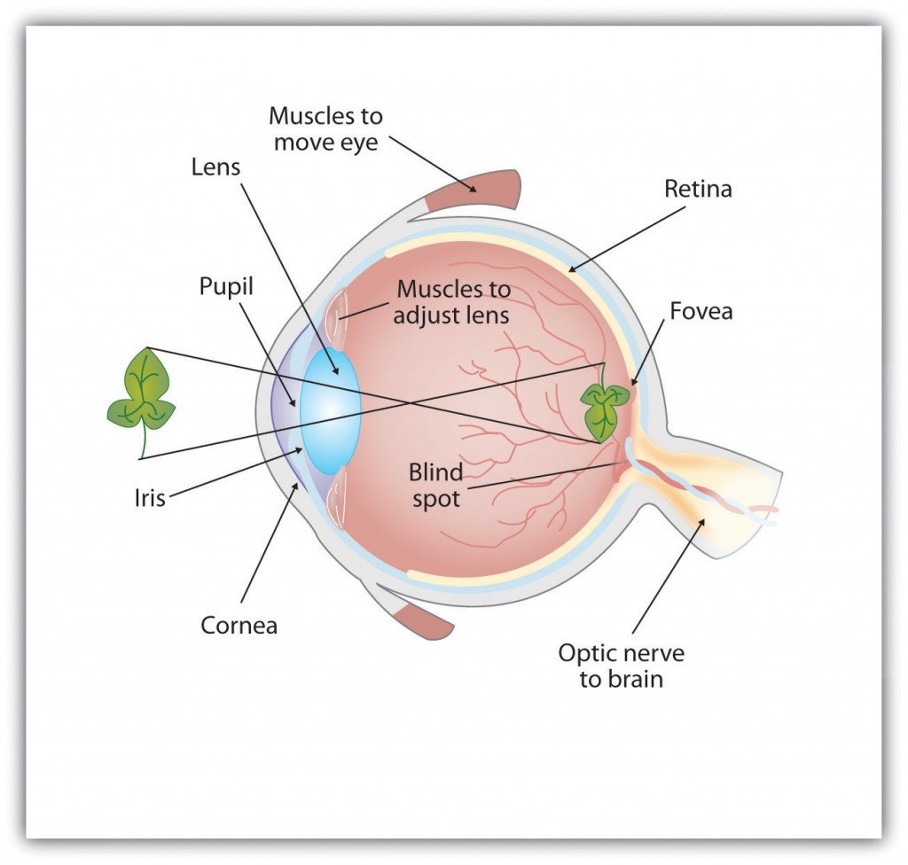
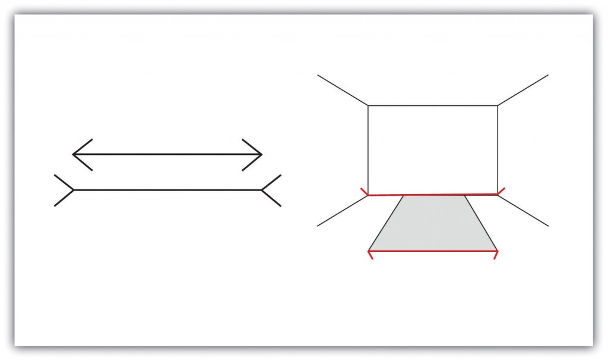
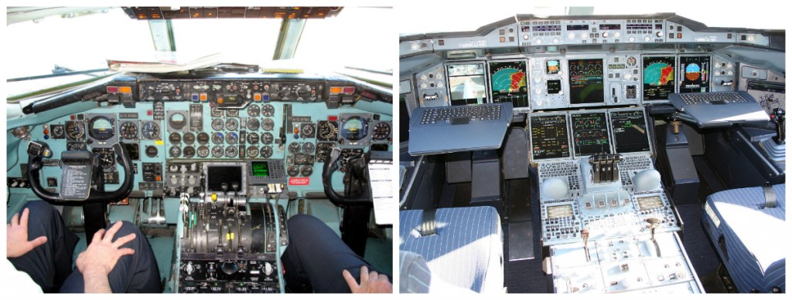

# Perception
```{r lan2000, echo = FALSE, out.width='100%', fig.align = 'center', fig.cap = 'Around the turn of the 20th century, futurists imagined what a classroom might look like in the year 2000. *Illustration by Jean-Marc Côté, Wikimedia Commons.*'}
# knitr::include_graphics("images/ch6/intro.png")
```

The study of sensation and perception is exceedingly important for our everyday lives because the knowledge generated by psychologists is used in so many ways to help so many people. Psychologists work closely with mechanical and electrical engineers, with experts in defense and military contractors, and with clinical, health, and sports psychologists to help them apply this knowledge to their everyday practices. 

## Sensation and Perception

:::learningobjectives
##### LEARNING OBJECTIVES {-}
1. XX
2. XX
:::

The ability to detect and interpret the events that are occurring around us allows us to respond to these stimuli appropriately [@Gibson2000]. In most cases the system is successful, but it is not perfect. In this chapter we will discuss the strengths and limitations of these capacities, focusing on both [sensation] — *the stimulation of sensory receptor cells, which is converted to neural impulses* — and [perception] — *our experience as a result of that stimulation*. Sensation and perception work seamlessly together to allow us to experience the world through our eyes, ears, nose, tongue, and skin, but also to combine what we are currently learning from the environment with what we already know about it to make judgments and to choose appropriate behaviors.

Humans possess powerful sensory capacities that allow us to sense the kaleidoscope of sights, sounds, smells, and tastes that surround us. Our eyes detect light energy and our ears pick up sound waves. Our skin senses touch, pressure, hot, and cold. Our tongues react to the molecules of the foods we eat, and our noses detect scents in the air. The human perceptual system is wired for accuracy, and people are exceedingly good at making use of the wide variety of information available to them [@Stoffregen2001].

<!-- Make textbox -->


Test your hearing
To get an idea of the range of sounds that the human ear can sense, test your hearing here: http://test-my-hearing.com

In many ways our senses are quite remarkable. The human eye can detect the equivalent of a single candle flame burning 30 miles away and can distinguish among more than 300,000 different colors. The human ear can detect sounds as low as 20 hertz (vibrations per second) and as high as 20,000 hertz, and it can hear the tick of a clock about 20 feet away in a quiet room. We can taste a teaspoon of sugar dissolved in two gallons of water, and we are able to smell one drop of perfume diffused in a three-room apartment. We can feel the wing of a bee on our cheek dropped from one centimeter above [@Galanter1962].

### Seeing {-}

Whereas other animals rely primarily on hearing, smell, or touch to understand the world around them, human beings rely in large part on vision. A large part of our cerebral cortex is devoted to seeing, and we have substantial visual skills. Seeing begins when light falls on the eyes, initiating the process of transduction, the conversion of stimuli detected by receptor cells to electrical impulses that are transported to the brain. Once this visual information reaches the visual cortex, it is processed by a variety of neurons that detect colors, shapes, and motion, and that create meaningful perceptions out of the incoming stimuli.

### The Sensing Eye and the Perceiving Visual Cortex {-}

As you can see in Figure \@ref(fig:anatomy) light enters the eye through the [cornea], *a clear covering that protects the eye and begins to focus the incoming light*. The light then passes through the [pupil], *a small opening in the center of the eye*. The pupil is surrounded by the [iris], *the colored part of the eye that controls the size of the pupil by constricting or dilating in response to light intensity*. When we enter a dark movie theater on a sunny day, for instance, muscles in the iris open the pupil and allow more light to enter. Complete adaptation to the dark may take up to 20 minutes.

```{r fig1, echo = FALSE, out.width='60%', fig.align = 'center', fig.cap = 'Anatomy of the Human Eye. Behind the pupil is the lens, a structure that focuses the incoming light on the retina, the layer of tissue at the back of the eye that contains photoreceptor cells. Rays from the top of the image strike the bottom of the retina and vice versa, and rays from the left side of the image strike the right part of the retina and vice versa, causing the image on the retina to be upside down.'}

```

Behind the pupil is the [lens], *a structure that focuses the incoming light on the* [retina], *the layer of tissue at the back of the eye that contains photoreceptor cells*. Rays from the top of the image strike the bottom of the retina and vice versa, and rays from the left side of the image strike the right part of the retina and vice versa, causing the image on the retina to be upside down.

The retina contains layers of neurons specialized to respond to light. As light falls on the retina, it first activates receptor cells known as rods and cones. The activation of these cells then spreads to the bipolar cells and then to the ganglion cells, which gather together and converge, like the strands of a rope, forming the optic nerve. The [optic nerve] is a collection of millions of ganglion neurons that sends vast amounts of visual information, via the thalamus, to the brain. Because the retina and the optic nerve are active processors and analyzers of visual information, it is appropriate to think of these structures as an extension of the brain itself.

[Rods] are visual neurons that specialize in *detecting black, white, and gray colors*. There are about 120 million rods in each eye. The rods do not provide a lot of detail about the images we see, but because they are highly sensitive to shorter-waved (darker) and weak light, they help us see in dim light — for instance, at night. Because the rods are located primarily around the edges of the retina, they are particularly active in peripheral vision (when you need to see something at night, try looking away from what you want to see). [Cones] *are visual neurons that are specialized in detecting fine detail and colors*. The five million or so cones in each eye enable us to see in color, but they operate best in bright light. The cones are located primarily in and around the [fovea], which is the central point of the retina.

To demonstrate the difference between rods and cones in attention to detail, choose a word in this text and focus on it. Do you notice that the words a few inches to the side seem more blurred? This is because the word you are focusing on strikes the detail-oriented cones, while the words surrounding it strike the less-detail-oriented rods, which are located on the periphery.

Margaret Livingstone @Margaret2000 (\@ref(fig:fig2)) found an interesting effect that demonstrates the different processing capacities of the eye’s rods and cones — namely, that the Mona Lisa’s smile, which is widely referred to as “elusive,” is perceived differently depending on how one looks at the painting. Because Leonardo da Vinci painted the smile in low-detail brush strokes, these details are better perceived by our peripheral vision (the rods) than by the cones. Livingstone found that people rated the Mona Lisa as more cheerful when they were instructed to focus on her eyes than they did when they were asked to look directly at her mouth. As Livingstone put it, “She smiles until you look at her mouth, and then it fades, like a dim star that disappears when you look directly at it.”

(ref:MonaCap) Mona Lisa's smile. 

```{r fig2, echo = FALSE, out.width='30%', fig.align = 'center', fig.cap = '(ref:MonaCap)'}
knitr::include_graphics("images/ch2/fig2.jpg")
```

The visual cortex is made up of specialized neurons that turn the sensations they receive from the optic nerve into meaningful images. Because there are no photoreceptor cells at the place where the optic nerve leaves the retina, a hole or blind spot in our vision is created (see \@ref(fig:fig3), “Blind Spot Demonstration”). When both of our eyes are open, we don’t experience a problem because our eyes are constantly moving, and one eye makes up for what the other eye misses. But the visual system is also designed to deal with this problem if only one eye is open — the visual cortex simply fills in the small hole in our vision with similar patterns from the surrounding areas, and we never notice the difference. The ability of the visual system to cope with the blind spot is another example of how sensation and perception work together to create meaningful experience.

```{r fig3, echo = FALSE, out.width='60%', fig.align = 'center', fig.cap = 'Figure 3. Blind Spot Demonstration. You can get an idea of the extent of your blind spot (the place where the optic nerve leaves the retina) by trying this: close your left eye and stare with your right eye at the cross in the diagram. You should be able to see the elephant image to the right (don’t look at it, just notice that it is there). If you can’t see the elephant, move closer or farther away until you can. Now slowly move so that you are closer to the image while you keep looking at the cross. At one distance (around a foot or so depending on your zoom), the elephant will completely disappear from view because its image has fallen on the blind spot.'}
knitr::include_graphics("images/ch2/fig3.jpg")
```

### Perceiving Form {-}

One of the important processes required in vision is the perception of form. German psychologists in the 1930s and 1940s, including Max Wertheimer (1880-1943), Kurt Koffka (1886-1941), and Wolfgang Köhler (1887-1967), argued that we create forms out of their component sensations based on the idea of the [gestalt], *a meaningfully organized whole*. The idea of the gestalt is that the “whole is more than the sum of its parts.” Some examples of how gestalt principles lead us to see more than what is actually there are summarized in Table \@ref(tab:gestalt).

Table: (\#tab:gestalt) Summary of Gestalt Principles of Form Perception

| Principle | Description | Example | Image |
| :----- | :-------- | :------------- | :-----: |
| Figure and ground | We structure input so that we always see a figure (image) against a ground (background). | At right, you may see a vase or you may see two faces, but in either case, you will organize the image as a figure against a ground. |  |
| Similarity | Stimuli that are similar to each other tend to be grouped together. | You are more likely to see three similar columns among the XYX characters at right than you are to see four rows. |   |
| Proximity | We tend to group nearby figures together. | Do you see four or eight images at right? Principles of proximity suggest that you might see only four.  |  |
| Continuity | We tend to perceive stimuli in smooth, continuous ways rather than in more discontinuous ways. | At right, most people see a line of dots that moves from the lower left to the upper right, rather than a line that moves from the left and then suddenly turns down. The principle of continuity leads us to see most lines as following the smoothest possible path. |   |
| Closure | We tend to fill in gaps in an incomplete image to create a complete, whole object. | Closure leads us to see a single spherical object at right rather than a set of unrelated cones. |   |

### Perceiving Depth {-}

Depth perception is the ability to perceive three-dimensional space and to accurately judge distance. Without depth perception, we would be unable to drive a car, thread a needle, or simply navigate our way around the supermarket [Howard2001](Howard & Rogers, 2001). 

Depth perception is the result of our use of depth cues, *messages from our bodies and the external environment that supply us with information about space and distance. Binocular depth cues are depth cues that are created by retinal image disparity — that is, the space between our eyes — and which thus require the coordination of both eyes*. One outcome of retinal disparity is that the images projected on each eye are slightly different from each other. The visual cortex automatically merges the two images into one, enabling us to perceive depth. Three-dimensional movies make use of retinal disparity by using 3-D glasses that the viewer wears to create a different image on each eye. The perceptual system quickly, easily, and unconsciously turns the disparity into 3-D.

An important binocular depth cue is convergence, the inward turning of our eyes that is required to focus on objects that are less than about 50 feet away from us. The visual cortex uses the size of the convergence angle between the eyes to judge the object’s distance. You will be able to feel your eyes converging if you slowly bring a finger closer to your nose while continuing to focus on it. When you close one eye, you no longer feel the tension — convergence is a binocular depth cue that requires both eyes to work.
Although the best cues to depth occur when both eyes work together, we are able to see depth even with one eye closed. Monocular depth cues are depth cues that help us perceive depth using only one eye [@Sekuler2006]. Some of the most important are summarized in Table 2.

***Table 2. Monocular Depth Cues That Help Us Judge Depth at a Distance.*** 

## Accuracy and Inaccuracy in Perception

The eyes, ears, nose, tongue, and skin sense the world around us, and in some cases perform preliminary information processing on the incoming data. But by and large, we do not experience sensation — we experience the outcome of perception, the total package that the brain puts together from the pieces it receives through our senses and that the brain creates for us to experience. When we look out the window at a view of the countryside, or when we look at the face of a good friend, we don’t just see a jumble of colors and shapes — we see, instead, an image of a countryside or an image of a friend [Goodale2006](Goodale & Milner, 2006).

### How the Perceptual System Interprets the Environment {-}

This meaning making involves the automatic operation of a variety of essential perceptual processes. One of these is sensory interaction — the working together of different senses to create experience. Sensory interaction is involved when taste, smell, and texture combine to create the flavor we experience in food. It is also involved when we enjoy a movie because of the way the images and the music work together.

```{r qr, echo = FALSE, out.width='60%', fig.align = 'center', fig.cap = 'HYPERLINK "http://www.youtube.com/watch?v=jtsfidRq2tw"Watch The McGurk Effect [YouTube]: http://www.youtube.com/watch?v=jtsfidRq2tw'}
knitr::include_graphics("images/ch2/qr.png")
```

Although you might think that we understand speech only through our sense of hearing, it turns out that the visual aspect of speech is also important. One example of sensory interaction is shown in the McGurk effect — an error in perception that occurs when we misperceive sounds because the audio and visual parts of the speech are mismatched. You can witness the effect yourself by viewing “The McGurk Effect.”

Other examples of sensory interaction include the experience of nausea that can occur when the sensory information being received from the eyes and the body does not match information from the vestibular system [Flanagan2004](Flanagan, May, & Dobie 2004) and synesthesia — an experience in which one sensation (e.g., hearing a sound) creates experiences in another (e.g., vision). Most people do not experience synesthesia, but those who do link their perceptions in unusual ways, for instance, by experiencing color when they taste a particular food or by hearing sounds when they see certain objects [Ramachandran2005](Ramachandran, Hubbard, Robertson, & Sagiv, 2005).

A second fundamental process of perception is [sensory adaptation] — a decreased sensitivity to a stimulus after prolonged and constant exposure. When you step into a swimming pool, the water initially feels cold, but after a while you stop noticing it. After prolonged exposure to the same stimulus, our sensitivity toward it diminishes and we no longer perceive it. The ability to adapt to the things that don’t change around us is essential to our survival, as it leaves our sensory receptors free to detect the important and informative changes in our environment and to respond accordingly. We ignore the sounds that our car makes every day, which leaves us free to pay attention to the sounds that are different from normal, and thus likely to need our attention. Our sensory receptors are alert to novelty and are fatigued after constant exposure to the same stimulus.

If sensory adaptation occurs with all senses, why doesn’t an image fade away after we stare at it for a period of time? The answer is that, although we are not aware of it, our eyes are constantly flitting from one angle to the next, making thousands of tiny movements (called saccades) every minute. This constant eye movement guarantees that the image we are viewing always falls on fresh receptor cells. What would happen if we could stop the movement of our eyes? Psychologists have devised a way of testing the sensory adaptation of the eye by attaching an instrument that ensures a constant image is maintained on the eye’s inner surface. Participants are fitted with a contact lens that has a miniature slide projector attached to it. Because the projector follows the exact movements of the eye, the same image is always projected, stimulating the same spot, on the retina. Within a few seconds, interesting things begin to happen. The image will begin to vanish, then reappear, only to disappear again, either in pieces or as a whole. Even the eye experiences sensory adaptation [Yarbus1967](Yarbus, 1967).

One of the major problems in perception is to ensure that we always perceive the same object in the same way, even when the sensations it creates on our receptors change dramatically. The ability to perceive a stimulus as constant despite changes in sensation is known as perceptual constancy. Consider our image of a door as it swings. When it is closed, we see it as rectangular, but when it is open, we see only its edge and it appears as a line. But we never perceive the door as changing shape as it swings — perceptual mechanisms take care of the problem for us by allowing us to see a constant shape.

The visual system also corrects for color constancy. Imagine that you are wearing blue jeans and a bright white T-shirt. When you are outdoors, both colors will be at their brightest, but you will still perceive the white T-shirt as bright and the blue jeans as darker. When you go indoors, the light shining on the clothes will be significantly dimmer, but you will still perceive the T-shirt as bright. This is because we put colors in context and see that, compared with its surroundings, the white T-shirt reflects the most light [McCann1992](McCann, 1992). In the same way, a green leaf on a cloudy day may reflect the same wavelength of light as a brown tree branch does on a sunny day. Nevertheless, we still perceive the leaf as green and the branch as brown.

### Illusions

```{r fig4, echo = FALSE, out.width='60%', fig.align = 'center', fig.cap = 'Figure 4. Optical Illusions as a Result of Brightness Constancy (Left) and Color Constancy (Right). Look carefully at the snakelike pattern on the left. Are the green strips really brighter than the background? Cover the white curves and you’ll see they are not. Square A in the right-hand image looks very different from square B, even though they are exactly the same.'}
knitr::include_graphics("images/ch2/fig4.jpg")
```

Although our perception is very accurate, it is not perfect. Illusions occur when the perceptual processes that normally help us correctly perceive the world around us are fooled by a particular situation so that we see something that does not exist or that is incorrect. \@ref(fig:fig4), “Optical Illusions as a Result of Brightness Constancy (Left) and Color Constancy (Right),” presents two situations in which our normally accurate perceptions of visual constancy have been fooled.

Another well-known illusion is the Mueller-Lyer illusion (see \@ref(fig:fig5), “The Mueller-Lyer Illusion”). The line segment in the bottom arrow looks longer to us than the one on the top, even though they are both actually the same length. It is likely that the illusion is, in part, the result of the failure of monocular depth cues — the bottom line looks like an edge that is normally farther away from us, whereas the top one looks like an edge that is normally closer.

```{r fig5, echo = FALSE, out.width='60%', fig.align = 'center', fig.cap = 'Figure 5. The Mueller-Lyer Illusion. The Mueller-Lyer illusion makes the line segment at the top of the left picture appear shorter than the one at the bottom. The illusion is caused, in part, by the monocular distance cue of depth — the bottom line looks like an edge that is normally farther away from us, whereas the top one looks like an edge that is normally closer.'}

```

The moon illusion refers to the fact that the moon is perceived to be about 50% larger when it is near the horizon than when it is seen overhead, despite the fact that in both cases the moon is the same size and casts the same size retinal image. The monocular depth cues of position and aerial perspective

```{r fig6, echo = FALSE, out.width='60%', fig.align = 'center', fig.cap = 'Figure 6 The Moon Illusion. The moon always looks larger on the horizon than when it is high above. But if we take away the surrounding distance cues of the horizon, the illusion disappears.'}

```

 (see \@ref(fig:fig6), “The Moon Illusion”) create the illusion that things that are lower and more hazy are farther away. The skyline of the horizon (trees, clouds, outlines of buildings) also gives a cue that the moon is far away, compared to when it is at its zenith. If we look at a horizon moon through a tube of rolled-up paper, taking away the surrounding horizon cues, the moon will immediately appear smaller.
 
The Ponzo illusion operates on the same principle. As you can see in \@ref(fig:fig7), “The Ponzo Illusion,” the top yellow bar seems longer than the bottom one, but if you measure them you’ll see that they are exactly the same length. The monocular depth cue of linear perspective leads us to believe that, given two similar objects, the distant one can only cast the same size retinal image as the closer object if it is larger. The topmost bar therefore appears longer.

```{r fig7, echo = FALSE, out.width='60%', fig.align = 'center', fig.cap = Figure 7. The Ponzo Illusion. The Ponzo illusion is caused by a failure of the monocular depth cue of linear perspective. Both bars are the same size, even though the top one looks larger.'}
knitr::include_graphics("images/ch2/fig7.jpg")
```

Illusions demonstrate that our perception of the world around us may be influenced by our prior knowledge. But the fact that some illusions exist in some cases does not mean that the perceptual system is generally inaccurate — in fact, humans normally become so closely in touch with their environment that the physical body and the particular environment that we sense and perceive becomes embodied — that is, built into and linked with our cognition, such that the world around us becomes part of our brain [Calvo2008](Calvo & Gomila, 2008). The close relationship between people and their environments means that, although illusions can be created in the lab and under some unique situations, they may be less common with active observers in the real world [Runeson1988](Runeson, 1988).

### The Important Role of Expectations in Perception

Our emotions, mindset, expectations, and the contexts in which our sensations occur all have a profound influence on perception. People who are warned that they are about to taste something bad rate what they do taste more negatively than people who are told that the taste won’t be so bad [Nitschke2006](Nitschke et al., 2006), and people perceive a child and adult pair as looking more alike when they are told that they are parent and child [@Bressan2002](Bressan & Dal Martello, 2002). Similarly, participants who see images of the same baby rate it as stronger and bigger when they are told it is a boy as opposed to when they are told it is a girl [Stern1989](Stern & Karraker, 1989), and research participants who learn that a child is from a lower-class background perceive the child’s scores on an intelligence test as lower than people who see the same test taken by a child they are told is from an upper-class background [Darley1983](Darley & Gross, 1983). Plassmann, O’Doherty, Shiv, and Rangel [Plassmann2008](2008) found that wines were rated more positively and caused greater brain activity in brain areas associated with pleasure when they were said to cost more than when they were said to cost less. And even experts can be fooled: professional referees tended to assign more penalty cards to soccer teams for videotaped fouls when they were told that the team had a history of aggressive behavior than when they had no such expectation [Jones2002](Jones, Paull, & Erskine, 2002).

:::fyi
#### Psychology in Everyday Life: How Understanding Sensation and Perception Can Save Lives {-}
**Human factors** is the field of psychology that uses psychological knowledge, including the principles of sensation and perception, to improve the development of technology. Human factors has worked on a variety of projects, ranging from nuclear reactor control centers and airplane cockpits to cell phones and websites [Proctor2008](Proctor & Van Zandt, 2008). For instance, knowledge of the visual system also helped engineers create new kinds of displays, such as those used on notebook computers and music players, and better understand how using cell phones while driving may contribute to automobile accidents [Lee2004](Lee & Strayer, 2004). Human factors also has made substantial contributions to airline safety. About two-thirds of accidents on commercial airplane flights are caused by human error [Nickerson1998](Nickerson, 1998). During takeoff, travel, and landing, the pilot simultaneously communicates with ground control, maneuvers the plane, scans the horizon for other aircraft, and operates controls. The need for a usable interface that works easily and naturally with the pilot’s visual perception is essential.

Psychologist Conrad Kraft [Kraft1978](1978) hypothesized that as planes land, with no other distance cues visible, pilots may be subjected to a type of moon illusion, in which the city lights beyond the runway appear much larger on the retina than they really are, deceiving the pilot into landing too early. Kraft’s findings caused airlines to institute new flight safety measures, where copilots must call out the altitude progressively during the descent, which has probably decreased the number of landing accidents.

\@ref(fig:fig8) presents images of an airplane instrument panel before and after it was redesigned by human factors psychologists. On the left is the initial design, in which the controls were crowded and cluttered, in no logical sequence, each control performing one task. The controls were more or less the same in color, and the gauges were not easy to read. The redesigned digital cockpit shows a marked improvement in usability. More of the controls are color-coded and multifunctional so that there is less clutter on the dashboard. Screens make use of LCD and 3-D graphics. Text sizes are changeable — increasing readability — and many of the functions have become automated, freeing up the pilots’ concentration for more important activities.

One important aspect of the redesign was based on the principles of sensory adaptation. Displays that are easy to see in darker conditions quickly become unreadable when the sun shines directly on them. It takes the pilot a relatively long time to adapt to the suddenly much brighter display. Furthermore, perceptual contrast is important. The display cannot be so bright at night that the pilot is unable to see targets in the sky or on the land. Human factors psychologists used these principles to determine the appropriate stimulus intensity needed on these displays so that pilots would be able to read them accurately and quickly under a wide range of conditions. The psychologists accomplished this by developing an automatic control mechanism that senses the ambient light visible through the front cockpit windows and detects the light falling on the display surface, and then automatically adjusts the intensity of the display for the pilot [Silverstein1985](Silverstein, Krantz, Gomer, Yeh, & Monty, 1990; Silverstein & Merrifield, 1985).

```{r fig8, echo = FALSE, out.width='60%', fig.align = 'center'}

```
:::

<!-- Insert images -->

:::takeaways
##### Key Takeaways {-}
- a
- b
:::

:::exercises
##### Exercises {-}
1. a
2. b
:::

References
Bressan, P., & Dal Martello, M. F. (2002). Talis pater, talis filius: Perceived resemblance and the belief in genetic relatedness. Psychological Science, 13, 213–218.

Broadbent, D. E. (1958). Perception and communication. New York, NY: Pergamon.

Calvo, P., & Gomila, T. (Eds.). (2008). Handbook of cognitive science: An embodied approach. San Diego, CA: Elsevier.

Caruso, E. M., Mead, N. L., & Balcetis, E. (2009). Political partisanship influences perception of biracial candidates’ skin tone. PNAS Proceedings of the National Academy of Sciences of the United States of America, 106(48), 20168–20173.

Cherry, E. C. (1953). Some experiments on the recognition of speech, with one and with two ears. Journal of the Acoustical Society of America, 25, 975–979.

Chua, H. F., Boland, J. E., & Nisbett, R. E. (2005). Cultural variation in eye movements during scene perception. Proceedings of the National Academy of Sciences, 102, 12629–12633.

Darley, J. M., & Gross, P. H. (1983). A hypothesis-confirming bias in labeling effects. Journal of Personality and Social Psychology, 44, 20–33.

Dijksterhuis, A. (2010). Automaticity and the unconscious. In S. T. Fiske, D. T. Gilbert, & G. Lindzey (Eds.), Handbook of social psychology (5th ed., Vol. 1, pp. 228–267). Hoboken, NJ: John Wiley & Sons.

Downing, P. E., Jiang, Y., Shuman, M., & Kanwisher, N. (2001). A cortical area selective for visual processing of the human body. Science, 293(5539), 2470–2473.

Fajen, B. R., & Warren, W. H. (2003). Behavioral dynamics of steering, obstacle avoidance, and route selection. Journal of Experimental Psychology: Human Perception and Performance, 29(2), 343–362.

Flanagan, M. B., May, J. G., & Dobie, T. G. (2004). The role of vection, eye movements, and postural instability in the etiology of motion sickness. Journal of Vestibular Research: Equilibrium and Orientation, 14(4), 335–346.

Galanter, E. (1962). Contemporary Psychophysics. In R. Brown, E. Galanter, E. H. Hess, & G. Mandler (Eds.), New directions in psychology. New York, NY: Holt, Rinehart and Winston.

Geldard, F. A. (1972). The human senses (2nd ed.). New York, NY: John Wiley & Sons.

Gegenfurtner, K. R., & Kiper, D. C. (2003). Color vision. Annual Review of Neuroscience, 26, 181–206.

Gibson, E. J., & Pick, A. D. (2000). An ecological approach to perceptual learning and development. New York, NY: Oxford University Press.

Goodale, M., & Milner, D. (2006). One brain — Two visual systems. Psychologist, 19(11), 660–663.

Harris, J. L., Bargh, J. A., & Brownell, K. D. (2009). Priming effects of television food advertising on eating behavior. Health Psychology, 28(4), 404–413.

Haxby, J. V., Gobbini, M. I., Furey, M. L., Ishai, A., Schouten, J. L., & Pietrini, P. (2001). Distributed and overlapping representations of faces and objects in ventral temporal cortex. Science, 293(5539), 2425–2430.

Howard, I. P., & Rogers, B. J. (2001). Seeing in depth: Basic mechanisms (Vol. 1). Toronto, ON: Porteous.

Jones, M. V., Paull, G. C., & Erskine, J. (2002). The impact of a team’s aggressive reputation on the decisions of association football referees. Journal of Sports Sciences, 20, 991–1000.

Karremans, J. C., Stroebe, W., & Claus, J. (2006). Beyond Vicary’s fantasies: The impact of subliminal priming and brand choice. Journal of Experimental Social Psychology, 42(6), 792–798.

Kelsey, C.A. (1997). Detection of visual information. In W. R. Hendee & P. N. T. Wells (Eds.), The perception of visual information (2nd ed.). New York, NY: Springer Verlag.

Kraft, C. (1978). A psychophysical approach to air safety: Simulator studies of visual illusions in night approaches. In H. L. Pick, H. W. Leibowitz, J. E. Singer, A. Steinschneider, & H. W. Steenson (Eds.), Psychology: From research to practice. New York, NY: Plenum Press.

Lee, J., & Strayer, D. (2004). Preface to the special section on driver distraction. Human Factors, 46(4), 583.

Livingstone, M., & Hubel, D. (1998). Segregation of form, color, movement, and depth: Anatomy, physiology, and perception. Science, 240, 740–749.

Livingstone M. S. (2000). Is it warm? Is it real? Or just low spatial frequency? Science, 290, 1299.

Macmillan, N. A., & Creelman, C. D. (2005). Detection theory: A user’s guide (2nd ed). Mahwah, NJ: Lawrence Erlbaum Associates.

McCann, J. J. (1992). Rules for color constancy. Ophthalmic and Physiologic Optics, 12(2), 175–177.

McKone, E., Kanwisher, N., & Duchaine, B. C. (2007). Can generic expertise explain special processing for faces? Trends in Cognitive Sciences, 11, 8–15.
 
Mogg, K., Bradley, B. P., Hyare, H., & Lee, S. (1998). Selective attention to food related stimuli in hunger. Behavior Research & Therapy, 36(2), 227–237.

Nickerson, R. S. (1998). Applied experimental psychology. Applied Psychology: An International Review, 47, 155–173.

Nitschke, J. B., Dixon, G. E., Sarinopoulos, I., Short, S. J., Cohen, J. D., Smith, E. E.,…Davidson, R. J. (2006). Altering expectancy dampens neural response to aversive taste in primary taste cortex. Nature Neuroscience 9, 435–442.

Pitcher, D., Walsh, V., Yovel, G., & Duchaine, B. (2007). TMS evidence for the involvement of the right occipital face area in early face processing. Current Biology, 17, 1568–1573.

Plassmann, H., O’Doherty, J., Shiv, B., & Rangel, A. (2008). Marketing actions can moderate neural representations of experienced pleasantness. Proceedings of the National Academy of Sciences, 105(3), 1050–1054.

Proctor, R. W., & Van Zandt, T. (2008). Human factors in simple and complex systems (2nd ed.). Boca Raton, FL: CRC Press.

Ramachandran, V. S., Hubbard, E. M., Robertson, L. C., & Sagiv, N. (2005). The emergence of the human mind: Some clues from synesthesia. In Synesthesia: Perspectives From Cognitive Neuroscience (pp. 147–190). New York, NY: Oxford University Press.

Rodriguez, E., George, N., Lachaux, J.-P., Martinerie, J., Renault, B., & Varela, F. J. (1999). Perception’s shadow: Long-distance synchronization of human brain activity. Nature, 397(6718), 430–433.

Runeson, S. (1988). The distorted room illusion, equivalent configurations, and the specificity of static optic arrays. Journal of Experimental Psychology: Human Perception and Performance, 14(2), 295–304.

Saegert, J. (1987). Why marketing should quit giving subliminal advertising the benefit of the doubt. Psychology and Marketing, 4(2), 107–120.

Silverstein, L. D., Krantz, J. H., Gomer, F. E., Yeh, Y., & Monty, R. W. (1990). The effects of spatial sampling and luminance quantization on the image quality of color matrix displays. Journal of the Optical Society of America, Part A, 7, 1955–1968.

Silverstein, L. D., & Merrifield, R. M. (1985). The development and evaluation of color systems for airborne applications: Phase I Fundamental visual, perceptual, and display systems considerations (Tech. Report DOT/FAA/PM085019). Washington, DC: Federal Aviation Administration.

Simons, D. J., & Chabris, C. F. (1999). Gorillas in our midst: Sustained inattentional blindness for dynamic events. Perception, 28(9), 1059–1074.

Stern, M., & Karraker, K. H. (1989). Sex stereotyping of infants: A review of gender labeling studies. Sex Roles, 20(9–10), 501–522.

Stoffregen, T. A., & Bardy, B. G. (2001). On specification and the senses. Behavioral and Brain Sciences, 24(2), 195–261.

Trappey, C. (1996). A meta-analysis of consumer choice and subliminal advertising. Psychology and Marketing, 13, 517–530.

Weiskrantz, L. (1997). Consciousness lost and found: A neuropsychological exploration. New York, NY: Oxford University Press.

Wickens, T. D. (2002). Elementary signal detection theory. New York, NY: Oxford University Press.

Witherington, D. C. (2005). The development of prospective grasping control between 5 and 7 months: A longitudinal study. Infancy, 7(2), 143–161.

Witt, J. K., & Proffitt, D. R. (2005). See the ball, hit the ball: Apparent ball size is correlated with batting average. Psychological Science, 16(12), 937–938.

Yarbus, A. L. (1967). Eye movements and vision. New York, NY: Plenum Press.

## Glossary

##### cones {-}

XX

##### cornea {-}

XX

##### fovea {-}

XX

##### gestalt {-}

XX

##### optic nerve {-}

XX

##### perception {-}

XX

##### pupil {-}

XX

##### Rods {-}

XX

##### sensation {-}

XX

##### sensory adaptation {-}

XX


