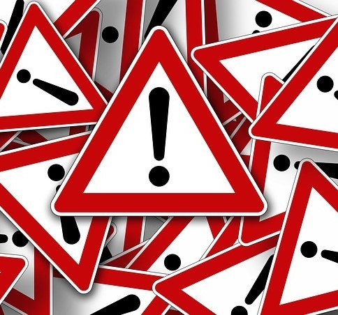
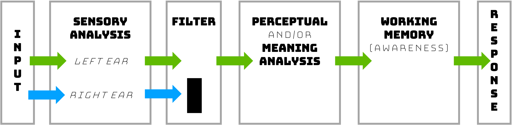

# Attention
```{r fig3.0, echo = FALSE, out.width='100%', fig.align = 'center'}
knitr::include_graphics("images/ch3/fig0.png")
```
We use the term “attention“ all the time, but what processes or abilities does that concept really refer to? This chapter will focus on how attention allows us to select certain parts of our environment and ignore other parts, and what happens to the ignored information. A key concept is the idea that we are limited in how much we can do at any one time. So we will also consider what happens when someone tries to do several things at once, such as driving while using electronic devices. Chapter 3 License and Attribution

:::learningobjectives
##### LEARNING OBJECTIVES {-}
1. XX
2. XX
:::

### What is Attention? {-}

```{r fig3.1, echo = FALSE, out.width='60%', fig.align = 'center', fig.cap = 'Are you reading these words right here right now? If so, it’s only because you directed your attention toward them. [Image: CC BY 2.0,  HYPERLINK "https://goo.gl/BRvSA7%5D"https://goo.gl/BRvSA7]'}

```

Before we begin exploring attention in its various forms, take a moment to consider how you think about the concept. How would you define attention, or how do you use the term? We certainly use the word very frequently in our everyday language: “ATTENTION! USE ONLY AS DIRECTED!” warns the label on the medicine bottle, meaning be alert to possible danger. “Pay attention!” pleads the weary seventh-grade teacher, not warning about danger (with possible exceptions, depending on the teacher) but urging the students to focus on the task at hand. We may refer to a child who is easily distracted as having an attention disorder, although we also are told that Americans have an attention span of about 8 seconds, down from 12 seconds in 2000, suggesting that we all have trouble sustaining concentration for any amount of time (from www.Statisticbrain.com). How that number was determined is not clear from the Web site, nor is it clear how attention span in the goldfish—9 seconds!—was measured, but the fact that our average span reportedly is less than that of a goldfish is intriguing, to say the least.

William James wrote extensively about attention in the late 1800s. An often quoted passage (James, 1890/1983) beautifully captures how intuitively obvious the concept of attention is, while it remains very difficult to define in measurable, concrete terms:

> Everyone knows what attention is. It is the taking possession by the mind, in clear and vivid form, of one out of what seem several simultaneously possible objects or trains of thought. Focalization, concentration of consciousness are of its essence. It implies withdrawal from some things in order to deal effectively with others. (pp. 381–382)

Notice that this description touches on the conscious nature of attention, as well as the notion that what is in consciousness is often controlled voluntarily but can also be determined by events that capture our attention. Implied in this description is the idea that we seem to have a [limited capacity] for information processing, and *that we can only attend to or be consciously aware of a small amount of information at any given time*.

Many aspects of attention have been studied in the field of psychology. In some respects, we define different types of attention by the nature of the task used to study it. For example, a crucial issue in World War II was how long an individual could remain highly alert and accurate while watching a radar screen for enemy planes, and this problem led psychologists to study how attention works under such conditions. When watching for a rare event, it is easy to allow concentration to lag. (This a continues to be a challenge today for TSA agents, charged with looking at images of the contents of your carry-on items in search of knives, guns, or shampoo bottles larger than 3 oz.) Attention in the context of this type of search task refers to the level of *sustained attention* or *vigilance* one can maintain. In contrast, [divided attention tasks] allow us to *determine how well individuals can attend to many sources of information at once*. [Spatial attention] refers specifically to *how we focus on one part of our environment and how we move attention to other locations in the environment*. These are all examples of different aspects of attention, but an implied element of most of these ideas is the concept of selective attention; some information is attended to while other information is intentionally blocked out. This module will focus on important issues in selective and divided attention, addressing these questions:

Can we pay attention to several sources of information at once, or do we have a limited capacity for information?
* How do we select what to pay attention to?
* What happens to information that we try to ignore?
* Can we learn to divide attention between multiple tasks?

### Selective Attention {-}

#### The Cocktail Party {-}
[Selective attention] is *the ability to select certain stimuli in the environment to process, while ignoring distracting information*. One way to get an intuitive sense of how attention works is to consider situations in which attention is used. A party provides an excellent example for our purposes. Many people may be milling around, there is a dazzling variety of colors and sounds and smells, the buzz of many conversations is striking. There are so many conversations going on; how is it possible to select just one and follow it? You don’t have to be looking at the person talking; you may be listening with great interest to some gossip while pretending not to hear. 

```{r fig3.2, echo = FALSE, out.width='60%', fig.align = 'center', fig.cap = 'Beyond just hearing your name from the clamor at a party, other words or concepts, particularly unusual or significant ones to you, can also snag your attention. [Image: Ross,  HYPERLINK "https://goo.gl/TVDfTn,"https://goo.gl/TVDfTn, CC BY-NC-SA 2.0,  HYPERLINK "https://goo.gl/Toc0ZF%5D"https://goo.gl/Toc0ZF]'}
knitr::include_graphics("images/ch3/fig2.jpg")
```

However, once you are engaged in conversation with someone, you quickly become aware that you cannot also listen to other conversations at the same time. You also are probably not aware of how tight your shoes feel or of the smell of a nearby flower arrangement. On the other hand, if someone behind you mentions your name, you typically notice it immediately and may start attending to that (much more interesting) conversation. This situation highlights an interesting set of observations. We have an amazing ability to select and track one voice, visual object, etc., even when a million things are competing for our attention, but at the same time, we seem to be limited in how much we can attend to at one time, which in turn suggests that attention is crucial in selecting what is important. How does it all work?

#### Dichotic Listening Studies {-}

This cocktail party scenario is the quintessential example of selective attention, and it is essentially what some early researchers tried to replicate under controlled laboratory conditions as a starting point for understanding the role of attention in perception (e.g., @Cherry1953; @Moray1959). In particular, they used [dichotic listening] and [shadowing tasks] to evaluate the selection process. [Dichotic listening] simply refers to *the situation when two messages are presented simultaneously to an individual, with one message in each ear*. In order to control which message the person attends to, the individual is asked to repeat back or “shadow” one of the messages as he hears it. For example, let’s say that a story about a camping trip is presented to John’s left ear, and a story about Abe Lincoln is presented to his right ear. The typical dichotic listening task would have John repeat the story presented to one ear as he hears it. Can he do that without being distracted by the information in the other ear?

People can become pretty good at the shadowing task, and they can easily report the content of the message that they attend to. But what happens to the ignored message? Typically, people can tell you if the ignored message was a man’s or a woman’s voice, or other physical characteristics of the speech, but they cannot tell you what the message was about. In fact, many studies have shown that people in a shadowing task were not aware of a change in the language of the message (e.g., from English to German; @Cherry1953), and they didn't even notice when the same word was repeated in the unattended ear more than 35 times [@Moray1959]! Only the basic physical characteristics, such as the pitch of the unattended message, could be reported.

On the basis of these types of experiments, it seems that we can answer the first question about how much information we can attend to very easily: not very much. We clearly have a limited capacity for processing information for meaning, making the selection process all the more important. The question becomes: How does this selection process work?

#### Models of Selective Attention {-}

Broadbent’s Filter Model. Many researchers have investigated how selection occurs and what happens to ignored information. Donald Broadbent was one of the first to try to characterize the selection process. His Filter Model was based on the dichotic listening tasks described above as well as other types of experiments (Broadbent, 1958). He found that people select information on the basis of physical features: the sensory channel (or ear) that a message was coming in, the pitch of the voice, the color or font of a visual message. People seemed vaguely aware of the physical features of the unattended information, but had no knowledge of the meaning. As a result, Broadbent argued that selection occurs very early, with no additional processing for the unselected information. A flowchart of the model might look like this:

```{r fig3.3, echo = FALSE, out.width='60%', fig.align = 'center', fig.cap = 'Figure 1. This figure shows information going in both the left and right ears. Some basic sensory information, such as pitch, is processed, but the filter only allows the information from one ear to be processed further. Only the information from the left ear is transferred to short-term memory (STM) and conscious awareness, and then further processed for meaning. That means that the ignored information never makes it beyond a basic physical analysis.'}

```

#### Treisman’s Attenuation Model {-}
Broadbent’s model makes sense, but if you think about it you already know that it cannot account for all aspects of the Cocktail Party Effect. What doesn’t fit? The fact is that you tend to hear your own name when it is spoken by someone, even if you are deeply engaged in a conversation. We mentioned earlier that people in a shadowing experiment were unaware of a word in the unattended ear that was repeated many times—and yet many people noticed their own name in the unattended ear even it occurred only once.

Anne Treisman (1960) @Treisman1960 carried out a number of dichotic listening experiments in which she presented two different stories to the two ears. As usual, she asked people to shadow the message in one ear. As the stories progressed, however, she switched the stories to the opposite ears. Treisman found that individuals spontaneously followed the story, or the content of the message, when it shifted from the left ear to the right ear. Then they realized they were shadowing the wrong ear and switched back.

```{r fig3.4, echo = FALSE, out.width='60%', fig.align = 'center', fig.cap = 'Figure 2. Early selection model.'}
knitr::include_graphics("images/ch3/fig4.png")
```

Results like this, and the fact that you tend to hear meaningful information even when you aren’t paying attention to it, suggest that we do monitor the unattended information to some degree on the basis of its meaning. Therefore, the filter theory can’t be right to suggest that unattended information is completely blocked at the sensory analysis level. Instead, Treisman suggested that selection starts at the physical or perceptual level, but that the unattended information is not blocked completely, it is just weakened or attenuated. As a result, highly meaningful or pertinent information in the unattended ear will get through the filter for further processing at the level of meaning. \@ref(fig:fig3.4) shows information going in both ears, and in this case there is no filter that completely blocks nonselected information. Instead, selection of the left ear information strengthens that material, while the nonselected information in the right ear is weakened. However, if the preliminary analysis shows that the nonselected information is especially pertinent or meaningful (such as your own name), then the Attenuation Control will instead strengthen the more meaningful information.

#### Late Selection Models {-}
```{r fig3.5, echo = FALSE, out.width='60%', fig.align = 'center', fig.cap = 'Figure 3. Late selection model.'}
knitr::include_graphics("images/ch3/fig5.png")
```

Other selective attention models have been proposed as well. A late selection or response selection model proposed by @Deutsch1963 suggests that all information in the unattended ear is processed on the basis of meaning, not just the selected or highly pertinent information. However, only the information that is relevant for the task response gets into conscious awareness. This model is consistent with ideas of subliminal perception; in other words, that you don’t have to be aware of or attending a message for it to be fully processed for meaning.

You might notice that \@ref(fig:fig3.5) looks a lot like the Early Selection model—only the location of the selective filter has changed, with the assumption that analysis of meaning occurs before selection occurs, but only the selected information becomes conscious.

#### Multimode Model {-}

Why did researchers keep coming up with different models? Because no model really seemed to account for all the data, some of which indicates that nonselected information is blocked completely, whereas other studies suggest that it can be processed for meaning. The multimode model addresses this apparent inconsistency, suggesting that the stage at which selection occurs can change depending on the task. @Johnston1978 demonstrated that under some conditions, we can select what to attend to at a very early stage and we do not process the content of the unattended message very much at all. Analyzing physical information, such as attending to information based on whether it is a male or female voice, is relatively easy; it occurs automatically, rapidly, and doesn’t take much effort. Under the right conditions, we can select what to attend to on the basis of the meaning of the messages. However, the late selection option—processing the content of all messages before selection—is more difficult and requires more effort. The benefit, though, is that we have the flexibility to change how we deploy our attention depending upon what we are trying to accomplish, which is one of the greatest strengths of our cognitive system.

This discussion of selective attention has focused on experiments using auditory material, but the same principles hold for other perceptual systems as well. @Neisser1979 investigated some of the same questions with visual materials by superimposing two semi-transparent video clips and asking viewers to attend to just one series of actions. As with the auditory materials, viewers often were unaware of what went on in the other clearly visible video. Twenty years later,  @Simons1999 explored and expanded these findings using similar techniques, and triggered a flood of new work in an area referred to as inattentional blindness.

:::fyi
#### Subliminal Perception {-}
The idea of subliminal perception—that stimuli presented below the threshold for awareness can influence thoughts, feelings, or actions—is a fascinating and kind of creepy one. Can messages you are unaware of, embedded in movies or ads or the music playing in the grocery store, really influence what you buy? Many such claims of the power of subliminal perception have been made. One of the most famous came from a market researcher who claimed that the message “Eat Popcorn” briefly flashed throughout a movie increased popcorn sales by more than 50%, although he later admitted that the study was made up [@Merikle2000]. Psychologists have worked hard to investigate whether this is a valid phenomenon. Studying subliminal perception is more difficult than it might seem, because of the difficulty of establishing what the threshold for consciousness is or of even determining what type of threshold is important; for example, Cheesman and @Merikle1984 and @Merikle1986 make an important distinction between objective and subjective thresholds. The bottom line is that there is some evidence that individuals can be influenced by stimuli they are not aware of, but how complex the stimuli can be or the extent to which unconscious material can affect behavior is not settled [e.g., @Bargh2008; @Greenwald1992; @Merikle2000].
:::

### Divided Attention and Multitasking {-}
In spite of the evidence of our limited capacity, we all like to think that we can do several things at once. Some people claim to be able to multitask without any problem: reading a textbook while watching television and talking with friends; talking on the phone while playing computer games; texting while driving. The fact is that we sometimes can seem to juggle several things at once, but the question remains whether dividing attention in this way impairs performance.
Is it possible to overcome the limited capacity that we experience when engaging in cognitive tasks? We know that with extensive practice, we can acquire skills that do not appear to require conscious attention. As we walk down the street, we don’t need to think consciously about what muscle to contract in order to take the next step. Indeed, paying attention to automated skills can lead to a breakdown in performance, or “choking” [e.g., @Beilock2001]. But what about higher level, more mentally demanding tasks: Is it possible to learn to perform two complex tasks at the same time?

```{r fig3.6, echo = FALSE, out.width='60%', fig.align = 'center', fig.cap = 'Unless a task is fully automated, some researchers suggest that “multi-tasking” doesn’t really exist; you are just rapidly switching your attention back and forth between tasks. [Image: CC0 Public Domain,  HYPERLINK "https://goo.gl/m25gce%5D"https://goo.gl/m25gce]'}
knitr::include_graphics("images/ch3/fig6.jpg")
```

#### Divided Attention Tasks {-}

Unless a task is fully automated, some researchers suggest that “multi-tasking” doesn’t really exist; you are just rapidly switching your attention back and forth between tasks. [Image: CC0 Public Domain, https://goo.gl/m25gce]

In a classic study that examined this type of divided attention task, two participants were trained to take dictation for spoken words while reading unrelated material for comprehension [@Spelke1976]. In divided attention tasks such as these, each task is evaluated separately, in order to determine baseline performance when the individual can allocate as many cognitive resources as necessary to one task at a time. Then performance is evaluated when the two tasks are performed simultaneously. A decrease in performance for either task would suggest that even if attention can be divided or switched between the tasks, the cognitive demands are too great to avoid disruption of performance. (We should note here that divided attention tasks are designed, in principle, to see if two tasks can be carried out simultaneously. A related research area looks at task switching and how well we can switch back and forth among different tasks [e.g., @Monsell2003]. It turns out that switching itself is cognitively demanding and can impair performance.

The focus of the @Spelke1976 study was whether individuals could learn to perform two relatively complex tasks concurrently, without impairing performance. The participants received plenty of practice—the study lasted 17 weeks and they had a 1-hour session each day, 5 days a week. These participants were able to learn to take dictation for lists of words and read for comprehension without affecting performance in either task, and the authors suggested that perhaps there are not fixed limits on our attentional capacity. However, changing the tasks somewhat, such as reading aloud rather than silently, impaired performance initially, so this multitasking ability may be specific to these well-learned tasks. Indeed, not everyone could learn to perform two complex tasks without performance costs [@Hirst1978], although the fact that some can is impressive.

#### Distracted Driving {-}

More relevant to our current lifestyles are questions about multitasking while texting or having cell phone conversations. Research designed to investigate, under controlled conditions, multitasking while driving has revealed some surprising results. Certainly there are many possible types of distractions that could impair driving performance, such as applying makeup using the rearview mirror, attempting (usually in vain) to stop the kids in the backseat from fighting, fiddling with the CD player, trying to negotiate a handheld cell phone, a cigarette, and a soda all at once, eating a bowl of cereal while driving (!). But we tend to have a strong sense that we CAN multitask while driving, and cars are being built with more and more technological capabilities that encourage multitasking. How good are we at dividing attention in these cases?

```{r fig3.7, echo = FALSE, out.width='60%', fig.align = 'center', fig.cap = 'If you look at your phone for just 5 seconds while driving at 55mph, that means you have driven the length of a football field without looking at the road. [Image: CC0 Public Domain, https://goo.gl/m25gce] '}

```


Most people acknowledge the distraction caused by texting while driving and the reason seems obvious: Your eyes are off the road and your hands and at least one hand (often both) are engaged while texting. However, the problem is not simply one of occupied hands or eyes, but rather that the cognitive demands on our limited capacity systems can seriously impair driving performance [@Strayer2011]. The effect of a cell phone conversation on performance (such as not noticing someone’s brake lights or responding more slowly to them) is just as significant when the individual is having a conversation with a hands-free device as with a handheld phone; the same impairments do not occur when listening to the radio or a book on tape [@Strayer2001]. Moreover, studies using eye-tracking devices have shown that drivers are less likely to later recognize objects that they did look at when using a cell phone while driving [@Strayer]. These findings demonstrate that cognitive distractions such as cell phone conversations can produce inattentional blindness, or a lack of awareness of what is right before your eyes (see also, @Simons1999). Sadly, although we all like to think that we can multitask while driving, in fact the percentage of people who can truly perform cognitive tasks without impairing their driving performance is estimated to be about 2% (@Watson2010).

It may be useful to think of attention as a mental resource, one that is needed to focus on and fully process important information, especially when there is a lot of distracting “noise” threatening to obscure the message. Our selective attention system allows us to find or track an object or conversation in the midst of distractions. Whether the selection process occurs early or late in the analysis of those events has been the focus of considerable research, and in fact how selection occurs may very well depend on the specific conditions. With respect to divided attention, in general we can only perform one cognitively demanding task at a time, and we may not even be aware of unattended events even though they might seem too obvious to miss (check out some examples in the Outside Resources below). This type of inattention blindness can occur even in well-learned tasks, such as driving while talking on a cell phone. Understanding how attention works is clearly important, even for our everyday lives.

:::takeaways
##### Key Takeaways {-}
- a
- b
:::

:::exercises
##### Exercises {-}
1. a
2. b
:::

## Glossary
