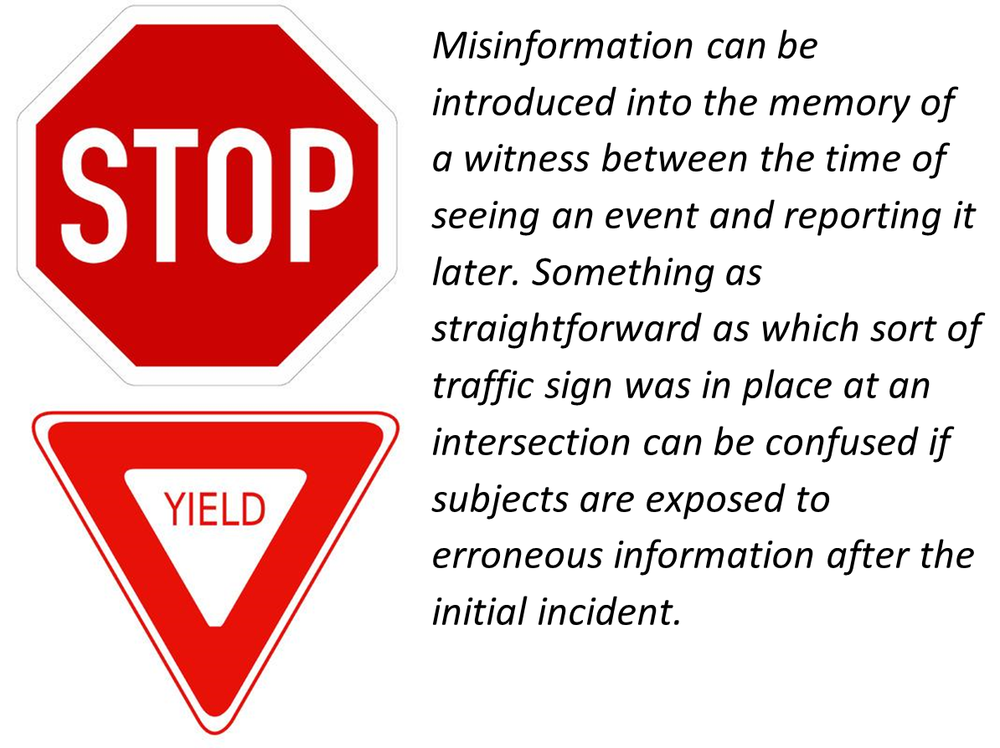

# Memory in Context {#memory-in-context}
```{r fig6.0, echo = FALSE, out.width='100%', fig.align = 'center'}

```

As we have seen, our memories are not perfect. They fail in part due to our inadequate encoding and storage, and in part due to our inability to accurately retrieve stored information. But memory is also influenced by the setting in which it occurs, by the events that occur to us after we have experienced an event, and by the cognitive processes that we use to help us remember. Although our cognition allows us to attend to, rehearse, and organize information, cognition may also lead to distortions and errors in our judgments and our behaviors.

:::learningobjectives
##### LEARNING OBJECTIVES {-}
1. Explain some of the errors that are common in human memory.
2. Describe some of the important research that has demonstrated human memory errors and their consequences.
3. Explain how schemas can distort our memories.
4. Describe the conditions that affect accuracy and inaccuracy in eyewitness memory.
:::

## Kinds of Memory Biases

Memory is susceptible to a wide variety of biases and errors. People can forget events that happened to them and people they once knew. They can mix up details across time and place. They can even remember whole complex events that never happened at all. Importantly, these errors, once made, can be very hard to unmake. A memory is no less “memorable” just
because it is wrong. Some small memory errors are commonplace, and you have no doubt
experienced many of them. You set down your keys without paying attention, and then cannot find them later when you go to look for them. You try to come up with a person’s name but cannot find it, even though you have the sense that it is right at the tip of your tongue (psychologists actually call this the tip-of-the-tongue effect, or TOT) [@Brown1991].

Other sorts of memory biases are more complicated and longer lasting. For example, it turns out that our expectations and beliefs about how the world works can have huge influences on our memories. Because many aspects of our everyday lives are full of redundancies, our memory systems take advantage of the recurring patterns by forming and using [schemas][schema], or memory templates  [@Alba1983; @brewer1981role]. Thus, we know to expect that a library will have shelves and tables and librarians, and so we don’t have to spend energy noticing these at the time. The result of this lack of attention, however, is that one is likely to remember schema-consistent information (such as tables), and to remember them in a rather generic way, whether or not they were actually present. 

```{r library2, echo = FALSE, out.width='60%', fig.align = 'center', fig.cap = 'For most of our experiences schematas are a benefit and help with information overload. However, they may make it difficult or impossible to recall certain details of a situation later. Do you recall the library as it actually was or the library as approximated by your library schemata? [Dan Kleinman](https://goo.gl/07xyDDz), [CC BY 2.0](https://goo.gl/BRvSA7)'}

```

### Schematic Processing: Distortions Based on Expectations {-}

We have seen that schemas help us remember information by organizing material into coherent representations. However, although schemas can improve our memories by helping us make sense of the world, they may also lead to cognitive biases. Using schemas may lead us to falsely remember things that never happened to us and to distort or misremember things that did. 

For one, schemas can lead us to pay attention to and search for information that fits our schemas—leading to something called confirmation bias. [Confirmation bias] is the tendency to verify and confirm our existing memories rather than to challenge and disconfirm them. The confirmation bias occurs because once we have schemas, they influence how we seek out and interpret new information. People tend to remember information that fits our schemas better than we remember information that disconfirms them [@stangor1992memory], a process that makes our views of the world very difficult to change. Furthermore, we ask questions in ways that confirm our schemas [@trope1997looking]. If we think that a person is an extrovert, we might ask her about ways that she likes to have fun, thereby making it more likely that we will confirm our beliefs. In short, once we begin to believe in something — for instance, a stereotype about a group of people — it becomes very difficult to later convince us that these beliefs are not true; the beliefs become self-confirming.

@darley1983hypothesis demonstrated how schemas about social class could influence memory. In their research they gave participants a picture and some information about a Grade 4 girl named Hannah. To activate a schema about her social class, Hannah was pictured sitting in front of a nice suburban house for one-half of the participants and pictured in front of an impoverished house in an urban area for the other half. Then the participants watched a video that showed Hannah taking an intelligence test. As the test went on, Hannah got some of the questions right and some of them wrong, but the number of correct and incorrect answers was the same in both conditions. Then the participants were asked to remember how many questions Hannah got right and wrong. Demonstrating that stereotypes had influenced memory, the participants who thought that Hannah had come from an upper-class background remembered that she had gotten more correct answers than those who thought she was from a lower-class background.

Our reliance on schemas can also make it more difficult for us to “think outside the box.” @Wason1960 asked undergraduate students to determine the rule that was used to generate the numbers 2-4-6 by asking them to generate possible sequences and then telling them if those numbers followed the rule. The first guess that students made was usually “consecutive ascending even numbers,” and they then asked questions designed to confirm their hypothesis (“Does 102-104-106 fit?” “What about 404-406-408?”). Upon receiving information that those guesses did fit the rule, the students stated that the rule was “consecutive ascending even numbers.” But the students’ use of the confirmation bias led them to ask only about instances that confirmed their hypothesis, and not about those that would disconfirm it. They never bothered to ask whether 1-2-3 or 3-11-200 would fit, and if they had they would have learned that the rule was not “consecutive ascending even numbers,” but simply “any three ascending numbers.” Again, you can see that once we have a schema (in this case a hypothesis), we continually retrieve that schema from memory rather than other relevant ones, leading us to act in ways that tend to confirm our beliefs.

### Source Monitoring {-}

One potential error in memory involves mistakes in differentiating the sources of information. [Source monitoring] refers to *the ability to accurately identify the source of a memory*. Perhaps you’ve had the experience of wondering whether you really experienced an event or only dreamed or imagined it. If so, you wouldn’t be alone. @Rassin2001 reported that up to 25% of undergraduate students reported being confused about real versus dreamed events. Studies suggest that people who are fantasy-prone are more likely to experience source monitoring errors [@Winograd1998], and such errors also occur more often for both children and the elderly than for adolescents and younger adults [@jacoby2006false].

In other cases we may be sure that we remembered the information from real life but be uncertain about exactly where we heard it. Imagine that you read a news story in a tabloid magazine such as the *National Enquirer*. You would probably discounted the information within that story because you know that its source is unreliable. But what if later you were to remember the story but forget the source of the information? If this happens, you might become convinced that the news story is true because you forget to discount it. The [sleeper effect] refers to *attitude change that occurs over time when we forget the source of information* [@Pratkanis1988].

In still other cases we may forget where we learned information and mistakenly assume that we created the memory ourselves. Canadian authors Wayson Choy, Sky Lee, and Paul Yee launched a $6 million copyright infringement lawsuit against the parent company of Penguin Group Canada, claiming that the novel *Gold Mountain Blues* contained “substantial elements” of certain works by the plaintiffs (Cbc.ca, 2011). The suit was filed against Pearson Canada Inc., author Ling Zhang, and the novel’s U.K.-based translator Nicky Harman. Zhang claimed that the book shared a few general plot similarities with the other works but that those similarities reflect common events and experiences in the Chinese immigrant community. She argued that the novel was “the result of years of research and several field trips to China and Western Canada,” and that she had not read the other works. Nothing was proven in court.

Finally, the musician George Harrison claimed that he was unaware that the melody of his song *My Sweet Lord* was almost identical to an earlier song by another composer. The judge in the copyright suit that followed ruled that Harrison did not intentionally commit the plagiarism. (Please use this knowledge to become extra vigilant about source attributions in your written work, not to try to excuse yourself if you are accused of plagiarism.)

### Memory Contamination {-}

#### Misinformation effect {-}

We know that schemas help us make sense of the world by filling in the gaps in our memory with information that makes sense given a particular context. This knowledge lead researchers to wonder whether these blanks could be filled in incorrectly when presented with other information.

In an early study, undergraduate subjects first watched a slideshow depicting a small red car driving and then hitting a pedestrian [@loftus1978semantic]. Some subjects were then asked leading questions about what had happened in the slides. For example, subjects were asked, “How fast was the car traveling when it passed the yield sign?” But this question was actually designed to be misleading, because the original slide included a stop sign rather than a yield sign.

Later, subjects were shown pairs of slides. One of the pair was the original slide containing the stop sign; the other was a replacement slide containing a yield sign. Subjects were asked which of the pair they had previously seen. Subjects who had been asked about the yield sign were likely to pick the slide showing the yield sign, even though they had originally seen the slide with the stop sign. In other words, the misinformation in the leading question led to inaccurate memory.

This phenomenon is called the [misinformation effect], because the misinformation that subjects were exposed to after the event (here in the form of a misleading question) apparently contaminates subjects’ memories of what they witnessed. Hundreds of subsequent studies have demonstrated that memory can be contaminated by erroneous information that people are exposed to after they witness an event [see @frenda2011current; @loftus2005planting]. The misinformation in these studies has led people to incorrectly remember everything from small but crucial details of a perpetrator’s appearance to objects as large as a barn that wasn’t there at all.

```{r trafficsign, echo = FALSE, out.width='80%', fig.align = 'center', fig.cap = 'Misinformation can be introduced into the memory of a witness between the time of seeing an event and reporting it later. Something as straightforward as which sort of traffic sign was in place at an intersection can be confused if subjects are exposed to erroneous information after the initial incident. *Original photo by Kevin Lee on Unsplash; edited by C. Pilegard.*'}

```

These studies have demonstrated that young adults (the typical research subjects in psychology) are often susceptible to misinformation, but that children and older adults can be even more susceptible [@bartlett2007eyewitness; @ceci1995jeopardy]. In addition, misinformation effects can occur easily, and without any intention to deceive [@allan2008still]. Even slight differences in the wording of a question can lead to misinformation effects. Subjects in one study were more likely to say yes when asked “Did you see the broken headlight?” than when asked “Did you see a broken headlight?” [@loftus1975leading].

Other studies have shown that misinformation can corrupt memory even more easily when it is encountered in social situations [@gabbert2004say]. This is a problem particularly in cases where more than one person witnesses a crime. In these cases, witnesses tend to talk to one another in the immediate aftermath of the crime, including as they wait for police to arrive. But because different witnesses are different people with different perspectives, they are likely to see or notice different things, and thus remember different things, even when they witness the same event. So when they communicate about the crime later, they not only reinforce common memories for the event, they also contaminate each other’s memories for the event [@gabbert2003memory; @paterson2006co; @takarangi2006modernising].

The misinformation effect has been modeled in the laboratory. Researchers had subjects watch a video in pairs. Both subjects sat in front of the same screen, but because they wore differently polarized glasses, they saw two different versions of a video, projected onto a screen. So, although they were both watching the same screen, and believed (quite reasonably) that they were watching the same video, they were actually watching two different versions of the video [@garry2008eyewitness]. In the video, Eric the electrician is seen wandering through an unoccupied house and helping himself to the contents thereof. A total of eight details were different between the two videos. After watching the videos, the “co-witnesses” worked together on 12 memory test questions. Four of these questions dealt with details that were different in the two versions of the video, so subjects had the chance to influence one another. Then subjects worked individually on 20 additional memory test questions. Eight of these were for details that were different in the two videos. Subjects’ accuracy was highly dependent on whether they had discussed the details previously. Their accuracy for items they had not previously discussed with their co-witness was 79%. But for items that they had discussed, their accuracy dropped markedly, to 34%. That is, subjects allowed their co-witnesses to corrupt their memories for what they had seen.

#### False Memories {-}

Some memory errors are so “large” that they almost belong in a class of their own: false memories. Back in the early 1990s, a pattern emerged whereby people would go into therapy for depression and other everyday problems, but over the course of the therapy develop memories for violent and horrible victimhood, typically of sexual abuse [@loftus1996myth]. The widespread phenomena later became known as the “repressed memory epidemic.” During this time, patients’ therapists claimed that the patients were recovering genuine memories of real childhood abuse, buried deep in their minds for years or even decades. However, some experimental psychologists believed that methods being used in therapy were creating the perfect recipe for memory contamination. These researchers suspected that many of these memories were likely to be false—unintentionally created in therapy—and that these traumatic memories of victimization were for events that never happened. These researchers then set out to see whether it would indeed be possible for wholly false memories to be created by procedures similar to those used in these patients’ therapy.

In early research into false memory, a typical study design was to recruit the families of undergraduates or other lab members. In one hallmark false memory study, undergraduate subjects’ family members were recruited to provide events from the students’ lives [@Loftus1995]. The student subjects were told that the researchers had talked to their family members and learned about four different events from their childhoods. The researchers asked if the now undergraduate students remembered each of these four events—introduced via short hints. The subjects were asked to write about each of the four events in a booklet and then were interviewed two separate times. The trick was that one of the events came from the researchers rather than the family (and the family had actually assured the researchers that this event had not happened to the subject). In the first such study, this researcher-introduced event was a story about being lost in a shopping mall and rescued by an older adult. In this study, after just being asked whether they remembered these events occurring on three separate occasions, a quarter of subjects came to believe that they had indeed been lost in the mall.

Similar procedures were used to get subjects to believe that they nearly drowned and had been rescued by a lifeguard, or that they had spilled punch on the bride’s parents at a family wedding, or that they had been attacked by a vicious animal as a child, among other events [@Heaps1999; @Hyman1995; @Porter1999]. More recent false memory studies have used a variety of different manipulations to produce false memories in substantial minorities and even occasional majorities of manipulated subjects [@Braun2002; @Lindsay2004; @Mazzoni1999; @Seamon2006; @wade2002picture]. For example, one group of researchers used a mock-advertising study, wherein subjects were asked to review (fake) advertisements for Disney vacations, to convince subjects that they had once met the character Bugs Bunny at Disneyland—an impossible false memory because Bugs is a Warner Brothers character [@Braun2002]. Other researchers gave subjects unmanipulated class photographs from their childhoods along with a fake story about a class prank, and thus enhanced the likelihood that subjects would falsely remember the prank [@Lindsay2004].

Using a false feedback manipulation, we have been able to persuade subjects to falsely remember having a variety of childhood experiences. In these studies, subjects are told (falsely) that a powerful computer system has analyzed questionnaires that they completed previously and has concluded that they had a particular experience years earlier. Subjects apparently believe what the computer says about them and adjust their memories to match this new information. A variety of different false memories have been implanted in this way. In some studies, subjects are told they once got sick on a particular food [@Bernstein2005]. These memories can then spill out into other aspects of subjects’ lives, such that they often become less interested in eating that food in the future [@Bernstein2009b]. Other false memories implanted with this methodology include having an unpleasant experience with the character Pluto at Disneyland and witnessing physical violence between one’s parents [@Berkowitz2008; @Laney2008].

#### False Memories and Confidence {-}

One important caveat to these studies is that this research often doesn’t report (or didn’t collect) the confidence of the participants *over time* in regard to their degree of certainty about the fake events having taken place. As a result, we do not have much data reflecting how belief in these false memories grew with time. Did participants believe in these false memories immediately, or did it take a long time? Did these memory implant suddenly or were bits of information implanted gradually? When participants *did* report these false memories, were their reports qualified with statements like, “I’m not sure, but it is possible that happened,” or were they immediately confident that the false memory was true?

The available evidence suggests that participants were not immediately highly confident while their memory was in the earlier stages of contamination. In fact, the opposite seems to be true: Participants start with reporting that they don’t remember certain events, and then over time and through repeated pushing by researchers during testing, their memories change.  For example, one group of researchers altered childhood photographs of their subjects to appear that they rode in a hot air balloon  and then asked the subjects to try to remember and describe their hot air balloon experience [@wade2002picture]. After the memory test, researchers would prompt them to imagine events as if they were true, even though the participants had no memories for the events themselves. Then, participants would have another memory test. Transcripts from this study suggest that confidence in these false memories grew over time as more contamination occurred and that, at the beginning, participants did not remember these events at all. Here is a sample transcript of the first memory test between researcher and subject in @wade2002picture:

> Interviewer: “And again, if you want to tell me as much as you can recall about this event without leaving anything out.”  
> Subject: “Mm … no, never actually thought I’d been in a hot air balloon, so there we go.”  
> Interviewer: “You can’t remember anything about this event?”  
> Subject: “Nah. Though [this photo] is me … no memory whatsoever.”  
> Interviewer: “If you want to take the next few minutes and concentrate on getting a memory back, something about the event.”  
> Subject: “No, yeah I honestly … no I can’t. That’s really annoying.” (p. 600)

After that exchange, researchers would then employ the visualization techniques that were used by therapists. By the third session, confidence seems to have grown:

> Interviewer: “Same again, tell me everything you can remember about Event 3 without leaving anything out.”  
> Subject: “Um, just trying to work out how old my sister was; trying to get the exact … when it happened. But I’m still pretty certain it occurred when I was in form one (6th grade) at um the local school there … Um basically for $10 or something you could go up in a hot air balloon and go up about 20 odd meters … it would have been a Saturday and I think we went with, yeah, my parents and, no it wasn’t, not my grandmother … not certain who any of the other people are there. Um, and I’m pretty certain that mum is down on the ground taking a photo.” (p. 600)

Some researchers speculate that this confidence effect should be considered regarding the repressed memory phenomenon of the 1990s as well; for example, patients’ false memories may not have appeared suddenly with high confidence, but rather could have been the results of interviewers pursuing low-certainty ideas until they became false memories. One patient from that time retracted the accusations of sexual abuse she made against her family. In her memoir, she implied that she was never confident about the instances of abuse having took place. Specifically, she wrote, “I drove back across San Francisco Bay [in 1989], back to Planet Incest, where the question was always incest and the answer was always incest and the explanation was always incest, and no one ever asked, ‘Are you sure?’” [@maran2010my, p. 126]. 

Importantly, once these false memories are implanted—whether through complex methods or simple ones—it is extremely difficult to tell them apart from true memories [@Bernstein2009a; @Laney2008].

## Memory in the Eyewitness Domain

An eyewitness is a person who has witnessed a crime either as a victim or as a bystander. After a crime takes place, police will interview eyewitnesses to gather information. Eyewitnesses are asked to remember details of the crime (e.g., what actions took place, the sequence of those actions, etc.) as well as remember the face of the perpetrator along with any other identifying features the perpetrator may possess. Law enforcement uses this information to come up with a suspect and, once they have a suspect, they often administer a lineup to the witness and ask them to make an identification.

In most jurisdictions in the United States, lineups are typically conducted with pictures, called photo spreads, rather than with actual people standing behind one-way glass [@wells2006eyewitness]. The eyewitness is given a set of small pictures of (typically) six or eight individuals who are dressed similarly, photographed in similar circumstances, and all match the original description that the eyewitness gave police soon-after the crime took place. If the lineup is constructed properly, one of these individuals in the lineup will be the police suspect, and the remainder are “foils” or “fillers.” If the eyewitness identifies the suspect, then the investigation of that suspect is likely to progress. However, suspects can be guilty or innocent. A witness selecting an innocent suspect can lead to a wrongful conviction. Selecting a filler photo will have no negative repercussions as fillers are people known to be innocent of the particular crime that is under investigation.

```{r lineup, echo = FALSE, out.width='60%', fig.align = 'center', fig.cap = 'Most lineups in the United States are conducted with photo spreads.'}
knitr::include_graphics("images/ch6/lineup.png")
```

With the proliferation of DNA testing, many past criminal cases were reexamined with the people who were convicted now being found to be innocent instead. About 70% of these 375 cases in which convictions were overturned involved eyewitness misidentification [@innocenceproject]. These statistics paired with laboratory-based lineup studies and the knowledge coming from false-memory research painted a very convincing picture that eyewitnesses not only get it wrong frequently, but they don’t even know when they’re getting wrong; namely, that a witness’s confidence is not related to their accuracy [@caputo2007distinguishing; @cutler1995mistaken]. This view proliferated to the degree that it made it into court rulings at the federal level and at the level of state supreme courts [@unitedstatesvgreene; @statevguilbert].

In the decades-long quest to better understand eyewitness reliability, it was discovered that past research did not use the optimal method of analysis when empirically testing the relationship between eyewitness confidence and their accuracy. When the past studies that found little relationship between the two were reanalyzed, they now showed that confidence is strongly predictive of accuracy on the first lineup test given to an eyewitness [@wixted2017relationship]. A strong confidence-accuracy relationship indicates that witnesses who are highly confident on the first lineup test show high degrees of accuracy (i.e., the person they selected is highly likely to be the guilty perpetrator), and witnesses who have low confidence in their selection have lower degrees of accuracy (i.e., the person they selected is less likely to be the guilty perpetrator). Witnesses tend to know when they are more likely to make an error, and that knowledge is generally reflected in their confidence scores.

It's worth noting that most of the conversation about eyewitness reliability has been focused on facial recognition because misidentifications (i.e., recognizing an innocent suspect as the perpetrator) are largely what lead to the incarceration of innocent people. However, there is another type of memory test that is different from recognition, called recall. Recall refers to a witness searching their memory to retrieve relevant information. Most of the studies investigating false memories are experiments that used recall tasks to investigate memory. When police ask witnesses to describe the crime or the perpetrator’s appearance, that is also recall. Similar to studies on recognition memory, recall studies also show a strong confidence-accuracy relationship as well [@wixted2018rethinking]. See Table \@ref(tab:recallrecognition) for the key distinctions between recall and recognition.

Table: (\#tab:recallrecognition) Recall vs. Recognition

| | Recall | Recognition |
| :-- | :------- | :-------|
| Description | Calling to mind something that is not present in front of them. | Deciding whether a currently-presented item was previously encountered |
| Example tasks | “What did you see?” “Tell me about what happened.” “Did the perpetrator have a weapon?” | “Have you seen this face before?” “Is this the car that drove away?” “Do you recognize this person?” “Is this the voice you heard?” |
| Automaticity | Recall is a search process; it requires you to actively search your memory. | Recognition—especially face recognition—is typically an automatic process. Because the item you are considering is physically present (e.g., a photo of a suspect’s face), there is no need to search memory. Instead, your brain yields a familiarity signal quickly and automatically.|
| Effect of time | Generally, the passage of time makes it harder to recall information as more forgetting occurs. However, it is possible to initially fail at remembering something and then successfully remember it later. (Imagine all the times that you’ve seen someone and thought, “I wanted to tell you something, but I forgot what it was.” Then, as you’re going to bed, you suddenly remember what you wanted to say.) | On a typical recognition test, after a few seconds of evaluating a stimulus, if it does not seem familiar, spending more time searching memory will not cause it to become more familiar. Because familiarity is an automatic process, you either experience the familiarity signal in a matter of seconds or you don’t. |

There are a lot of situational factors that can affect a witness’ memory. These factors include poor vision or viewing conditions during the crime, particularly stressful witnessing experiences, too little time to view the perpetrator or perpetrators, too much delay between witnessing and identifying, and being asked to identify a perpetrator from a race other than one’s own [@bornstein2012effects; @brigham2007influence; @burton1999face; @deffenbacher2004meta]. However, the presence of these factors does not necessarily make eyewitnesses more likely to misidentify an innocent person as a perpetrator. In other words, these factors do not implant false memories. Instead, they make it harder for the face of the perpetrator to enter the brain in the first place, increasing the likelihood that an eyewitness will fail to recognize a guilty person even if they are in the lineup [@wixted2017relationship].

There is a substantial body of research demonstrating that eyewitnesses can make serious, but often understandable and even predictable, errors. However, there is an increasingly influential body of research indicating that, while those errors happen, they generally occur long after memory has already been contaminated. In fact, high-confidence errors on the first lineup test are scarce [@yilmaz2023principles], and a reanalysis of past research shows that eyewitnesses are reliable on the first, properly conducted, memory test [@wixted2017relationship; @wixted2018rethinking]. 

People will often hear the words “eyewitness memory” and “eyewitness testimony” used interchangeably, but they are different. Eyewitness testimony refers to statements made in the courtroom weeks, months or years after an event occurred. And, as shown by decades of past research, memory becomes increasingly contaminated with the passage of time. The memory of a witness in court has long-been contaminated, so their testimony may not be accurate no matter how high their confidence might be. However, the reports that an eyewitness provides soon after a crime takes place are much more likely to be reliable, and law enforcement can use a witness’ confidence at that time as a gauge of their accuracy.

There are many things that the justice system can do to help lineup identifications “go right.” For example, investigators can put together high-quality, fair lineups [@wells1998eyewitness; @wells2020policy]. A fair lineup is one in which the suspect and each of the fillers is equally likely to be chosen by someone who has read an eyewitness description of the perpetrator but who did not actually witness the crime [@brigham1990standards]. This means that no one in the lineup should “stand out” from the others for reasons other than they being the person from the witness’ memory, and everyone in the lineup should match the description given by the eyewitness at the very start of the investigation. Other important recommendations that have come out of this research include better ways to conduct lineups, “double blind” lineups, unbiased instructions for witnesses, video-recording the lineup procedure, and avoiding the use of show-up procedures [see @twg1999eyewitness; @wells1998eyewitness; @wells2003eyewitness]. The most important recommendation is that a witness’ memory should only be tested once using the same suspect with the same witness [@wells2020policy; @wixted2021test]. Everything after the first lineup test is a test of contaminated memory.


## Forgetting

As you’ve come to see, memory is fragile, and forgetting can be frustrating and even embarrassing. But why do we [forget][forgetting]? To answer this question, we will look at several perspectives on forgetting.

### Encoding Failure {-}

Sometimes memory errors happen before the actual memory process begins, which is called an encoding failure. Encoding failures refer to the times that the information never entered our brain to later become a memory. In these cases, we don’t say that we’ve “forgotten” a particular piece of information. Instead, we say that the information is “not available.” We can’t remember or forget something if we never stored it in our memory in the first place. This would be like trying to find a book on your e-reader that you never actually purchased and downloaded. Often, in order to remember something, we must pay attention to the details and actively work to process the information (effortful encoding). Lots of times we don’t do this. For instance, think of how many times in your life you’ve seen a penny. Can you accurately recall what the front of a U.S. penny looks like? When researchers @Nickerson1979 asked this question, they found that most Americans don’t know which one it is. The reason is most likely encoding failure. Most of us never encode the details of the penny. We only encode enough information to be able to distinguish it from other coins. If we don’t encode the information, then it’s not in our long-term memory, so we will not be able to remember it.

```{r nickel, echo = FALSE, out.width='80%', fig.align = 'center', fig.cap = 'Can you tell which coin, (a), (b), (c), or (d) is the accurate depiction of a US nickel? The correct answer is (c).'}
knitr::include_graphics("images/ch6/fig3.png")
```

### Interference {-}

Sometimes information is stored in our memory, but for some reason it is inaccessible. This is known as interference, and there are two types: [proactive interference] and [retroactive interference]. Have you ever gotten a new phone number or moved to a new address, but right after you tell people the old (and wrong) phone number or address? When the new year starts, do you find you accidentally write the previous year? These are examples of proactive interference: when old information hinders the recall of newly learned information. Retroactive interference happens when information learned more recently hinders the recall of older information. For example, this week you are studying about Freud’s Psychoanalytic Theory. Next week you study the humanistic perspective of Maslow and Rogers. Thereafter, you have trouble remembering Freud’s Psychosexual Stages of Development because you can only remember Maslow’s Hierarchy of Needs.

```{r fig6.4, echo = FALSE, out.width='90%', fig.align = 'center'}
knitr::include_graphics("images/ch6/fig4.png")
```

### Cue-Overload Principle {-}

Quick! Try to remember every experience you’ve ever had!

That was a pretty hard task, right? That’s because the entirety of all our memories is not immediately accessible to us on command. Instead, memory is “cue-dependent,” which means we need something to trigger our ability to remember something [@tulving1973encoding]. The piece of information that helps us access a specific memory is called a “retrieval cue.” 

When others ask for more information to help “jog their memory,” in memory terms, it means they’re asking someone to provide them with a retrieval cue. Sometimes, however, that cue isn’t effective. One way the retrieval cue may fail is that it’s been overloaded—there are too many memories attached to that cue [@watkins1975buildup]. This weakens the cue (i.e., makes it less effective at pulling up a specific memory). For example, if I were to ask, “Do you remember your brother at Christmas,” the cue “brother at Christmas” may be ineffective at pulling up a specific memory because you (presumably) have *many* memories with siblings at Christmas. If I were to provide you a cue that wasn’t tied to a lot of memories (“Do you remember your brother during Christmas two years ago? When he started laughing while eating green beans?”), you would be better at immediately retrieving the memory from your brain (“Yes, I do remember! That was so funny! He laughed so hard that one green bean popped out of his nose!”). 

:::fyi
##### Flashbulb Memories {-}
You may have a clear memory of when you first heard about the 9/11 attacks in the United States in 2001, when the Chicago Cubs broke their 108-year-long championship title drought with their World Series win over Cleveland in 2016, or where you were when you learned of the January 6 insurrection on the United States Capitol in 2021. This type of memory, which we experience along with a great deal of emotion, is known as a [flashbulb memory] — a vivid and emotional memory of an unusual event that people believe they remember very well [@brown1977flashbulb].

People are very certain of their memories of these important events, and frequently overconfident. @talarico2003confidence tested the accuracy of flashbulb memories by asking students to write down their memory of how they had heard the news about either the September 11, 2001, terrorist attacks or about an everyday event that had occurred to them during the same time frame. These recordings were made on September 12, 2001. Then the participants were asked again, either one, six, or 32 weeks later, to recall their memories. The participants became less accurate in their recollections of both the emotional event and the everyday events over time. Although the participants’ confidence in the accuracy of their memory of everyday events appropriately declined over time, confidence in the accuracy of their memory of learning about the attacks did not decline. The conclusion was that flashbulb memories are special only in that they are always confidently held despite their declining accuracy. 
:::

:::takeaways
##### Key Takeaways {-}
- The human brain is wired to develop and make use of  categories and schemas. Schemas help us remember new information but may also lead us to falsely remember things that never happened to us and to distort or misremember things that did.
- Eyewitness identification errors can lead to people being falsely accused and even convicted. Likewise, eyewitness memory can be corrupted by leading questions, misinterpretations of events, conversations with co-witnesses, and their own expectations for what should have happened.
- There are several reasons why forgetting occurs. One reason we forget is due to encoding failure: we can’t remember something if we never stored it in our memory in the first place.  Other times, information is actually stored in our memory, but we cannot access it due to interference. Proactive interference happens when old information hinders the recall of newly learned information. Retroactive interference happens when information learned more recently hinders the recall of older information.
:::

:::exercises
##### Exercises {-}
1. Imagine that you are a juror in a murder case where an eyewitness testifies. In what ways might your knowledge of memory errors affect your use of this testimony?
2. Consider some of the cognitive schemas that you hold in your memory. How do these knowledge structures bias your information processing and behaviour, and how might you prevent them from doing so?
3. Describe a flashbulb memory of a significant event in your life. Compare your memory with someone else who was with you at the time. Are there differences? Why?
:::

## Glossary

##### confirmation bias {-}

The tendency to verify and confirm our existing memories rather than to challenge and disconfirm them

##### flashbulb memory {-}

Exceptionally vivid recollection of an important event

##### forgetting {-}

loss of information from long-term memory

##### misinformation effect {-}

A memory error caused by exposure to incorrect information between the original event (e.g., a crime) and later memory test (e.g., an interview, lineup, or day in court)

##### proactive interference {-}

old information hinders the recall of newly learned information

##### retroactive interference {-}

information learned more recently hinders the recall of older information

##### schema {-}

A memory template, created through repeated exposure to a particular class of objects or events

##### source monitoring {-}

The ability to accurately identify the source of a memory

##### sleeper effect {-}

Attitude change that occurs over time when we forget the source of information
