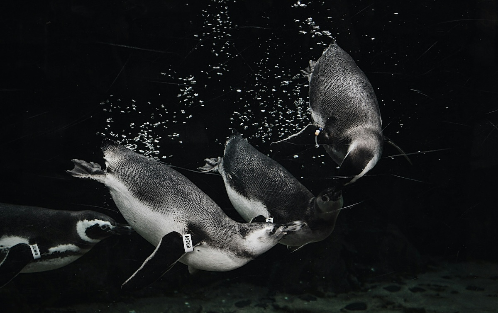
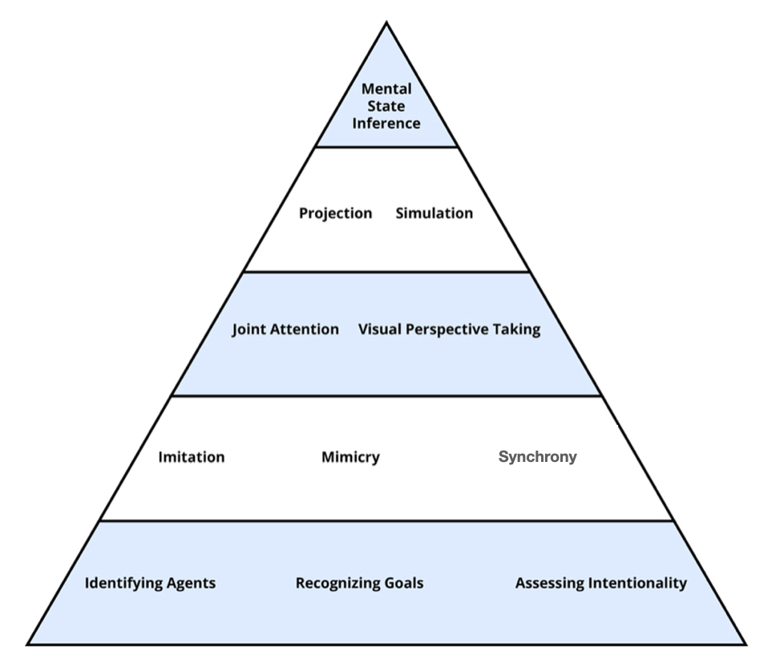

# Knowledge
```{r penguins, echo = FALSE, out.width='100%', fig.align = 'center'}
 
```

People form mental concepts of categories of objects, which permit them to respond appropriately to new objects they encounter. But categorization is actually more complex than it first appears. Consider penguins: they're clearly birds, yet they swim instead of soar, and waddle instead of hop. Despite being quite "un-birdy," you still recognize them as birds rather than fish or mammals. Your knowledge systems do more than categorize objects, though. You also use your knowledge to understand other minds -- their beliefs, desires, and intentions. When you suggest to a friend that you visit the penguins at the zoo, you're using this ability to predict their response based on what you know about their interests and preferences.

Your knowledge operates at multiple levels: you categorize the physical world around you (recognizing penguins as birds despite their unusual characteristics), and you model the mental worlds of other people (understanding their thoughts, feelings, and motivations). Both types of knowledge allow you to navigate your environment effectively, whether you're correctly identifying animals at the zoo or predicting how your friend will react when you suggest watching the penguins swim. Understanding how these knowledge systems work reveals how you make sense of both the physical and social worlds around you.

:::learningobjectives
##### LEARNING OBJECTIVES {-}
1. Understand the problems with attempting to define categories.
2. Learn about theories of the mental representation of concepts.
3. Learn how knowledge may influence concept learning.
:::

```{r truck, echo = FALSE, out.width='50%', fig.align = 'center', fig.cap = 'Although you’ve (probably) never seen this particular truck before, you know a lot about it because of the knowledge you’ve accumulated in the past about the features in the category of trucks. [CC0 Public Domain](https://goo.gl/m25gce)'}
knitr::include_graphics("images/ch7/truck.jpg")
```

Consider the following set of objects: some dust, papers, a computer monitor, two pens, a cup, and an orange. What do these things have in common? Only that they all happen to be on my desk as I write this. This set of things can be considered a [category], *a set of objects that can be treated as equivalent in some way*. But, most of our categories seem much more informative—they share many properties. For example, consider the following categories: trucks, wireless devices, weddings, psychopaths, and trout. Although the objects in a given category are different from one another, they have many commonalities. When you know something is a truck, you know quite a bit about it. The psychology of categories concerns how people learn, remember, and use informative categories such as trucks or psychopaths.

The *mental representations we form of categories* are called [concepts](concept). There is a category of trucks in the world, and I also have a concept of trucks in my head. We assume that people’s concepts correspond more or less closely to the actual category, but it can be useful to distinguish the two, as when someone’s concept is not really correct.

Concepts are at the core of intelligent behavior. We expect people to be able to know what to do in new situations and when confronting new objects. If you go into a new classroom and see chairs, a blackboard, a projector, and a screen, you know what these things are and how they will be used. You’ll sit on one of the chairs and expect the instructor to write on the blackboard or project something onto the screen. You do this *even if you have never seen any of these particular objects before*, because you have concepts of classrooms, chairs, projectors, and so forth, that tell you what they are and what you’re supposed to do with them. Furthermore, if someone tells you a new fact about the projector—for example, that it has a halogen bulb—you are likely to extend this fact to other projectors you encounter. In short, concepts allow you to extend what you have learned about a limited number of objects to a potentially infinite set of entities.

You know thousands of categories, most of which you have learned without careful study or instruction. Although this accomplishment may seem simple, we know that it isn’t, because it is difficult to program computers to solve such intellectual tasks. If you teach a learning program that a robin, a swallow, and a duck are all birds, it may not recognize a cardinal or peacock as a bird. As we’ll shortly see, the problem is that objects in categories are often surprisingly diverse.

Simpler organisms, such as animals and human infants, also have concepts [@Mareschal2010]. Squirrels may have a concept of predators, for example, that is specific to their own lives and experiences. However, animals likely have many fewer concepts and cannot understand complex concepts such as mortgages or musical instruments.

## Nature of Categories

```{r dog, echo = FALSE, out.width='50%', fig.align = 'center', fig.cap = 'Here is a very good dog, but one that does not fit perfectly into a well-defined category where all dogs have four legs. Image: [State Farm](https://goo.gl/KHtu6N), [CC BY 2.0](https://goo.gl/BRvSA7)'}
knitr::include_graphics("images/ch7/dog.jpg")
```

Traditionally, it has been assumed that categories are *well-defined*. This means that you can give a definition that specifies what is in and out of the category. Such a definition has two parts. First, it provides the *necessary features* for category membership: What must objects have in order to be in it? Second, those features must be *jointly sufficient* for membership: If an object has those features, then it is in the category. For example, if I defined a dog as a four-legged animal that barks, this would mean that every dog is four-legged, an animal, and barks, and also that anything that has all those properties is a dog.

Unfortunately, it has not been possible to find definitions for many familiar categories. Definitions are neat and clear-cut; the world is messy and often unclear. For example, consider our definition of dogs. In reality, not all dogs have four legs; not all dogs bark. I knew a dog that lost her bark with age (this was an improvement); no one doubted that she was still a dog. It is often possible to find some necessary features (e.g., all dogs have blood and breathe), but these features are generally not sufficient to determine category membership (you also have blood and breathe but are not a dog).

Even in domains where one might expect to find clear-cut definitions, such as science and law, there are often problems. For example, many people were upset when Pluto was downgraded from its status as a planet to a dwarf planet in 2006. Upset turned to outrage when they discovered that there was no hard-and-fast definition of planethood: “Aren’t these astronomers scientists? Can’t they make a simple definition?” In fact, they couldn’t. After an astronomical organization tried to make a definition for planets, a number of astronomers complained that it might not include accepted planets such as Neptune and refused to use it. If everything looked like our Earth, our moon, and our sun, it would be easy to give definitions of planets, moons, and stars, but the universe has sadly not conformed to this ideal.

Table: (\#tab:typicality) Examples of two categories, with members ordered by typicality [from @Rosch1975]

| Furniture | Fruit |
| :-----: | :-----: |
| chair | orange |
| table | banana |
| desk | pear |
| bookcase | plum |
| lamp | strawberry |
| cushion | pineapple |
| rug | lemon |
| stove | honeydew |
| picture | date |
| vase | tomato |

### Typicality {-}

Even among items that clearly are in a category, some seem to be “better” members than others [@Rosch1973]. Among birds, for example, robins and sparrows are very typical. In contrast, ostriches and penguins are very atypical (meaning not typical). If someone says, “There’s a bird in my yard,” the image you have will be of a smallish passerine bird such as a robin, not an eagle or hummingbird or turkey.

You can find out which category members are typical merely by asking people. Table \@ref(tab:typicality) shows a list of category members in order of their rated typicality. [Typicality] is perhaps the most important variable in predicting how people interact with categories. Table \@ref(tab:influences) is a partial list of what typicality influences.

We can understand the two phenomena of borderline members and typicality as two sides of the same coin. Think of the most typical category member: This is often called the category prototype. Items that are less and less similar to the [prototype](#prototype-def) become less and less typical. At some point, these less typical items become so atypical that you start to doubt whether they are in the category at all. Is a rug really an example of furniture? It’s in the home like chairs and tables, but it’s also different from most furniture in its structure and use. From day to day, you might change your mind as to whether this atypical example is in or out of the category. So, changes in typicality ultimately lead to borderline members.

Table: (\#tab:influences) Influences of typicality on cognition.

| Influence | Source |
| :-------- | :--- |
| Typical items are judged category members more often | @Hampton1979 |
| Speed of categorization is faster for typical items | @rips1973semantic |
| Typical members are learned before atypical ones | @Rosch1975 |
| Learning a category is easier if typical examples are provided | @mervis1980acquisition |
| In language comprehension, references to typical members are understood more easily | @garrod1977interpreting |
| In language production, people tend to say typical items before atypical ones (e.g., "apples and lemons" rather than "lemons and apples") | @onishi2008prototypicality |

#### Source of Typicality {-}

Intuitively, it is not surprising that robins are better examples of birds than penguins are, or that a table is a more typical kind of furniture than is a rug. But given that robins and penguins are known to be birds, why should one be more typical than the other? One possible answer is the frequency with which we encounter the object: We see a lot more robins than penguins, so they must be more typical. Frequency does have some effect, but it is actually not the most important variable [@Rosch1976]. For example, I see both rugs and tables every single day, but one of them is much more typical as furniture than the other.

The best account of what makes something typical comes from @Rosch1975 *family resemblance theory*. They proposed that items are likely to be typical if they (a) have the features that are frequent in the category and (b) do not have features frequent in other categories. Let’s compare two extremes, robins and penguins. Robins are small flying birds that sing, live in nests in trees, migrate in winter, hop around on your lawn, and so on. Most of these properties are found in many other birds. In contrast, penguins do not fly, do not sing, do not live in nests or in trees, do not hop around on your lawn. Furthermore, they have properties that are common in other categories, such as swimming expertly and having wings that look and act like fins. These properties are more often found in fish than in birds.

According to Rosch and Mervis, then, it is not because a robin is a very common bird that makes it typical. Rather, it is because the robin has the shape, size, body parts, and behaviors that are very common among birds—and not common among fish, mammals, bugs, and so forth.

In a classic experiment, @Rosch1975 made up two new categories, with arbitrary features. Subjects viewed example after example and had to learn which example was in which category. Rosch and Mervis constructed some items that had features that were common in the category and other items that had features less common in the category. The subjects learned the first type of item before they learned the second type. Furthermore, they then rated the items with common features as more typical. In another experiment, Rosch and Mervis constructed items that differed in how many features were shared with a different category. The more features were shared, the longer it took subjects to learn which category the item was in. These experiments, and many later studies, support both parts of the family resemblance theory.

```{r bird, echo = FALSE, out.width='40%', fig.align = 'center', fig.cap = 'When you think of “bird,” how closely does the robin resemble your general figure? [CC0 Public Domain](https://goo.gl/m25gce)'}
knitr::include_graphics("images/ch7/bird.jpg")
```

## Theories of Concept Representation

Now that we know these facts about the psychology of concepts, the question arises of how concepts are mentally represented. There have been two main answers. The first, somewhat confusingly called the [prototype theory] suggests that people have a *summary representation of the category, a mental description that is meant to apply to the category as a whole*. (The significance of *summary* will become apparent when the next theory is described.) This description can be represented as a set of *weighted features* (Smith & Medin, 1981). The features are weighted by their frequency in the category. For the category of birds, having wings and feathers would have a very high weight; eating worms would have a lower weight; living in Antarctica would have a lower weight still, but not zero, as some birds do live there.

```{r lizard, echo = FALSE, out.width='60%', fig.align = 'center', fig.cap = 'If you were asked, “What kind of animal is this?” according to prototype theory, you would consult your summary representations of different categories and then select the one that is most similar to this image—probably a lizard! [Adhi Rachdian](https://goo.gl/dQyUwf), [CC BY 2.0](https://goo.gl/BRvSA7)'}
knitr::include_graphics("images/ch7/lizard.jpg")
```

The idea behind prototype theory is that when you learn a category, you learn a general description that applies to the category as a whole: Birds have wings and usually fly; some eat worms; some swim underwater to catch fish. People can state these generalizations, and sometimes we learn about categories by reading or hearing such statements (“The kimodo dragon can grow to be 10 feet long”).
When you try to classify an item, you see how well it matches that weighted list of features. For example, if you saw something with wings and feathers fly onto your front lawn and eat a worm, you could (unconsciously) consult your concepts and see which ones contained the features you observed. This example possesses many of the highly weighted bird features, and so it should be easy to identify as a bird.

This theory readily explains the phenomena we discussed earlier. Typical category members have more, higher-weighted features. Therefore, it is easier to match them to your conceptual representation. Less typical items have fewer or lower-weighted features (and they may have features of other concepts). Therefore, they don’t match your representation as well. This makes people less certain in classifying such items. Borderline items may have features in common with multiple categories or not be very close to any of them. For example, edible seaweed does not have many of the common features of vegetables but also is not close to any other food concept (meat, fish, fruit, etc.), making it hard to know what kind of food it is.

A very different account of concept representation is the *exemplar theory* ([exemplar] being a fancy name for an example; @Medin1978). This theory denies that there is a summary representation. Instead, the theory claims that your concept of vegetables is remembered examples of vegetables you have seen. This could of course be hundreds or thousands of exemplars over the course of your life, though we don’t know for sure how many exemplars you actually remember.

How does this theory explain classification? When you see an object, you (unconsciously) compare it to the exemplars in your memory, and you judge how similar it is to exemplars in different categories. For example, if you see some object on your plate and want to identify it, it will probably activate memories of vegetables, meats, fruit, and so on. In order to categorize this object, you calculate how similar it is to each exemplar in your memory. These similarity scores are added up for each category. Perhaps the object is very similar to a large number of vegetable exemplars, moderately similar to a few fruit, and only minimally similar to some exemplars of meat you remember. These similarity scores are compared, and the category with the highest score is chosen.

Why would someone propose such a theory of concepts? One answer is that in many experiments studying concepts, people learn concepts by seeing exemplars over and over again until they learn to classify them correctly. Under such conditions, it seems likely that people eventually memorize the exemplars [@Smith1998]. There is also evidence that *close similarity* to well-remembered objects has a large effect on classification. @Allen1991 taught people to classify items by following a rule. However, they also had their subjects study the items, which were richly detailed. In a later test, the experimenters gave people new items that were very similar to one of the old items but were in a different category. That is, they changed one property so that the item no longer followed the rule. They discovered that people were often fooled by such items. Rather than following the category rule they had been taught, they seemed to recognize the new item as being very similar to an old one and so put it, incorrectly, into the same category.

[Causal Model Theory] builds upon the prototype and exemplar theories, highlighting how people’s mental representations of categories evolve over time. Causal model theory proposes that people possess subjective theories about what constitutes a category, and these theories are based on a person’s continuously developing knowledge about concepts that focus on causal relationships (i.e. cause-and-effect relationships). Concepts are not learned in isolation, but rather are learned as a part of our experiences with the world around us-we acquire new information, we update our mental representation of what constitutes a category [@murphy2002]. Importantly, Causal Model Theory does not discount that a person’s subjective theory about what constitutes category membership may include identifying important similarities that unite concepts within that category. However, Causal Model Theory proposes that concept formation relies more heavily on causal relationships that are relevant to a particular category [@Laurence1999-LAUCAC-3]. 

## Organization of Concepts

### Semantic Networks {-}

The Semantic Network approach proposes that concepts of the mind are arranged in a functional storage-system for the meanings of words. In a graphical illustration of such a semantic net, concepts of our mental dictionary are represented by nodes, which represent a piece of knowledge about our world.  Links between the nodes indicate the relationship between concepts. The links can not only show that there is a relationship, they can also indicate the kind of relation by their length, for example. Every concept in the net is in a dynamical correlation with other concepts, which may have protoypically similar characteristics or functions. 

#### Collins and Quillian's Model {-}

One of the first scientists who thought about structural models of human memory that could be run on a computer was @quillian1967word. Together with Allan Collins, he developed the Semantic Network with related categories and with a hierarchical organization. 

In the Figure \@ref(fig:network), Collins and Quillian's network with added properties at each node is shown. As already mentioned, the skeleton-nodes are interconnected by links. At the nodes, concept names are added. General concepts are on the top and more particular ones at the bottom. By looking at the concept "car", one gets the information that a car has 4 wheels, has an engine, has windows, and furthermore moves around, needs fuel, is manmade. 

```{r network, echo = FALSE, out.width='60%', fig.align = 'center', fig.cap = 'Semantic Network according to Collins and Quillian with nodes, links, concept names and properties. '}
knitr::include_graphics("images/ch7/fig5.png")
```


These pieces of information must be stored somewhere. It would take too much space if every detail must be stored at every level. So the information of a car is stored at the base level and further information about specific cars, e.g. BMW, is stored at the lower level, where you do not need the fact that the BMW also has four wheels, if you already know that it is a car. This way of storing shared properties at a higher-level node is called [cognitive economy]. 

Information that is shared by several concepts is stored in the highest parent node. All child nodes below the information bearer also contain the properties of the parent node. However, there are exceptions. Sometimes a special car has not four wheels, but three. This specific property is stored in the child node.  Evidence for this structure can be found by the sentence verification technique. In experiments participants had to answer statements about concepts with "yes" or "no". It took longer to say "yes" if the concept-bearing nodes were further apart.

The phenomenon that adjacent concepts are activated is called [spreading activation]. These concepts are far more easily accessed by memory, they are "primed". This was studied and backed by @meyer1971facilitation with a lexical-decision task. Participants had to decide if word pairs were words or non-words. They were faster at finding real word pairs if the concepts of the two words were near each other in a semantic network. 

## Mental Models

How do humans use their understanding of concepts to make sense of the world? [Mental Model Theory] [@Johnson-Laird1991-JOHD-9], proposes that people use mental models to reason about the world. A [mental model] is a mental representation based on a set of fundamental assumptions that a person believes to be true [@Byrne_Johnson-Laird_2009]. These assumptions can be constructed from perception, imagination, or from discussions with other people [@Byrne_Johnson-Laird_1985]. A mental model is like a mental picture or idea that represents a specific possibility [@Johnson-Laird2002-JOHCAT-12], and which captures the common elements shared by all the different ways that possibility could happen. 

### A Theory of Mind {-}
[Theory of Mind] refers to the way people use mental models to understand other people. Theory of mind is the knowledge that others' beliefs, desires, intentions, emotions, and thoughts (i.e. their mental states) may be different from one's own, and that people’s behavior is based on their mental states [@Apperly2009DoHH]. A theory of mind allows adults to construct mental models that explain the motivation behind people’s actions, and to form predictions for how they will act in the future.

Possessing a theory of mind allows us to use our observations of people's behavior to infer their mental states (or vice versa: to predict their behavior from knowledge of their mental states). Having an appreciation for the workings of another person’s mind is considered a prerequisite for many of the phenomena that define the human species, such as: natural language acquisition [@baldwin1998word], strategic social interaction [@zhang2012perspective], reflexive thought [@bogdan2000minding], and moral judgment [@guglielmo2009heart]. The capacity to understand the minds of others begins to develop in the first year of life and becomes more robust throughout childhood and into adulthood. 

#### The Role of Theory of Mind in Social Life {-}
Imagine you are observing an interaction between two people: a man is standing behind a counter, and a woman hands them a thin plastic object. Without a theory of mind, you would be incapable of understanding this event, or predicting how either person would react to the other. Due to our capacity to infer mental states from behavior, we likely infer that the woman is a customer pulling out her credit card with the intention to pay the cashier behind the register [@baird2001making]. People’s theory of mind thus frames and interprets perceptions of human behavior in a particular way—as observations of agents who act intentionally and who have desires, beliefs, and other mental states that guide their actions [@perner1991understanding; @wellman1990child].

People without a theory of mind would be utterly incapable of making sense of simple social interactions that occur throughout everyday life. Moreover, without a theory of mind, there would probably be no such things as cashiers, credit cards, or money [@tomasello2003key]. Humans need to understand minds to engage in the kinds of complex interactions that social communities (small and large) require, and it is these complex social interactions that have given rise to the innovation of different human cultures around the world.

#### What is theory of mind? {-}
The first thing to note is that “theory of mind” is not a single thing. What underlies people’s capacity to recognize and understand mental states is a whole host of components or a “toolbox” for navigating the social world [@malle2008fundamental]. Figure \@ref(fig:pyramid) shows some of the most important tools. The simple and automatic processes appear at the bottom of the pyramid, and as we ascend to the upper levels, the processes become increasingly complex and deliberate. This organization also reflects development—from tools that infants display within the first 6–12 months to tools they need to acquire over the next 3–5 years. In the next few sections, we will talk about the capacities that make up each level.

```{r pyramid, echo = FALSE, out.width='100%', fig.align = 'center', fig.cap = 'Some of the major tools of theory of mind, with the bottom showing simple, automatic, early developing processes, and the top showing complex, more deliberate, late developing processes. '}

```

#### Level 1: Agents, Goals, and Intentionality {-}
The agent category allows humans to identify those moving objects in the world that can act on their own. Features that even infants can use to identify agents, include: being self-propelled, having eyes or a face, and reacting systematically to another person’s behavior, such as by following their gaze or imitating their actions [@johnson2000; @premack1990]. The process of recognizing goals builds on this agent category. Even before the end of their first year, infants recognize that agents reach towards desired objects even when they don’t successfully make contact with the object they are attempting to grab [@GERGELY1995165; @woodward1998]. What it means to recognize goals, therefore, is to see an agent consistently pursue a particular object. 

Why is it important to recognize the goals of other people? Starting in infancy, humans expect other people's actions to be [goal directed] whereby they seek, track, and act to achieve desired outcomes [@gergely2003teleological; @jara-ettinger2016naive].Through learning to recognize the many ways by which agents pursue goals, humans learn to identify behaviors that are intentional. The concept of [intentionality] refers to the mental states that motivate people to act. Understanding the intentions that motivate a person's behavior is more complicated than identifying goals, as people sometimes possess intentions that differ from the eventual outcome. In addition, some behaviors can be unintentional even if they were goal-directed—such as when you possess the earnest goal of impressing your date, but instead, unintentionally make a fool of yourself. To act intentionally you need, aside from a goal, the right kinds of beliefs about how to achieve the goal. Moreover, by adulthood, the concept of intentionality requires that an agent have the skill to perform the intentional action. For example, if I am flipping a coin to try and have it land on heads, and do so on my first attempt, you would not judge my action of making it land on heads as intentional—you would say it was luck [@malle1997folk].

:::fyi
##### Infants’ Mental State Inferences from Goal Directed Actions {-}
Mental state reasoning becomes more robust throughout development, but previous research indicates that even infants are able to reason about the minds of others. Infants use people’s goal directed actions [@GERGELY1995165; @woodward1998] to infer mental states and use their understanding of people's mental states to predict their future behavior [@jara-ettinger2016naive]. For example, after observing an agent exert more effort [@liu2017ten] or take a greater risk [@liu2022dangerous] to obtain one object over another, infants infer social agents prefer the object associated with the more effortful or riskier actions. Thus, infants appear to use the relative cost an agent is willing to incur to infer the value that agents places on specific goal objects (i.e. they prefer object A over B).

Infants may also be interested in representing people's social goals whereby they use their observations of people's social interactions to infer the relationships between people [@powell2022adopted]. Recent research indicates that infants expect social agents who imitate the actions of others to be more likely to help [@pepe2023infants] and comfort [@kudrnova2024infants] those they imitate. These converging lines of work indicate that infants expect imitators to be positively affiliated, and therefore act in ways that promote the welfare, of those they imitate. Support for this hypothesis comes from recent evidence that infants use observations of a person's social interactions to infer the strength of their relationships to others. In a study by @thomas2022early, infants saw one social agent share saliva with a second agent, and also pass a ball back-and-forth with a third agent. Infants expected the saliva sharer to possess a stronger relationship with their social partner,compared to the agent who passed the ball, and therefore be more likely to comfort their social partner when they were in distress. Overall, infants appear to use the goal-directed actions of social agents to infer positively affiliated relationships, and expect people to act in ways that promote the welfare of their affiliates.
:::

#### Level 2: Imitation & synchrony {-}
From childhood, imitation aids in our understanding of other people [@meltzoff2003imitation]. [Imitation] is the human tendency to carefully observe other people’s behaviors and replicate their actions. A subtle, automatic form of imitation is called mimicry in which people unconsciously copy other people’s behavior. [Mimicry] can sometimes lead to [synchrony] whereby people engage in the same behaviors or possess the same internal states. Have you ever noticed when two people in conversation take on similar gestures, body positions, or even tone of voice? They “synchronize” their behaviors by way of (largely) unconscious imitation. Interestingly, people who enjoy an interaction tend to synchronize their behaviors more, and increased synchrony can increase enjoyment during a social interaction [@chartrand1999chameleon]. 

#### Level 3: Joint attention & visual perspective {-}
Going beyond the automatic, humans are capable of actively engaging with other people’s mental states, such as when they enter into situations of [joint attention]: two or more people attending to the same object and being aware that they are mutually attending to it. Such shared engagement is critical for children to learn the meaning of objects, and throughout adulthood to successfully work with other people. When I hold up my keyboard and show it to you, we are jointly attending to it, and if I then say it’s called “Tastatur” in German, you know that I am referring to the keyboard and not to the table on which it had been resting.

Another important capacity of engagement is [visual perspective taking] which refers to perceiving something from another person’s physical viewpoint. Pretend you are sitting at a dinner table and advise another person on where the salt is—do you consider that it is to her left even though it is to your right? When we overcome our egocentric perspective this way, we imaginatively adopt the other person’s spatial viewpoint and determine how the world looks from their perspective. 

#### Level 4: Projection & simulation {-}

When imagining what it might be like to be in another person’s psychological position, humans must go beyond mental rotation. One tool to understand other people’s thoughts and feelings is [simulation]: the process of representing other people’s mental states. Imagining a situation from another person’s perspective is a useful tool in understanding what motivated them to act. This often proves difficult to do effectively, as people are often influence by their own mental states and engage in social projection whereby they assume other people think, feel, or desire the same things they do [@meltzoff2007like; @krueger2007social]. 

In a sense, [social projection] is an absence of perspective taking, because we assume that the other person’s perspective equals our own. Have you ever been surprised that friend missed the obvious point of a movie that seemed so clear to you? Or that everyone is going to stare at the pimple on your forehead that appeared that same morning? In these kinds of situations, people find it difficult to suppress their own knowledge and overestimate the likelihood that other people will share their perspective [@keysar1994illusory], and how attentive other people will be to the things they are focused on [@gilovich1999spotlight]. So, the next time when you spot a magnificent bird high up in the tree and you get impatient with your friend who just can’t see what is clearly obvious, remember: it’s obvious to you.

#### Level 5: Mental state inference {-}
The ability to effectively model and take another person’s perspective requires that we separate our mental states from those of other people. Effective modeling of other people's mental states also relies on general knowledge of how people tend to respond to a situation (“Everybody would be nervous when threatened by a man with a gun”) and agent-specific knowledge (“Joe is fearless because he was trained in martial arts”). People also use the perceived facts and context of the situation, such as what is happening to the agent, the agent’s facial expressions and behaviors, and what the person saw or didn’t see. 

This capacity of integrating multiple lines of information into a [mental state inference] develops steadily within the first few years of life [@wellman2001meta]. The research began with a clever experiment by @wimmer1983beliefs, who tested whether children can pass a false-belief test. In this experiment, children are asked whether a person who possesses a false belief (i.e. a belief that contradicts reality) will act in accordance with their false belief or the child’s accurate knowledge of the situation. 

Children in the false-belief task were shown a picture book. In the book, Sally puts her ball in a basket and leaves the room. While Sally is out of the room, Anne comes along and takes the ball from the basket and puts it inside a box. The child is then asked where Sally thinks the ball is located when she comes back to the room. Is she going to look first in the box or in the basket?

The correct answer is that she will look in the basket, because that’s where she put it and thinks it is; but we have to infer this false belief against our own accurate knowledge that the ball is in the box. This is very difficult for children before the age of 4, and it usually takes some cognitive effort in adults [@epley2004perspective].

#### Summary {-}
Understanding the minds of othe people requires many tools. Humans use their knowledge and observations of people's faces, goal-directed actions, and gestures to understand concepts such as agent, intentional action, and preferences. These inferences rely on relatively automatic psychological processes, such as imitation, joint attention, and projection, as well as more deliberate processes, such as simulation and mental-state inference. The ability to integrate all of these tool is essential for developing accurate mental models of others' minds. These mental models enable people to understand and navigate the social world and the individuals within it.  


:::takeaways
##### Key Takeaways {-}
- Concepts are central to our everyday thought. When we are planning for the future or thinking about our past, we think about specific events and objects in terms of their categories. If you’re visiting a friend with a new baby, you have some expectations about what the baby will do, what gifts would be appropriate, how you should behave toward it, and so on. Knowing about the category of babies helps you to effectively plan and behave when you encounter this child you’ve never seen before.
- Learning about those categories is a complex process that involves seeing exemplars (babies), hearing or reading general descriptions (“Babies like black-and-white pictures”), general knowledge (babies have kidneys), and learning the occasional rule (all babies have a rooting reflex). 
:::

:::exercises
##### Exercises {-}
1. Practice: Pick a couple of familiar categories and try to come up with definitions for them. When you evaluate each proposal (a) is it in fact accurate as a definition, and (b) is it a definition that people might actually use in identifying category members?
2. Practice: For the same categories, can you identify members that seem to be “better” and “worse” members? What about these items makes them typical and atypical?
3. Discussion: Choose three common categories: a natural kind, a human artifact, and a social event. Are the corresponding categories likely to differ across countries and cultures? Can you make a hypothesis about when such categories are likely to differ and when they are not?
:::

## Glossary

##### Basic-level category {-}

The neutral, preferred category for a given object, at an intermediate level of specificity.

##### Category {-}

A set of entities that are equivalent in some way. Usually the items are similar to one another.

##### Causal Model Theory {-}
Causal Model Theory suggests that people categorize concepts based on evolving subjective theories that emphasize causal relationships, rather than solely on comparisons with prototypes or exemplars.

##### Cognitive economy {-}

A principle of semantic organization that properties of a category that are shared by many members of a category are stored at a higher-level node in the network.

##### Concept {-}

The mental representation of a category.

##### Exemplar {-}

An example in memory that is labeled as being in a particular category.

##### Goal Directed {-}

An agent's behavior that is motivated by a desire to seek, track, or obtain a particular outcome. 

##### Imitation {-}

The conscious observation and replication of other people’s behavior. 

##### Intentionality {-}

Mental states that motivate people's actions.

##### Joint Attention {-}

Two or more people attending to the same object and being aware that they are mutually attending to it

##### Mental Model {-}

A mental representation based on a set of fundamental assumptions that a person believes to be true

##### Mental Model Theory {-}

Mental Model Theory proposes that people use mental models to reason about the world, mapping out different possibilities based on a set of fundamental assumptions

##### Mental State Inference {-}

Generating a belief about a person's mental states. Inferences can be based on observations of how a person behaves, knowledge of the person, knowledge of how people generally act, or on knowledge of contextual factors of a situation. 

##### Mimicry {-}

Unconsciously imitating another person's behavior

##### Prototype {#prototype-def -}

The most typical category member.

##### Prototype theory {-}

A theory of concept representation that people have a summary representation of a category that is meant to apply to the category as a whole.

##### Simulation {-}

The process of representing a different person’s mental states.

##### Social Projection {-}

A person's assumption that another person possesses identical mental states.

##### Spreading activation {-}  

When a concept is activated in memory, related concepts also increase in activation.

##### Synchrony {-}

Two or more people displaying the same behaviors or having the same internal states (typically because of mutual mimicry).

##### Theory of Mind {-}

The human capacity to understand minds, a capacity that is made up of a collection of concepts (e.g., agent, intentionality) and processes (e.g., goal detection, imitation, empathy, perspective taking).

##### Typicality {-}

The difference in “goodness” of category members, ranging from the most typical (the prototype) to borderline members.

##### Visual Perspective Taking {-}

Attempting to visualize something from another person’s spatial vantage point.
