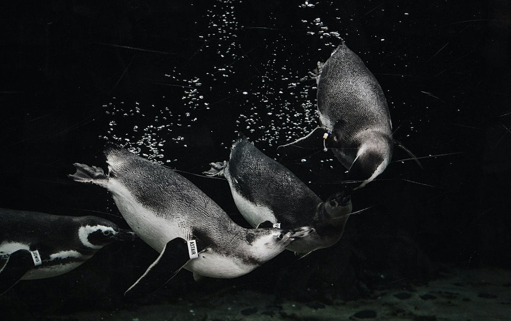
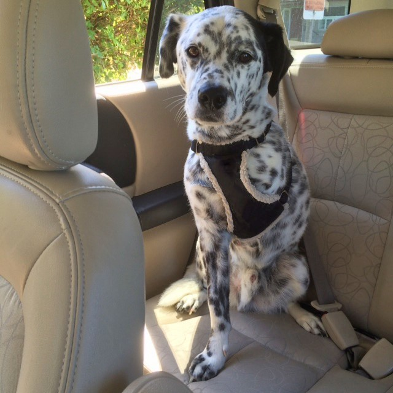
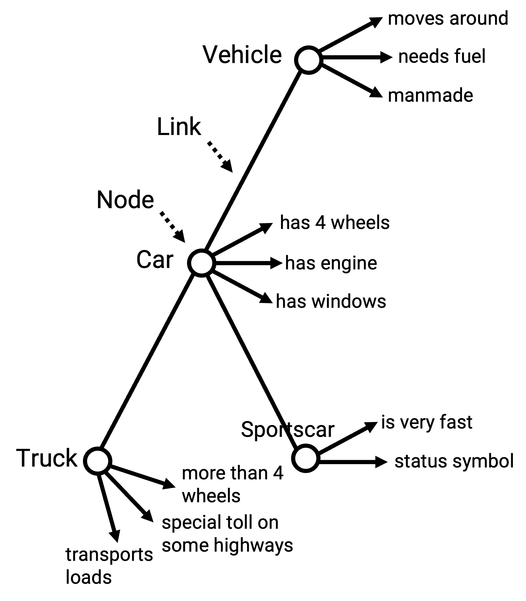
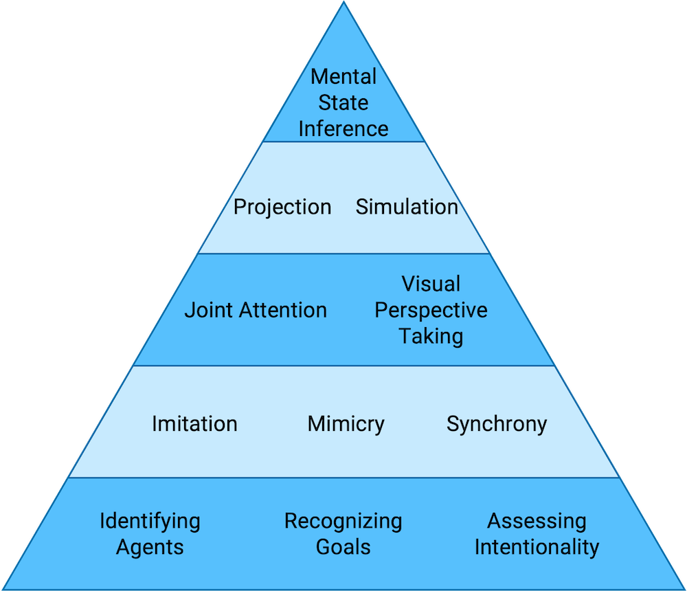

# Knowledge
```{r penguins, echo = FALSE, out.width='100%', fig.align = 'center', fig.alt = 'Black and white photograph of four penguins swimming underwater.'}
 
```

People form mental concepts of categories of objects, which allow them to respond appropriately to new objects they encounter. But categorization is actually more complex than it first appears. Consider penguins: they're clearly birds, yet they swim instead of fly, and waddle instead of hop. Despite these "un-birdy" characteristics, you still recognize them as birds rather than fish or mammals. Your knowledge systems do more than categorize objects, though. You also use your knowledge to understand other minds -- their beliefs, desires, and intentions. When you suggest to a friend that you visit the penguins at the zoo, you're using this ability to predict their response based on what you know about their interests and preferences.

Your knowledge operates at multiple levels: you categorize the physical world around you (recognizing penguins as birds despite their unusual characteristics), and you model the mental worlds of other people (understanding their thoughts, feelings, and motivations). Both types of knowledge allow you to navigate your environment effectively, whether you're correctly identifying animals at the zoo or predicting how your friend will react when you suggest watching the penguins swim. Understanding how these knowledge systems work reveals how you make sense of both the physical and social worlds around you.

:::learningobjectives
##### LEARNING OBJECTIVES {-}
1. Understand the problems with attempting to define categories.
2. Learn about theories of the mental representation of concepts.
3. Understand how concepts are organized in semantic networks.
4. Learn how prior knowledge and expertise change the way we process information.
5. Understand how people use mental models to reason about other minds.
:::

```{r truck, echo = FALSE, out.width='50%', fig.align = 'center', fig.cap = 'Although you’ve (probably) never seen this particular truck before, you know a lot about it because of the knowledge you’ve accumulated in the past about the features in the category of trucks. [CC0 Public Domain](https://goo.gl/m25gce)', fig.alt = 'Photograph of a small red and yellow cargo truck.'}

```

Consider the following set of objects: some dust, papers, a computer monitor, two pens, a cup, and an orange. What do these things have in common? Only that they all happen to be on my desk as I write this. This set of things can be considered a [category], *a set of objects that can be treated as equivalent in some way*. But, most of our categories seem much more informative—they share many properties. For example, consider the following categories: trucks, wireless devices, weddings, psychopaths, and trout. Although the objects in a given category are different from one another, they have many commonalities. When you know something is a truck, you know quite a bit about it. The psychology of categories concerns how people learn, remember, and use informative categories such as trucks or psychopaths.

The *mental representations we form of categories* are called [concepts](concept). There is a category of trucks in the world, and I also have a concept of trucks in my head. We assume that people’s concepts correspond more or less closely to the actual category, but it can be useful to distinguish the two, as when someone’s concept is not really correct.

Concepts are at the core of intelligent behavior. We expect people to be able to know what to do in new situations and when confronting new objects. If you go into a new classroom and see chairs, a blackboard, a projector, and a screen, you know what these things are and how they will be used. You’ll sit on one of the chairs and expect the instructor to write on the blackboard or project something onto the screen. You do this *even if you have never seen any of these particular objects before*, because you have concepts of classrooms, chairs, projectors, and so forth, that tell you what they are and what you’re supposed to do with them. Furthermore, if someone tells you a new fact about the projector—for example, that it has a halogen bulb—you are likely to extend this fact to other projectors you encounter. In short, concepts allow you to extend what you have learned about a limited number of objects to a potentially infinite set of entities.

You know thousands of categories, most of which you have learned without careful study or instruction. Although this accomplishment may seem simple, we know that it isn’t, because it is difficult to program computers to solve such intellectual tasks. If you teach a learning program that a robin, a swallow, and a duck are all birds, it may not recognize a cardinal or peacock as a bird. As we’ll shortly see, the problem is that objects in categories are often surprisingly diverse.

Simpler organisms, such as animals and human infants, also have concepts [@Mareschal2010]. Squirrels may have a concept of predators, for example, that is specific to their own lives and experiences. However, animals likely have many fewer concepts and cannot understand complex concepts such as mortgages or musical instruments.

## Nature of Categories

```{r dog, echo = FALSE, out.width='50%', fig.align = 'center', fig.cap = 'Here is a very good dog, but one that does not fit perfectly into a well-defined category where all dogs have four legs. Image: [State Farm](https://goo.gl/KHtu6N), [CC BY 2.0](https://goo.gl/BRvSA7)', fig.alt = 'A Dalmatian dog sits attentively in the back seat of a car. The dog is missing its left front leg at the shoulder.'}

```

Traditionally, it has been assumed that categories are *well-defined*. This means that you can give a definition that specifies what is in and out of the category. Such a definition has two parts. First, it provides the *necessary features* for category membership: What must objects have in order to be in it? Second, those features must be *jointly sufficient* for membership: If an object has those features, then it is in the category. For example, if I defined a dog as a four-legged animal that barks, this would mean that every dog is four-legged, an animal, and barks, and also that anything that has all those properties is a dog.

Unfortunately, it has not been possible to find definitions for many familiar categories. Definitions are neat and clear-cut; the world is messy and often unclear. For example, consider our definition of dogs. In reality, not all dogs have four legs; not all dogs bark. I knew a dog that lost her bark with age (this was an improvement); no one doubted that she was still a dog. It is often possible to find some necessary features (e.g., all dogs have blood and breathe), but these features are generally not sufficient to determine category membership (you also have blood and breathe but are not a dog).

Even in domains where one might expect to find clear-cut definitions, such as science and law, there are often problems. For example, many people were upset when Pluto was downgraded from its status as a planet to a dwarf planet in 2006. Upset turned to outrage when they discovered that there was no hard-and-fast definition of planethood: “Aren’t these astronomers scientists? Can’t they make a simple definition?” In fact, they couldn’t. After an astronomical organization tried to make a definition for planets, a number of astronomers complained that it might not include accepted planets such as Neptune and refused to use it. If everything looked like our Earth, our moon, and our sun, it would be easy to give definitions of planets, moons, and stars, but the universe has sadly not conformed to this ideal.

Table: (\#tab:typicality) Examples of two categories, with members ordered by typicality [from @Rosch1975]

| Furniture | Fruit |
| :-----: | :-----: |
| chair | orange |
| table | banana |
| desk | pear |
| bookcase | plum |
| lamp | strawberry |
| cushion | pineapple |
| rug | lemon |
| stove | honeydew |
| picture | date |
| vase | tomato |

### Typicality {-}

Even among items that clearly are in a category, some seem to be “better” members than others [@Rosch1973]. Among birds, for example, robins and sparrows are very typical. In contrast, ostriches and penguins are very atypical (meaning not typical). If someone says, “There’s a bird in my yard,” the image you have will be of a smallish passerine bird such as a robin, not an eagle or hummingbird or turkey.

You can find out which category members are typical merely by asking people. Table \@ref(tab:typicality) shows a list of category members in order of their rated typicality. [Typicality] is perhaps the most important variable in predicting how people interact with categories. Table \@ref(tab:influences) is a partial list of what typicality influences.

We can understand the two phenomena of borderline members and typicality as two sides of the same coin. Think of the most typical category member: This is often called the category prototype. Items that are less and less similar to the [prototype](#prototype-def) become less and less typical. At some point, these less typical items become so atypical that you start to doubt whether they are in the category at all. Is a rug really an example of furniture? It’s in the home like chairs and tables, but it’s also different from most furniture in its structure and use. From day to day, you might change your mind as to whether this atypical example is in or out of the category. So, changes in typicality ultimately lead to borderline members.

Table: (\#tab:influences) Influences of typicality on cognition.

| Influence | Source |
| :-------- | :--- |
| Typical items are judged category members more often | @Hampton1979 |
| Speed of categorization is faster for typical items | @rips1973semantic |
| Typical members are learned before atypical ones | @Rosch1975 |
| Learning a category is easier if typical examples are provided | @mervis1980acquisition |
| In language comprehension, references to typical members are understood more easily | @garrod1977interpreting |
| In language production, people tend to say typical items before atypical ones (e.g., "apples and lemons" rather than "lemons and apples") | @onishi2008prototypicality |

#### Source of Typicality {-}

Intuitively, it is not surprising that robins are better examples of birds than penguins are, or that a table is a more typical kind of furniture than is a rug. But given that robins and penguins are known to be birds, why should one be more typical than the other? One possible answer is the frequency with which we encounter the object: We see a lot more robins than penguins, so they must be more typical. Frequency does have some effect, but it is actually not the most important variable [@Rosch1976]. For example, I see both rugs and tables every single day, but one of them is much more typical as furniture than the other.

The best account of what makes something typical comes from @Rosch1975 *family resemblance theory*. They proposed that items are likely to be typical if they (a) have the features that are frequent in the category and (b) do not have features frequent in other categories. Let’s compare two extremes, robins and penguins. Robins are small flying birds that sing, live in nests in trees, migrate in winter, hop around on your lawn, and so on. Most of these properties are found in many other birds. In contrast, penguins do not fly, do not sing, do not live in nests or in trees, do not hop around on your lawn. Furthermore, they have properties that are common in other categories, such as swimming expertly and having wings that look and act like fins. These properties are more often found in fish than in birds.

According to Rosch and Mervis, then, it is not because a robin is a very common bird that makes it typical. Rather, it is because the robin has the shape, size, body parts, and behaviors that are very common among birds—and not common among fish, mammals, bugs, and so forth.

In a classic experiment, @Rosch1975 made up two new categories, with arbitrary features. Subjects viewed example after example and had to learn which example was in which category. Rosch and Mervis constructed some items that had features that were common in the category and other items that had features less common in the category. The subjects learned the first type of item before they learned the second type. Furthermore, they then rated the items with common features as more typical. In another experiment, Rosch and Mervis constructed items that differed in how many features were shared with a different category. The more features were shared, the longer it took subjects to learn which category the item was in. These experiments, and many later studies, support both parts of the family resemblance theory.

```{r bird, echo = FALSE, out.width='40%', fig.align = 'center', fig.cap = 'When you think of “bird,” how closely does the robin resemble your general figure? [CC0 Public Domain](https://goo.gl/m25gce)', fig.alt = 'Photograph of a robin. Its head and back are warm brown with orange tones, and its chest is gray.'}

```

## Theories of Concept Representation

Now that we know these facts about the psychology of concepts, the question arises of how concepts are mentally represented. There have been two main answers. The first, somewhat confusingly called the [prototype theory] suggests that people have a *summary representation of the category, a mental description that is meant to apply to the category as a whole*. (The significance of *summary* will become apparent when the next theory is described.) This description can be represented as a set of *weighted features* (Smith & Medin, 1981). The features are weighted by their frequency in the category. For the category of birds, having wings and feathers would have a very high weight; eating worms would have a lower weight; living in Antarctica would have a lower weight still, but not zero, as some birds do live there.

```{r lizard, echo = FALSE, out.width='60%', fig.align = 'center', fig.cap = 'If you were asked, “What kind of animal is this?” according to prototype theory, you would consult your summary representations of different categories and then select the one that is most similar to this image—probably a lizard! [Adhi Rachdian](https://goo.gl/dQyUwf), [CC BY 2.0](https://goo.gl/BRvSA7)', fig.alt = 'Photograph of a Komodo dragon walking toward the camera on a beach. Komodo dragons are the world\'s largest lizards.'}

```

The idea behind prototype theory is that when you learn a category, you learn a general description that applies to the category as a whole: Birds have wings and usually fly; some eat worms; some swim underwater to catch fish. People can state these generalizations, and sometimes we learn about categories by reading or hearing such statements (“The kimodo dragon can grow to be 10 feet long”).
When you try to classify an item, you see how well it matches that weighted list of features. For example, if you saw something with wings and feathers fly onto your front lawn and eat a worm, you could (unconsciously) consult your concepts and see which ones contained the features you observed. This example possesses many of the highly weighted bird features, and so it should be easy to identify as a bird.

This theory readily explains the phenomena we discussed earlier. Typical category members have more, higher-weighted features. Therefore, it is easier to match them to your conceptual representation. Less typical items have fewer or lower-weighted features (and they may have features of other concepts). Therefore, they don’t match your representation as well. This makes people less certain in classifying such items. Borderline items may have features in common with multiple categories or not be very close to any of them. For example, edible seaweed does not have many of the common features of vegetables but also is not close to any other food concept (meat, fish, fruit, etc.), making it hard to know what kind of food it is.

A very different account of concept representation is the *exemplar theory* ([exemplar] being a fancy name for an example; @Medin1978). This theory denies that there is a summary representation. Instead, the theory claims that your concept of vegetables is remembered examples of vegetables you have seen. This could of course be hundreds or thousands of exemplars over the course of your life, though we don’t know for sure how many exemplars you actually remember.

How does this theory explain classification? When you see an object, you (unconsciously) compare it to the exemplars in your memory, and you judge how similar it is to exemplars in different categories. For example, if you see some object on your plate and want to identify it, it will probably activate memories of vegetables, meats, fruit, and so on. In order to categorize this object, you calculate how similar it is to each exemplar in your memory. These similarity scores are added up for each category. Perhaps the object is very similar to a large number of vegetable exemplars, moderately similar to a few fruit, and only minimally similar to some exemplars of meat you remember. These similarity scores are compared, and the category with the highest score is chosen.

Why would someone propose such a theory of concepts? One answer is that in many experiments studying concepts, people learn concepts by seeing exemplars over and over again until they learn to classify them correctly. Under such conditions, it seems likely that people eventually memorize the exemplars [@Smith1998]. There is also evidence that *close similarity* to well-remembered objects has a large effect on classification. @Allen1991 taught people to classify items by following a rule. However, they also had their subjects study the items, which were richly detailed. In a later test, the experimenters gave people new items that were very similar to one of the old items but were in a different category. That is, they changed one property so that the item no longer followed the rule. They discovered that people were often fooled by such items. Rather than following the category rule they had been taught, they seemed to recognize the new item as being very similar to an old one and so put it, incorrectly, into the same category.

[Causal Model Theory] builds upon the prototype and exemplar theories, highlighting how people’s mental representations of categories evolve over time. Causal model theory proposes that people possess subjective theories about what constitutes a category, and these theories are based on a person’s continuously developing knowledge about concepts that focus on causal relationships (i.e. cause-and-effect relationships). Concepts are not learned in isolation, but rather are learned as a part of our experiences with the world around us-we acquire new information, we update our mental representation of what constitutes a category [@murphy2002]. Importantly, Causal Model Theory does not discount that a person’s subjective theory about what constitutes category membership may include identifying important similarities that unite concepts within that category. However, Causal Model Theory proposes that concept formation relies more heavily on causal relationships that are relevant to a particular category [@Laurence1999-LAUCAC-3]. 

## Organization of Concepts

### Semantic Networks {-}

The Semantic Network approach proposes that concepts of the mind are arranged in a functional storage-system for the meanings of words. In a graphical illustration of such a semantic net, concepts of our mental dictionary are represented by nodes, which represent a piece of knowledge about our world.  Links between the nodes indicate the relationship between concepts. The links can not only show that there is a relationship, they can also indicate the kind of relation by their length, for example. Every concept in the net is in a dynamical correlation with other concepts, which may have protoypically similar characteristics or functions. 

#### Collins and Quillian's Model {-}

One of the first scientists who thought about structural models of human memory that could be run on a computer was @quillian1967word. Together with Allan Collins, he developed the Semantic Network with related categories and with a hierarchical organization. 

In the Figure \@ref(fig:network), Collins and Quillian's network with added properties at each node is shown. As already mentioned, the skeleton-nodes are interconnected by links. At the nodes, concept names are added. General concepts are on the top and more particular ones at the bottom. By looking at the concept "car", one gets the information that a car has 4 wheels, has an engine, has windows, and furthermore moves around, needs fuel, is manmade. 

```{r network, echo = FALSE, out.width='50%', fig.align = 'center', fig.cap = 'Semantic Network according to Collins and Quillian with nodes, links, concept names and properties. ', fig.alt = 'A semantic network diagram illustrating concepts as nodes connected by labeled links. Example nodes include vehicle, car, truck, and sportscar, with lines representing associative links between them. The diagram labels one node as "car" and one connection as a "link" to illustrate the structure of the network.'}

```

These pieces of information must be stored somewhere. It would take too much space if every detail must be stored at every level. So the information of a car is stored at the base level and further information about specific cars, e.g. BMW, is stored at the lower level, where you do not need the fact that the BMW also has four wheels, if you already know that it is a car. This way of storing shared properties at a higher-level node is called [cognitive economy]. 

Information that is shared by several concepts is stored in the highest parent node. All child nodes below the information bearer also contain the properties of the parent node. However, there are exceptions. Sometimes a special car has not four wheels, but three. This specific property is stored in the child node.  Evidence for this structure can be found by the sentence verification technique. In experiments participants had to answer statements about concepts with "yes" or "no". It took longer to say "yes" if the concept-bearing nodes were further apart.

The phenomenon that adjacent concepts are activated is called [spreading activation]. These concepts are far more easily accessed by memory, they are "primed". This was studied and backed by @meyer1971facilitation with a lexical-decision task. Participants had to decide if word pairs were words or non-words. They were faster at finding real word pairs if the concepts of the two words were near each other in a semantic network. 

## Prior Knowledge and Thinking

Knowledge isn't static: it accumulates over time and fundamentally changes how we process new information. Having rich, well-organized knowledge in a domain doesn't just mean you know more facts; it changes the way you think.

### The Power of Prior Knowledge {-}

Having relevant knowledge helps you think about new information. For example, if you already know a lot about baseball, listening to a game on the radio is straightforward -- you know exactly happened when the announcer says a batter grounded out, or that an outfielder stole a home run -- and you might remember interesting plays from the game to talk about later. If you don't know baseball, the same radio broadcast might be nearly incomprehensible, and when someone asks you later what happened in the game, you might not remember anything. 

A classic demonstration of this effect comes from @bransford1972contextual. They had people listen to passages that were difficult to understand without the right context. Read the following paragraph: 

> The procedure is actually quite simple. First you arrange things into different groups. Of course, one pile may be sufficient depending on how much there is to do. If you have to go somewhere else due to lack of facilities that is the next step, otherwise you are pretty well set. It is important not to overdo things. That is, it is better to do too few things at once than too many. In the short run this may not seem important but complications can easily arise. A mistake can be expensive as well. At first the whole procedure will seem complicated. Soon, however, it will become just another facet of life. It is difficult to foresee any end to the necessity for this task in the immediate future, but then one never can tell. After the procedure is completed one arranges the materials into different groups again. Then they can be put into their appropriate places. Eventually they will be used once more and the whole cycle will then have to be repeated. However, that is part of life. [@bransford1972contextual, p. 722]

This passage is confusing until you're told it's about washing clothes. Then, it makes perfect sense. Go back and read the passage now: the words haven't changed, but your ability to activate the right prior knowledge transforms your comprehension.

Some of the most striking demonstrations of how knowledge changes cognition come from studies of expertise. When you develop expertise, it's not only that your amount of knowledge increases; it's also that you organize your knowledge in fundamentally different ways that allow you to see patterns and solve problems that novices cannot. Recall from Chapter \@ref(working-memory-chapter) our discussion of a landmark study by @Chase1973: chess masters briefly glimpsed positions from actual chess games and could reproduce them with remarkable accuracy, far better than novice players. However, when shown random arrangements of chess pieces—positions that would never occur in a real game—the masters performed no better than novices. This shows that chess expertise isn't about having a better memory in general. Instead, experts have learned to recognize meaningful patterns and configurations. A master might see a position and think "ah, a Sicilian Defense with an isolated queen's pawn", allowing them to chunk many individual pieces into a single, meaningful unit. Read ahead to Chapter \@ref(problem-solving) for more about how expertise affects problem solving.

### Mental Models and Organized Knowledge {-}

As people develop knowledge and expertise, they build rich [mental models](#mental-model) in their domains. A mental model is a mental representation based on a set of organized knowledge and assumptions [@Johnson-Laird1991-JOHD-9; @Byrne_Johnson-Laird_2009]. These models allow experts to reason efficiently about their domain.

A doctor examining a patient with certain symptoms doesn't just catalog individual signs; they have a mental model of how different organ systems interact, how diseases progress, what patterns of symptoms co-occur. A chef combining ingredients doesn't just follow recipes; they have a mental model of how flavors complement each other, how cooking methods affect texture, how ingredients transform under heat. You probably have a mental model of how your daily commute works, including typical traffic patterns and alternate routes. You likely have mental models of social situations, helping you navigate dinner parties or job interviews. Mental models allow us to simulate possibilities, make predictions, and understand complex systems without having to reason through every detail from scratch.

One particularly important domain where humans develop sophisticated mental models is in understanding other people. Just as a physics expert builds models of physical systems, all humans build models of how minds work. This capacity to model other minds (i.e., to understand that others have beliefs, desires, and intentions that may differ from our own) is fundamental to human social life.

## Social Knowledge

We've seen how experts develop organized knowledge structures that change the way they think in domains like physics or chess. One domain where everyone becomes something of an "expert" is understanding other people. From infancy, humans develop sophisticated knowledge structures (i.e., mental models) for reasoning about minds. This capacity is called Theory of Mind.

### Understanding Other Minds {-}

[Theory of Mind] is the knowledge that others' beliefs, desires, intentions, emotions, and thoughts (i.e., their mental states) may be different from one's own, and that people’s behavior is based on their mental states [@Apperly2009DoHH]. This capacity allows you to construct mental models that explain why people act as they do and predict what they'll do next. The capacity to understand the minds of others begins to develop in the first year of life and becomes more robust throughout childhood and into adulthood. 

Imagine observing someone behind a counter accepting a thin plastic object from another person. Without theory of mind, this event would be incomprehensible. With it, you immediately understand: a customer is paying a cashier with a credit card [@baird2001making]. This capacity to interpret behavior in terms of mental states is fundamental to human social life. Without it, there would be no complex social interactions, no teaching and learning, no collaboration [@tomasello2003key].

### The Development of Theory of Mind {-}
Theory of mind is not a single ability but rather a “toolbox” for navigating the social world [@malle2008fundamental]. Figure \@ref(fig:pyramid) shows some of the most important tools. These capacities range from simple and automatic processes that infants display within the first year of life to complex and deliberate processes that develop over the first few years.

```{r pyramid, echo = FALSE, out.width='60%', fig.align = 'center', fig.cap = 'Some of the major tools of theory of mind, with the bottom showing simple, automatic, early developing processes, and the top showing complex, more deliberate, late developing processes. ', fig.alt = 'A pyramid diagram showing levels of theory of mind processes from most basic at the bottom to most complex at the top. From bottom to top: identifying agents, recognizing goals, and assessing intentionality; imitation, mimicry, and synchrony; joint attention and visual perspective taking; projection and simulation; and mental state inference at the apex.'}

```

Infants can tell the difference between agents that act on their own and other objects [@johnson2000; @premack1990], expect other people's actions to be directed by goals [@gergely2003teleological; @jara-ettinger2016naive], and begin to assess intentionality [@malle1997folk]. As we develop, we add more sophisticated abilities: we automatically imitate and synchronize with others [@meltzoff2003imitation; @chartrand1999chameleon], we engage in joint attention (sharing focus on the same object), we take others' visual perspectives, and eventually we can simulate what it's like to be in another person's position.

However, perspective-taking is difficult. People often engage in social projection, that is, assuming others think, feel, or perceive the same things they do [@meltzoff2007like; @krueger2007social]. Have you ever been surprised that a friend missed the "obvious" point of a movie? Or worried everyone would notice the pimple on your forehead? In these situations, people find it difficult to suppress their own knowledge and overestimate the likelihood that other people will share their perspective [@keysar1994illusory], and how attentive other people will be to the things they are focused on [@gilovich1999spotlight].

#### The False Belief Test {-}

A key milestone in theory of mind development is passing the false-belief test [@wimmer1983beliefs]. In this test, children see a story: Sally puts her ball in a basket and leaves the room. While Sally is gone, Anne moves the ball from the basket to a box. Children are asked where Sally will look for the ball when she returns.

The correct answer is the basket: that's where Sally believes it is. But children must infer this false belief against their own knowledge that the ball is actually in the box. This is very difficult for children before age 4, and it takes cognitive effort even for adults [@epley2004perspective].

:::fyi
##### Infant Social Cognition {-}

While theory of mind becomes more sophisticated throughout development, even infants show remarkable abilities to reason about others' minds. How do researchers study what preverbal infants understand? These studies typically use puppets or videos of people as "agents," and measure where infants look and for how long. Infants tend to look longer at events that surprise them or violate their expectations, allowing researchers to infer what infants understand about minds and social relationships.

Infants use observations of people’s goal directed actions to infer mental states and predict future behavior [@GERGELY1995165; @jara-ettinger2016naive; @woodward1998]. For example, infants watch how much effort or risk someone is willing to take to get different objects. If an agent works harder or take bigger risks to obtain one toy over another, infants infer that the agent prefers the harder-to-get toy [@liu2017ten; @liu2022dangerous]. In other words, infants appear to use the "cost" someone pays (in effort or risk) to figure out how much that person values different goals.

Infants also use social interactions to infer relationships between people [@powell2022adopted]. Recent research shows that infants expect people who imitate each other to have closer relationships, and expect that imitators will be more likely to help and comfort those they imitate [@kudrnova2024infants;@pepe2023infants]. Infants also use other social cues to infer relationship strength. For example, in a study by @thomas2022early, infants saw one social agent share saliva with a second agent, and also pass a ball back-and-forth with a third agent. Infants expected the saliva-sharer to have a stronger relationship with their partner and to be more likely to comfort them when distressed.

These findings suggest that even before they can talk, infants are building sophisticated models of how minds work and how social relationships function.
:::

:::takeaways
##### Key Takeaways {-}
- Learning about those categories is a complex process that involves seeing exemplars (babies), hearing or reading general descriptions (“Babies like black-and-white pictures”), general knowledge (babies have kidneys), and learning the occasional rule (all babies have a rooting reflex). 
- Concepts are organized in semantic networks with hierarchical structure and spreading activation, allowing efficient storage and retrieval of knowledge.
- Prior knowledge and expertise fundamentally change how we process information. Experts don't just know more -- they organize knowledge into meaningful patterns and see deeper principles that novices miss.
- Mental models are organized knowledge structures that allow us to reason efficiently about domains where we have expertise, from physics to cooking to understanding other people.
- Theory of mind is the capacity to recognize that others have mental states different from our own. This capacity relies on multiple tools, from basic agent recognition to complex mental state inference.
:::

:::exercises
##### Exercises {-}
1. Practice: Pick a couple of familiar categories and try to come up with definitions for them. When you evaluate each proposal (a) is it in fact accurate as a definition, and (b) is it a definition that people might actually use in identifying category members?
2. Practice: For the same categories, can you identify members that seem to be “better” and “worse” members? What about these items makes them typical and atypical?
3. Reflection: Think of something you're an "expert" in—this could be a hobby, sport, academic subject, video game, TV show, or anything else you know well. How does your knowledge change the way you notice things or understand new information in that domain? Can you give an example of a pattern or connection you see that a novice wouldn't notice?
4. Application: Think of a time when you misunderstood someone's behavior because you didn't consider their different knowledge or perspective. What went wrong? How does this relate to the false belief test and the problem of egocentrism in theory of mind?
:::

## Glossary

##### Basic-level category {-}

The neutral, preferred category for a given object, at an intermediate level of specificity.

##### Category {-}

A set of entities that are equivalent in some way. Usually the items are similar to one another.

##### Causal Model Theory {-}
Causal Model Theory suggests that people categorize concepts based on evolving subjective theories that emphasize causal relationships, rather than solely on comparisons with prototypes or exemplars.

##### Cognitive economy {-}

A principle of semantic organization that properties of a category that are shared by many members of a category are stored at a higher-level node in the network.

##### Concept {-}

The mental representation of a category.

##### Exemplar {-}

An example in memory that is labeled as being in a particular category.

##### Mental Model {-}

A mental representation based on organized knowledge and assumptions.

##### Prototype {#prototype-def -}

The most typical category member.

##### Prototype theory {-}

A theory of concept representation that people have a summary representation of a category that is meant to apply to the category as a whole.

##### Spreading activation {-}  

When a concept is activated in memory, related concepts also increase in activation.

##### Theory of Mind {-}

The human capacity to understand minds, a capacity that is made up of a collection of concepts (e.g., agent, intentionality) and processes (e.g., goal detection, imitation, empathy, perspective taking).

##### Typicality {-}

The difference in “goodness” of category members, ranging from the most typical (the prototype) to borderline members.
