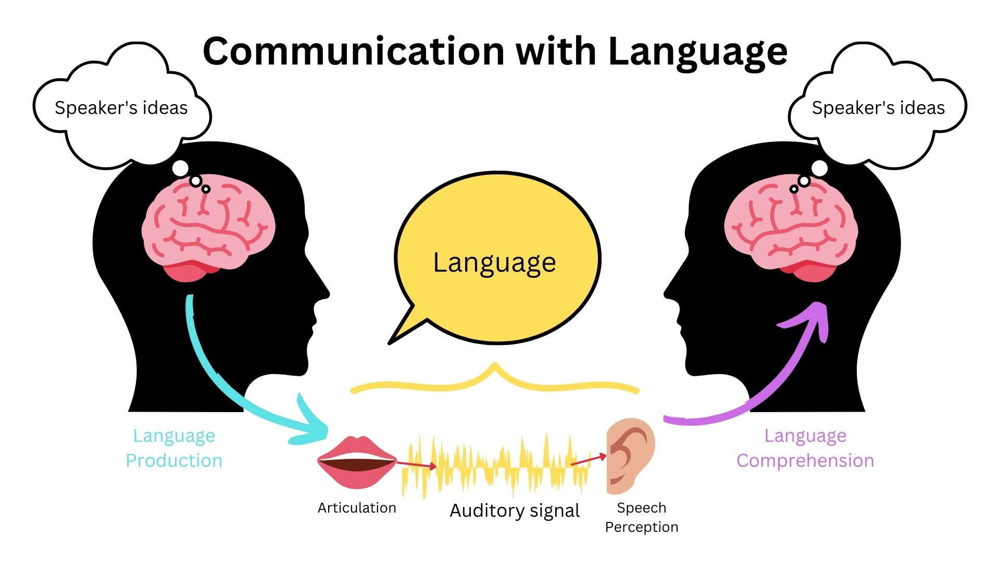

# Language
```{r fig8.1, echo = FALSE, out.width='100%', fig.align = 'center'}

```

Although language is often used for the transmission of information (“turn right at the next light and then go straight,” “Place tab A into slot B”), this is only its most mundane function. Language also allows us to access existing knowledge, to draw conclusions, to set and accomplish goals, and to understand and communicate complex social relationships. 

Human language is the most complex behavior on the planet and, at least as far as we know, in the universe. Some languages are oral - or spoken - which involves the operation of the vocal cords, and the coordination of breath with movements of the throat, mouth, and tongue. Other languages are signed, where the language is expressed by movements of the hands. You may be familiar with American Sign Language (ASL), but there are at least 300 sign languages around the world. All human languages involve a variety of complex cognitive, social, and biological processes. Language involves both the ability to comprehend spoken, signed, or written words and to create communication in real time when we speak, sign, or write.

:::learningobjectives
##### LEARNING OBJECTIVES {-}
1. Understand and appreciate the complex behavior that is human language
2.
:::

## What is Language?

Did you know that you can read minds? That's pretty much what you do every time you use human language to communicate with the people around you. Language allows us to convert our thoughts into a code, which others can decode, thus essentially reading our minds. 

Think about a time where you have been talking to a friend. Before you speak, you decided what to wanted to say. If you use spoken languages, you then squeeze the air out of your lungs, vibrating your vocal folds, and manipulating parts of your mouth to produce sounds. Those sounds then vibrate the air particles and are picked up by your eardrums and interpreted as auditory information by your brain. If you use signed languages, you use a variety of manual and facial gestures to produce meaningful signs. The person you're signing with sees these gestures and interprets this as visual information. In both cases, if the communication was successful, the other person ends up with an idea in their mind that’s similar to the idea in yours. All humans have this shared system that allows us to understand each other’s ideas through language.  

We are not the only creatures that can communicate, however. Nonhuman animals have a wide variety of systems of communication. Some species communicate using scents; others use visual displays, such as baring the teeth, puffing up the fur, or flapping the wings; and still others use vocal sounds. Male songbirds, such as canaries and finches, sing songs to attract mates and to protect territory, and chimpanzees use a combination of facial expressions, sounds, and actions, such as slapping the ground, to convey aggression [@deWaal1989]. Honeybees use a waggle dance to direct other bees to the location of food sources [@vonFrisch1956]. The language of vervet monkeys is relatively advanced in the sense that they use specific sounds to communicate specific meanings. Vervets make different calls to signify that they have seen either a leopard, a snake, or a hawk [@Seyfarth1997).

Despite their wide abilities to communicate, efforts to teach animals to use language have had only limited success. The most proficient nonhuman language speaker is Kanzi, a bonobo who lives at the Language Learning Center at Georgia State University [@Savage-Rumbaugh1994]. As you can see in “Video Clip: Language Recognition in Bonobos,” Kanzi has a propensity for language that is in many ways similar to humans. He learned faster when he was younger than when he got older, he learns by observation, and he can use symbols to comment on social interactions, rather than simply for food treats. Kanzi can also create elementary syntax and understand relatively complex commands. Kanzi can make tools and can even play the video game Pac-Man.

And yet even Kanzi does not have a true language in the same way that humans do. Human babies learn words faster and faster as they get older, but Kanzi does not. Each new word he learns is almost as difficult as the one before. Kanzi usually requires many trials to learn a new sign, whereas human babies can speak words after only one exposure. Kanzi’s language is focused primarily on food and pleasure and only rarely on social relationships. Although he can combine words, he generates few new phrases and cannot master syntactic rules beyond the level of about a two-year-old human child [@Greenfield1991].

```{r qr, echo = FALSE, out.width='60%', fig.align = 'center', fig.cap = ' HYPERLINK "http://www.youtube.com/watch?v=2Dhc2zePJFE"Watch: “Kanzi and Novel Sentences” [YouTube]: http://www.youtube.com/watch?v=2Dhc2zePJFE'}
knitr::include_graphics("images/ch8/qr.png")
```

In sum, although many animals communicate, none of them has a true language. With some exceptions, the information that can be communicated in nonhuman species is limited primarily to displays of liking or disliking, and related to basic motivations of aggression and mating. Humans also use this more primitive type of communication, in the form of nonverbal behaviors such as eye contact, touch, hand signs, and interpersonal distance, to communicate their like or dislike for others, but they (unlike animals) also supplant this more primitive communication with language. Although other animal brains share similarities to ours, only the human brain is complex enough to create language. What is perhaps most remarkable is that although language never appears in non-humans, language is universal in humans. All humans, unless they have a profound brain abnormality or are completely isolated from other humans, learn language.

### Linguistic Diversity {-}

We've introduced Language, but we can also talk about individual languages. There are thousands of languages that are currently being spoken around the world. We don't know the exact number because it's hard to define what the difference between a language and a dialect is. 

Colloquially, the term dialect is used to refer to ways of speaking that people perceive to be substandard, low status, associated with working class, non-prestigious, geographically-isolated, or some derivation or aberration from a ‘standard’ version of the language. The linguistic fact though is that everyone has a dialect. Rather than think about languages and dialects in a hierarchical way, linguists think about [dialect]s as subdivisions of a language. What you may think of as 'English' is Mainstream US English (MUSE), which is a dialect of English. If you're from California, you may speak Californian English, yet another dialect. No one of these dialects is more correct or legitimate than another. 

The way you speak may also be affected by the kinds of groups you associate with. Speaking differently with different social groups is called a [sociolect]. There are many words, phrases, and pronunciation differences associated with the LGBT+ community. Using these features could constitute a sociolect.

Last, there are also just some things that we each do a little bit differently. Think of particular saying that you might use with your family, inside jokes with your friends, memes, and features from different dialects and sociolects. All of these come together to create the unique version of a language that you speak. We call that an [idiolect].

### The Components of Language {-}

Language can be conceptualized in terms of sounds, meaning, and the environmental factors that help us understand it. Phonemes are the elementary sounds of our language, morphemes are the smallest units of meaning in a language, syntax is the set of grammatical rules that control how words are put together, and contextual information is the elements of communication that are not part of the content of language but that help us understand its meaning.

A [phoneme] is *the smallest unit of sound that makes a meaningful difference in a language*. The word “bit” has three phonemes, /b/, /i/, and /t/ (in transcription, phonemes are placed between slashes), and the word “pit” also has three: /p/, /i/, and /t/. In spoken languages, phonemes are produced by the positions and movements of the vocal tract, including our lips, teeth, tongue, vocal cords, and throat, whereas in sign languages phonemes are defined by the shapes and movement of the hands.

There are hundreds of unique phonemes that can be made by human speakers, but most languages only use a small subset of the possibilities. English contains about 45 phonemes, whereas other languages have as few as 15 and others more than 60. The Hawaiian language contains only about a dozen phonemes, including five vowels (a, e, i, o, and u) and seven consonants (h, k, l, m, n, p, and w).

In addition to using a different set of phonemes, because the phoneme is actually a category of sounds that are treated alike within the language, speakers of different languages are able to hear the difference only between some phonemes but not others. This is known as the categorical perception of speech sounds. English speakers can differentiate the /r/ phoneme from the /l/ phoneme, and thus “rake” and “lake” are heard as different words. In Japanese, however, /r/ and /l/ are the same phoneme, and thus speakers of that language cannot tell the difference between the word “rake” and the word “lake.” Try saying the words “cool” and “keep” out loud. Can you hear the difference between the two /k/ sounds? To English speakers they both sound the same, but to speakers of Arabic these represent two different phonemes (Figure 10.9, “Speech Sounds and Adults”).

Whereas phonemes are the smallest units of sound in language, a [morpheme] is *a string of one or more phonemes that makes up the smallest units of meaning in a language*. Some morphemes, such as one-letter words like “I” and “a,” are also phonemes, but most morphemes are made up of combinations of phonemes. Some morphemes are prefixes and suffixes used to modify other words. For example, the syllable “re-” as in “rewrite” or “repay” means “to do again,” and the suffix “-est” as in “happiest” or “coolest” means “to the maximum.”

[Syntax] is *the set of rules of a language by which we construct sentences*. Each language has a different syntax. The syntax of the English language requires that each sentence have a noun and a verb, each of which may be modified by adjectives and adverbs. For example, in African American English (AAE), which has different syntactic rules that MUSE, to describe a habitual action, one could say, "They *be* reading in the library." This sentence doesn't follow the rules of MUSE syntax, in which one would more likely describe the same event by saying something like, "They are usually reading in the library" [@green2002]. This also shows us how many systematic grammatical differences there might be between two very similar dialects of the same language, like AAE and MUSE.

[Semantics] is *the meaning of words and sentences*. Languages denote, refer to, and represent things. Words do not possess fixed meanings but change their interpretation as a function of the context in which they are spoken. We use contextual information — *the information surrounding language—to help us interpret it*. The study of this kind of contextual information is called [pragmatics]. Examples of contextual information include the knowledge that we have and that we know that other people have, and nonverbal expressions such as facial expressions, postures, gestures, and tone of voice. Misunderstandings can easily arise if people aren’t attentive to contextual information or if some of it is missing, such as it may be in newspaper headlines or in text messages.

An example that can help differentiate semantics and pragmatics is the sentence, "It's cold in here." The denotational meaning (i.e. semantics) of the sentence refers to the temperature in the room. But perhaps someone says this situation to someone sitting next to an open window. Now, this sentence means something like "please close the window."  That is the pragmatic meaning. 

:::fyi
### Examples in Which Syntax Is Correct but the Interpretation Can Be Ambiguous
* Grandmother of Eight Makes Hole in One
* Milk Drinkers Turn to Powder
* Farmer Bill Dies in House
* Old School Pillars Are Replaced by Alumni
* Two Convicts Evade Noose, Jury Hung
* Include Your Children When Baking Cookies
:::

## Mechanisms of Language

The two major components of language that are studied in cognitive psychology are language production and language comprehension. Language production encompasses the process of converting thoughts into language, while language comprehension, or language processing, is the process of decoding language back into thoughts. Successful communication happens when the listener correctly decodes the speech signal produced by the speaker, understanding the intended message.

```{r fig8.2, echo = FALSE, out.width='80%', fig.align = 'center', fig.cap = 'A model of communication with language exchanges to help them practice language.'}

```

### Language Processing {-}

Language processing is an incredible complex process. In this section, we introduce some of the topics that fall under language processing. 

#### Speech Perception {-}

Above, we introduced phonemes as a concept. But how do we know these are relevant units of language to study? Speech is a continuous signal and part of language comprehension is picking out the sounds and telling them apart. These tasks comprise speech perception. 
 
The first of these tasks, [speech segmentation], requires the listener to tell where one word stops and another begins. The place where one word stops and another begins is called a word boundary. Children as young as 8 months are sensitive to the statistical regularities in the language that they hear and use them to segment words. A study found that after being familiarized with sequences of words generated by a speech synthesizer, infants were able to tell where word boundaries were [@saffran1996]. 

Part of telling words apart requires listeners to tell two sounds apart. For example, to tell the words 'pat' and 'bat' apart, you have to be able to tell the difference between the two sounds /p/ and /b/. We know that infants are born able to understand all phonemes, but as they get older, they lose their ability to do so. By 10 months of age a child’s ability to recognize phonemes becomes very similar to that of the adult speakers of the native language. Phonemes that were initially differentiated come to be treated as equivalent [@Werker2002].

[(https://www.youtube.com/watch?v=WvM5bqUsbu8)]

Research, like that done by [@saffran1996] and [@Werker2002], tells us that as children learn a particular language, they very quickly start to pick up on statistical patterns in the language and start to pay attention only to the relevant acoustic information that helps them tell sounds apart in their language.

#### Sentence Processing {-}

Sentence processing takes place whenever a reader or listener processes a language utterance, either in isolation or in the context of a conversation or a text. To do this, you group words into phrases, based on the syntactic rules from your language, in order to determine what the sentence means. This process is called [parsing]. By and large, this happens so quickly and automatically, that it's hard to notice yourself doing it. 

Let's look at examples of when parsing is very hard. [Garden path sentences] are sentences that start out in a way that makes you think the sentence means one thing, but information at the end of the sentence forces you to reevaluate the meaning of the sentence. These are [all over the place](https://www.theguardian.com/world/2018/apr/10/spanish-politicians-urged-to-resign-over-fake-degree-claims), if you're looking out for them.

:::fyi
##### Can you understand these Garden Path Sentences the first time?
* The horse raced past the barn fell.
* The old man the boat.
* When Fred eats food gets thrown.
* The cotton clothing is made of grows in Mississippi.
:::

These sentences show us that as you read or hear the next word, you are continuously parsing the sentence and evaluating the meaning. You don't wait until the end of the sentence to parse and understand it. 

### Language Production {-}

Less is known about language production, because studying it can be more difficult. One way that people do study it is by asking what kinds of things might affect the way you speak? One thing we know that will affect language production, is language that the speaker hears before speaking. For example, if the speaker is listening to descriptions of an event that use passive constructions (e.g. 'The election was won by the incumbent.') as opposed to active constructions (e.g. 'The incumbent won the election.'), the speaker is more likely to use the passive construction when they speak next [@pickering2008]. This is called structural priming. 

## Language Acquisition

Language learning begins even before birth, because the fetus can hear muffled versions of speaking from outside the womb. @Moon1993 found that infants only two days old sucked harder on a pacifier when they heard their mothers’ native language being spoken than when they heard a foreign language, even when strangers were speaking the languages. 

During the first year or so after birth, and long before they speak their first words, infants are already learning language. One aspect of this learning is practice in producing speech. By the time they are six to eight weeks old, babies start making vowel sounds (ooohh, aaahh, goo) as well as a variety of cries and squeals to help them practice.

```{r fig8.3, echo = FALSE, out.width='60%', fig.align = 'center', fig.cap = 'Practicing Language. Babies often engage in vocal exchanges to help them practice language.'}
knitr::include_graphics("images/ch8/fig2.jpg")
```

At about seven months, infants begin [babbling], engaging in *intentional vocalizations that lack specific meaning*. Children babble as practice in creating specific sounds, and by the time they are one year old, the babbling uses primarily the sounds of the language that they are learning [@deBoysson-Bardies1984]. These vocalizations have a conversational tone that sounds meaningful even though it isn’t. Babbling also helps children understand the social, communicative function of language (Figure 2.3, “Practicing Language”). Children who are exposed to sign language babble in sign by making hand movements that represent real language [@Petitto1991].

At the same time that infants are practicing their speaking skills by babbling, they are also learning to better understand sounds and eventually the words of language. One of the first words that children understand is their own name, usually by about six months, followed by commonly used words like “bottle,” “mama,” and “doggie” by 10 to 12 months [@Mandel1995].

The early utterances of children contain many errors, for instance, confusing /b/ and /d/, or /c/ and /z/. And the words that children create are often simplified, in part because they are not yet able to make the more complex sounds of the real language (Dobrich & Scarborough, 1992). Children may say “keekee” for kitty, “nana” for banana, and “vesketti” for spaghetti in part because it is easier. Often these early words are accompanied by gestures that may also be easier to produce than the words themselves. Children’s pronunciations become increasingly accurate between one and three years, but some problems may persist until school age.

Most of a child’s first words are nouns, and early sentences may include only the noun. “Ma” may mean “more milk please” and “da” may mean “look, there’s Fido.” Eventually the length of the utterances increases to two words (“mo ma” or “da bark”), and these primitive sentences begin to follow the appropriate syntax of the native language.

The infant usually produces his or her first words at about one year of age. It is at this point that the child first understands that words are more than sounds — they refer to particular objects and ideas. By the time children are two years old, they have a vocabulary of several hundred words, and by kindergarten their vocabularies have increased to several thousand words. By Grade 5, most children know about 50,000 words. The average university student knows about 200,000 words.

Because language involves the active categorization of sounds and words into higher level units, children make some mistakes in interpreting what words mean and how to use them. In particular, they often make [overextensions] of concepts, *which means they use a given word in a broader context than appropriate*. A child might at first call all adult men “daddy” or all animals “doggie.”

Children learn that people are usually referring to things that they are looking at when they are speaking [@Baldwin1993], and that that the speaker’s emotional expressions are related to the content of their speech. Children also use their knowledge of syntax to help them figure out what words mean. If a child hears an adult point to a strange object and say, “this is a dirb,” they will infer that a “dirb” is a thing, but if they hear them say, “this is a one of those dirb things” they will infer that it refers to the colour or other characteristic of the object. And if they hear the word “dirbing,” they will infer that “dirbing” is something that we do [@Waxman1990].

### The Importance of Language in Cognitive Development {-}

Not all children are given access to language at an early age. One of the best documented cases of intentional language deprivation is the case of Genie, who was locked in a small room from infancy until the age of 13, almost completely deprived of human contact. When psychologists were evaluating her condition and beginning to treat her, she was only able to say a few words and they didn’t know how much she understood. As she went through therapy, she followed some of the normative acquisition milestones, like the one-word stage and using short phrases. But her language development was slower than average and she never acquired a full grammar. [@pines1981]

Despite knowing how damaging language deprivation can be, there is one group of children who don’t have access to the language environment. About 90-95% of babies who are born deaf or hard of hearing are born into families where the primary language modality is speech [@mitchell-karchmer2004]. In some cases, families who learn that their child is deaf choose to start learning a sign language like ASL. If they use sign in their interactions with their child, then the baby has access to an ambient language in the visual modality and will develop a mental grammar from that input. But some families of deaf children choose not to use signed language, which means that their child does not get access to any ambient language: neither auditory nor visual. Why might a family make that decision? To answer that question, we need to talk a bit about cochlear implants.

A cochlear implant (CI) is an electronic prosthetic device that is implanted surgically. It takes sounds from the environment and converts them to electrical signals. Those signals then get transmitted to the brain via the auditory nerve [@NIH-NIDCD]. In developed countries, it is very common for deaf children to receive a CI between ages one and three years. Even so, most kids with CIs still score well below hearing kids on standard tests of language proficiency, even when they’ve had the implant for several years – not because of any deficit in the children, but because the electrical signals from a cochlear implant are not a sufficient language environment for typical development [@mauldin2019]. But in spite of this evidence, there’s still a persistent stigma around sign languages and deafness, and many parents, teachers, and medical professionals consider it so important for children to “pass” in a hearing world that they don’t offer access to signed language because they fear that it might interfere with the child’s eventual acquisition of spoken language. Because of this belief that vocal language is better than sign language, known as *oralism*, many deaf children have no exposure to language before receiving a CI, and after implantation have access only to the atypical electrical signals produced by the device. 

This language deprivation leads to long-term impairments in social and cognitive function and, ironically, to lower scores on tests of vocal language comprehension [@hall2019; @hall2017; @humphries2016;@lillo2021]. In contrast, when deaf children of hearing parents have access to ASL by age six months, their vocabulary develops at a comparable rate to deaf children of deaf signing parents [@caselli2021].

This evidence from deaf kids shows us just how vital the language environment is, and how important it is that children have access to an ambient language as early as possible. The neural connections that make up mental grammar can only form in response to language input from the environment. Without that input in the first year of life, it’s much harder for the brain to build a mental grammar.

### Bilingualism {-}

There’s a bias in the literature on children’s language acquisition: a lot of it focuses on kids who are acquiring just one language, but monolingual kids are not the norm around the world. It is just as common for children to grow up with more than one language in the environment. Some children have one language in the home environment and another at daycare. In some families, one adult speaks one language and another adult speaks a different one. And some kids grow up in an environment where all the adults switch between two or three languages.

Some early psychological research showed that, when compared with monolingual children, bilingual children performed more slowly when processing language, and their verbal scores were lower. But these tests were frequently given in English, even when this was not the child’s first language, and the children tested were often of lower socioeconomic status than the monolingual children [@Andrews1982].

More current research that has controlled for these factors has found that, although bilingual children may, in some cases, learn language somewhat slower than do monolingual children [@Oller2002], bilingual and monolingual children do not significantly differ in the final depth of language learning, nor do they generally confuse the two languages [@Nicoladis1997]. In fact, participants who speak two languages have been found to have better cognitive functioning, cognitive flexibility, and analytic skills in comparison to monolinguals [@Bialystok2009]. Research has also found that learning a second language produces changes in the area of the brain in the left hemisphere that is involved in language, such that this area is denser and contains more neurons [@Mechelli2004]. Furthermore, the increased density is stronger in those individuals who are most proficient in their second language and who learned the second language earlier. Thus, rather than slowing language development, learning a second language seems to increase cognitive abilities.

### Adult Language Acquisition {-}

As the previous chapter showed, language learning is not usually difficult or effortful for young children. As long as they’re in an environment where they have access to language used by adults, they’ll learn it pretty quickly. One reason it’s so easy for little ones is because of their neural plasticity: their brains are super-keen to make new connections in response to their experiences. The older you get, the harder it is for your brain to grow new neural pathways, so the harder it is to learn new things. It’s not impossible by any means, it just takes more effort!

On the other hand, adults have some advantages over children. We have metacognitive skills we can apply consciously to language learning, such as memorizing new vocabulary and morphology, choosing to study a little bit each day, or seeking out books, movies, podcasts or other media in our new language. We also have metalinguistic awareness that we can employ. For example, we can consciously practice placing our articulators in new positions, or we can compare and contrast the syntactic structures in our new language with those from our L1 (first language).

Another factor that can make language learning harder for adults than for children is our self-consciousness. Learning a new language usually involves interacting with other people, including other people who are more proficient than us. If you’re adult who’s used to being seen as competent, it can be embarrassing to feel like a beginner and to make mistakes.

Like the field of Linguistics as a whole, the subfield of Second Language Acquisition is often narrowly focused on grammar, especially on acquiring phonetics, morphology and syntax. This approach to teaching and learning is related to colonial ways of thinking that treat language as an object or asset that can be acquired in isolation from people, communities, and relationships [@czaykowska2017;@lukaniec2022;@mackenzie2022]. 

:::fyi
##### Research Focus: When can we best learn language? Testing the critical period hypothesis

For many years psychologists assumed that there was a [critical period] (*a time in which learning can easily occur*) for language learning, lasting between infancy and puberty, and after which language learning was more difficult or impossible [@brown1967; @Penfield1959]. But later research provided a different interpretation. 

An important study by Jacqueline Johnson and Elissa Newport [@Johnson1989] using Chinese and Korean speakers who ahd learned English as a second language provided the first insight. The participants were all adults who had immigrated to the United States between three and 39 years of age and who were tested on their English skills by being asked to detect grammatical errors in sentences. Johnson and Newport found that the participants who had begun learning English before they were seven years old learned it as well as native English speakers but that the ability to learn English dropped off gradually for the participants who had started later. Newport and Johnson also found a correlation between the age of acquisition and the variance in the ultimate learning of the language. While early learners were almost all successful in acquiring their language to a high degree of proficiency, later learners showed much greater individual variation. 

Johnson and Newport's finding that children who immigrated before they were seven years old learned English fluently seemed consistent with the idea of a critical period in language learning. But their finding of gradual decrease in proficiency for those immigrated between eight and 39 years of age was not - rather, it suggested that there might not be a single critical period  of language learning that ended at puberty, as early theorists had expected, but that language learning at later ages is imply better when it occurs earlier. This idea was reinforced in research by [@Hakuta2003, who examined census records of language learning in millions of Chinese and Spanish immigrants. The census form asks respondents to describe their own English ability using one of five categories: not at all, not well, well, very well, and speak only English. The results of this research dealt another blow to the idea of the critical period, because it showed that regardless of what year was used as a cutoff point for the end of the critical period, there was no evidence for any discontinuity in language-learning potential. Rather, the results (Figure 10.10 "English Proficiency in Native Chinese Speakers") showed that the degree of success in second-language acquisition declined steadily throughout the respondent's life span. The difficulty of learning language as one gets older is probably due to the fact that, with age, the brain loses its [plasticity] - that is, *its ability to develop new neural connections*.

```{r fig8.4, echo = FALSE, out.width='60%', fig.align = 'center', fig.cap = 'English Proficiency in Native Chinese Speakers. Hakuta, Bialystok, and Wiley (2003) found no evidence for critical periods in language learning. Regardless of level of education, self-reported second-language skills decreased consistently across age of immigration.'}
knitr::include_graphics("images/ch8/fig3.jpg")
```
:::

## Language and Thought

Researchers have been asking for decades whether the specific language(s) you speak affects the way you think. This hypothesis is often called the Sapir-Whorf Hypothesis [@sapir-whorf1956]. There are two versions of this theory: a strong version and a weak version. The strong version, called [linguistic determinism], is that the language you speak will determine, or limit, the way that you think. The weak version, called [linguistic relativity], is the hypothesis that people who speak different languages think differently as a result, or that language influences your thought but does not limit it. 

While there is little evidence for linguistic determinism, there are a variety of studies that support the conclusion that language influences thought, though indirectly via mechanisms like attention. One of these studies is about the perception of color. Different languages have different color terms. Russian has two words for the range of colors we call 'blue' in English. One corresponds to light blues, and the other to dark blues. As a result, Russian speakers are better than English speakers at discriminating between shades of blue, when one fell into the light blue category, and the other the dark blue category [@winawer2007].

Another piece of evidence comes from grammatical gender. If you have studied a language like French or Spanish, you know that some language categorize nouns into groups, called grammatical genders. So every noun will be either masculine or feminine. [@semenuks2017] found that speakers tended to use feminine-associated words to describe objects that had feminine grammatical gender. For example, if bridge is feminine in French, speakers would be more likely to describe it using an adjective with the gender associations as the gender of the noun. So, the grammatical groups that nouns fall into affects how you might describe those nouns. 

These examples show how language may - even in quite a limited way - influence the way we think about these things. 

:::takeaways
##### Key Takeaways {-}
- a
- b
:::

:::exercises
##### Exercises {-}
1. a
2. b
:::


## Glossary

##### word {-}


##### phoneme {-}

A phoneme is a unit of sound that can distinguish one word from another in a particular language.

##### morpheme {-}

A morpheme is the smallest unit of language that carries meaning. 

##### Syntax {-}

Syntax is the list of rules that allows you to construct grammatical sentences in a given language. 

##### Semantics {-}

Semantics is the meaning of words and sentences. Usually this refers to the definitional meaning, like you might find in a dictionary. 

##### Pragmatics {-}

Pragmatics refers to the meaning of words and sentences in context, where the surrounding language may change the meaning of the word or sentence. 

##### dialect {-}

A dialect is a subdivision, or version, of a language that may be associated with a geographical location or socioeconomic group. 

##### sociolect {-}

A sociolect is a version of a language that is associated with a particular social group.

##### idiolect {-}

An idiolect is the version of a language that a speaker speaks, which is unique to that speaker. 

##### babbling {-}

Babbling consists of intentional vocalizations that lack specific meaning produced by young children when they are learning language.

##### overextensions {-}

Overextentions are when a learning of a language - often a child - uses a word in a broader context than appropriate. 

##### Bilingualism {-}

Bilingualism refers to the state of being able to speak two languages.

##### critical period {-}


##### linguistic determinism {-}

##### linguistic relativity {-} 

