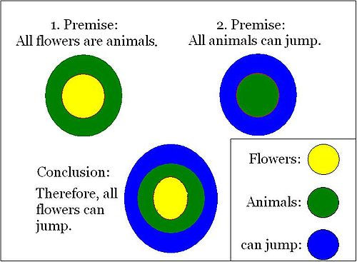
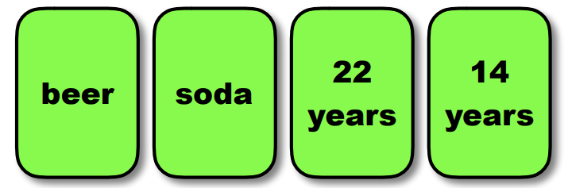
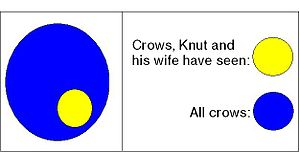
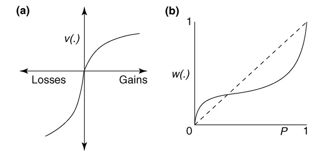

# Reasoning and Decision Making
```{r 9.0, echo = FALSE, out.width='100%', fig.align = 'center'}
 
```
We like to think that we make important decisions rationally, logically, and without bias or error— but what if that’s not the case?

Let us consider the following scene of Knut's life: It is a rainy summer afternoon in Germany and Knut and his wife are tired of watching the black crows in their garden. They decide to escape from the dreary weather and take a vacation to Spain, as Knut and his wife have never been there before. They will leave the next day, and he is packing his bag. He packs the crucial things first: underwear, socks, pajamas, and a toiletry bag with a toothbrush, shampoo, soap, sun tan lotion, and bug spray. Knut cannot find the bug spray, and his wife volunteers to go buy a new bottle. He advises her to take an umbrella for the walk to the pharmacy as it is raining outside, and then he turns back to packing. But what did he already pack into his bag? Immediately, he remembers and continues, putting together outfits and packing his clothing. Since it is summer, Knut packs mostly shorts and t-shirts. After half an hour, he is finally convinced that he has done everything necessary for a nice vacation.

With this story of Knut’s vacation preparation, we will explain the basic principles of reasoning and decision making. We will demonstrate how much cognitive work is necessary for even this fragment of everyday life.

In reasoning, available information is taken into account in the form of premises. A conclusion is reached on the basis of these premises through a process of inference. The content of the conclusion goes beyond either one of the premises. To demonstrate, consider the following consideration Knut makes before planning his vacation:

> Premise 1: In all countries in southern Europe it is warm during summer.
> Premise 2: Spain is a country in southern Europe.
> Conclusion: Therefore, in Spain it is warm during summer.
 
The conclusion in this example follows directly from the premises, but it includes information that is not explicitly stated in the premises. This is a typical feature of a process of reasoning. We will discuss the two major kinds of reasoning, inductive reasoning and deductive reasoning, which logically complement of one another.

## Deductive reasoning

:::learningobjectives
##### LEARNING OBJECTIVES {-}
1. XX
2. XX
:::

Deductive reasoning is concerned with syllogisms in which the conclusion follows logically from the premises. The following example about Knut makes this process clear:

1. Premise: Knut knows: If it is warm, one needs shorts and t-shirts.
2. Premise: He also knows that it is warm in Spain during summer.
Conclusion: Therefore, Knut reasons that he needs shorts and t-shirts in Spain.

In this example it is obvious that the premises are about rather general information and the resulting conclusion is about a more special case which can be inferred from the two premises. We will now differentiate between the two major kinds of syllogisms: categorical and conditional syllogisms.

### Categorical syllogisms {-}

In categorical syllogisms, the statements of the premises typically begin with “all”, “none” or “some” and the conclusion starts with “therefore,” “thus,” or “hence.” These kinds of syllogisms describe a relationship between two categories. In the example given above in the introduction of deductive reasoning these categories are *Spain* and *the need for shorts and T-Shirts*. Two different approaches serve the study of categorical syllogisms: the [normative approach] and the [descriptive approach].

#### The normative approach {-}
```{r fig9.1, echo = FALSE, out.width='60%', fig.align = 'center', fig.cap = 'Euler Circles'}

```

The normative approach to categorical syllogisms is based on logic, and deals with the problem of categorizing conclusions as either valid or invalid. “Valid” means that the conclusion follows logically from the premises whereas “invalid” means the contrary. Two basic principles and a method called Euler Circles have been developed to help make validity judgments. The first principle was created by Aristotle, and states “If the two premises are true, the conclusion of a valid syllogism must be true” (cp. @Goldstein2005). The second principle states “The validity of a syllogism is determined only by its form, not its content.” These two principles explain why the following syllogism is (surprisingly) valid:

>All flowers are animals.

>All animals can jump. 

>Therefore, all flowers can jump.

Even though it is quite obvious that the first premise is not true and further that the conclusion is not true, the whole syllogism is still valid. That is, when you apply formal logic to the syllogism in the example, the conclusion is valid.

It is possible to display a syllogism formally with symbols or letters and explain its relationship graphically with the help of diagrams. One way to demonstrate a premise graphically is to use Euler circles (pronounced “oyler”). Starting with a circle to represent the first premise and adding one or more circles for the second one (\@ref(fig:fig9.1)), one can compare the constructed diagrams with the conclusion. The displayed syllogism in (\@ref(fig:fig9.1)) is obviously valid. The conclusion shows that everything that can jump contains animals which again contains flowers. This aligns with the two premises which point out that flowers are animals and thus are able to jump. Euler circles help represent such logic.

#### The descriptive approach {-}

The descriptive approach is concerned with estimating people’s ability to judge the validity of syllogisms and explaining errors people make. This psychological approach uses two methods in order to study people’s performance:

>Method of evaluation: People are given two premises and a conclusion. Their task is to judge whether the syllogism is valid.

>Method of production: Participants are given two premises. Their task is to develop a logically valid conclusion.
  
In addition to the form of a syllogism, the content can influence a person’s decision and cause the person to neglect logical thinking. The belief bias states that people tend to judge syllogisms with believable conclusions as valid, while they tend to judge syllogisms with unbelievable conclusions as invalid. Given a conclusion as like “Some bananas are pink”, hardly any participants would judge the syllogism as valid, even though it might be logically valid according to its premises (e.g. Some bananas are fruits. All fruits are pink.)

### Conditional syllogisms {-}

Another type of syllogism is called “conditional syllogism.” Just like the categorical syllogisms, they also have two premises and a conclusion. The difference is that the first premise has the form “If … then”. Syllogisms like this one are common in everyday life. Consider the following example from the story about Knut:

>Premise 1: If it is raining, Knut’s wife needs an umbrella.
 
>Premise 2: It is raining.
 
>Conclusion: Therefore, Knut’s wife needs an umbrella.
 
Conditional syllogisms are typically given in the abstract form: “If p then q”, where “p” is called the [antecedent] and “q” the [consequent].

#### Forms of conditional syllogisms {-}

There are four major forms of conditional syllogisms: [modus ponens], [modus tollens], [denying the antecedent], and [affirming the consequent]. These are illustrated in the table below (\@ref(tab:Syllogisms)) by means of the conditional syllogism above (i.e. If it is raining, Knut’s wife needs an umbrella). The table indicates the premises, the resulting conclusions and whether the form is valid. The bottom row displays the how frequently people correctly identify the validity of the syllogisms.

|  | Modus Ponens | Modus Tollens | Denying the Antecedent | Affirming the Consequent |
|---|---|---|---|---|
| Description | The antecedent of the first premise is affirmed in the second premise.  | The consequent of the first premise is negated in the second premise. | The antecedent of the first premise is negates in the second premise. | The antecedent of the first premise is affirmed in the second premise. |
| Formal | If P then Q.  P Therefore Q. | If P the Q.  Not-Q Therefore Not-P. | If P then Q.  Not-P Therefore Not-Q. | If P then Q.  Q Therefore P. |
| Example | If it is raining, Knut's wife needs an umbrella. It is raining. Therefore Knut's wife needs an umbrella. | If it is raining, Knut's wife needs an umbrella. Knut's wife does not need an umbrella. Therefore it is not raining. | If it is raining, Knut's wife needs an umbrella.  It is not raining. Therefore Knut's wife does not need an umbrella. | If it is raining, Knut's wife needs an umbrella. Knut's wife needs an umbrella. Therefore it is raining.  |
| Validity | Valid | VALID | INVALID | INVALID |
| Correct Judgements | 97 % correctly identify as valid.  | 60% correctly identify as valid. | 40% correctly identify as invalid. | 40% correctly identify as invalid. |
Table: (\#tab:Syllogisms) Different kinds of conditional syllogisms.

As we can see, the validity of the syllogisms with valid conclusions is easier to judge correctly than the validity of the syllogisms with invalid conclusions. The conclusion in the instance of the modus ponens is apparently valid. In the example it is very clear that Knut’s wife needs an umbrella if it is raining.

The validity of the modus tollens is more difficult to recognize. Referring to the example, if Knut’s wife does not need an umbrella it can’t be raining. The first premise says that if it is raining, she needs an umbrella. So the reason for Knut’s wife not needing an umbrella is that it is not raining. Consequently, the conclusion is valid.

The validity of the remaining two kinds of conditional syllogisms is judged correctly by only 40% of people. If the method of denying the antecedent is applied, the second premise says that it is not raining. But from this fact it does not follow logically that Knut’s wife does not need an umbrella— she could need an umbrella for another reason, such as to shield from the sun.

Affirming the consequent in the case of the given example means that the second premise says that Knut’s wife needs an umbrella, but again the reason for this can be circumstances apart from rain. So, it does not logically follow that it is raining. Therefore, the conclusion of this syllogism is invalid.

The four kinds of syllogisms have shown that it is not always easy to make correct judgments concerning the validity of the conclusions. The following passages will deal with other errors people make during the process of conditional reasoning.

#### The Wason Selection Task {-}

The Wason Selection Task is a famous experiment which shows that people make more reasoning errors in abstract situations than when the situation is taken from real life [@Wason1960].

In the abstract version of the Wason Selection Task, four cards are shown to the participants with a letter on one side and a number on the other (\@ref(fig:fig9.2)). The task is to indicate the minimum number of cards that have to be turned over to test whether the following rule is observed: “If there is a vowel on one side then there is an even number on the other side.” 53% of participants selected the ‘E’ card which is correct, because turning this card over is necessary to test the truth of the rule. However another card still needs to be turned over. 64% indicated that the ‘4’ card has to be turned over which is not right. Only 4% of participants answered correctly that the ‘7’ card needs to be turned over in addition to the ‘E’. The correctness of turning over these two cards becomes more obvious if the same task is stated in terms of real-world items instead of vowels and numbers. One of the experiments for determining this was the beer/drinking-age problem used by @Griggs1982. This experiment is identical to the Wason Selection Task except that instead of numbers and letters on the cards, everyday terms (beer, soda and ages) were used (\@ref(fig:fig9.3)). Griggs and Cox gave the following rule to participants: “If a person is drinking beer then he or she must be older than 21.” In this case 73% of participants answered correctly, that the cards with “beer” and “14 years” have to be turned over to test whether the rule is kept.

```{r fig9.2, echo = FALSE, out.width='60%', fig.align = 'center', fig.cap = ''}
knitr::include_graphics("images/ch9/fig2.png")
```

```{r fig9.3, echo = FALSE, out.width='60%', fig.align = 'center', fig.cap = ''}

```

#### Why is the performance better in the case of real–world items? {-}

There are two different approaches to explain why participants’ performance is significantly better in the case of the beer/drinking-age problem than in the abstract version of the Wason Selection Task: the permission schemas approach and the evolutionary approach.

The rule, “if a person is 21 years old or older then they are allowed to drink alcohol,” is well-known as an experience from everyday life. Based on a lifetime of learning rules in which one must satisfy some criteria for permission to perform a specific act, we have a "permission schema" already stored in long-term memory to think about such situations. Participants can apply this previously-learned permission schema to the Wason Selection Task for real–world items to improve participants’ performance. On the contrary such a permission schema from everyday life does not exist for the abstract version of the Wason Selection Task (CHENG & HOLYOAK, 1985; GRIGGS & COX, 1983)

The evolutionary approach concerns the human ability of "cheater detection". This approach states that an important aspect of human behavior across our evolutionary history is the ability for people to cooperate in a way that is mutually beneficial. As long as a person who receives a benefit also pays the relevant cost, everything works well in a social exchange. If someone cheats, however, and receives a benefit from others without paying the cost, problems arise. It is assumed that the ability to detect cheaters became a part of the human cognitive makeup during evolution. This cognitive ability improves the performance in the beer/drinking-age version of the Wason Selection Task as it allows people to detect a cheating person who does not behave according to the rule. Cheater-detection does not work in the case of the abstract version of the Wason Selection Task as vowels and numbers cannot behave in any way, much less cheat, and so the cheater detection mechanism is not activated (COSMIDES 1989; GIGERENZER & HUG, 1992)

## Inductive reasoning

So far we have discussed deductive reasoning, which is reaching conclusions based on logical rules applied to a set of premises. However, many problems cannot be represented in a way that would make it possible to use these rules to come to a conclusion. [Inductive reasoning] is the process of making observations and applying those observations via generalization to a different problem. Therefore one infers from a special case to the general principle, which is just the opposite of the procedure of deductive reasoning (\@ref(fig:fig9.4)). A good example of inductive reasoning is the following:
 
> Premise: All crows Knut and his wife have ever seen are black.
 
> Conclusion: Therefore, they reason that all crows on earth are black.

In this example it is obvious that Knut and his wife infer from the simple observation about the crows they have seen to the general principle about all crows. Considering (\@ref(fig:fig9.4)), this means that they infer from the subset (yellow circle) to the whole (blue circle). As with this example, it is typical in inductive reasoning that the premises are believed to support the conclusion, but do not ensure the conclusion.

```{r fig9.4, echo = FALSE, out.width='60%', fig.align = 'center', fig.cap = ''}

```

### Forms of inductive reasoning {-}

The two different forms of inductive reasoning are “*strong*” and “*weak*” induction. The former indicates that the truth of the conclusion is very likely if the assumed premises are true. An example for this form of reasoning is the one given in the previous section. In this case it is obvious that the premise (“All crows Knut and his wife have ever seen are black”) gives good evidence for the conclusion (“All crows on earth are black”) to be true. Nevertheless it is still possible, although very unlikely, that not all crows are black.

On the contrary, conclusions reached by “weak induction” are supported by the premises in a relatively weak manner. In this approach, the truth of the premises makes the truth of the conclusion possible, but not likely. An example for this kind of reasoning is the following:

> Premise: Knut always listens to music with his iPhone.

> Conclusion: Therefore, he reasons that all music is only heard with iPhones.

In this instance the conclusion is obviously false. The information the premise contains is not very representative and although it is true, it does not give decisive evidence for the truth of the conclusion.

To sum it up, strong inductive reasoning yields conclusions which are very probable whereas the conclusions reached through weak inductive reasoning are unlikely to be true.

### Reliability of conclusions {-}

If the strength of the conclusion of an inductive argument has to be determined, three factors concerning the premises play a decisive role. The of Knut and his wife’s observations about crows (see previous sections) displays these factors:

When Knut and his wife observe, in addition to the black crows in Germany, the crows in Spain, the *number of observations* they make concerning the crows increases. Furthermore, the *representativeness of these observations* is supported if Knut and his wife observe the crows at different times and in different places and see that they are black every time. The *quality of the evidence* for all crows being black increases if Knut and his wife add scientific measurements that support the conclusion. For example, they could find out that the crows’ genes determine that the only color they can be is black.

Conclusions reached through a process of inductive reasoning are never definitely true, as no one has seen all crows on earth. It is possible, although very unlikely, that there is a green or brown exemplar. The three above factors contribute to the strength of an inductive argument. The stronger these factors are, the more reliable the conclusions reached through induction.

### Processes and constraints {-}

In the process of inductive reasoning people often make use of heuristics. These heuristics help people make judgments, but sometimes cause errors when the cues they are sensitive to are misleading. In the following sections, two of these heuristics, [the availability heuristic] and [the representativeness heuristic], are explained. Subsequently, [confirmation bias] is introduced, which refers to when people rely too heavily on their own prior beliefs when assessing new evidence.

#### The availability heuristic {-}

The availability heuristic refers to when people judge more memorable events (or examplars more generally) to be more frequent than less memorable events. In Kahneman and Tversky's paper introducing the heuristic, they describe that "Availability is an ecologically valid clue for the judgment of frequency because, in general, frequent events are easier to recall or imagine than infrequent ones. However, availability is also affected by various factors which are unrelated to actual frequency" (TVERSKY KAHNEMAN 1973). In other words, while an event's memorability is often a good cue as to how frequent that event is, this cue is imperfect.

For example, in an experiment done by Sarah Lichtenstein and colleagues, participants were asked to choose from a list which causes of death occur most often. Because of the availability heuristic, people judged more “spectacular” causes like homicide or tornadoes to cause more deaths than less dramatic causes, like asthma. They propose that this is because dramatic causes of death are disproportionately publicized in media, resulting in easier recall for participants and thus erroneously higher estimates of frequency (LICHTENSTEIN ET AL 1978).

#### The representativeness heuristic {-}

Similarly to the availability heuristic, the representativeness heuristic is used when people judge frequency. However in this case, people rely on a judgment of *similarity* instead of using memorability as a cue. For example, Tversky and Kahneman (TVERSKY KAHNEMAN 1983) gave the following description to a group of participants:

"Linda is 31 years old, single, outspoken and very bright. She majored in philosophy. As a student, she was deeply concerned with issues of discrimination and social justice, and also participated in anti-nuclear demonstrations."

They then asked participants to rank a series of descriptions in order of how likely they were to describe Linda. Most participants rated "Linda is a bank teller and is active in the feminist movement" as more likely than "Linda is a bank teller". However, this is logically impossible, as the first description *includes* the second (Figure 7). Because the participants based their judgment on similarity between the description of Linda and being "active in the feminist movement", rather than reasoning in line with the formal laws of logic, most committed this "conjunction fallacy".

Like the availability heuristic though, the representativeness heuristic is often accurate and useful. Tversky and Kahneman write: "Representativeness tends to covary with frequency: Common instances and frequent events are generally more representative than unusual instances and rare events" (TVERSKY KAHNEMAN 1983).


```{r fig9.5, echo = FALSE, out.width='60%', fig.align = 'center', fig.cap = 'Feminist bank tellers.'}
knitr::include_graphics("images/ch9/fig5.png")
```

#### Confirmation bias {-}

Confirmation bias refers to a set of related phenomena wherein people seek or interpret evidence in a way that aligns with beliefs they already hold. This can take the form of overweighting evidence that supports one's belief, underweighting evidence that opposes one's belief, using an information search strategy that is more likely to reveal supportive evidence, remembering only evidence that aligns with one's beliefs, and more (Nickerson, 1998). It is important to note that with most forms of confirmation bias, psychologists are not referring to intentional, goal-directed reasoning, such as what a lawyer defending a case might engage in. Rather, these phenomena are typically understood to be unintential, at least at a concious level.

For example, if someone believes that black cats bring bad luck, they may be additionally inclined to notice or remember negative events that occurred after seeing a black cat.

### Induction vs. deduction {-}

```{r fig9.6, echo = FALSE, out.width='60%', fig.align = 'center', fig.cap = 'Deductive and inductive reasoning.'}
knitr::include_graphics("images/ch9/fig6.png")
```

The table below (\@ref(tab:IndDed)) summarizes the most prevalent properties and differences between deductive and inductive reasoning which are important to keep in mind.

|  | Deductive Reasoning | Inductive Reasoning |
|---|---|---|
| Premises | Stated as facts or general principles ("It is warm in the Summer of Spain.") | Based on observations of specific cases ("All crows Knut and his wife have seen are back.") |
| Conclusion | Conclusion is more special than the information the premises provide. It is reached directly by applying logical rules to the premises. | Conclusion is more general than the information the premises provide. It is reached by generalizing the premises` information. |
| Validity | If the premises are true, the conclusions must be true. | If the premises are true, the conclusion is probably true. |
| Usage | More difficult to use (mainly in logical problems). One needs facts which are definitely true.  | Used often in everyday life (fast and easy). Evidence is used instead of proved facts.  |

Table: (\#tab:IndDed) Induction vs. deduction

## Decision making

The psychological processes of decision making are critical in everyday life. Imagine Knut deciding whether he should pack his heavy umbrella because of a forecasted “20% chance of rain” or selecting between two different types of travel insurance for his vacation.

There are two main ways to describe and analyze decision making. The “normative” approach describes how decision makers *ought* to make decisions. That is, it describes how people *should* behave if they were perfectly rational and had well-defined preferences. Here, “rational” typically means that one adheres to the laws of probability and formal logic. The “descriptive” approach to studying decision making describes how real-life decision makers *actually* make decisions, rather than how they should. A common finding among decision making researchers is that people do not typically follow what a perfectly rational actor would do, though this claim is contentious and widely debated within the field.


### Theories of Decision Making{-}

**Expected Value Theory**: In the earliest days of probability theory, theorists used Expected Value Theory (EVT) as a normative account. Under EVT, the value of an option is calculated as the probability that option will occur, multiplied by the quantitative value of that option. For example, if a casino offers a game in which there as an 80% chance of winning $10, the “expected value” is .8 x 10 = $8. Because EVT is normative, people should be willing to pay up to $7.99 in order to play that game, because the expected value ($8) is higher than the cost (< $8). However, EVT has several issues as a normative theory. One sizeable issue is that most decisions do not have quantitative outcomes. For example, when deciding whether to take an umbrella due to a 20% chance of rain, there is no clear number that expresses how good or bad it would be to get caught in the rain! A second sizeable issue is that some decisions can have infinitely large expected values but have infinitely small probabilities of occurring, and people are typically uninterested in taking those gambles, despite EVT suggesting they should. This was first demonstrated in a game called the St. Petersburg Paradox, described in box 9.4.1.

:::fyi
##### St. Petersburg Paradox
A classic paradox dating back to 1713, the St. Petersburg Paradox, describes a game in which a fair coin is flipped repeatedly until it lands on heads, at which point the game ends. The number of times the coin was flipped (including the final heads) is the variable *k*, and the player wins $2^k$ dollars. How much would you be willing to pay to play this game? Most people are unwilling to pay more than ten dollars. However, you might notice that the expected value of this game is infinite, because hypothetically the coin could *never* land on heads, though it's incredibly unlikely. Needless to say, a game with infinite expected value that most people would not pay ten dollars for presents a problem for Expected Value Theory.
:::

**Expected Utility Theory**: Due to these issues, most modern theorists believe that Expected Utility Theory (EUT) is a better normative account of decision making. Under EUT, “utility” instead of “value” is multiplied by a probability. Utility is a more general term that refers to how subjectively good we believe an outcome to be, and “disutility” refers to how subjectively bad we believe an outcome to be. For example, if Kanut hates to be caught in the rain, he might multiply the chance of rain, 20%, by how much disutility the rain gives him, perhaps -60 “utils” (negative because it’s disutility here). Utils are best thought of as a hypothetical measure of satisfaction with some outcome. Here, Kanut’s expected utility from the rain is .2 x -60 utils = -12 utils. If Kanut knew that packing his heavy umbrella gave him -20 utils, he would decide to forgo packing the umbrella because the expected disutility of carrying the heavy umbrella is more negative than the expected disutility of getting caught in the rain. EUT also accounts for the fact that people typically experience *diminishing marginal utility*. This is the observation that the utility of a gain is proportional to how much of that good you already have. For example, if you have $100 dollars and somebody gives you $5,000, you will experience much more gain in utility than if you have $100,000 and somebody gives you that same $5,000. Diminishing marginal utility helps resolve the issue with EVT demonstrated by the St. Petersburg Paradox because the extremely high potential values cease to be meaningful (if you have $100 billion, the next dollar you earn is meaningless).

**Prospect Theory**: By having participants in experiments report their willingness to play various gambles, Daniel Kahneman and Amos Tversky measured how people actually weigh value and probability, which they called Prospect Theory (Kahneman and Tversky, 1979). The major findings of Prospect Theory (PT), called the probability weighting function and the value function, are shown in (\@ref(fig:fig9.7)). The probability weighting function shows that, on average, people tend to overweight small probabilities (i.e., behave as though they have higher probabilities than they actually do), and underweight large probabilities (i.e., behave as though they have lower probabilities than they actually do). The value function shows that, on average, people show diminishing marginal (di)utility for large gains or large losses, and that losses typically have greater disutility than comparably sized gains have utility (hence the “kink” at zero).

### Constructed Preferences {-}
Contrary to theorists’ claim that rational decision makers always have well-defined preferences, real-life decision makers tend to make different selections depending on how choices are presented to them. Two common examples of this are *default effects* and *framing effects*.

**Default Effects**: The default effect refers to the tendency for decision makers to choose a pre-selected option, rather than select non-pre-selected options in a particular choice context. A classic example of this effect concerns organ donor rates across different countries. In some countries, such as Austria and France, citizens are enrolled to be organ donors by default. That is, unless a citizen actively selects to not be an organ donor, they will be presumed to be one. In other countries, such as the United States, citizens are presumed not to be organ donors unless they actively select to be one. In countries like Austria and France, organ donor rates are typically as high as 99% (Johnson and Goldstein, 2003). In the United States, organ donor rates are approximately 54% (Penn Medicine, 2022). This large gap is partially due to the different default option in each country.

Default effects are thought to occur for three main reasons (Dinner et al., 2011; Jachimowicz et al., 2019). First, people are sometimes inattentive when making selections (Choi et al., 2002). Second, because people often perceive losses as worse than comparable gains (as discussed in the Prospect Theory section), the losses associated with switching away from a particular option may feel more significant than the gains associated with a new option. Finally, people often perceive defaults as implicit recommendations (McKenzie et al., 2006). 

**Framing Effects**: Framing effects occur when logically equivalent descriptions of an option lead to different choices. There are a number of types of framing effects, with one of the simplest being attribute framing (Levin et al., 1998). For example, a doctor might describe that five years after undergoing a particular surgery, 90% of patients are still alive. A doctor could also describe that five years after that same surgery, 10% of patients had died, a logically equivalent description (one entails the other). In multiple experiments, people have been found to be much more willing to undergo riskier medical procedures when they are described in the “positive” frame (90%, here) than the “negative” frame (10%; McNeil et al., 1982; Wilson et al., 1987). There is debate in the literature as to why framing effects occur, with varying perspectives on whether they are reasonable ways for decision makers to behave.

:::fyi
##### Are more options better? {-}
People often have the intuition that more options are better, because there is a higher chance a decision maker can find something that suits their needs or preferences. Traditional economic theory agrees! However, psychological research reveals this is typically not the case. In one classic experiment, shoppers in a grocery store were asked to sample flavors of jam. Some shoppers were given 6 flavors to choose from, while others were given 24 flavors to choose from. Shoppers were far more likely to purchase a jar afterward if they had only 6 flavors to choose from. Subsequent studies suggest people are also more satisfied with their ultimate selections if they had fewer options to choose from (Iyengar and Lepper, 2000). A recent meta-analysis found that this "choice overload" tends to be a function of decision task difficulty, choosers' uncertainty in their preferences, choice set complexity, and the decision goal (Chernev et al., 2015).
:::


```{r fig9.7, echo = FALSE, out.width='60%', fig.align = 'center', fig.cap = 'Relation between (monetary) gains/losses and their subjective value according to Prospect Theory.'}

```

:::takeaways
##### Key Takeaways {-}
- a
- b
:::

:::exercises
##### Exercises {-}
1. a
2. b 
:::


References
Krawczyk,Daniel (2018). Reasoning: The Neuroscience of How We Think. Elsevier.
Goldstein, E. Bruce (2005). Cognitive Psychology - Connecting, Mind Research, and Everyday Experience. Thomson Wadsworth.
Marie T. Banich (1997). Neuropsychology. The neural bases of Mental Function. Houghton Mifflin.
Wilson, Robert A.& Keil, Frank C. (1999). The MIT Encyclopedia of the Cognitive Sciences. Massachusetts: Bradford Book.
Ward, Jamie (2006). The Student's Guide To Cognitive Science. Psychology Press.
Levitin, D. J.(2002). Foundations of Cognitve Psychology.
Schmalhofer, Franz. Slides from the course: Cognitive Psychology and Neuropsychology, Summer Term 2006/2007, University of Osnabrueck
