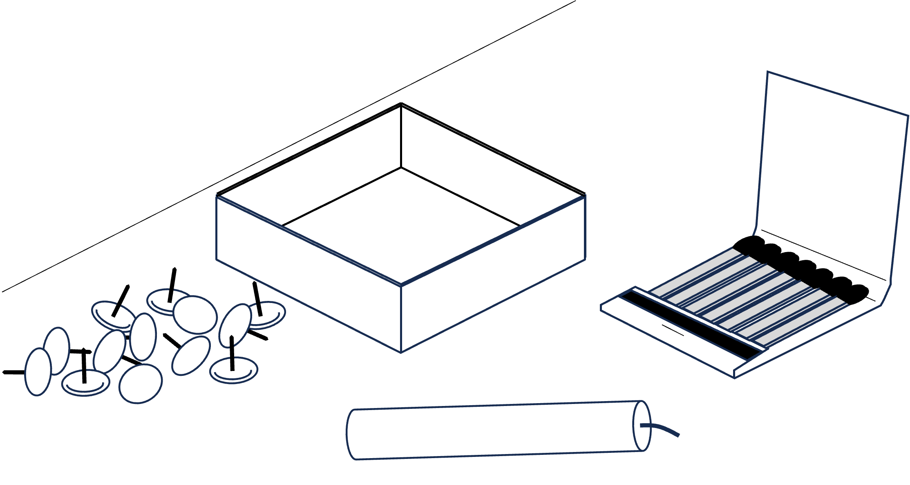
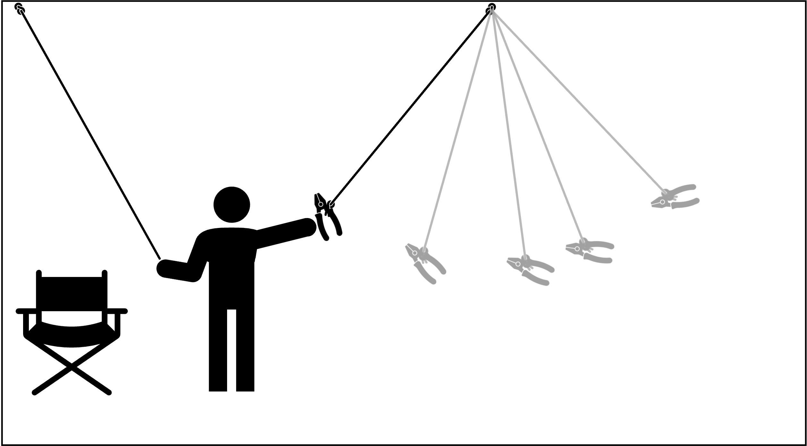
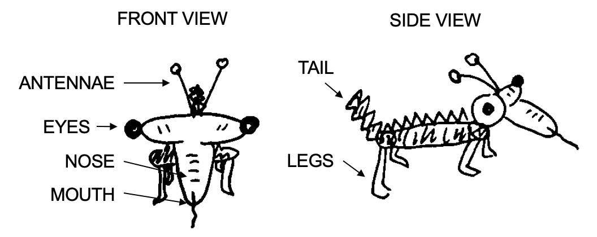

# Problem Solving
```{r fig10.0, echo = FALSE, out.width='100%', fig.align = 'center'}
 
```

How do we achieve our goals when the solution is not immediately obvious? What mental blocks are likely to get in our way, and how can we leverage our prior knowledge to solve novel problems?

:::learningobjectives
##### LEARNING OBJECTIVES {-}
1. Distinguish between well-defined and ill-defined problems.
2. Identify the importance of insight problems in understanding how humans solve problems.
3. Describe impediments to problem solving such as functional fixedness.
4. Distinguish between problem-solving processes for novices and experts.
:::

## What is a problem?

The most basic definition of a [problem] is any given situation that differs from a desired goal. This definition is very useful for discussing problem solving in terms of evolutionary adaptation, as it allows us to understand every aspect of human or animal life as a problem. This includes issues like finding food in harsh winters, remembering where you left your provisions, making decisions about which way to go, learning, repeating and varying all kinds of complex movements, and so on. Though all of these problems were of crucial importance during the human evolutionary process, they are by no means solved exclusively by humans. We find an amazing variety of different solutions for these problems in nature; just consider, for example, the way a bat hunts its prey compared to a spider. We will mainly focus on problems that are not solved by animals or evolution; we will instead focus on abstract problems, such as playing chess. Furthermore, we will not consider problems that have an obvious solution. For example, imagine you to take a sip of coffee from a mug next to your right hand. You do not even have to think about how to do this. This is not because the situation itself is trivial (a robot capable of recognizing the mug, deciding whether it is full, then grabbing it and moving it to your mouth would be a highly complex machine) but because in the context of all possible situations it is so trivial that it no longer is a problem our consciousness needs to be bothered with. The problems we will discuss in the following all need some conscious effort, though some seem to be solved without us being able to say how exactly we got to the solution. We will often find that the strategies we use to solve these problems are applicable to more basic problems, too.

Non-trivial, abstract problems can be divided into two groups: well-defined problems and ill-defined problems.

### Well-defined Problems {-}

For many abstract problems, it is possible to find an algorithmic solution. We call problems well-defined if they can be properly formalized, which involves the following properties:

* The problem has a **clearly defined given state**. This might be the line-up of a chess game, a given formula you have to solve, or the set-up of the towers of Hanoi game (which we will discuss later).

* There is a **finite set of operators**, that is, rules you may apply to the given state. For the chess game, e.g., these would be the rules that tell you which piece you may move to which position.

* Finally, the problem has a **clear goal state**: The equations is resolved to x, all discs are moved to the right stack, or the other player is in checkmate.

A problem that fulfills these requirements can be solved using algorithms. Therefore many well-defined problems can be very effectively solved by computers, like playing chess.

### Ill-defined Problems {-}

Though many problems can be properly formalized, there are still others where this is not the case. Good examples for this are all kinds of tasks that involve creativity, and, generally speaking, all problems for which it is not possible to clearly define a given state and a goal state. Formalizing a problem such as “Please paint a beautiful picture” may be impossible. Still, this is a problem most people would be able to approach in one way or the other, even if the result may be totally different from person to person. And while one person might judge that picture X is gorgeous, you might completely disagree.

The line between well-defined and ill-defined problems is not always neat: ill-defined problems often involve sub-problems that can be perfectly well-defined. On the other hand, many everyday problems that seem to be completely well-defined involve — when examined in detail — a great amount of creativity and ambiguity. Consider the fairly ill-defined task of writing an essay about something you read in class: you will not be able to complete this task without first understanding the text you have to write about. This step is the first subgoal you have to solve. In this example, an ill-defined problem involves a well-defined sub-problem.

## Restructuring: The Gestalt Approach 

One dominant approach to problem solving originated from Gestalt psychologists in the 1920s. Their understanding of problem solving emphasizes behavior in situations requiring relatively novel means of attaining goals and suggests that problem solving involves a process called [restructuring]. With a Gestalt approach, two main questions have to be considered to understand the process of problem solving: (1) how is a problem represented in a person's mind?, and (2) how does solving this problem involve a reorganization or restructuring of this representation?

### How is a problem represented in the mind? {-}

Generally speaking, problem representations are models of the situation as experienced by the solver. Representing a problem means to analyze it and split it into separate components, including objects, predicates, state space, operators, and selection criteria. Internal and external representations are distinguished: an internal representation is one held in memory, and which has to be retrieved by cognitive processes, while an external representation exists in the environment, such like physical objects or symbols whose information can be picked up and processed by the perceptual system.

The efficiency of problem solving depends on the underlying representations in a person’s mind, which usually also involves personal aspects. Re-analyzing the problem along different dimensions, or changing from one representation to another, can result in arriving at a new understanding of a problem. This is called [restructuring]. The following example illustrates this:

Two boys of different ages are playing badminton. The older one is a more skilled player, and therefore the outcome of matches between the two becomes predictable. After repeated defeats the younger boy finally loses interest in playing. The older boy now faces a problem, namely that he has no one to play with anymore.

The usual options, according to @wertheimer1945productive, range from “offering candy” and “playing a different game” to “not playing at full ability” and “shaming the younger boy into playing.” All of these strategies aim at making the younger boy stay.

The older boy instead comes up with a different solution: He proposes that they should try to keep the birdie in play as long as possible. Thus they change from a game of competition to one of cooperation. The proposal is happily accepted and the game is on again.

The key in this story is that the older boy *restructured* the problem, having found that his attitude toward the game made it difficult to keep the younger boy playing. With the new type of game the problem is solved: the older boy is not bored, and the younger boy is not frustrated. In some cases, new representations can make a problem more difficult or much easier to solve. In the latter case [insight] – the sudden realization of a problem’s solution – may be the key to finding a solution.

### Insight {-}

There are two very different ways of approaching a *goal-oriented situation*. In one case an organism readily reproduces the response to the given problem from past experience. This is called [reproductive thinking].

The second way requires *something new and different* to achieve the goal—prior learning is of little help here. Such [productive thinking] is sometimes argued to involve [insight]. Gestalt psychologists state that insight problems are a separate category of problems in their own right.

Tasks that might involve insight usually have certain features: they require something new and non-obvious to be done, and in most cases they are difficult enough to predict that the initial solution attempt will be unsuccessful. When you solve a problem of this kind you often have a so called ["aha" experience]: *the solution pops into mind all of a sudden*. In one moment you have no idea how to answer the problem, and you feel you are not making any progress trying out different ideas, but in the next moment the problem is solved.

Would you like to experience such an effect? Here is an example of an insight problem from @silveira1971incubation: you are given four pieces of a chain, each made up of three links (see Figure \@ref(fig:chain1)). The task is to link it all up to a closed loop. To open a link costs 2 cents, and to close a link costs 3 cents. You have 15 cents to spend. What should you do?

If you want to know the correct solution, scroll down to Figure \@ref(fig:chain2).

```{r chain1, echo = FALSE, out.width='60%', fig.align = 'center', fig.cap = 'The materials for the cheap necklace problem.'}
knitr::include_graphics("images/ch10/chain1.png")
```

To show that solving insight problems involves restructuring, psychologists have created a number of problems that are more difficult to solve for participants with previous experiences, since it is harder for them to change the representation of the given situation.

For *non-insight* problems the opposite is the case. Solving arithmetical problems, for instance, requires [schemas], through which one can get to the solution step by step.

### Fixation {-}

Sometimes, previous experience or familiarity can even make problem solving more difficult. This is the case whenever habitual directions get in the way of finding new directions – an effect called [fixation].

#### Functional fixedness {-}

Functional fixedness concerns the solution of *object use problems*. The basic idea is that when the usual function an object is emphasized, it will be far more difficult for a person to use that object in a novel manner. An example for this effect is the *candle problem* [@duncker1945problem]: Imagine you are given a book of matches, a box of tacks, and a candle (Figure \@ref(fig:candle1)). On the wall of the room there is a corkboard. Your task is to fix the candle to the corkboard in such a way that no wax will drop on the floor when the candle is lit. Got an idea?

```{r candle1, echo = FALSE, out.width='60%', fig.align = 'center', fig.cap = 'The materials for the candle problem.'}
knitr::include_graphics("images/ch10/candle1.png")
```

If you're having trouble thinking of a solution, try considering the same materials, but presented slightly differently, in Figure \@ref(fig:candle2).

```{r candle2, echo = FALSE, out.width='60%', fig.align = 'center', fig.cap = 'The same materials, presented slightly differently.'}

```

Here’s a clue: when people are confronted with a problem and given certain objects to solve it, it is difficult for them to figure out that they could use the objects in a different way. In Figure \@ref(fig:candle3), the box is being used as a holder for the tacks. In Figure \@ref(fig:candle2), the box is presented without a specific use. Presenting the materials in the latter fashion helps participants have the insight they need: the box has to be recognized as a support rather than as a container— tack the box to the wall, and place the candle upright in the box. The box will catch the falling wax (Figure \@ref(fig:candle3)).

```{r candle3, echo = FALSE, out.width='45%', fig.align = 'center', fig.cap = 'A solution to the candle problem.'}
knitr::include_graphics("images/ch10/candle3.png")
```

A further example is the two-string problem [@maier1931reasoning]: You are left in a room with a pair of pliers and given the task to tie two strings together that are hanging from the ceiling (Figure \@ref(fig:twostring). The problem you face is that you can never reach both strings at a time because they are just too far away from each other. What can you do?

```{r twostring, echo = FALSE, out.width='60%', fig.align = 'center', fig.cap = 'The two-string problem.'}
knitr::include_graphics("images/ch10/twostring.png")
```

Solution: You must recognize you can use the pliers in a novel function: as weight for a pendulum. You can tie them to one of the strings, push it away, hold the other string and wait for the first one to swing toward you (Figure \@ref(fig:twostring2)). 

```{r twostring2, echo = FALSE, out.width='60%', fig.align = 'center', fig.cap = 'A solution to the two-string problem.'}

```

```{r chain2, echo = FALSE, out.width='50%', fig.align = 'center', fig.cap = 'The solution to the cheap necklace problem.'}
knitr::include_graphics("images/ch10/chain2.png")
```

#### Mental fixedness {-}
Functional fixedness as involved in the examples above illustrates a [mental set]: *a person’s tendency to respond to a given task in a manner based on past experience*. Because we map an object to a particular function we have difficulty thinking of an alternative use (i.e., pliers as pendulum's weight).

One approach to studying fixation was to study *wrong-answer verbal insight problems*. In these problems, people tend to give an incorrect answer when failing to solve a problem rather than to give no answer at all.

A typical example: People are told that on a lake the area covered by water lilies doubles every 24 hours and that it takes 60 days to cover the whole lake. Then they are asked how many days it takes to cover half the lake. The typical response is “30 days” (whereas 59 days is correct).

These wrong solutions are due to an inaccurate interpretation, or representation, of the problem. This can happen because of sloppiness (a quick shallow reading of the problem and/or weak monitoring of their efforts made to come to a solution). In this case error feedback should help people to reconsider the problem features, note the inadequacy of their first answer, and find the correct solution. If, however, people are truly fixated on their incorrect representation, being told the answer is wrong does not help. @dominowski1995insight investigated these two possibilities by giving participants error feedback. Error feedback only led to right answers in approximately one third of cases. The authors concluded that only approximately one third of the wrong answers were due to inadequate monitoring.

Another approach is the study of examples with and without a preceding analogous task. In cases such like the *water-jug task* [@luchins1942mechanization], analogous thinking indeed leads to a correct solution, but to take a different way might make the case much simpler:

> Imagine you are given three jugs with different capacities and are asked to measure the required amount of water. You are not allowed to use anything except the jugs and as much water as you likes. 

In the first case the sizes are: 127 cups, 21 cups and 3 cups. Your goal is to measure 100 cups of water. In the second case you are asked to measure 18 cups from jugs of 39, 15 and 3 cups capacity. Participants who are given the 100 cup task first choose a complicated way to solve the second task. Participants who did not know about that complex task solved the 18 cup case by just adding three cups to 15. This fixation on prior problem-solving experience—persisting in using a suboptimal solution, rather than seeking a more efficient solution—is also known as the *Einstellung* effect.

:::fyi
##### Fixation on Examples {-}
When trying to solve an ill-defined problem with many possible solutions, people often find it helpful to look at examples of solutions. You’ve probably done this as a student when you have been assigned to write an essay, or complete a creative final project—it is natural to want to see examples of what you are supposed to do. However, provision of examples is not always a good thing for promoting creative thinking, as examples can be a source of mental fixation. To illustrate, consider one study by @smith1993constraining. In this study, participants were asked to draw pictures of alien creatures. Some participants were provided with examples such as those in Figure \@ref(fig:creature), and some were not. Do you notice that the examples have features in common? What do you think happened to the participants’ drawings when they saw these examples?

```{r creature, echo = FALSE, out.width='85%', fig.align = 'center', fig.cap = '@smith1993constraining showed their participants examples similar to these. *Drawings by Michael Barlev and Annie Ditta.*'}

```
 
Participants were more likely to include the shared features of the examples (i.e., four legs, antennae, tail) in their pictures compared to when participants were not shown examples, demonstrating fixation. This effect persisted—and even increased!—when participants were instructed to be as different as possible from the examples in a follow-up study. However, recent work has shown that sometimes, people can generate more creative ideas when they are given common examples and are told to avoid using them [@george2020need].
:::

#### Overcoming Mental Fixation {-}

Clearly, mental fixation poses a challenge for solving problems and thinking of creative ideas. Yet, we are able to accomplish these tasks (albeit with some difficulty). So, how is it that we are able to overcome mental fixation and reach solutions? One strategy for overcoming mental fixation is quite simple—take a break from whatever you are working on, and do something else for a while! You’ve probably experienced this before. Perhaps you are working on an essay and have hit a mental road block about what to write next. In frustration, you get up to go take a walk. Then, either during that walk or when you get back to your computer, the idea suddenly hits you in a moment of insight—aha! And you are able to continue with your work. The phenomenon—that we are more likely to come to a solution when taking a break between problem-solving attempts compared to when we work continuously on a problem—is called [incubation].

There are many theories proposed for why incubation periods are effective. One theory is called *forgetting fixation*. Under this theory, attempts to solve problems result in the generation of mental fixation on unhelpful information that impedes progress. However, taking a break gets you out of that mental space, and sometimes even into a new physical space, too! The passage of time, along with this shift in mental and physical context, allows for that unhelpful information to be forgotten, so problem solvers are more able to access new information and apply it to the problem at hand. Often, this work happens unconsciously, which can result in solutions coming to mind all at once, fully formed, in what has been termed an “Aha!” moment [@kounios2009aha]—an insight experience. 

## Solving Problems by Analogy

One special kind of restructuring is analogical problem solving. Here, to find a solution to one problem (i.e., the target problem) an analogous solution to another problem (i.e., the base problem) is presented.

An example for this kind of strategy is the radiation problem posed by @duncker1945problem:

> As a doctor you have to treat a patient with a malignant, inoperable tumor, buried deep inside the body. There exists a special kind of ray which is harmless at a low intensity, but at sufficiently high intensity is able to destroy the tumor. At such high intensity, however, the ray will also destroy the healthy tissue it passes through on the way to the tumor. What can be done to destroy the tumor while preserving the healthy tissue?

When this question was asked to participants in an experiment, most of them couldn't come up with the appropriate answer to the problem. Then they were told a story that went something like this:

> A general wanted to capture his enemy's fortress. He gathered a large army to launch a full-scale direct attack, but then learned that all the roads leading directly towards the fortress were blocked by landmines. These roadblocks were designed in such a way that it was possible for small groups of the fortress-owner's men to pass over them safely, but a large group of men would set them off. The general devised the following plan: He divided his troops into several smaller groups and ordered each of them to march down a different road, timed in such a way that the entire army would reunite exactly when reaching the fortress and could hit with full strength.

Here, the story about the general is the base problem, and the radiation problem is the target problem. The fortress is analogous to the tumor and the big army corresponds to the highly intensive ray. Likewise, a small group of soldiers represents a ray at low intensity. The solution to the problem is to split the ray up, as the general did with his army, and send the now harmless rays towards the tumor from different angles in such a way that they all meet when reaching it. No healthy tissue is damaged but the tumor itself gets destroyed by the ray at its full intensity.

@gick1980analogical presented Duncker's radiation problem to a group of participants. Ten percent of participants were able to solve the problem right away, but thirty percent could solve it when they read the story of the general before. After being given an additional hint — to use the story as help — seventy-five percent of them solved the problem.

Following these results, Gick and Holyoak concluded that analogical problem solving requires
*recognizing* that an analogical connection exists between the target and the base problem and *mapping* corresponding parts of the two problems onto each other (fortress → tumor, army → ray, etc.). One reason that people may fail to solve a problem by analogy is that we tend to pay attention to the surface features of problems (e.g., the tumor problem is a medical problem, and the fortress problem is a military problem). However, analogical problem solving requires making connections based on a problems structural features (e.g., both the tumor problem and the fortress problem involve a large force that is too dangerous when applied from a single direction, so many smaller forces must converge simultaneously instead). Next, Gick and Holyoak started looking for factors that could help the recognizing and mapping processes without providing an explicit hint.

#### Schemas {-}

The abstract concept that links the target problem with the base problem is called the problem schema. @gick1983schema investigated how to achieve [schema induction], or the creation of an useful problem-solving schema that can be applied from a base problem to a target problem.

The experimenters had participants read stories that presented problems and their solutions. One story was the above story about the general, and other stories required the same problem schema (i.e., if a heavy force coming from one direction is not suitable, use multiple smaller forces that simultaneously converge on the target). The experimenters manipulated how many of these stories the participants read before the participants were asked to solve the radiation problem. The experiment showed that in order to solve the target problem, reading two stories with analogical problems is more helpful than reading only one story. This evidence suggests that schema induction can be achieved by exposing people to multiple problems with the same problem schema.

## Creativity

In order to solve problems—particularly ill-defined problems—humans need to think *creatively* and stretch beyond the boundaries of what they have accomplished previously. You may have heard of the phrase “thinking outside of the box” as related to creativity—let’s go through an example to illustrate what this means. In a classic problem-solving task, participants are presented with an array of nine dots and are instructed to connect all 9 dots with four lines, without picking up their writing instrument [@maier1930reasoning]. See Figure \@ref(fig:ninedot) below. 

```{r ninedot, echo = FALSE, out.width='40%', fig.align = 'center', fig.cap = 'The nine-dot problem.'}
knitr::include_graphics("images/ch10/ninedot.png")
```

Think you have a solution? The only way to solve this problem is to literally go “outside of the box” by drawing lines that extend beyond the boundaries of the box that the dots create. This example illustrates how, when we think creatively, we often need to think of novel and appropriate solutions to a task that we have not generated before (see [Restructuring: The Gestalt Approach] section for more information about how we do this). See Figure \@ref(fig:ninedotsolution) for different possible solutions.

```{r ninedotsolution, echo = FALSE, out.width='40%', fig.align = 'center', fig.cap = 'Solutions to the nine-dot problem.'}
knitr::include_graphics("images/ch10/ninedotsolution.png")
```

Creativity can be studied in many different ways—from the personal (i.e., identifying what traits are associated with more creative people), to the societal (i.e., what makes something broadly recognized as creative?), to the cognitive (i.e., how is our cognitive system structured such that we are able to think creatively and solve problems when we encounter them?). We will focus on the last approach—often called the *creative cognition approach* [@smith1995creative]. This approach to studying creativity assumes that all humans are capable of creative thought; it is not something special that only some humans have and others do not. Indeed, the creative cognition approach states that the human cognitive system—with all its strengths and its flaws—is built in order to facilitate our ability to think creatively. For example, why would it make sense that our memory system is fallible; that is, why do we forget things that are sometimes important to remember? Our ability to forget has been argued to be a byproduct of our ability to think flexibly and apply old knowledge to new scenarios in ways that are appropriate for the current situation [@ditta2018consideration]. See [The Sins of Human Memory and How They Benefit Creative Thinking] for more information.

:::fyi
##### The Sins of Human Memory and How They Benefit Creative Thinking {-}
In a classic paper, @schacter1999seven argued that the flaws in the human memory system—everyday issues we face like forgetting names, misremembering where we encountered a piece of information, and failure to access information we know we have stored in memory—are actually byproducts of an adaptive system. @ditta2018consideration took this argument a step further, and argued that these flaws in the memory system also support creative thinking. For example, losing access to information, like when we forget, helps us overcome the tendency to reproduce mundane solutions to problems that would not be creative or useful. Misremembering information—as when musicians mistakenly attribute a melody as the product of their own mind, rather than another song they heard in the past—is likely a byproduct of our memory system helping us to take old information from its context, and transfer and apply it to a new context where that information might be helpful—but not in its original form. Of course, sometimes these memory errors get us into trouble (as with the musician example—this is called *cryptomnesia* and is an example of accidental plagiarism!), but without a flexible memory system that occasionally produces such errors, we would likely be much less able to solve problems when we encounter them. The “seven sins” of human memory are listed below—see if you can think of why such sins might actually reflect a benefit of the cognitive system!

**Seven Sins of Human Memory**

- Transience: The fact that memory for information declines over time. 
- Absentmindedness: Without appropriate memory cues to trigger our memory, we may fail to complete a task in the future. 
- Blocking: Related information impairs our ability to access the piece of information we want (e.g., tip-of-the-tongue phenomenon).
- Misattribution: Misremembering where you encountered a piece of information.
- Suggestibility: The fact that our memory can be changed with outside suggestion from others—typically through imagination inflation, where we imagine how an event might have happened and mistakenly attribute that imagination as an actual component of the event.
- Bias: The fact that we remember information in ways consistent with our own biases (e.g., remembering a political candidate’s speech as being better or worse than it was, based on whether we support or do not support them).
- Persistence: The fact that memories—particularly highly emotional ones—are resistant to forgetting, even when we want them to be (e.g., post-traumatic stress disorder, PTSD).
:::

### Defining Creativity {-}

The term [creativity] can mean many things to different people. Thus, when researchers study creativity, they need to operationally define the term. Though scholars disagree about the best way to define creativity, most agree that in order for something to be creative, it must be both novel and appropriate for the situation [@runco2012standard]. [Novelty] is straightforward: an idea must be new (at least to the individual thinking it, if not to society as a whole) to be considered creative, as reproducing what came before is typically not something that most people would call creative. [Appropriateness] refers to the need for the idea to “make sense” in the context of the problem. For example, if we return to the nine-dot problem, a creative solution must involve drawing lines; folding the paper to make multiple dots touch would not be an appropriate solution (though it is certainly outside of the box!). Scholars disagree about “appropriateness,” and you might find yourself agreeing: folding the paper before the drawing the lines is certainly a novel way to approach the problem! Scholars also sometimes include additional characteristics in their definitions of creativity; for example, an idea instilling an element of “surprise” as necessary for something to be labeled as creative [@simonton2018defining].

### Creative Thinking {-}

Creative thinking is sometimes defined as consisting of both divergent and convergent thinking. [Divergent thinking] is when the goal is to explore and idea space and generate as many different ideas as possible. In the lab, divergent thinking is often measured through the Alternative Uses Task, in which participants are presented with everyday household objects and asked to generate as many uses for those objects as possible. Those ideas are then scored on a number of different dimensions, including originality and fluency (i.e., how many ideas they were able to generate). Interestingly, divergent thinking and producing creative ideas seems to be a process that unfolds over time, with some research demonstrating that the most creative ideas come later during the idea generation period, perhaps after the more common ideas that immediately come to mind [@george2020need]. [Convergent thinking], on the other hand, is when the goal is to unite many different concepts into a single idea or smaller subset of ideas. Convergent thinking is typically measured in the lab through the Remote Associates Task (RAT), where participants are presented with three seemingly unrelated words and are asked to find the fourth word that relates to all three words (e.g., WISE-WORK-TOWER; solution: CLOCK). Creativity is determined by counting the number of RAT problem solved correctly. Though convergent and divergent thinking are sometimes studied separately, it is likely that creative thinking involves elements of both types of thinking.

## How do Experts Solve Problems?

An [expert] is someone who devotes large amounts of their time and energy to one specific field of interest in which they, subsequently, reach a certain level of mastery. It should not be a surprise that experts tend to be better at solving problems in their field than [novices](novice) (i.e., people who are beginners or not as well-trained in a field as experts) are. Experts are faster at coming up with solutions and have a higher rate of correct solutions. But what is the difference between the way experts and non-experts solve problems? Research on the nature of expertise has come up with the following conclusions:

1. Experts know more about their field,

2. their knowledge is organized differently, and

3. they spend more time analyzing the problem.

Expertise is domain-specific: when it comes to problems that are outside the experts’ domain of expertise, their performance often does not differ from that of novices.

### Knowledge {-}

An experiment by @Chase1973 dealt with the question of how well experts and novices are able to reproduce positions of chess pieces on chess boards after a brief presentation. The results showed that experts were far better at reproducing actual game positions, but that their performance was comparable with that of novices when the chess pieces were arranged randomly on the board. Chase and Simon concluded that the superior performance on actual game positions was due to the ability to recognize familiar patterns: A chess expert has up to 50,000 patterns stored in his memory. In comparison, a good player might know about 1,000 patterns by heart and a novice only few to none at all. This very detailed knowledge is of crucial help when an expert is confronted with a new problem in his field. Still, it is not only the amount of knowledge that makes an expert more successful. Experts also organize their knowledge differently from novices.

### Organization {-}

@Chi1981 took a set of 24 physics problems and presented them to a group of physics professors as well as to a group of students with only one semester of physics. The task was to group the problems based on their similarities. The students tended to group the problems based on their surface structure (i.e., similarities of objects used in the problem, such as sketches illustrating the problem), whereas the professors used their deep structure (i.e., the general physical principles that underlie the problems) as criteria. By recognizing the actual structure of a problem experts are able to connect the given task to the relevant knowledge they already have (e.g., another problem they solved earlier which required the same strategy).

### Analysis {-}

Experts often spend more time analyzing a problem before actually trying to solve it. This way of approaching a problem may often result in what appears to be a slow start, but in the long run this strategy is much more effective. A novice, on the other hand, might start working on the problem right away, but often reaches dead ends as they chose a wrong path in the very beginning.

### The Curse of Expertise {-}
Though experts approach problem solving differently and are typically more successful than novices, expertise is not always a good thing. There are some conditions under which knowing too much can lead to inhibition—especially in creative problem solving. For example, in a study using the Remote Associates Task discussed earlier, three types of problems were used [@wiley1998expertise]. First, problems that used terms related to baseball, but where the solution was unrelated to baseball (e.g., PLATE-BROKEN-SHOT; solution: GLASS). Second, problems using baseball terms where the solution was related to baseball (e.g., PLATE-BROKEN-REST; solution: HOME). Third, neutral problems unrelated to baseball at all (e.g., BLUE-KNFIE-COTTAGE; solution: CHEESE). Baseball experts and novices were asked to solve all of the problem types. In this study, experts ended up worse than novices at solving the problems with baseball-unrelated solutions!  The experts were likely too fixated on trying to find a solution related to baseball when it was not appropriate to do so. Thus, having too much knowledge can sometimes reduce our capability to think outside the box.

:::takeaways
##### Key Takeaways {-}
- The way we mentally represent problems affects our ability to solve them. In the case of insight problems, we may need to restructure the way we see the problem in order to arrive at a solution.
- Sometimes, our mental representation of a problem space can inhibit our ability to solve problems. For example, functional fixedness is a bias to only see an object for its given use, even when alternative uses for the object would help solve the problem.
- Experts don't just know more than novices; their knowledge is also organized differently.
:::

:::exercises
##### Exercises {-}
1. A Google Image search for "life hacks" yields ideas for using common household objects in novel, useful ways. What do these life hacks tend to share in common? They are compelling examples of overcoming functional fixedness! Try to identify some relevant life hacks and identify how functional fixedness was overcome (e.g., what was the object's intended use, and how is it being used in the life hack?).
2. Do you have expert knowledge in an area? Maybe it's an academic subject, an instrument, a video game, or something from your place of work (e.g., many restaurant servers have astounding expert knowledge of their menus, enough that they can take a whole table's order without writing anything down!). What is the difference between how you might solve a problem in this domain versus how a novice might solve the same problem?
:::

## Glossary

##### "aha" experience {-}

A moment of insight in which a solution pops into the problem solver's head.

##### appropriateness {-}

The extent to which a solution makes sense in the context of the problem.

##### convergent thinking {-}

Creative thinking in which the goal is to unite many different concepts into a single idea or smaller subset of ideas.

##### creativity {-}

The ability to generate novel and appropriate solutions to problems.

##### divergent thinking {-}

Creative thinking in which the goal is to explore and idea space and generate as many different ideas as possible.

##### expert {-}

A person who reaches mastery in a field following extensive practice.

##### incubation {-}

Individuals become more likely to generate a solution when taking a break between problem-solving attempts compared to when working continuously on a problem.

##### mental set {-}

A person’s tendency to respond to a given task in a manner based on past experience.

##### novelty {-}

The extent to which a solution to a problem is new, as opposed to reproducing what has come before.

##### novice {-}

A person who is a beginner in a field.

##### problem {-}

Any situation that differs from a desired goal.

##### productive thinking {-}

Producing a response to a problem that is new or different from previous problem-solving experience.

##### reproductive thinking {-}

Producing a response to a problem based on previous problem-solving experience.

##### restructuring {-}

Re-analyzing the problem along different dimensions, or changing from one representation to another, resulting in a new understanding of a problem.

##### schema induction {-}

The creation of an useful problem-solving schema that can be applied from a base problem to a target problem.
