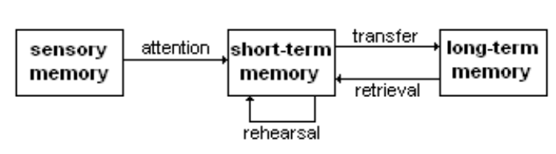
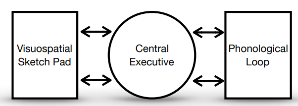
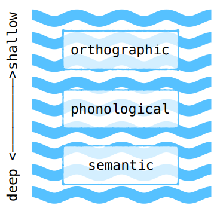
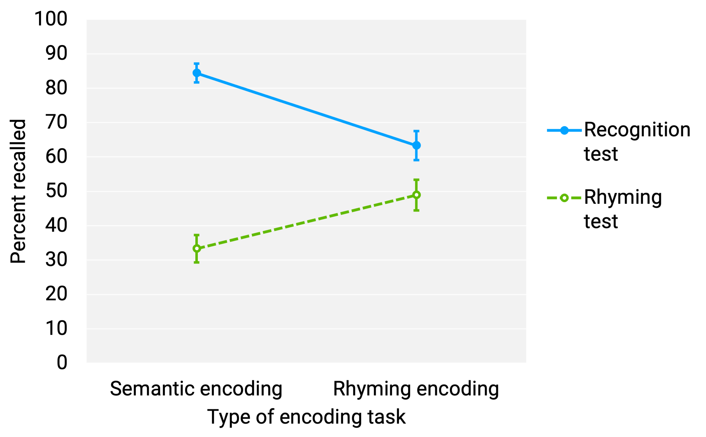
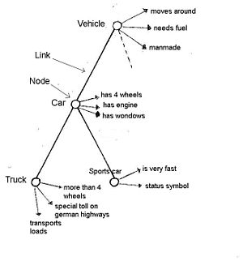
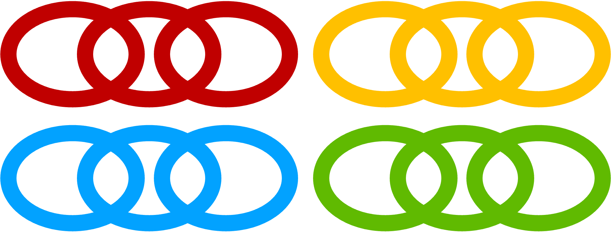
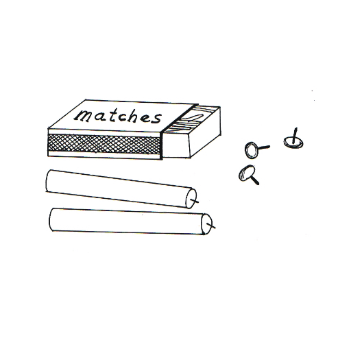
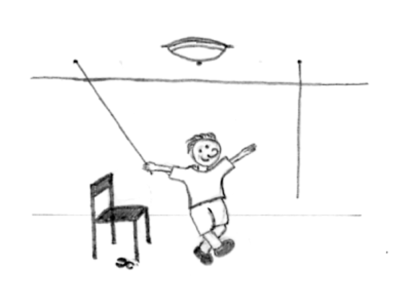

--- 
title: "Cognitive Foundations"
author: "Celeste Pilegard"
date: "Current version rendered 2023-03-30"
site: bookdown::bookdown_site
documentclass: book
bibliography: [book.bib, packages.bib]
csl: apa.csl
url: https://pilegard.github.io/cogfoundations/
favicon: images/favicon.ico
cover-image: images/cover.png
description: |
  This is a an OER textbook for introductory to cognitive psychology.
link-citations: yes
github-repo: pilegard/cogfoundations
---

# About {-}

## About the Book {-}
This collaborative book project is led by Celeste Pilegard, but represents the work of dozens of authors and collaborators listed below. Dr. Pilegard is an Assistant Teaching Professor in the Department of Psychology at the University of California, San Diego. Correspondence can be sent to [Celeste Pilegard](mailto:pilegard@ucsd.edu). 

Please use this [Google form](https://forms.gle/83CBvAgLuJshRfz37) to let us know if you've used the book in your course. If you notice an error or would like to suggest an improvement, please use the [GitHub site](https://github.com/pilegard/cogfoundations) to open an issue or submit a pull request with the suggested change, use this [Google form](https://forms.gle/83CBvAgLuJshRfz37), or [send an email](mailto:pilegard@ucsd.edu) with "Cognitive Foundations OER" in the subject line.

This book was formatted using the [bookdown](https://bookdown.org/) package.

### Second Edition {-}
The second edition of this book builds on the first edition with updates, improvements, and edits by a team of UC San Diego graduate student content experts:

- Catherine Arnett (Language)
- Pria Daniel (Attention)
- Mohan Gupta (Long-Term Memory)
- Leo Kleiman-Lynch (Reasoning and Decision Making)
- Hayden Schill (Perception, Working Memory)
- Anne Yilmaz (Memory in Context)

M. Gupta and C. Pilegard reformatted the book using the bookdown. C. Pilegard updated the chapters on History and Problem Solving. C. Pilegard edited all chapters.

The second edition of this book was supported by a Course Development and Instructional Improvement Program grant awarded to C. Pilegard. The program is sponsored by the Division of Undergraduate Education at the University of California, San Diego.

### First Edition {-}
The first edition of this book was aggregated from multiple Open Educational Resources by Celeste Pilegard. All adaptations, revisions, and transformations of source material were completed by Celeste Pilegard.

The original authors of the work remixed for the first edition of the book are listed below:

- Mehgan Andrade, College of the Canyons
- Mara Aruguete, Lincoln University
- David B. Baker, University of Akron
- Laura Bryant, Eastern Gateway Community College
- Barbara Chappell, Walden University
- Kathryn Dumper, Bainbridge State College
- Frances Friedrich, University of Utah
- William J. Jenkins, Mercer University
- Arlene Lacombe, Saint Joseph’s University
- Cara Laney, Reed College
- Julie Lazzara, Paradise Valley Community College
- Elizabeth F. Loftus, University of California, Irvine
- Marilyn D. Lovett, Spelman College
- Tammy McClain, West Liberty University
- Richard Milich, University of Kentucky
- Gregory Murphy, New York University
- Barbara B. Oswald, Miami University
- Marion Perlmutter, University of Michigan
- Walter Roberts, University of Kentucky
- Christie Napa Scollon, Singapore Management University
- Heather Sperry, University of Akron
- Rose M. Spielman, Formerly of Quinnipiac University
- Charles Stangor, University of Maryland
- Mark D. Thomas, Albany State University
- Jennifer Walinga, Royal Roads University
- Neil Walker, College of the Canyons
- Authors of the [Cognitive Psychology and Cognitive Neuroscience Wikibook](https://en.wikibooks.org/wiki/Cognitive_Psychology_and_Cognitive_Neuroscience)
- Wikipedia authors

C. Pilegard authored original portions of the first edition where noted below.

Many thanks to the original authors for their work and for choosing open licenses.

## License and Attributions {-}
Unless otherwise noted, this work is licensed under the Creative Commons Attribution-NonCommercial-ShareAlike 4.0 International License. To view a copy of this license, visit http://creativecommons.org/licenses/by-nc-sa/4.0/ or send a letter to Creative Commons, PO Box 1866, Mountain View, CA 94042, USA.

Front cover photo by Nathan Dumlao on Unsplash.

Licenses and attributions for individual chapters are noted in the following sections.

### Chapter 1. History and Research Methods {-}
#### First edition {-}
Rise of Cognitive Psychology\
Source: Spielman, R. M., Dumper, K., Jenkins, W., Lacombe, A., Lovett, M., & Perlmutter, M. (2014). Psychology. Houston, Tx: OpenStax.\
Psychology by Spielman et al. is licensed under a Creative Commons Attribution License.\
Condensed from original

Source: Baker, D. B. & Sperry, H. (2019). History of psychology. In R. Biswas-Diener & E. Diener (Eds), Noba textbook series: Psychology. Champaign, IL: DEF publishers. Retrieved from http://noba.to/j8xkgcz5 \
History of Psychology by David B. Baker and Heather Sperry is licensed under a Creative Commons Attribution-NonCommercial-ShareAlike 4.0 International License.\
Condensed from original

Research Methods in Psychology\
Source: Scollon, C. N. (2019). Research designs. In R. Biswas-Diener & E. Diener (Eds), Noba textbook series: Psychology. Champaign, IL: DEF publishers. Retrieved from http://noba.to/acxb2thy \
Research Designs by Christie Napa Scollon is licensed under a Creative Commons Attribution-NonCommercial-ShareAlike 4.0 International License\
Condensed from original; Example experiment under “Experimental research” changed to Mueller and Oppenheimer (2014)

### Chapter 2. Perception {-}
#### First edition {-}
Perception \
Source: Stangor, C. and Walinga, J. Introduction to Psychology – 1st Canadian Edition. Victoria, B.C.: BCcampus. Retrieved from: https://opentextbc.ca/introductiontopsychology/
Introduction to Psychology - 1st Canadian Edition by Charles Stangor is licensed under a Creative Commons Attribution-NonCommercial-ShareAlike 4.0 International License.\
Changes and additions (c) 2014 Jennifer Walinga, licensed under a Creative Commons Attribution-NonCommercial-ShareAlike 3.0 Unported License.\
Condensed from Walinga version; American spellings used; Imperial measurements used; some content adapted to suit course.

Cover photo by Mathilda Khoo on Unsplash.

### Chapter 3. Attention {-}
#### First edition {-}
Attention\
Source: Friedrich, F. (2019). Attention. In R. Biswas-Diener & E. Diener (Eds), Noba textbook series: Psychology. Champaign, IL: DEF publishers. Retrieved from http://noba.to/uv9x8df5 \
Attention by Frances Friedrich is licensed under a Creative Commons Attribution-NonCommercial-ShareAlike 4.0 International License.\
Condensed from original version; some content adapted to suit course. 

Source: Milich, R. & Roberts, W. (2022). Adhd and behavior disorders in children. In R. Biswas-Diener & E. Diener (Eds), Noba textbook series: Psychology. Champaign, IL: DEF publishers. Retrieved from http://noba.to/cpxg6b27 \
ADHD and Behavior Disorders in Children by Richard Milich and Walter Roberts are licensed under a Creative Commons Attribution-NonCommercial-ShareAlike 4.0 International License.
Condensed from original version; some content adapted to suit course. 

Cover photo by chuttersnap on Unsplash.

### Chapter 4. Working Memory {-}
#### First edition {-}
Working Memory\
Source: Multiple authors. Memory. In Cognitive Psychology and Cognitive Neuroscience. Wikibooks. Retrieved from https://en.wikibooks.org/wiki/Cognitive_Psychology_and_Cognitive_Neuroscience \
Wikibooks are licensed under the Creative Commons Attribution-ShareAlike License.
Cognitive Psychology and Cognitive Neuroscience is licensed under the GNU Free Documentation License.\
Condensed from original version. American spellings used. Content added or changed to reflect American perspective and references. Context and transitions added throughout. Substantially edited, adapted, and (in some parts) rewritten for clarity and course relevance. Chapter introduction added. Content added including transition from STM to WM approach, description of episodic buffer, description and evidence for working memory components, addition of episodic buffer.

Cover photo by Matt Briney on Unsplash.

### Chapter 5. Long-Term Memory {-}
#### First edition {-}
Long term memory\
Source: Stangor, C. and Walinga, J. (2014). Introduction to Psychology – 1st Canadian Edition. Victoria, B.C.: BCcampus. Retrieved from: https://opentextbc.ca/introductiontopsychology/
Introduction to Psychology - 1st Canadian Edition by Charles Stangor is licensed under a Creative Commons Attribution-NonCommercial-ShareAlike 4.0 International License.\
Changes and additions (c) 2014 Jennifer Walinga, licensed under a Creative Commons Attribution-NonCommercial-ShareAlike 3.0 Unported License.\
Condensed from Walinga version; American spellings used; Imperial measurements used; some content adapted to suit course.

Serial position curve information from: Andrade, M., & Walker, N. (n.d.) Cognitive Psychology. 
Cognitive Psychology by Mehgan Andrade and Neil Walker is licensed under a Creative Commons Attribution4.0 International License.

Encoding, Retrieval, and Consolidation\
Source: The following entries accessed from http:/www.en.wikipedia.org/ served as sources for this chapter: Memory Rehearsal; Levels-of-processing Effect; Testing Effect; Encoding Specificity Principle; Transfer-Appropriate Processing; Memory Consolidation.\
Wikipedia text is licensed under the Creative Commons Attribution-ShareAlike License.\
Chapter introduction added. Transitions and images added. Edited for content and clarity throughout.

Some encoding specificity principle information from: Andrade, M., & Walker, N. (n.d.) Cognitive Psychology.\
Cognitive Psychology by Mehgan Andrade and Neil Walker is licensed under a Creative Commons Attribution4.0 International License.\

Cover photo by Julian Dik on Unsplash.

### Chapter 6. Memory in Context {-}
#### First edition {-}
Memory in Context\
Kinds of Memory Biases; Misinformation Effect\
Source: Laney, C. & Loftus, E. F. (2019). Eyewitness testimony and memory biases. In R. Biswas-Diener & E. Diener (Eds), Noba textbook series: Psychology. Champaign, IL: DEF publishers. Retrieved from http://noba.to/uy49tm37 \
Eyewitness Testimony and Memory Biases by Cara Laney and Elizabeth F. Loftus is licensed under a Creative Commons Attribution-NonCommercial-ShareAlike 4.0 International License.\
Condensed from original

Schematic Processing; Source Monitoring; Flashbulb Memories\
Stangor, C. and Walinga, J. (2014). Introduction to Psychology – 1st Canadian Edition. Victoria, B.C.: BCcampus. Retrieved from: [https://opentextbc.ca/introductiontopsychology/](https://opentextbc.ca/introductiontopsychology/) \
Introduction to Psychology - 1st Canadian Edition by Charles Stangor is licensed under a Creative Commons Attribution-NonCommercial-ShareAlike 4.0 International License.\
Changes and additions (c) 2014 Jennifer Walinga, licensed under a Creative Commons Attribution-NonCommercial-ShareAlike 3.0 Unported License.\
Condensed from original; American spellings used; cultural references updated for American audience

Forgetting\
Source: Spielman, R. M. OpenStax, Psychology. OpenStax CNX. [http://cnx.org/contents/4abf04bf-93a0-45c3-9cbc-2cefd46e68cc@12.2](http://cnx.org/contents/4abf04bf-93a0-45c3-9cbc-2cefd46e68cc@12.2).
Psychology by Spielman (+ multiple authors) is licensed under a Creative Commons Attribution 4.0 International License\
Condensed from original

Cover photo by Markus Spiske on Unsplash.

### Chapter 7. Knowledge {-}
#### First edition {-}
Knowledge\
Introduction through Theories of Concept Representation\
Source: Murphy, G. (2019). Categories and concepts. In R. Biswas-Diener & E. Diener (Eds), Noba textbook series: Psychology. Champaign, IL: DEF publishers. Retrieved from http://noba.to/6vu4cpkt \
Categories and Concepts by Gregory Murphy is licensed under a Creative Commons Attribution-NonCommercial-ShareAlike 4.0 International License.\
Condensed from original version. 

Concept Organization\
Source: Multiple authors. Memory. In Cognitive Psychology and Cognitive Neuroscience. Wikibooks. Retrieved from https://en.wikibooks.org/wiki/Cognitive_Psychology_and_Cognitive_Neuroscience\
Wikibooks are licensed under the Creative Commons Attribution-ShareAlike License.
Cognitive Psychology and Cognitive Neuroscience is licensed under the GNU Free Documentation License.\
Condensed from original version. American spellings used. Content added or changed to reflect American perspective and references. Context and transitions added throughout. Substantially edited, adapted, and (in some parts) rewritten for clarity and course relevance.

Cover photo by Alli Elder on Unsplash.

### Chapter 8. Language {-}
#### First edition {-}
Language\
Source: Stangor, C. and Walinga, J. (2014). Introduction to Psychology – 1st Canadian Edition. Victoria, B.C.: BCcampus. Retrieved from: https://opentextbc.ca/introductiontopsychology/
Introduction to Psychology - 1st Canadian Edition by Charles Stangor is licensed under a Creative Commons Attribution-NonCommercial-ShareAlike 4.0 International License.\
Changes and additions (c) 2014 Jennifer Walinga, licensed under a Creative Commons Attribution-NonCommercial-ShareAlike 3.0 Unported License.\
Condensed from original; American spellings used; cultural references updated for American audience. Bilingualism reverted to Strangor version.

Sentence Processing section from Wikipedia entry (http:/www.en.wikipedia.org/), “Sentence Processing.”\
Wikipedia text is licensed under the Creative Commons Attribution-ShareAlike License.

Cover photo by Eric Muhr on Unsplash.

### Chapter 9. Reasoning and Decision Making {-}
#### First edition {-}
Reasoning and Decision Making\
Source: Multiple authors. Memory. In Cognitive Psychology and Cognitive Neuroscience. Wikibooks. Retrieved from https://en.wikibooks.org/wiki/Cognitive_Psychology_and_Cognitive_Neuroscience
Wikibooks are licensed under the Creative Commons Attribution-ShareAlike License.
Cognitive Psychology and Cognitive Neuroscience is licensed under the GNU Free Documentation License.\
Condensed from original version. American spellings used. Content added or changed to reflect American perspective and references. Context and transitions added throughout. Substantially edited, adapted, and (in some parts) rewritten for clarity and course relevance. 

Cover photo by Qurratul Ayin Sadia on Unsplash.

### Chapter 10. Problem Solving {-}
#### First edition {-}
Problem Solving\
Source: Multiple authors. Memory. In Cognitive Psychology and Cognitive Neuroscience. Wikibooks. Retrieved from https://en.wikibooks.org/wiki/Cognitive_Psychology_and_Cognitive_Neuroscience
Wikibooks are licensed under the Creative Commons Attribution-ShareAlike License.
Cognitive Psychology and Cognitive Neuroscience is licensed under the GNU Free Documentation License.\
Condensed from original version. American spellings used. Content added or changed to reflect American perspective and references. Context and transitions added throughout. Substantially edited, adapted, and (in some parts) rewritten for clarity and course relevance. 

Cover photo by Pixabay on Pexels.

<!--chapter:end:index.Rmd-->

# History and Research Methods

(\#fig:lan2000)Around the turn of the 20th century, futurists imagined what a classroom might look like in the year 2000. *Illustration by Jean-Marc Côté, Wikimedia Commons.*

Philosophers have wondered about the mind at least as far back as Socrates. Yet the scientific study of the mind only began much more recently. What changed, and what tools can we use to study the mind?

:::learningobjectives
##### LEARNING OBJECTIVES {-}
1. Describe the precursors to the establishment of the science of cognitive psychology.
2. Identify key individuals and events in the history of cognitive psychology.
3. Articulate the difference between correlational and experimental designs.
4. Understand how experiments help us to infer causality.
5. List a strength and weakness of different research designs.
:::

## Rise of Cognitive Psychology

Precursors to American psychology can be found in philosophy and physiology. Philosophers such as John Locke (1632–1704) and Thomas Reid (1710–1796) promoted [empiricism], the idea that all knowledge comes from experience. The work of Locke, Reid, and others emphasized the role of the human observer and the primacy of the senses in defining how the mind comes to acquire knowledge. In American colleges and universities in the early 1800s, these principles were taught as courses on mental and moral philosophy. Most often these courses taught about the mind based on the faculties of intellect, will, and the senses [@fuchs2000].

(\#fig:pharoah)The earliest records of a psychological experiment go all the way back to the Pharaoh Psamtik I of Egypt in the 7th Century B.C. *Image: Neithsabes, CC0 Public Domain, https://goo.gl/m25gce*

### Analytic introspection {-}

The formal development of modern psychology is usually credited to the work of German physician, physiologist, and philosopher Wilhelm Wundt (1832–1920). Wundt helped to establish the field of experimental psychology by serving as a strong promoter of the idea that psychology could be an experimental field and by providing classes, textbooks, and a laboratory for training students. In 1875, he joined the faculty at the University of Leipzig and quickly began to make plans for the creation of a program of experimental psychology. In 1879, he complemented his lectures on experimental psychology with a laboratory experience: an event that has served as the popular date for the establishment of the science of psychology.

(\#fig:wundt)Wilhelm Wundt is considered one of the founding figures of modern psychology. *CC0 Public Domain, https://goo.gl/m25gce*

The response to the new science was immediate and global. Wundt attracted students from around the world to study the new experimental psychology and work in his lab. Students were trained to offer detailed self-reports of their reactions to various stimuli, a procedure known as [introspection]. The goal was to identify the elements of [consciousness]. In addition to the study of sensation and perception, research was done on mental chronometry, more commonly known as reaction time. The work of Wundt and his students demonstrated that the mind could be measured and the nature of consciousness could be revealed through scientific means. It was an exciting proposition, and one that found great interest in America. After the opening of Wundt’s lab in 1879, it took just four years for the first psychology laboratory to open in the United States [@benjamin2007].

### The Growth of Psychology {-}

Throughout the first half of the 20th century, psychology continued to grow and flourish in America. It was large enough to accommodate varying points of view on the nature of mind and behavior. Gestalt psychology is a good example. The Gestalt movement began in Germany with the work of Max Wertheimer (1880–1943). Opposed to the reductionist approach of Wundt’s laboratory psychology, Wertheimer and his colleagues Kurt Koffka (1886–1941), Wolfgang Kohler (1887–1967), and Kurt Lewin (1890–1947) believed that studying the whole of any experience was richer than studying individual aspects of that experience. The saying “the whole is greater than the sum of its parts” is a Gestalt perspective. Consider that a melody is an additional element beyond the collection of notes that comprise it. The Gestalt psychologists proposed that the mind often processes information simultaneously rather than sequentially. For instance, when you look at a photograph, you see a whole image, not just a collection of pixels of color. Using Gestalt principles, Wertheimer and his colleagues also explored the nature of learning and thinking. Most of the German Gestalt psychologists were Jewish and were forced to flee the Nazi regime due to the threats posed on both academic and personal freedoms. In America, they were able to introduce a new audience to the Gestalt perspective, demonstrating how it could be applied to perception and learning [@wertheimer1938]. In many ways, the work of the Gestalt psychologists served as a precursor to the rise of cognitive psychology in America [@benjamin2007].

Behaviorism emerged early in the 20th century and became a major force in American psychology. Championed by psychologists such as John B. Watson (1878–1958) and B. F. Skinner (1904–1990), behaviorism rejected any reference to mind and viewed overt and observable behavior as the proper subject matter of psychology. Through the scientific study of behavior, it was hoped that laws of learning could be derived that would promote the prediction and control of behavior. Russian physiologist Ivan Pavlov (1849–1936) influenced early behaviorism in America. His work on conditioned learning, popularly referred to as classical conditioning, provided support for the notion that learning and behavior were controlled by events in the environment and could be explained with no reference to mind or consciousness [@fancher1987].

### Cognitive Revolution {-}

Behaviorism’s emphasis on objectivity and focus on external behavior had pulled psychologists’ attention away from the mind for a prolonged period of time. The early work of the humanistic psychologists redirected attention to the individual human as a whole, and as a conscious and self-aware being. By the 1950s, new disciplinary perspectives in linguistics, neuroscience, and computer science were emerging, and these areas revived interest in the mind as a focus of scientific inquiry. This particular perspective has come to be known as the cognitive revolution [@miller2003]. By 1967, Ulric Neisser published the first textbook entitled Cognitive Psychology, which served as a core text in cognitive psychology courses around the country [@henley2005lost]. Cognitive psychology is the study of mental processes such as attention, memory, perception, language use, problem solving, creativity, and thinking. Much of the work derived from cognitive psychology has been integrated into various other modern disciplines of psychological study including social psychology, personality psychology, abnormal psychology, developmental psychology, educational psychology, and economics.

Although no one person is entirely responsible for starting the cognitive revolution, Noam Chomsky was very influential in the early days of this movement. Chomsky (1928–), an American linguist, was dissatisfied with the influence that behaviorism had had on psychology. He believed that psychology’s focus on behavior was short-sighted and that the field had to re-incorporate mental functioning into its purview if it were to offer any meaningful contributions to understanding behavior [@miller2003].

European psychology had never really been as influenced by behaviorism as had American psychology; and thus, the cognitive revolution helped reestablish lines of communication between European psychologists and their American counterparts. Furthermore, psychologists began to cooperate with scientists in other fields, like anthropology, linguistics, computer science, and neuroscience, among others. This interdisciplinary approach often was referred to as the cognitive sciences, and the influence and prominence of this particular perspective resonates in modern-day psychology [@miller2003]. Next, we will look at the research methods psychologists use to ask questions about the world.

## Research Methods in Psychology

One of the important steps in scientific inquiry is to test our research questions, otherwise known as hypotheses. However, there are many ways to test hypotheses in psychological research. Which method you choose will depend on the type of questions you are asking, as well as what resources are available to you. All methods have limitations, which is why the best research uses a variety of methods.

Most psychological research can be divided into two types: experimental and correlational research.

### Experimental Research {-}

Imagine you are taking notes in class. Should you take typed notes on your laptop, or longhand notes in a notebook? Which method of note taking will help you learn the most from lecture? As long as you’re taking notes, does it really matter?

(\#fig:laptop)Does note taking medium matter? Experiments can help us find out. *Photo from Unsplash.*

Pam A. Mueller and Daniel M. Oppenheimer, psychology researchers at Princeton University and UCLA, set out to test the difference between longhand and laptop note taking [@mueller2014]. Participants in their experiment were told to take notes while they watched video lectures. Half of the participants were given a notebook to take notes, meaning they would take notes longhand, and the other half were given a laptop for note taking, meaning they would type their notes. Afterward, participants completed a test that measured how much participants learned from the lectures.

In an experiment, researchers manipulate, or cause changes, in the [independent variable], and observe or measure any impact of those changes in the [dependent variable]. The independent variable is the one under the experimenter’s control, or the variable that is intentionally altered between groups. In the case of Mueller and Oppenheimer’s experiment, the independent variable was whether participants took notes longhand or using a laptop. The dependent variable is the variable that is not manipulated at all, or the one where the effect happens. One way to help remember this is that the dependent variable “depends” on what happens to the independent variable. In our example, the participants’ learning (the dependent variable in this experiment) depends on how the participants take notes (the independent variable). Thus, any observed changes or group differences in learning can be attributed to note taking method. What Mueller and Oppenheimer found was that the people who took notes longhand learned significantly more from the lectures than those who took notes using a laptop. In other words, the note taking method students use causes a difference in learning. Do you find this surprising? 

But wait! Doesn’t learning depend on a lot of different factors—for instance, how intelligent someone is, or how much they already know about a topic? How can we accurately conclude that the note taking method causes differences in learning, as in the case of Mueller and Oppenheimer’s experiment? The most important thing about experiments is [random assignment]. Participants don’t get to pick which condition they are in (e.g., participants didn’t choose whether they took notes using a laptop or notebook). The experimenter assigns them to a particular condition based on the flip of a coin or the roll of a die or any other random method. Why do researchers do this? Random assignment makes it so the groups, on average, are similar on all characteristics except what the experimenter manipulates.

By randomly assigning people to conditions (laptop versus longhand note taking), some people who already have some knowledge about the lecture topics should end up in each condition. Likewise, some people who have never heard of the lecture topics should end up in each condition. As a result, the distribution of all these factors will generally be consistent across the two groups, and this means that on average the two groups will be relatively equivalent on all these factors. Random assignment is critical to experimentation because if the only difference between the two groups is the independent variable, we can infer that the independent variable is the cause of any observable difference (e.g., in the amount they learn from the lecture).

So why do people learn more from a lecture when they take longhand rather than laptop notes? It turns out that when people take notes on a laptop, they tend to take verbatim notes, meaning that they try to type every single word the lecturer says. On the other hand, when people take longhand notes, they tend to take summary notes, meaning that they reframe the ideas in their own words. This additional cognitive processing improves learning.

#### Other considerations {-}

In addition to using random assignment, you should avoid introducing confounds into your experiments. [Confounds] are things that could undermine your ability to draw causal inferences. For example, if you wanted to test if a new happy pill will make people happier, you could randomly assign participants to take the happy pill or not (the independent variable) and compare these two groups on their self-reported happiness (the dependent variable). However, if some participants know they are getting the happy pill, they might develop expectations that influence their self-reported happiness. This is sometimes known as a [placebo effect]. Sometimes a person just knowing that he or she is receiving special treatment or something new is enough to actually cause changes in behavior or perception: In other words, even if the participants in the happy pill condition were to report being happier, we wouldn’t know if the pill was actually making them happier or if it was the placebo effect—an example of a confound. A related idea is [participant demand]. This occurs when participants try to behave in a way they think the experimenter wants them to behave. Placebo effects and participant demand often occur unintentionally. Even [experimenter expectations] can influence the outcome of a study. For example, if the experimenter knows who took the happy pill and who did not, and the dependent variable is the experimenter’s observations of people’s happiness, then the experimenter might perceive improvements in the happy pill group that are not really there.

One way to prevent these confounds from affecting the results of a study is to use a double-blind procedure. In a double-blind procedure, neither the participant nor the experimenter knows which condition the participant is in. For example, when participants are given the happy pill or the fake pill, they don’t know which one they are receiving. This way the participants shouldn’t experience the placebo effect, and will be unable to behave as the researcher expects (participant demand). Likewise, the researcher doesn’t know which pill each participant is taking (at least in the beginning—later, the researcher will get the results for data-analysis purposes), which means the researcher’s expectations can’t influence his or her observations. Therefore, because both parties are “blind” to the condition, neither will be able to behave in a way that introduces a confound. At the end of the day, the only difference between groups will be which pills the participants received, allowing the researcher to determine if the happy pill actually caused people to be happier.

### Correlational Designs {-}

When scientists passively observe and measure phenomena it is called correlational research. Here, we do not intervene and change behavior, as we do in experiments. In correlational research, we identify patterns of relationships, but we usually cannot infer what causes what. Importantly, with correlational research, you can examine only two variables at a time, no more and no less.

So, what if you wanted to test whether spending on others is related to happiness, but you don’t have $20 to give to each participant? You could use a correlational design—which is exactly what Elizabeth Dunn, a professor at the University of British Columbia, did in a study [@dunn2008]. She asked people how much of their income they spent on others or donated to charity, and later she asked them how happy they were. Do you think these two variables were related? Yes, they were! The more money people reported spending on others, the happier they were.

#### More details about the correlation {-}

To find out how well two variables correspond, we can plot the relation between the two scores on what is known as a scatterplot (Figure \@ref(fig:scatter)). In the scatterplot, each dot represents a data point. (In this case it’s individuals, but it could be some other unit.) Importantly, each dot provides us with two pieces of information—in this case, information about how good the person rated the past month (x-axis) and how happy the person felt in the past month (y-axis). Which variable is plotted on which axis does not matter. 

(\#fig:scatter)Scatterplot of the association between happiness and ratings of the past month, a positive correlation (*r* = .81). Each dot represents an individual.

The association between two variables can be summarized statistically using the correlation coefficient (abbreviated as r). A [correlation] coefficient provides information about the direction and strength of the association between two variables. For the example above, the direction of the association is positive. This means that people who perceived the past month as being good reported feeling more happy, whereas people who perceived the month as being bad reported feeling less happy.

With a positive correlation, the two variables go up or down together. In a scatterplot, the dots form a pattern that extends from the bottom left to the upper right (just as they do in Figure 1). The r value for a positive correlation is indicated by a positive number (although, the positive sign is usually omitted). Here, the r value is .81.

A negative correlation is one in which the two variables move in opposite directions. That is, as one variable goes up, the other goes down. Figure \@ref(fig:scatter2) shows the association between the average height of males in a country (y-axis) and the pathogen prevalence (or commonness of disease; x-axis) of that country. In this scatterplot, each dot represents a country. Notice how the dots extend from the top left to the bottom right. What does this mean in real-world terms? It means that people are shorter in parts of the world where there is more disease. The r value for a negative correlation is indicated by a negative number—that is, it has a minus (–) sign in front of it. Here, it is –.83.

(\#fig:scatter2)Scatterplot showing the association between average male height and pathogen prevalence, a negative correlation (r = –.83). Each dot represents a country. [@chiao2009]

The strength of a correlation has to do with how well the two variables align. Recall that in Professor Dunn’s correlational study, spending on others positively correlated with happiness: The more money people reported spending on others, the happier they reported to be. At this point you may be thinking to yourself, I know a very generous person who gave away lots of money to other people but is miserable! Or maybe you know of a very stingy person who is happy as can be. Yes, there might be exceptions. If an association has many exceptions, it is considered a weak correlation. If an association has few or no exceptions, it is considered a strong correlation. A strong correlation is one in which the two variables always, or almost always, go together. In the example of happiness and how good the month has been, the association is strong. The stronger a correlation is, the tighter the dots in the scatterplot will be arranged along a sloped line.

#### Problems with the correlation {-}

If generosity and happiness are positively correlated, should we conclude that being generous causes happiness? Similarly, if height and pathogen prevalence are negatively correlated, should we conclude that disease causes shortness? From a correlation alone, we can’t be certain. For example, in the first case it may be that happiness causes generosity, or that generosity causes happiness. Or, a third variable might cause both happiness and generosity, creating the illusion of a direct link between the two. For example, wealth could be the third variable that causes both greater happiness and greater generosity. This is why correlation does not mean causation—an often repeated phrase among psychologists.

### Qualitative Designs {-}

Just as correlational research allows us to study topics we can’t experimentally manipulate (e.g., whether you have a large or small income), there are other types of research designs that allow us to investigate these harder-to-study topics. Qualitative designs, including participant observation, case studies, and narrative analysis are examples of such methodologies. 

### Quasi-Experimental Designs {-}

What if you want to study the effects of marriage on a variable? For example, does marriage make people happier? Can you randomly assign some people to get married and others to remain single? Of course not. So how can you study these important variables? You can use a [quasi-experimental design].

A quasi-experimental design is similar to experimental research, except that random assignment to conditions is not used. Instead, we rely on existing group memberships (e.g., married vs. single). We treat these as the independent variables, even though we don’t assign people to the conditions and don’t manipulate the variables. As a result, with quasi-experimental designs causal inference is more difficult. For example, married people might differ on a variety of characteristics from unmarried people. If we find that married participants are happier than single participants, it will be hard to say that marriage causes happiness, because the people who got married might have already been happier than the people who have remained single.

(\#fig:love)What is a reasonable way to study the effects of marriage on happiness? *Image: Nina Matthews Photography, https://goo.gl/IcmLqg, CC BY-NC-SA, https://goo.gl/HSisdg*

### Longitudinal Studies {-}

Another powerful research design is the [longitudinal study]. Longitudinal studies track the same people over time. Some longitudinal studies last a few weeks, some a few months, some a year or more. Some studies that have contributed a lot to psychology followed the same people over decades. For example, one study followed more than 20,000 Germans for two decades. From these longitudinal data, psychologist Rich @lucas2003 was able to determine that people who end up getting married indeed start off a bit happier than their peers who never marry. Longitudinal studies like this provide valuable evidence for testing many theories in psychology, but they can be quite costly to conduct, especially if they follow many people for many years.

### Tradeoffs in Research {-}

Even though there are serious limitations to correlational and quasi-experimental research, they are not poor cousins to experiments and longitudinal designs. In addition to selecting a method that is appropriate to the question, many practical concerns may influence the decision to use one method over another. One of these factors is simply resource availability—how much time and money do you have to invest in the research? (Tip: If you’re doing a senior honor’s thesis, do not embark on a lengthy longitudinal study unless you are prepared to delay graduation!) Often, we survey people even though it would be more precise—but much more difficult—to track them longitudinally. Especially in the case of exploratory research, it may make sense to opt for a cheaper and faster method first. Then, if results from the initial study are promising, the researcher can follow up with a more intensive method.

Beyond these practical concerns, another consideration in selecting a research design is the ethics of the study. For example, in cases of brain injury or other neurological abnormalities, it would be unethical for researchers to inflict these impairments on healthy participants. Nonetheless, studying people with these injuries can provide great insight into human psychology (e.g., if we learn that damage to a particular region of the brain interferes with emotions, we may be able to develop treatments for emotional irregularities). In addition to brain injuries, there are numerous other areas of research that could be useful in understanding the human mind but which pose challenges to a true experimental design—such as the experiences of war, long-term isolation, abusive parenting, or prolonged drug use. However, none of these are conditions we could ethically experimentally manipulate and randomly assign people to. Therefore, ethical considerations are another crucial factor in determining an appropriate research design.

### Research Methods: Why You Need Them {-}

Just look at any major news outlet and you’ll find research routinely being reported. Sometimes the journalist understands the research methodology, sometimes not (e.g., correlational evidence is often incorrectly represented as causal evidence). Often, the media are quick to draw a conclusion for you. After reading this module, you should recognize that the strength of a scientific finding lies in the strength of its methodology. Therefore, in order to be a savvy consumer of research, you need to understand the pros and cons of different methods and the distinctions among them. Plus, understanding how psychologists systematically go about answering research questions will help you to solve problems in other domains, both personal and professional, not just in psychology.

:::takeaways
##### Key Takeaways {-}
- People have asked questions about the mind for centuries, but only relatively recently took a scientific approach. Psychology, and cognitive psychology especially, is a young science.
- In order to be a savvy consumer of research, you need to understand the pros and cons of different methods and the distinctions among them. Plus, understanding how psychologists systematically go about answering research questions will help you to solve problems in other domains, both personal and professional, not just in psychology.
:::

:::exercises
##### Exercises {-}
1. Discussion: How were early researchers important to the development of psychology as a science?
2. Practice: Make a list of the schools of thought that preceded the cognitive revolution and write a short description of each.
3. Compare: What are some key differences between experimental and correlational research?
:::

## Glossary

##### behaviorism {-}

The study of behavior.

##### confounds {-}

Factors that undermine the ability to draw causal inferences from an experiment.

##### consciousness {-}

Awareness of ourselves and our environment.

##### correlation {-}

Measures the association between two variables, or how they go together.

##### dependent variable {-}

The variable the researcher measures but does not manipulate in an experiment.

##### empiricism {-}

The belief that knowledge comes from experience.

##### experimenter expectations {-}

When the experimenter’s expectations influence the outcome of a study.

##### independent variable {-}

The variable the researcher manipulates and controls in an experiment.

##### introspection {-}

A method of focusing on internal processes.

##### longitudinal study {-}

A study that follows the same group of individuals over time.

##### participant demand {-}

When participants behave in a way that they think the experimenter wants them to behave.

##### placebo effect {-}

When receiving special treatment or something new affects human behavior.

##### quasi-experimental design {-}

An experiment that does not require random assignment to conditions.

##### random assignment {-}

Assigning participants to receive different conditions of an experiment by chance.

<!--chapter:end:01-intro.Rmd-->

# Perception

The study of sensation and perception is exceedingly important for our everyday lives because the knowledge generated by psychologists is used in so many ways to help so many people. Psychologists work closely with mechanical and electrical engineers, with experts in defense and military contractors, and with clinical, health, and sports psychologists to help them apply this knowledge to their everyday practices. 

:::learningobjectives
##### LEARNING OBJECTIVES {-}
1. Review and summarize the capacities and limitations of human sensation.
2. Identify the key structures of the eye and the role they play in vision.
3. Describe how sensation and perception work together through sensory interaction, selective attention, sensory adaptation, and perceptual constancy.
4. Give examples of how our expectations may influence our perception, resulting in illusions and potentially inaccurate judgments.
:::

## Sensation and Perception

The ability to detect and interpret the events that are occurring around us allows us to respond to these stimuli appropriately [@Gibson2000]. In most cases the system is successful, but it is not perfect. In this chapter we will discuss the strengths and limitations of these capacities, focusing on both [sensation] — the stimulation of sensory receptor cells, which is converted to neural impulses — and [perception] — our experience as a result of that stimulation. Sensation and perception work seamlessly together to allow us to experience the world through our eyes, ears, nose, tongue, and skin, but also to combine what we are currently learning from the environment with what we already know about it (prior knowledge) in order to make judgments and to choose appropriate behaviors.

Humans possess powerful sensory capacities that allow us to sense the kaleidoscope of sights, sounds, smells, and tastes that surround us. Our eyes detect light energy and our ears pick up sound waves. Our skin senses touch, pressure, hot, and cold. Our tongues react to the molecules of the foods we eat, and our noses detect scents in the air. The human sensory and perceptual systems are wired for accuracy, and people are exceedingly good at making use of the wide variety of information available to them [@Stoffregen2001].

In many ways, our senses are quite remarkable. The human eye can detect the equivalent of a single candle flame burning 30 miles away and can distinguish among more than 300,000 different colors. The human ear can detect sounds as low as 20 hertz (vibrations per second) and as high as 20,000 hertz, and it can hear the tick of a clock about 20 feet away in a quiet room. We can taste a teaspoon of sugar dissolved in two gallons of water, and we are able to smell one drop of perfume diffused in a three-room apartment. We can feel the wing of a bee on our cheek dropped from one centimeter above [@Galanter1962].

### Seeing {-}

Whereas other animals rely primarily on hearing, smell, or touch to understand the world around them, humans rely in large part on vision. Thus, vision will be the primary sense we focus on in this chapter. A large part of our cerebral cortex is devoted to seeing, and we have substantial visual skills. Seeing begins when light falls on the eyes, initiating the process of [transduction], the conversion of light detected by receptor cells to electrical impulses that are transported to the brain. Once this visual information reaches the visual cortex, it is processed by a variety of neurons that detect colors, shapes, and motion, and that create meaningful perceptions out of the incoming stimuli. The brain does this in part by combining incoming information with our expectations and prior knowledge about the world.

### The Sensing Eye and the Perceiving Visual Cortex {-}

As you can see in Figure \@ref(fig:anatomy), light enters the eye through the [cornea], a clear covering that protects the eye and begins to focus the incoming light. The light then passes through the [pupil], a small opening in the center of the eye. The pupil is surrounded by the [iris], the colored part of the eye that controls the size of the pupil by constricting or dilating in response to light intensity. When we enter a dark movie theater on a sunny day, for instance, muscles in the iris open the pupil and allow more light to enter. Complete adaptation to the dark may take up to 20 minutes.

(\#fig:anatomy)Anatomy of the Human Eye. Behind the pupil is the lens, a structure that focuses the incoming light on the retina, the layer of tissue at the back of the eye that contains photoreceptor cells. Rays from the top of the image strike the bottom of the retina and vice versa, and rays from the left side of the image strike the right part of the retina and vice versa, causing the image on the retina to be upside down.

Behind the pupil is the [lens], a structure that focuses the incoming light on the [retina], the layer of tissue at the back of the eye that contains photoreceptor cells. Rays from the top of the image strike the bottom of the retina and vice versa, and rays from the left side of the image strike the right part of the retina and vice versa, causing the image on the retina to be upside down.

The retina contains layers of neurons specialized to respond to light. As light falls on the retina, it first activates receptor cells known as *rods* and *cones*. The activation of these cells then spreads to the *bipolar cells* and then to the *ganglion cells*, which gather together and converge, like the strands of a rope, forming the *optic nerve*. The [optic nerve] is a collection of millions of ganglion neurons that sends vast amounts of visual information, via a structure in the middle of the brain called the thalamus, to the visual cortex, which starts at the back of the brain (thus validating to the phrase, "I have eyes in the back of my head"). Because the retina and the optic nerve are active processors and analyzers of visual information, it is appropriate to think of these structures as an extension of the brain itself.

[Rods] are sensory receptor neurons that specialize in detecting black, white, and gray colors. There are about 120 million rods in each eye. The rods do not provide a lot of detail about the images we see, but because they are highly sensitive to shorter-waved (darker) and weak light, they help us see in dim light — for instance, at night. Because the rods are located primarily around the edges of the retina, they are particularly active in peripheral vision (when you need to see something at night, try looking slightly to the side of what you want to see in order to activate more of your highly sensitive rod receptors). [Cones] are sensory receptor neurons that are specialized in detecting fine detail and colors. The five million or so cones in each eye enable us to see in color, but they operate best in bright light. The cones are located primarily in and around the [fovea], which is the central point of the retina.

To demonstrate the difference between rods and cones in attention to detail, choose a word in this text and focus on it. Do you notice that the words a few inches to the side seem more blurred? This is because the word you are focusing on strikes the detail-oriented cones, while the words surrounding it strike the less-detail-oriented rods, which are located on the periphery.

Margaret Livingstone @livingstone2000warm (Figure \@ref(fig:monalisa)) found an interesting effect that demonstrates the different processing capacities of the eye’s rods and cones — namely, that the Mona Lisa’s smile, which is widely referred to as “elusive,” is perceived differently depending on how one looks at the painting. Because Leonardo da Vinci painted the smile in low-detail brush strokes, the smile is actually better perceived by the rods in our peripheral vision than by the cones. Livingstone found that people rated the Mona Lisa as more cheerful when they were instructed to focus on her eyes than they did when they were asked to look directly at her mouth. As Livingstone put it, “She smiles until you look at her mouth, and then it fades, like a dim star that disappears when you look directly at it.”

(\#fig:monalisa)Mona Lisa's smile.

The brain's visual cortex is made up of specialized neurons that turn the sensations they receive from the optic nerve into meaningful representations of the world. Because there are no photoreceptor cells at the place where the optic nerve leaves the retina, a hole or [blind spot] in our vision is created (see Figure \@ref(fig:blindspot)). When both of our eyes are open, we don’t experience a  "hole" in our awareness because our eyes are constantly moving, and one eye makes up for what the other eye misses. The visual system is also designed to deal with this problem if only one eye is open — the visual cortex simply fills in the small hole in our vision with similar patterns from the surrounding areas, and we never notice the difference. The visual system's ability to cope with the blind spot is another example of how sensation and perception work together to create meaningful experience.

(\#fig:blindspot)Blind Spot Demonstration. You can get an idea of the extent of your blind spot (the place where the optic nerve leaves the retina) by trying this: close your left eye and stare with your right eye at the cross in the diagram. You should be able to see the elephant image to the right (don’t look at it, just notice that it is there). If you can’t see the elephant, move closer or farther away until you can. Now slowly move so that you are closer to the image while you keep looking at the cross. At one distance (around a foot or so depending on your zoom), the elephant will completely disappear from view because its image has fallen on the blind spot.

### Perceiving Depth {-}

[Depth perception] is the ability to perceive three-dimensional space and to accurately judge distance. Without depth perception, we would be unable to drive a car, thread a needle, or simply navigate our way around the supermarket [@Howard2001]. 

Depth perception is the result of our use of [depth cues], messages from our bodies and the external environment that supply us with information about space and distance. [Binocular depth cues] are depth cues that are created by retinal image disparity — that is, the space between our eyes — and which thus require the coordination of both eyes. One outcome of retinal disparity is that the images projected on each eye are slightly different from each other. The visual cortex automatically merges the two images into one, enabling us to perceive depth. Three-dimensional movies make use of retinal disparity by using 3-D glasses that the viewer wears to create a different image on each eye. The perceptual system quickly, easily, and unconsciously turns the disparity into 3-D.

An important binocular depth cue is [convergence], the inward turning of our eyes that is required to focus on objects that are less than about 50 feet away from us. The visual cortex uses the size of the convergence angle between the eyes to judge the object’s distance. You will be able to feel your eyes converging if you slowly bring a finger closer to your nose while continuing to focus on it. When you close one eye, you no longer feel the tension — convergence is a binocular depth cue that requires both eyes to work.

Although the best cues to depth occur when both eyes work together, we are able to see depth even with one eye closed. [Monocular depth cues] are depth cues that help us perceive depth using only one eye [@Sekuler2006]. Some of the most important cues are summarized in Table \@ref(tab:monocular).

| Name | Description | Example | Image |
|---|---|---|---|
| Position | We tend to see objects higher up in our field of vision as farther away. | The fence posts at right appear farther away not only because they become smaller but also because they appear higher up in the picture.  |  |
| Relative size | Assuming that the objects in a scene are the same size, smaller objects are perceived as father away. | at right, the cars in the distance appear smaller than those nearer to us. |  |
| Linear perspective | Parallel lines appear to converge at a distance. | We know that the tracks at right are parallel. When they appear closer together, we determine they are farther away.  |  |
| Light and shadow | The eye receives more reflected light from objects that are closer to us. Normally, light comes from above, so darker images are in shadow. | We see the images at right as extending and indented according to their shadowing. If we invert the picture, the images will reverse.  |  |
| Interposition | When one object overlaps another object, we view it as closer.  | At right, because the blue star covers the pink bar, it is seen as closer than the yellow moon.  |  |
| Aerial perspective | Objects that appear hazy, or that are covered with smog or dust, appear farther away.  | The artist who pained the picture on the right used aerial perspective to make the clouds more hazy and this appear farther away.  |  |
Table: (\#tab:monocular) Monocular Depth Cues That Help Us Judge Depth at a Distance.

### Perceiving Form {-}

One of the important functions of the visual system is the perception of form. German psychologists in the 1930s and 1940s, including Max Wertheimer (1880-1943), Kurt Koffka (1886-1941), and Wolfgang Köhler (1887-1967), argued that we create forms out of their component sensations based on the idea of the *[gestalt]*, a meaningfully organized whole. The idea of the gestalt is that the “whole is more than the sum of its parts.” Some examples of how gestalt principles lead us to see more than what is actually there are summarized in Table \@ref(tab:gestalt).

Table: (\#tab:gestalt) Summary of Gestalt Principles of Form Perception

| Principle | Description | Example | Image |
| :----- | :-------- | :------------- | :-----: |
| Figure and ground | We structure input so that we always see a figure (image) against a ground (background). | At right, you may see a vase or you may see two faces, but in either case, you will organize the image as a figure against a ground. |  |
| Similarity | Stimuli that are similar to each other tend to be grouped together. | You are more likely to see three similar columns among the XYX characters at right than you are to see four rows. |   |
| Proximity | We tend to group nearby figures together. | Do you see four or eight images at right? Principles of proximity suggest that you might see only four.  |  |
| Continuity | We tend to perceive stimuli in smooth, continuous ways rather than in more discontinuous ways. | At right, most people see a line of dots that moves from the lower left to the upper right, rather than a line that moves from the left and then suddenly turns down. The principle of continuity leads us to see most lines as following the smoothest possible path. |   |
| Closure | We tend to fill in gaps in an incomplete image to create a complete, whole object. | Closure leads us to see a single spherical object at right rather than a set of unrelated cones. |   |

## Perception: Information Integration 
The eyes, ears, nose, tongue, and skin sense the world around us, and in some cases perform preliminary information processing on the incoming data. But by and large, what we end up "seeing" or experiencing is a result of our brain's interpretation of the sensory information coming in, rather than a direct read out of that information. When we look out the window at a view of the countryside, or when we look at the face of a good friend, we don’t just see a jumble of colors and shapes — we see, instead, an image of a countryside or an image of a friend [@Goodale2006]. How our brain interprets and integrates sensory information in a way that leads to our everyday experience largely depends on attention, working memory, and other cognitive processes that will be discussed in future chapters of this book. 

### How the Perceptual System Interprets the Environment {-}

This process of understanding involves the automatic operation of a variety of essential perceptual processes. One of these is [sensory interaction] — the working together of different senses to create experience. For example, sensory interaction is involved when taste, smell, and texture combine to create the flavor we experience in food. It is also involved when we enjoy a movie because of the way the images and the music work together.

(\#fig:mcgurk)Watch The McGurk Effect [YouTube]: http://www.youtube.com/watch?v=jtsfidRq2tw 

Although you might think that we understand speech only through our sense of hearing, it turns out that the visual aspect of speech is also important. One example of sensory interaction is shown in the [McGurk effect] — an error in perception that occurs when we misperceive sounds because the audio and visual parts of the speech are mismatched. You can witness the effect yourself by viewing the video in Figure \@ref(fig:mcgurk).

Other examples of sensory interaction include the experience of nausea that can occur when the sensory information being received from the eyes and the body does not match information from the vestibular system [@Flanagan2004] and [synesthesia] — an experience in which one sensation (e.g., seeing a number) creates experiences in another (e.g., hearing a sound). Most people do not experience synesthesia, but those who do link their perceptions in unusual ways, for instance, by experiencing color when they taste a particular food or by hearing sounds when they see certain objects [@Ramachandran2005].

A more recent example of sensory interaction illustrates how sounds can directly shape our visual perception [@Williams2022]. Researchers showed people noisy images (e.g., a blurry image of a plane/bird) paired with naturalisitic sounds. Perception -- whether they saw it as a plane or bird -- was shaped by the sound that the image was paired with. If the image was paired with the sounds of a bird, people were more likely to see the image as a bird instead of a plane. This research shows that our perceptual experience of one sense (e.g., vision) is shaped by other senses (e.g., hearing). 

A second fundamental process of perception is [sensory adaptation] — a decreased sensitivity to a stimulus after prolonged and constant exposure. When you step into a swimming pool, the water initially feels cold, but after a while you stop noticing it. After prolonged exposure to the same stimulus, our sensitivity toward it diminishes and we no longer perceive it. The ability to adapt to the things that don’t change around us is essential to our survival, as it leaves our sensory receptors free to detect the important and informative changes in our environment and to respond accordingly. We ignore the sounds that our car makes every day, which leaves us free to pay attention to the sounds that are different from normal, and thus likely to need our attention. Our sensory receptors are alert to novelty and are fatigued after constant exposure to the same stimulus.

If sensory adaptation occurs with all senses, why doesn’t an image fade away after we stare at it for a period of time? The answer is that, although we are not aware of it, our eyes are constantly flitting from one angle to the next, making thousands of tiny movements (called [saccades]) every minute. This constant eye movement guarantees that the image we are viewing always falls on fresh receptor cells. What would happen if we could stop the movement of our eyes? Psychologists have devised a way of testing the sensory adaptation of the eye by attaching an instrument that ensures a constant image is maintained on the eye’s inner surface. Participants are fitted with a contact lens that has a miniature slide projector attached to it. Because the projector follows the exact movements of the eye, the same image is always projected, stimulating the same spot, on the retina. Within a few seconds, interesting things begin to happen. The image will begin to vanish, then reappear, only to disappear again, either in pieces or as a whole. Even the eye experiences sensory adaptation [@Yarbus1967].

One of the major problems in perception is to ensure that we always perceive the same object in the same way, even when the sensations it creates on our receptors change dramatically. The ability to perceive a stimulus as constant despite changes in sensation is known as [perceptual constancy]. Consider our image of a door as it swings. When it is closed, we see it as rectangular, but when it is open, we see only its edge and it appears as a line. But we never perceive the door as changing shape as it swings — perceptual mechanisms take care of the problem for us by allowing us to see a constant shape.

The visual system also corrects for color constancy. Imagine that you are wearing blue jeans and a bright white T-shirt. When you are outdoors, both colors will be at their brightest, but you will still perceive the white T-shirt as bright and the blue jeans as darker. When you go indoors, the light shining on the clothes will be significantly dimmer, but you will still perceive the T-shirt as bright. This is because we put colors in context and see that, compared with its surroundings, the white T-shirt reflects the most light [@McCann1992]. In the same way, a green leaf on a cloudy day may reflect the same wavelength of light as a brown tree branch does on a sunny day. Nevertheless, we still perceive the leaf as green and the branch as brown.

:::fyi
##### Why are computers still so bad at perception? {-}
[Computer vision] refers to machines or algorithms that are built to mimic the human sensation and perception system. As we’ve learned, perception does not work like a camera, where we experience exactly what comes in through our senses. Instead, what we perceive is influenced by many factors, such as other sensory input, prior experiences, and expectations. Programming all of these components into a computer is difficult, and one reason why computer vision isn’t as good as we might expect it to be. 

Another complication is that there are still significant gaps in our understanding of the human perceptual system. For instance, consider this: if perception is an integrative process that takes time, whatever we see now is no longer what is in front of us. Yet, humans can do amazing time-sensitive feats like hitting a 90-mph fastball in a baseball game. It appears then that a fundamental function of visual perception is not just to know what is happening around you now, but actually to make an accurate inference about what you are about to see next [@Enns2008], so that you can keep up with the world. Understanding how this future-oriented, predictive function of perception is achieved in the brain is a largely unsolved challenge, and just another piece of the puzzle that computer vision models will have to solve as well.
::: 

### Illusions {-}

(\#fig:constancy)Optical Illusions as a Result of Brightness Constancy (Left) and Color Constancy (Right). Look carefully at the snakelike pattern on the left. Are the green strips really brighter than the background? Cover the white curves and you’ll see they are not. Square A in the right-hand image looks very different from square B, even though they are exactly the same.

Although our perception is very accurate, it is not perfect. [Illusions] occur when the perceptual processes that normally help us correctly perceive the world around us are fooled by a particular situation so that we see something that does not exist or that is incorrect. Figure \@ref(fig:constancy) presents two situations in which our normally accurate perceptions of visual constancy have been fooled.

Another well-known illusion is the [Mueller-Lyer illusion] (see Figure \@ref(fig:muellerlyer)). The line segment in the bottom arrow looks longer to us than the one on the top, even though they are both actually the same length. It is likely that the illusion is, in part, the result of the failure of monocular depth cues — the bottom line looks like an edge that is normally farther away from us, whereas the top one looks like an edge that is normally closer.

(\#fig:muellerlyer)The Mueller-Lyer illusion makes the line segment at the top of the left picture appear shorter than the one at the bottom. The illusion is caused, in part, by the monocular distance cue of depth — the bottom line looks like an edge that is normally farther away from us, whereas the top one looks like an edge that is normally closer.

The Ponzo illusion operates on the same principle. As you can see in Figure \@ref(fig:ponzoillusion), the top yellow bar seems longer than the bottom one, but if you measure them you’ll see that they are exactly the same length. The monocular depth cue of linear perspective leads us to believe that, given two similar objects, the distant one can only cast the same size retinal image as the closer object if it is larger. The topmost bar therefore appears longer.

(\#fig:ponzoillusion)The Ponzo Illusion. The Ponzo illusion is caused by a failure of the monocular depth cue of linear perspective. Both bars are the same size, even though the top one looks larger.

Illusions demonstrate that our perception of the world around us may be influenced by our prior knowledge. But the fact that some illusions exist in some cases does not mean that the perceptual system is generally inaccurate — in fact, humans normally become so closely in touch with their environment that the physical body and the particular environment that we sense and perceive becomes [embodied] — that is, built into and linked with our cognition, such that the world around us becomes part of our brain [@calvo2008handbook]. The close relationship between people and their environments means that, although illusions can be created in the lab and under some unique situations, they may be less common with active observers in the real world [@Runeson1988].

### The Important Role of Expectations in Perception {-}

Our emotions, mindset, expectations, and the contexts in which our sensations occur all have a profound influence on perception. People who are warned that they are about to taste something bad rate what they do taste more negatively than people who are told that the taste won’t be so bad [@nitschke2006altering], and people perceive a child and adult pair as looking more alike when they are told that they are parent and child [@Bressan2002]. Similarly, participants who see images of the same baby rate it as stronger and bigger when they are told it is a boy as opposed to when they are told it is a girl [@Stern1989], and research participants who learn that a child is from a lower-class background perceive the child’s scores on an intelligence test as lower than people who see the same test taken by a child they are told is from an upper-class background [@Darley1983]. @plassmann2008marketing found that wines were rated more positively and caused greater brain activity in brain areas associated with pleasure when they were said to cost more than when they were said to cost less. And even experts can be fooled: professional referees tended to assign more penalty cards to soccer teams for videotaped fouls when they were told that the team had a history of aggressive behavior than when they had no such expectation [@Jones2002].

:::fyi
##### Psychology in Everyday Life: How Understanding Sensation and Perception Can Save Lives {-}
[Human factors] is the field of psychology that uses psychological knowledge, including the principles of sensation and perception, to improve the development of technology. Human factors has worked on a variety of projects, ranging from nuclear reactor control centers and airplane cockpits to cell phones and websites [@Proctor2008]. For instance, knowledge of the visual system also helped engineers create new kinds of displays, such as those used on notebook computers and music players, and better understand how using cell phones while driving may contribute to automobile accidents [@Lee2004]. Human factors also has made substantial contributions to airline safety. About two-thirds of accidents on commercial airplane flights are caused by human error [@Nickerson1998]. During takeoff, travel, and landing, the pilot simultaneously communicates with ground control, maneuvers the plane, scans the horizon for other aircraft, and operates controls. The need for a usable interface that works easily and naturally with the pilot’s visual perception is essential.

Psychologist @Kraft1978 hypothesized that as planes land, with no other distance cues visible, pilots may be subjected to a type of moon illusion, in which the city lights beyond the runway appear much larger on the retina than they really are, deceiving the pilot into landing too early. Kraft’s findings caused airlines to institute new flight safety measures, where copilots must call out the altitude progressively during the descent, which has probably decreased the number of landing accidents.

Figure \@ref(fig:humanfactors) presents images of an airplane instrument panel before and after it was redesigned by human factors psychologists. On the left is the initial design, in which the controls were crowded and cluttered, in no logical sequence, each control performing one task. The controls were more or less the same in color, and the gauges were not easy to read. The redesigned digital cockpit shows a marked improvement in usability. More of the controls are color-coded and multifunctional so that there is less clutter on the dashboard. Screens make use of LCD and 3-D graphics. Text sizes are changeable — increasing readability — and many of the functions have become automated, freeing up the pilots’ concentration for more important activities.

One important aspect of the redesign was based on the principles of sensory adaptation. Displays that are easy to see in darker conditions quickly become unreadable when the sun shines directly on them. It takes the pilot a relatively long time to adapt to the suddenly much brighter display. Furthermore, perceptual contrast is important. The display cannot be so bright at night that the pilot is unable to see targets in the sky or on the land. Human factors psychologists used these principles to determine the appropriate stimulus intensity needed on these displays so that pilots would be able to read them accurately and quickly under a wide range of conditions. The psychologists accomplished this by developing an automatic control mechanism that senses the ambient light visible through the front cockpit windows and detects the light falling on the display surface, and then automatically adjusts the intensity of the display for the pilot [@Silverstein1985; @Silverstein1990].

(\#fig:humanfactors)Airplane instrument panel before and after it was redesigned by human factors psychologists.

:::

:::takeaways
##### Key Takeaways {-}
- Sensation is the process of receiving information from the environment through our sensory organs. Perception is the process of interpreting and organizing the incoming information so that we can understand it and react accordingly.
- The retina has two types of photoreceptor cells: rods, which detect brightness and respond to black and white, and cones, which respond to red, green, and blue. Colour blindness occurs when people lack function in the red- or green-sensitive cones.
Feature detector neurons in the visual cortex help us recognize objects, and some neurons respond selectively to faces and other body parts.
- The ability to perceive depth occurs as the result of binocular and monocular depth cues.
- Perceptual constancy allows us to perceive an object as the same, despite changes in sensation.
- Cognitive illusions are examples of how our expectations can influence our perceptions.
:::

:::exercises
##### Exercises {-}
1. Practice: List some ways that the processes of visual perception help you engage in an everyday activity, such as driving a car or riding a bicycle.
2. Discussion: What are some cases where your expectations about what you thought you were going to experience influenced your perceptions of what you actually experienced?
:::

## Glossary

##### binocular depth cues {-}

Depth cues that are created by retinal image disparity — that is, the space between our eyes — and which thus require the coordination of both eyes

##### blind spot {-}

A hole in our vision where the optic nerve leaves the retina

##### computer vision {-}

Machines or algorithms that are built to mimic the human sensation and perception system

##### cones {-}

Visual neurons that are specialized in detecting fine detail and colours

##### convergence {-}

the inward turning of our eyes that is required to focus on objects that are less than about 50 feet away from us

##### cornea {-}

A clear covering that protects the eye and begins to focus the incoming light

##### depth cues {-}

Messages from our bodies and the external environment that supply us with information about space and distance

##### depth perception {-}

The ability to perceive three-dimensional space and to accurately judge distance

##### embodied {-}

The particular environment that we sense and perceive becomes built into and linked with our cognition

##### fovea {-}

The central point of the retina

##### gestalt {-}

A meaningfully organized whole

##### human factors {-}

The field of psychology that uses psychological knowledge, including the principles of sensation and perception, to improve the development of technology

##### iris {-}

The coloured part of the eye that controls the size of the pupil by constricting or dilating in response to light intensity

##### lens {-}

A structure that focuses the incoming light on the retina

##### McGurk Effect {-}

An error in perception that occurs when we misperceive sounds because the audio and visual parts of the speech are mismatched

##### monocular depth cues {-}

Depth cues that help us perceive depth using only one eye

##### Mueller-Lyer Illusion {-}

An illusion in which one line segment looks longer than another based on converging or diverging angles at the ends of the lines.

##### optic nerve {-}

A collection of millions of ganglion neurons that sends vast amounts of visual information to the brain

##### perception {-}

The process of interpreting and organizing the incoming information so that we can understand it and react accordingly

##### perceptual constancy {-}

The ability to perceive a stimulus as constant despite changes in sensation

##### pupil {-}

A small opening in the centre of the eye

##### retina {-}

The layer of tissue at the back of the eye that contains photoreceptor cells

##### rods {-}

Visual neurons that specialize in detecting black, white, and gray colours

##### saccades {-}

The rapid shifting of the eyes from one fixation point to another

##### sensation {-}

The process of receiving information from the environment through our sensory organs

##### sensory adaptation {-}

A decreased sensitivity to a stimulus after prolonged and constant exposure

##### sensory interaction {-}

The working together of different senses to create experience

##### synesthesia {-}

An experience in which one sensation (e.g., seeing a number) creates experiences in another (e.g., hearing a sound)

##### transduction {-}

The conversion of light detected by receptor cells to electrical impulses that are transported to the brain

<!--chapter:end:02-perception.Rmd-->

# Attention

We use the term “attention“ all the time, but what processes or abilities does that concept really refer to? This chapter will focus on how attention allows us to select certain parts of our environment and ignore other parts, and how effectively we can control our attentional resources. A key concept is the idea that we are limited in how much we can do at any one time. So we will also consider what happens when someone tries to do several things at once, such as driving while using electronic devices. Chapter 3 License and Attribution

:::learningobjectives
##### LEARNING OBJECTIVES {-}
1. Explain why selective attention is important and how it can be studied.
2. Understand early dichotic listening experiments that informed how we think about selective attention, and models that have since been proposed to describe how we selectively attend to some things over others. 
2. Understand that our cognitive system can control our attentional resources, while recognizing the limits and constraints we face. 
:::

## What is Attention?

(\#fig:attentionsign)Are you reading these words right here right now? If so, it’s only because you directed your attention toward them. *Photo by Justin Chrn on Unsplash*

Before we begin exploring attention in its various forms, take a moment to consider how you think about the concept. How would you define attention, or how do you use the term? We certainly use the word very frequently in our everyday language: “ATTENTION! USE ONLY AS DIRECTED!” warns the label on the medicine bottle, meaning be alert to possible danger. “Pay attention!” pleads the weary seventh-grade teacher, not warning about danger (with possible exceptions, depending on the teacher) but urging the students to focus on the task at hand. American psychologist and philosopher William James wrote extensively about attention in the late 1800s. An often quoted passage [@james1890principles] beautifully captures how intuitively obvious the concept of attention is, while it remains very difficult to define in concrete and measurable terms:

> Everyone knows what attention is. It is the taking possession by the mind, in clear and vivid form, of one out of what seem several simultaneously possible objects or trains of thought. Focalization, concentration of consciousness are of its essence. It implies withdrawal from some things in order to deal effectively with others. (pp. 381–382)

Notice that this description touches on the conscious nature of attention, as well as the notion that what is in consciousness is often controlled voluntarily but can also be determined by external events that capture our attention. These events are often sensory in nature, such as the check engine light turning on in your car or the sound of someone calling your name from across the room. Implied in James' description is the idea that we seem to have a limited capacity for information processing, and that we can only attend to or be consciously aware of a small amount of information at any given time. If someone captures your attention by calling your name, you are - at least momentarily - pulled away from what you were doing before they called you. This relates to the concept of selective attention; some information can be attended to while other information is blocked out or ignored. The first part of this chapter will address selective attention and some models that have been proposed to explain how we selectively attend to different sensory inputs. 

As noted above, we often voluntarily control our attention (a process also known as [attentional control]. Sometimes we may need to have *sustained attention* or *vigilance* to complete a particular task. For example, a crucial issue in World War II was how long an individual could remain highly alert and accurate while watching a radar screen for enemy planes, and this problem led psychologists to study how attention works under such conditions. When watching for a rare event, it is easy to become distracted or allow concentration to lag. However, there are other times when we may need to be flexible and *switch our attention* to something else. For example, if you are reading while your partner is cooking dinner and the smoke alarm goes off, you should probably switch from paying attention to your book to helping him put out the fire. The second part of this chapter addresses how and how effectively we control our attention, including the consequences of overestimating our ability to attend to multiple sources of information or tasks at the same time, such as texting and driving. 

## Selective Attention {-}

### The Cocktail Party {-}
[Selective attention] is the ability to select certain stimuli in the environment to process, while ignoring distracting information. One way to get an intuitive sense of how attention works is to consider situations in which attention is used. A party provides an excellent example for our purposes. 

Imagine many people may be milling around, a dazzling variety of colors and sounds and smells, the buzz of many conversations. When walking around, you don't have to be looking at the person talking; you may start listening with great interest to some gossip while pretending not to hear, and may easily switch to listening to another conversation that grabs your attention as new people walk by. However, once you are engaged in conversation with someone, you quickly become aware that you cannot keep listening to other conversations at the same time. You  are also probably *not* aware of how tight your shoes feel or of the smell of a nearby flower arrangement. 

(\#fig:cocktailparty)Beyond just hearing your name from the clamor at a party, other words or concepts, particularly unusual or significant ones to you, can also snag your attention. *Photo by Michael Discenza on Unsplash*

On the other hand, if someone behind you mentions your name, you typically notice it immediately and may start attending to that (much more interesting) conversation. This situation highlights an interesting set of observations. We have an amazing ability to select and track one voice or visual object, even when many things are competing for our attention. But at the same time, we seem to be limited in how much we can attend to at one time, which in turn suggests that attention is crucial in selecting what is important. How does it all work?

### Dichotic Listening Studies {-}

This cocktail party scenario is the quintessential example of selective attention, and it is essentially what some early researchers tried to replicate under controlled laboratory conditions as a starting point for understanding the role of attention in perception [e.g., @Cherry1953; @Moray1959]. In particular, they used [dichotic listening] and [shadowing] tasks to evaluate the selection process. Dichotic listening simply refers to the situation when two messages are presented simultaneously to an individual, with one message in each ear. In order to control which message the person attends to, the individual is asked to repeat back or “shadow” one of the messages as he hears it. For example, let’s say that a story about a camping trip is presented to John’s left ear, and a story about Abe Lincoln is presented to his right ear. The typical dichotic listening task would have John repeat the story presented to one ear as he hears it. Can he do that without being distracted by the information in the other ear?

People can become pretty good at the shadowing task, and they can easily report the content of the message that they attended to. But what happens to the message they ignored? Typically, people can tell you if the ignored message sounded masculine or feminine, or other physical characteristics of the speech, but they cannot tell you what the message was about. In fact, many studies have shown that people in a shadowing task were not aware of a change in the language of the message (e.g., from English to German; @Cherry1953), and they didn't even notice when the same word was repeated in the unattended ear more than 35 times [@Moray1959]! Only the basic physical characteristics, such as the pitch of the unattended message, could be reported.

On the basis of these types of experiments, we clearly have a limited capacity for processing information for meaning, making the selection process all the more important. How does this selection process work?

### Models of Selective Attention {-}

#### Broadbent’s Filter Model {-}

Many researchers have investigated how selection occurs and what happens to ignored information. Donald Broadbent was one of the first to try to characterize the selection process. His Filter Model was based on the dichotic listening tasks described above as well as other types of experiments [@Broadbent1958]. He found that people select information on the basis of *physical features*: e.g., the sensory channel (or ear) that a message was coming in, the pitch of the voice, the color or font of a visual message. People seemed vaguely aware of the physical features of the unattended information, but had no knowledge of the meaning. As a result, Broadbent argued that selection occurs *very early*, with no additional processing for the unselected information. A flowchart of the model might look like Figure \@ref(fig:broadbent).

(\#fig:broadbent)Broadbent Filter Model. This figure shows information coming in both the left and right ears. Some basic sensory information, such as pitch, is processed, but an internal filter only allows the information from one ear to be processed further. Only the information from the left ear is transferred to short-term memory (STM) and conscious awareness, and then further processed for meaning. Under this model, ignored information never makes it beyond a basic physical analysis.

#### Treisman’s Attenuation Model {-}

Broadbent’s model intuitively makes sense, but you may have noticed that one problem is that it cannot account for all aspects of the Cocktail Party Effect. What doesn’t fit? The fact is that you tend to hear your own name when it is spoken by someone, even if you are deeply engaged in a conversation. We mentioned earlier that people in a shadowing experiment were unaware of a word in the unattended ear that was repeated many times — and yet many people noticed their own name in the unattended ear even it occurred only once.

Anne @Treisman1960 carried out a number of dichotic listening experiments in which she presented two different stories to the two ears. In line with the standard procedure, she asked people to shadow the message in one ear. As the stories progressed, however, she switched the stories to the opposite ears. Treisman found that individuals spontaneously followed the story, or the content of the message, when it shifted from the left ear to the right ear. Then they realized they were shadowing the wrong ear and switched back.

Results like this, and the fact that you tend to hear meaningful information even when you aren’t paying attention to it, suggest that we *do* monitor the unattended information to some degree on the basis of its meaning. Therefore, Broadbent's Filter Model can’t be right because it suggests that unattended information is completely blocked at the sensory analysis level. Instead, Treisman suggested that selection starts at the physical or perceptual level, but that the unattended information is not blocked completely, it is just weakened or *attenuated*. As a result, highly meaningful or pertinent information in the unattended ear will get through the filter for further processing at the level of meaning. A flowchart of her model might look like Figure \@ref(fig:treisman). 

(\#fig:treisman)Treisman Attenuation Model, an early selection model. This figure shows information coming in both ears, but in contrast to the early selection model, there is no filter that completely blocks nonselected information. Instead, selection of the left ear information strengthens that material, while the nonselected information in the right ear is weakened. However, if the preliminary analysis shows that the nonselected informatio is especially pertinent or meaningful (such as your own name) then the Attenuation Control will instead strengthen the more meaningful information.

#### Late Selection Models {-}

Other selective attention models have been proposed as well. A *late selection* or *response selection* model proposed by @Deutsch1963 suggests that all information in the unattended ear is processed on the basis of meaning, not just the selected or highly pertinent information (Figure \@ref(fig:lateselection)). However, only the information that is relevant for the task response gets into conscious awareness. This model is consistent with ideas of subliminal perception; in other words, that you don’t have to be aware of or attending a message for it to be fully processed for meaning.

(\#fig:lateselection)Deutsch and Deutsch late selection model. This figure shows a similar structure to the early selection model, with the major difference being that the location of the selective filter has changed, here being later on in the process. Here, the model makes the assumption that analysis of meaning occurs before selection occurs, but only the selected information becomes conscious.

#### Multimode Model {-}

Why did researchers keep coming up with different models? Because no model really seemed to account for all the data, some of which indicates that nonselected information is blocked completely, whereas some suggests that it can be processed for meaning. The multimode model addresses this apparent inconsistency, suggesting that the stage at which selection occurs can change depending on the task. @Johnston1978 demonstrated that under some conditions, we can select what to attend to at a very early stage and we do not process the content of the unattended message very much at all. Analyzing physical information, such as attending to information based on whether it sounds like a masculine or feminine voice, is relatively easy; it occurs automatically, rapidly, and doesn’t take much effort. Under the right conditions, we can select what to attend to on the basis of the meaning of the messages. However, the late selection option—processing the content of all messages before selection—is more difficult and requires more effort. The benefit, though, is that we have the flexibility to change how we deploy our attention depending upon what we are trying to accomplish, which is one of the greatest strengths of our cognitive system.

### Selective Attention Beyond the Auditory Domain {-}

This discussion of selective attention has focused on experiments using auditory material, but the same principles hold for other sensory systems as well. @neisser1979control investigated some of the same questions with visual materials by superimposing two semi-transparent video clips and asking viewers to attend to just one series of actions. As with the auditory materials, viewers often were unaware of what went on in the other video, despite it being clearly visible. Twenty years later, @Simons1999 explored and expanded these findings using similar techniques, and triggered a flood of new work in an area referred to as [inattentional blindness]. In the original study, participants were instructed to complete a task that required paying close attention to certain features of a video clip; in doing so, many of them completely missed other features, such as a man in a gorilla costume walking into the scene [@Simons1999].

:::fyi
##### Subliminal Perception {-}
The idea of *subliminal perception* — that stimuli presented below the threshold for awareness can influence thoughts, feelings, or actions — is a fascinating and kind of creepy one. Can messages you are unaware of, embedded in movies or ads or the music playing in the grocery store, really influence what you buy? Many such claims of the power of subliminal perception have been made. One of the most famous came from a market researcher who claimed that the message “Eat Popcorn” briefly flashed throughout a movie increased popcorn sales by more than 50%, although he later admitted that the study was made up [@Merikle2004]. Psychologists have worked hard to investigate whether this is a valid phenomenon. But studying subliminal perception is more difficult than it might seem, because of the difficulty of establishing what the threshold for consciousness is or of even determining what type of threshold is important. For example, @Cheesman1984 made an important distinction between objective and subjective thresholds [see also @Cheesman1986]. The bottom line is that there is some evidence that individuals can be influenced by stimuli they are not aware of, but how complex the stimuli can be or the extent to which unconscious material can affect behavior is not settled [e.g., @Bargh2014; @Greenwald1992; @Merikle2004].
:::

## Controlling Attention {-}

As mentioned in the previous section, one of the greatest strengths of our cognitive system is the ability to control how we deploy our cognitive resources to achieve our goals, also known as [cognitive control].In the attention domain, we can try to devote all our attention to one thing or we can try to switch our attention to something else. But how good are we at each of these processes? And what happens when we try to do too much at once? 

### Sustaining Attention {-}

Imagine trying to do your homework with many external and internal distractors: your phone buzzes from an incoming text message, a thought pops into your head about what you want to eat for dinner, a colorful hummingbird flies by your window. If you have a goal to finish your homework assignment before the deadline, you may have to actively focus your attention on your homework despite these distractors. One part of cognitive control is [inhibitory control], or the suppression of goal-irrelevant stimuli (*attentional inhibition*) or responses (*response inhibition*) [@Tiego2018]. Attentional inhibition is thought to be an important aspect of sustaining attention.  

#### Stroop Experiments {-}

A common task used to study attention is the Stroop task, named for J.R. Stroop who described it in one of the most highly cited experimental psychology papers ever published [@Stroop1935]. In the classic Stroop task, participants are shown words in different colors, and instructed to say out loud the color of the word (not the word itself) as quickly and accurately as they can. That is, their task is to pay attention to the ink color, and ignore anything else that might distract them. Sometimes words match the color they are printed in, such as the words on the left in Figure \@ref(fig:stroop). Other times words are printed in a color that differs from their meanings, such as the words on the right. 

(\#fig:stroop)Example of congruent (left) and incongruent (right) stimuli in a classic Stroop paradigm.

When the word meaning matches its ink color, or they are *congruent*, the task is pretty easy and participants respond relatively quickly and accurately. However, when the word meaning doesn’t match its ink color, or they are *incongruent*, participants tend to respond slower and make more errors (often by reading out the word, rather than its color). Try it yourself! Even with the simple example above, you might notice that you get tripped up with the incongruent stimuli. This is because with incongruent stimuli there is *interference* between processing the physical features of the word (color) and its semantics (meaning), and we need to inhibit the irrelevant yet salient semantic information to succeed at the task. Even if we try to attend to just one thing, we can still be thrown off if other things are distracting enough. 

### Switching Attention {-}

In our previous example about doing homework, we called attention-grabbing items or events “distractors.” However, sometimes our goals change or important new information comes up, and we *want* or *need* to switch our attention to something else. In this case, such inputs aren’t distractions, but rather helpful cues to switch our attention. Up until now, it may have sounded like having your attention pulled away or actively switching attention is quite easy and natural. However, it turns out that switching attention is cognitively demanding and can impair performance. 

#### Task Switching Experiments {-}

A large body of work studies [cognitive flexibility], or how we adapt our cognition to new or changing environments or goals. A typical task switching experiment involves first training participants to complete two or more simple tasks that relate to the same set of stimuli, and then having them switch back and forth between them [@Monsell2003]. For example, researchers can train participants to classify the number (e.g., odd or even) *or* the letter (e.g., vowel or consonant) when shown a number-letter pair. If a subject had to complete the number classification task for these stimuli – E1, 8Z, D3, 7U – the correct responses would be “odd”, “even”, “odd”, “odd”. But if they were cued to switch back and forth between the two tasks for the same stimuli in this example, the correct responses would be “odd”, “consonant”, “odd”, “vowel”.  

In order to successfully switch in a task-switching experiment, it is thought that some mental processes must happen, which can include switching attention between stimuli or concepts, retrieving different goal states and task-set rules, and activating or adjusting responses [@Monsell2003]. Many different task-switching paradigms have been used in psychology and cognitive neuroscience to understand how we switch between doing different tasks. One reliable behavioral finding is that participants are slower and less accurate in their responding on switch trials compared to non-switch trials. This suggests that switching is cognitively demanding and comes at a cost. 

### Multitasking {-}

In spite of the evidence of our limited capacity, many of us like to think that we can do several things at once. Some people claim to be able to *multitask* without any problem: reading a textbook while watching television or talking with friends, talking on the phone while playing video games, even texting while driving. The fact is that sometimes we *seem* to juggle several things at once, particularly when some or all of the tasks are “easy.” For example, as we talk to someone while walking down the street, we don’t need to think consciously about what muscle to contract to take our next step. In fact, paying attention to automated skills can lead to a breakdown in performance, or “choking” [e.g., @Beilock2001]. But what about higher level, more mentally demanding tasks? Is it possible to perform multiple complex tasks *at the same time*? 

In one study, two participants were trained to take dictation for spoken words while reading unrelated material for comprehension [@Spelke1976]. To establish a baseline performance and determine the amount of cognitive resources needed for each task, the participants first performed each task separately. Then they performed both tasks simultaneously. Next, they completed extensive practice of one hour per day, five days a week, for 17 weeks. Remarkably, the participants were able to learn dictation for lists of words and read for comprehension without any decline in performance for either task. The authors suggested that this may indicate there are no fixed limits on our attentional capacity. However, when the participants were asked to switch to different tasks, such as reading aloud instead of silently, performance was initially impaired. Therefore, the ability to multitask appears to be specific to well-learned tasks.

Unless a task is fully automated, many researchers suggest that “multitasking” doesn’t exist – even when you think you are multitasking, you are really just rapidly switching your attention back and forth. A body of research using dual-task paradigms suggests that earlier estimates of our capacity for doing two or more things at the same time were overly optimistic; some cognitive operations cause “bottlenecks” that require exclusive use of a cognitive resource and therefore cannot be done concurrently [@Pashler1993]. This has been supported in experimental psychology and applied to real-world situations, including distracted driving (see next section) and emergency medicine. One review paper argued that it is impossible to multitask unless behaviors are completely automatic, and that in emergency medicine, physicians are instead rapidly switching between small tasks, which can come at a cost [@Skaugset2016]. 

### Distracted Driving {-}

In today's technology-driven society, questions regarding multitasking while using electronic devices have become increasingly relevant. Specifically, research investigating the effects of multitasking while driving—under controlled conditions—has produced some surprising results. While distractions such as applying makeup, tending to children in the back seat, fiddling a CD player, or eating a bowl of cereal while driving can impair performance, we often overestimate our ability to multitask behind the wheel. Despite this, cars are being built with ever more advanced technological capabilities that further encourage multitasking. Given these factors, it is important to ask how effective we truly are at dividing our attention in such situations.

(\#fig:driving)If you look at your phone for just 5 seconds while driving at 55mph, that means you have driven the length of a football field without looking at the road. *Photo by Alexandre Boucher on Unsplash*

Most people acknowledge the distraction caused by texting while driving and the reason seems obvious: Your eyes are off the road and your hands and at least one hand (often both) are engaged while texting. However, the problem is not simply one of occupied hands or eyes, but rather that the cognitive demands on our limited capacity systems can seriously impair driving performance [@Strayer2011]. The effect of a cell phone conversation on performance (such as not noticing someone’s brake lights or responding more slowly to them) is just as significant when the individual is having a conversation with a hands-free device as with a handheld phone; the same impairments do not occur when listening to the radio or a book on tape [@Strayer2001]. Moreover, studies using eye-tracking devices have shown that drivers are less likely to later recognize objects that they did look at when using a cell phone while driving [@Strayer2007]. These findings demonstrate that cognitive distractions such as cell phone conversations can produce inattentional blindness, or a lack of awareness of what is right before your eyes (see also, @Simons1999). Sadly, although we may think that we can multitask while driving, in fact the percentage of people who can truly perform cognitive tasks without impairing their driving performance is estimated to be only about 2% [@Watson2010]. 

:::fyi
##### Attention-Deficit/Hyperactivity Disorder (ADHD) {-}
By the end of their first decade of life, typically developing children have mastered the complex cognitive operations required to comply with the rules, such as stopping themselves from acting impulsively, paying attention to parents and teachers in the face of distraction, and sitting still despite boredom. For children with Attention-Deficit/Hyperactivity Disorder (ADHD), exercising self-control is a unique challenge. Some people used to believe that children with ADHD were willfully noncompliant due to moral or motivational deficits [@Still1902]. However, scientists now know that noncompliance observed in ADHD can be explained by many factors, including neurological dysfunction. 

ADHD is the most commonly diagnosed childhood behavior disorder, affecting 3% to 7% of children in the United States, according to the American Psychiatric @APA2000. The core symptoms of ADHD are organized into two clusters: hyperactivity/impulsivity and inattention. Hyperactive and impulsive symptoms are closely related, the former involving moving perpetually (even when stillness is expected) and the latter including acting without considering repercussions. Inattentive symptoms describe difficulty with organization and task follow-through, as well as a tendency to be distracted by external stimuli. Broadly speaking, boys are more likely than girls to experience symptoms from the hyperactive and impulsive cluster [@Hartung1998], while girls are more likely to experience symptoms from the inattentive cluster [@Quinn2014]. Gender differences in how ADHD presents, combined with other factors such as how parents, teachers, or clinicians notice and interpret ADHD symptoms, have contributed to many women and girls with ADHD not being diagnosed or treated [@Quinn2014]. 
:::

:::takeaways
##### Key Takeaways {-}
- It may be useful to think of attention as a mental resource, one that is needed to focus on and fully process important information, especially when there is a lot of distracting “noise” threatening to obscure the message. 
- Our selective attention system allows us to find or track an object or conversation in the midst of distractions. Whether the selection process occurs early or late in the analysis of those events has been the focus of considerable research, and in fact how selection occurs may very well depend on the specific conditions. 
- With respect to controlling our attention, in general we can only perform one cognitively demanding task at a time, and even then, we can be distracted from performing that task if the conditions are right. 
- Switching back and forth between different tasks also comes at a cost. 
- When we focus our attention on one task or source of information, we may not even be aware of unattended events even though they might seem too obvious to miss. This type of inattention blindness can occur even in well-learned tasks, such as driving while talking on a cell phone.
:::

:::exercises
##### Exercises {-}
1. Discuss: Discuss the implications of the different models of selective attention for everyday life. For instance, what advantages and disadvantages would be associated with being able to filter out all unwanted information at a very early stage in processing? What are the implications of processing all ignored information fully, even if you aren't consciously aware of that information?
2. Practice: Think of examples of when you feel you can successfully multitask and when you can’t. What aspects of the tasks or the situation seem to influence divided attention performance? How accurate do you think you are in judging your own multitasking ability?
3. Apply: What are the public policy implications of current evidence of inattentional blindness as a result of distracted driving? Should this evidence influence traffic safety laws? What additional studies of distracted driving would you propose?
:::

## Glossary

##### attentional control {-}

Our ability to choose what we pay attention to

##### cognitive control {-}

The ability to regulate how we deploy our cognitive resources to achieve our goals

##### cognitive flexibility {-}

How we adapt our cognition to new or changing environments or goals

##### dichotic listening {-}

An experimental task in which two messages are presented to different ears.

##### inattentional blindness {-}

The failure to notice a fully visible object when attention is devoted to something else.

##### inhibitory control {-}
The suppression of goal-irrelevant stimuli

##### limited capacity {-}

The notion that humans have limited mental resources that can be used at a given time.

##### selective attention {-}

The ability to select certain stimuli in the environment to process, while ignoring distracting information.

##### shadowing {-}

A task in which the individual is asked to repeat an auditory message as it is presented.

##### subliminal perception {-}

The ability to process information for meaning when the individual is not consciously aware of that information.

<!--chapter:end:03-attention.Rmd-->

# Short-term and Working Memory

:::learningobjectives
##### LEARNING OBJECTIVES {-}
1. XX
2. XX
:::

Working memory is like your mind’s workspace— a limited capacity system for storage and processing of information. While early researchers focused on the storage function of working memory, contemporary scientists stress the processing and manipulation functions of the system. In fact, the name for the system was changed from “short-term memory” to “working memory” to emphasize the processing function of this stage of memory. Today, scientists primarily use the term “working memory” instead of “short-term memory. 
Chapter 4 License and Attribution

When people talk about memory, they are describing the mind’s ability to encode, store, and retrieve information. Our ability to remember is what allows us to learn from our experiences. How does our brain store and later retrieve information? Many different models of memory have evolved in an attempt to answer this question. Distinctions are drawn between working memory and long-term memory based on the period of time information is accessible after it is first encountered. [Sensory Memory], also known as Iconic Memory, has the smallest time span for accessibility of information. With [Short Term] and [Working Memory], information is accessible seconds to minutes after it is first encountered. [Long Term Memory] has an accessibility period from minutes to years to decades. 

In more recent research, the distinctions between working and long-term memory focus more so on whether attention is being used to actively hold things in mind. Under that interpretation, working memory lasts as long as attention is involved. While the focus of this chapter is on working memory, we will start describing what working memory used to be called: short-term memory.

## Short-Term Memory

(\#fig:fig4.1)Figure 1. Atkinson and Shiffrin’s Modal Model of Memory. Image from Wikimedia Commons.

In the middle of the 20th century, many scientists were interested in [short-term memory] (STM), or how humans can hold small amounts of information actively in their minds for a short period of time. In 1968, Richard Atkinson and Richard Shiffrin proposed a model of memory referred to as the Modal Model of Memory (\@ref(fig:fig1)). In this model, information first enters [sensory memory], which is a highly transient storage space for information that recently entered your sensory system. This information is high quality but fades away very quickly. Have you ever had the experience of hearing someone say something when you weren’t really paying attention, then repeating it immediately in your head, and then being able to understand it? For about three seconds, you can play back the auditory information that you just heard. You can even hear it in the speaker’s original tone of voice! You use your sensory memory to do this. 

The next stage the Modal Model is short-term memory. Information that you pay attention to from sensory memory enters the short-term memory store. As the name suggests, information is retained in the Short Term Memory for a rather short period of time (15–30 seconds). In order to keep information in short-term memory, the model suggests you must rehearse it.

How much information can be held in short-term memory? According to George Miller (1959), the capacity of short-term memory is five to nine pieces of information (The magical number seven, plus or minus two). That’s why I could read a 7-digit phone number to you and have you repeat it back, but if I read you my 16-digit credit card number and asked you to repeat it to me, it would probably feel impossible. What counts as a “piece of information?” A piece of information is called a [chunk], which is *a meaningful unit of information*. All of the following can be chunks: single digits or letters, whole words, or even sentences. An example of chunking information is the following.

Try to remember the following digits:
> 1 2 2 5 1 9 8 5

Now try to remember the same digits, but group them differently:
> 12 - 25 - 1985

With this strategy you chunked eight pieces of information (eight digits) to three pieces to remember them as a date on the calendar. You could chunk the information even more efficiently if you recognize 12-25 as a single unit, the date of Christmas. The process of chunking is the process of combining smaller units of information into larger, meaningful units of information. The term “meaningful” is subjective— a meaningful chunk for you might not be a meaningful chunk for me. For example, 4 1 3 3 might not make a meaningful chunk for everyone, but if you’re a football buff, you might chunk it as 41–33: the final score of the Super Bowl for the 2017 season.

A famous experiment concerned with chunking was conducted by @Chase1973 with novices and experts in chess playing. When asked to remember certain arrangements of chess pieces on a board, the experts performed significantly better that the novices. However, if the pieces were arranged randomly, i.e. not corresponding to possible game situations, both the experts and the novices performed equally poorly. The reason is that expert chess players spend hours studying chess games and memorizing board configurations. When trying to remember the layout of a chess board, the experienced chess players do not try to remember single positions of the figures in the correct game situation, but whole chunks of figures from their memory. In random board configurations this strategy cannot work, which shows that chunking (as done by experienced chess players) enhances the performance only in specific memory tasks.

### From Short-Term Memory to Baddeley’s Working Memory Model {-}

Although the Modal Model of short-term memory proposed by Atkinson and Shiffrin explained aspects of human memory under certain conditions, the model turned out to be limited in its explanatory power. @Baddeley1974 drew attention to problems with the model. For example, Baddeley and Hitch emphasized that we can not only hold information actively in our minds, we can also do things with that information. Whereas the Modal Model conceived of short-term memory as a mostly passive storage space, Baddeley and Hitch emphasized our ability to process and manipulate information. They even set aside the term “short-term memory” in favor of “[working memory],” in order to emphasize the processing and manipulation functions of the system. Scientists don’t use the term “short-term memory” very often now, and tend to prefer to use “working memory.” The modern understanding of the working memory system includes all of the things that early scientists called “short-term memory,” but also includes other capabilities as described in the next section.

## Working Memory 
According to Baddeley, [working memory] is not only capable of storage, but also of the manipulation of incoming information. Baddeley and Hitch’s 1974 model consists of three parts: two storages spaces called the phonological loop and the visuospatial sketch pad, and a control unit call the central executive.

We will consider each part in turn: The [Phonological Loop] is *responsible for auditory and verbal information, such as phone numbers, people’s names, or general conversation*. One source of evidence that we have a special storage space for auditory information is the [phonological similarity effect]. Read the following list of words, then look away and try to repeat it to yourself:

> car rig seam bar rose pop gear

And now try this one:
> leak feed beak deep heat peek beat

If you are like the participants in Conrad’s 1964 study, your performance was worse on the second list than it was in the first. The reason the second list was harder is because when you read the words on the page, you translate them into an acoustic form. Because the words in the second list sound alike, you are more likely to confuse them as you repeat them in your phonological loop.

How much information can the phonological loop hold? Researchers have found that the *magical number seven plus or minus two* does not explain all of the available data. While Miller’s magical number is approximately accurate when English-speaking participants remember digits or letters, it doesn’t hold when the length of the words is manipulated.

To demonstrate this to yourself, try to remember the following list of words:
> lip base rain duck bib fall gate

And now try this one:
> carpenter radiate thermostat honesty photograph dinosaur horizon

Both lists are seven words long, and yet people are much worse at a list like the second one [@Baddeley1975]. This is called the [word-length effect]: *lists of short words are recalled better than lists of long words*. If you think back to the research on short-term memory, this result is surprising! According to Miller’s magical number, these lists should be remembered equally well because they contain the same number of items. Findings like the word length effect led researchers to conclude that the capacity of the phonological loop should not be measured in number of items, but in amount of time instead: the phonological loop can hold about two seconds of auditory information, which it can replay over and again through an active articulatory process. Imagine you have two seconds of tape— you could fit a lot more short words on it than long words!

The next component of working memory is the [visuospatial sketch pad], which *handles visual and spatial information*. Like the phonological loop, the visuospatial sketchpad is primarily a storage space. What evidence do we have that visual and spatial information is stored independently from auditory and verbal information? Look at the block letter F to the right. In an example experiment, you would be instructed to memorize the letter, and then, starting with the starred corner and then traveling up and around the letter, indicate whether each corner is an outside corner (like the starred corner) or an inside corner (like the fifth corner as you travel around the shape). In one condition, participants would verbally say “outside” or “inside” for each corner. In the other condition, participants would point at the words “outside” and “inside” displayed in front of them for each corner. @Brooks1968 conducted an experiment similar to this one, and found that participants were much better at the task when they could verbally indicate the type of corner than when they had to point. Why? We have two storage spaces in working memory and each of them is limited in capacity. Mentally traveling around the block letter and judging the corners is a spatial task, and so it puts a load on the visuospatial sketchpad. If you add pointing on top of that, participants’ visuospatial sketchpads get overloaded and they struggle to do both simultaneously. If instead you allow participants to respond verbally, they are distributing the response aspect of the task onto the phonological loop. That way, neither storage system becomes overloaded.

We have seen that the phonological loop and the visuospatial sketch pad deal with different kinds of information, which nonetheless have to interact in order to do certain tasks. The component that connects these two systems is the central executive. The [central executive] *coordinates the activity of both the phonological loop and the visuospatial sketch pad*. In fact, most of the “working” part of working memory is done by the central executive.

The functions of the central executive can be broken down into three categories: shifting, updating, and inhibition [@Miyake2000]. Shifting refers to engaging and disengaging from tasks, such as switching your attention back and forth between watching television and doing the dishes. Updating refers to monitoring information that is incoming into working memory, and making room for it by replacing old information in working memory. Inhibition refers to the deliberate inhibition of responses, such as when the ticket taker says “enjoy your movie!” and you stop yourself from saying, “you too!” 

### The episodic buffer {-}
Science is an ongoing process, and so despite the usefulness of Baddeley and Hitch’s working memory model, it was updated in 2000 to add another component: the episodic buffer [@Baddeley2000]. The episodic buffer is a limited capacity, temporary storage system that is controlled by the central executive and integrates information from a variety of sources including long-term memory. The episodic buffer was added to help account for human performance in complex cognition— for example, we can remember many more words when we remember a meaningful sentence than when we remember a random word list. The episodic buffer was added to help account for this and other phenomena in which working memory performance seemingly requires additional storage as well as interfacing with long-term memory. The addition of the Episodic Buffer paralleled broader movement in the field towards thinking about how knowledge impacts working memory capacity.  

### Working Memory, Meaning, and Distinctiveness 

People not only have better memory for items that are more meaningful to them (e.g., you can remember 7 real-world objects better than 7 colors), but also for items that are distinct [@Brady2016]. The idea that we have better memory for more distinct items in a set (i.e., remembering blue vs. red is easier than remembering blue vs. teal) has been around for almost a century [@Von1933]. She showed that certain things were more or less memorable, not in and of themselves, but in relation to how distinct they were from other stimuli in the set. This idea has recently re-emerged in more recent research on working memory as a way to explain capacity limitations as well as memory errors. 

The finding that distinctive items can be remembered better than similar items has been reproduced many times, with many different kinds of stimuli. For instance, expert radiologists have the best memory for mammograms that are the most distinct from other mammograms [@Schill2021].

Research into memory and distinctiveness has also led to recent advances in understanding memory errors. For example, researchers have found that the similarity between two items can almost perfectly predict the memory errors we make. The more similar two items are, the more likely we are to think that the similar item was the thing we were trying to remember. [@Schurgin2020]. This has many real world implications such as in the field of eyewitness testimony, which will be touched on in later chapters. 

:::takeaways
##### Key Takeaways {-}
- a
- b
:::

:::exercises
##### Exercises {-}
1. a
2. b
:::

## Glossary

<!--chapter:end:04-wm.Rmd-->

# Long-term Memory

:::learningobjectives
##### LEARNING OBJECTIVES {-}
1. XX
2. XX
:::

Our memories allow us to do relatively simple things, such as remembering where we parked our car or the name of the current governor of California, but also allow us to form complex memories, such as how to ride a bicycle or to write a computer program. Moreover, our memories define us as individuals — they are our experiences, our relationships, our successes, and our failures. Without our memories, we would not have a life. 

## WORKING MEMORY VS. LONG-TERM MEMORY

As we discussed in the last chapter, working memory is a temporary storage space for information that is being actively stored and manipulated in consciousness. Information that is not trained on will be forgotten within 18 to 30 seconds. Long-term memory, on the other hand, is where we store everything from a few moments to the earliest thing we can remember. There is theoretically no upper limit to the amount of information we can store in long-term memory.

### The Serial Position Curve {-}

(\#fig:fig5.1)The serial position curve is the result of both primacy effects and recency effects.

The distinction between working memory and long-term memory can be demonstrated with the [serial position curve]. When we give people a long list of words one at a time (e.g., on flashcards) and then ask them to recall them, the results look something like those in \@ref(fig:fig5.1). People are able to retrieve more words that were presented to them at the beginning and the end of the list than they are words that were presented in the middle of the list. This pattern, known as the serial position curve, is caused by two retrieval phenomenon: The [primacy effect] refers to *a tendency to better remember stimuli that are presented early in a list*. The [recency effect] refers to *the tendency to better remember stimuli that are presented later in a list*.

There are a number of explanations for primacy and recency effects, but one of them is in terms of the effects of rehearsal on short-term and long-term memory (@Baddeley1990). Because we can keep the last words that we learned in the presented list in short-term memory by rehearsing them before the memory test begins, they are relatively easily remembered. So the recency effect can be explained in terms of maintenance rehearsal in short-term memory— the most recent words are still available in short-term memory at the time of recall. And the primacy effect may also be due to rehearsal—when we hear the first word in the list we start to rehearse it, making it more likely that it will be moved from short-term to long-term memory. And the same is true for the other words that come early in the list. But for the words in the middle of the list, this rehearsal becomes much harder, making them less likely to be moved to LTM.

### Structure {-}

According to Baddeley’s model, working memory includes a central executive, phonological loop, visuospatial sketchpad, and episodic buffer. What is the structure of long-term memory? As you can see in \@ref(fig:fig5.2), long-term memory can be divided into two major categories of memory types: explicit memory and implicit memory, which can be further divided into multiple sub-types: semantic, episodic, procedural, priming, and conditioning memory.

:::fyi
##### Concept Focus: Differences between brains and computers
* In computers, information can be accessed only if one knows the exact location of the
memory. In the brain, information can be accessed through spreading activation from closely related concepts. Further, there is no exact location of a stored memory in the brain.
* Computers differentiate memory (e.g. the hard drive) from processing 
(the central processing unit), but in brains there is no such distinction.
In the brain (but not in computers) existing memory is used to interpret and 
store incoming information, and retrieving information from memory changes
the memory itself.
* The brain is self-organizing and self-reparing, but computers are not. If a person
suffers a stroke, neural plasticity will help them recover. 
* The brain is significantly more complex than any current computer. The brain is estimated
to have 25,000,000,000,000,000 (25 million billion) interactions among axons, 
dendrites, neurons, and neurotransmitters, and that doesn't include the approximately 
1 trillion glial cells that may also be important for information processing and memory.

Although cognitive psychology began in earnest at about the same time that the
eclectronic computer was first being developed, and although cognitive psycholgists 
have frequently used the computer as a model for understanding how the brain 
operates, research in cognitive neuroscience has revealed many important differences
between brains and computers. The neuroscientists Chris Chatham (2007) 
[http://scienceblogs.com/developingintelligence/2007/03/27/why-the-brain-is-not-like-a-co/ HYPER link] provided 
the list of differences between brains and computers shown here. You might want 
to check out the website and responses to it. 
[http://scienceblogs.com/developingintelligence/2007/03.27/why-the-brain-is-not-like-a-co/ HYPER link]
:::

### Explicit Memory {-}

The first form of long-term memory we will discuss is explicit memory. We are measuring explicit memory when we assess memory by asking a person to consciously remember things. [Explicit memory] refers to *knowledge or experiences that can be consciously remembered*. There are two types of explicit memory: *episodic and semantic*. [Episodic memory] refers to *the firsthand experiences that we have had (e.g., recollections of our high school graduation day or of the fantastic dinner we had in New York last year)*. [Semantic memory] refers to *our knowledge of facts and concepts about the world* (e.g., that the absolute value of −90 is greater than the absolute value of 9 and that one definition of the word “affect” is “the experience of feeling or emotion”).

Explicit memory is assessed using measures in which the individual being tested must consciously attempt to remember the information. A [recall memory test] is *a measure of explicit memory that involves bringing from memory information that has previously been remembered*. We rely on our recall memory when we take an essay test, because the test requires us to generate previously remembered information. A multiple-choice test is an example of a [recognition memory test], *a measure of explicit memory that involves determining whether information has been seen or learned before*.

(\#fig:fig5.2)Types of long-term memory.

Your own experiences taking tests will probably lead you to agree with the scientific research finding that recall is more difficult than recognition. Recall, such as required on essay tests, involves two steps: first generating an answer and then determining whether it seems to be the correct one. Recognition, as on multiple-choice test, only involves determining which item from a list seems most correct [@Haist1992]. Although they involve different processes, recall and recognition memory measures tend to be correlated. Students who do better on a multiple-choice exam will also, by and large, do better on an essay exam [@Bridgeman1996].

A third way of measuring memory is known as relearning (Nelson, 1985). Measures of [relearning] (or savings) *assess how much more quickly information is processed or learned when it is studied again after it has already been learned but then forgotten*. If you have taken some French courses in the past, for instance, you might have forgotten most of the vocabulary you learned. But if you were to work on your French again, you’d learn the vocabulary much faster the second time around. Relearning can be a more sensitive measure of memory than either recall or recognition because it allows assessing memory in terms of “how much” or “how fast” rather than simply “correct” versus “incorrect” responses. Relearning also allows us to measure memory for procedures like driving a car or playing a piano piece, as well as memory for facts and figures.

## Implicit Memory {-}

While explicit memory consists of the things that we can consciously report that we know, implicit memory refers to knowledge that we cannot consciously access. However, implicit memory is nevertheless exceedingly important to us because it has a direct effect on our behavior. [Implicit memory] refers to *the influence of experience on behavior, even if the individual is not aware of those influences*. As you can see in \@ref(fig:fig5.2), “Types of Memory,” there are three general types of implicit memory: procedural memory, classical conditioning effects, and priming.

[Procedural memory] refers to our often *unexplainable knowledge of how to do things*. When we walk from one place to another, speak to another person in English, dial a cell phone, or play a video game, we are using procedural memory. Procedural memory allows us to perform complex tasks, even though we may not be able to explain to others how we do them. There is no way to tell someone how to ride a bicycle; a person has to learn by doing it. The idea of implicit memory helps explain how infants are able to learn. The ability to crawl, walk, and talk are procedures, and these skills are easily and efficiently developed while we are children despite the fact that as adults we have no conscious memory of having learned them. Also note that within procedural memory, it is often divided into three sub-types: cognitive, motor, and perceptual. 

A second type of implicit memory is [classical conditioning effects], *in which we learn, often without effort or awareness, to associate neutral stimuli (such as a sound or a light) with another stimulus (such as food), which creates a naturally occurring response, such as enjoyment or salivation*. The memory for the association is demonstrated when the conditioned stimulus (the sound) begins to create the same response as the unconditioned stimulus (the food) did before the learning.

The final type of implicit memory is known as [priming], or *changes in behavior as a result of experiences that have happened frequently or recently*. Priming refers both to the activation of knowledge (e.g., we can prime the concept of kindness by presenting people with words related to kindness) and to the influence of that activation on behavior (people who are primed with the concept of kindness may act more kindly).

One measure of the influence of priming on implicit memory is the *word fragment test*, in which a person is asked to fill in missing letters to make words. You can try this yourself: First, try to complete the following word fragments, but work on each one for only three or four seconds. Do any words pop into mind quickly?

Now read the following sentence carefully:

“He got his materials from the shelves, checked them out, and then left the building.”

Then try again to make words out of the word fragments.

>1. _ i b _ a _ y  
2. _ h _ s _ _ i _ n  
3. _ o _ k  
4. _ h _ i s _  

I think you might find that it is easier to complete fragments 1 and 3 as “library” and “book,” respectively, after you read the sentence than it was before you read it. However, reading the sentence didn’t really help you to complete fragments 2 and 4 as “physician” and “chaise.” This difference in implicit memory probably occurred because as you read the sentence, the concept of “library” (and perhaps “book”) was primed, even though they were never mentioned explicitly. Once a concept is primed it influences our behaviors, for instance, on word fragment tests.

Our everyday behaviors are influenced by priming in a wide variety of situations. Seeing an advertisement for cigarettes may make us start smoking, seeing the flag of our home country may arouse our patriotism, and seeing a student from a rival school may arouse our competitive spirit. And these influences on our behaviors may occur without our being aware of them.

## Encoding, Retrieval, and Consolidation

Imagine you are able to perfectly study for an exam. You take notes in lecture and read the textbook as the quarter moves along. As you approach the exam, you develop study materials, test yourself on the information, and go to the professor’s office hours to ask about the parts you find the most difficult. The day before the exam, you explain all of the important concepts from class to your best friend. You get a good night’s sleep, and the next morning you find that remembering the important concepts from class feels relatively easy. The questions on the exam include bits of information that help you retrieve the concepts that you studied so hard to understand. You leave feeling like your exam performance was a good reflection of the hard work you put in to studying. 

(\#fig:fig5.3)Photo by Robert Bye on Uplash.

In this situation, you were able to successfully encode, retrieve, and consolidate the information you sought to learn. [Encoding] refers to *storing new information in long-term memory*. This is the process you engaged in during lecture and studying. [Retrieval] refers to *remembering information from long-term memory*. This is what you did when you tested yourself on information and when you took the exam. [Consolidation] is *the stabilization of long-term memories after initial encoding*. Consolidation insulates your memories from interference from new memories that are formed. Interference causes a retreival failure of the target memory. Consolidation is aided by sleep, which is why you felt even more confident in your knowledge by getting a good night of sleep before the exam. The following sections will discuss the factors that affect encoding, retrieval, and consolidation.

### Encoding {-}

#### Maintenance rehearsal {-}
[Maintenance rehearsal] is a type of memory rehearsal that is useful in maintaining information in working memory. Because this usually involves repeating information without thinking about its meaning or connecting it to other information, the information is not usually transferred to long term memory. That is, maintenance rehearsal does not usually lead to encoding new long-term memories. An example of maintenance rehearsal would be repeating a phone number mentally, or aloud until the number is entered into the phone to make the call. The number is held in working memory long enough to make the call, but never transferred to long term memory. An hour, or even five minutes after the call, the phone number will no longer be remembered. 

#### Depth of processing {-}
The [levels-of-processing effect], identified by Fergus @Craik1975, describes memory recall of stimuli as a function of the depth of mental processing at encoding. Deeper levels of analysis produce more elaborate, longer-lasting, and stronger memory traces than shallow levels of analysis. Depth of processing falls on a shallow to deep continuum. Shallow processing (e.g., processing based on phonemic and orthographic components) leads to a fragile memory trace that is susceptible to rapid decay. Conversely, deep processing (e.g., semantic processing) results in a more durable memory trace.

This theory contradicts the multi-store Atkinson-Shiffrin memory model which represents memory strength as being continuously variable, the assumption being that rehearsal always improves long-term memory. They argued that rehearsal that consists simply of repeating previous analyses (maintenance rehearsal) doesn't enhance long-term memory.

(\#fig:fig5.4)Levels of processing based on evidence from Craik & Tulving. Rogers and colleagues would later add an even deeper level - self-reference.

In a study from @Craik1975 participants were given a list of 60 words. Each word was presented along with three questions. The participant had to answer one of them. Those three questions were in one of three categories. One category of questions was about how the word was presented visually ("Is the word shown in italics?"). This category of questions was meant to promote [orthographic processing], or *processing related to how the word was written*. The second category of questions was about the phonemic qualities of the word ("Does the word begin with the sound 'bee'?"). This category was meant to promote [phonological processing], or *processing related to how the words sound*. The third category of questions was presented so that the reader was forced to think about the word within a certain context ("Can you meet one in the street [a friend]”?). This category of questions was meant to promote [semantic processing], or *processing related to the words’ meaning*. The result of this study showed that the more deeply words were processed at encoding, the more likely they were to be remembered later.

Later work by @Rogers1977 expanded the levels-of-processing effect by demonstrating an even deeper level of processing than semantic processing: self-referential processing (e.g., “Does this word describe you?”). This is referred to as the [self-reference effect]: *processing words in terms of their relation to yourself promotes an even higher rate of recall than normal semantic processing*.

#### The Testing Effect {-}
The testing effect is that retrieval from memory rather than simple restudy is a more effective way to cement information into memory. For example, if you are trying to learn that the mitochondria is the powerhouse of the cell, you could either reread this fact or create a flashcard asking “what is the powerhouse of the cell?” and retrieving from memory that it is the “mitochondria”. The latter way is a more effective study strategy. Particularly in the case when correct answer feedback is provided. The testing effect has been ubiquitously found in a variety of declarative learning context, so regardless of what you are trying to learn, it is an effective method [@Rickard2018; @Larsen2009; @Kromann2009; @Lantz2010; @Pan2015; @Nungester1982; @McDaniel2007].

Although the testing effect was first noted by @Abbot1909, the past decade has seen a resurgence in research. With this resurgence is also a better understanding of potential mechanisms of the testing effect. Our current understanding has two leading categories of mechanisms. One theory assumes, active retrieval of a memory reinstates the previous contexts, which strengthens said memory and that memory search is restricted through episodic cues, making it quicker to find the memory @Karpicke2014. A newer theory proposes that the testing effect is caused by the simple fact that testing causes two memories to be created, a study memory initially created during the initial acquisition of information and a test memory that is created during testing. Further, testing with correct answer feedback will always strengthen the study memory. Thus, the testing effect is the result of the fact that there are two potential memories that could be retrieved for the same bit of information [@Rickard2018; @Rickard2020 @Gupta2022].   

#### The Spacing Effect {-}
The spacing effect, which isthe benefit of temporally spaced practice relative to massed practice, is one of the most robust phenomena that improves declarative memory [@Polyn2009; @Lohnas2014; @Mozer2009; @Cepeda2008; @Benjamin2010]. Or in other words, spacing out your learning versus cramming for an exam the night before will yield better retention over a longer period of time. Note that this is the spaced repetition of the same information and not different information. 

In general, models propose three potential mechanisms of the spacing effect. contextual drift, study-phase retrieval, and multiple learning time scales. Contextual drift refers to the diversity of contexts at each study time point. The more diverse the contexts over encounters, the stronger the resulting memory. Study-phase retrieval is the reactivation of a prior memory, including its original context, upon restudy. Thus, upon each encounter of an item, the prior memory of that item will be reactivated, increasing its strength. Information can be represented at different time scales. Some information can only be represented at fast time scales and other information can only be represented at slower time scales. For example, observed contexts of information is most likely to be represented at slower time scales. 

Used together, the testing effect and the spacing effect are two of the most robust and effective strategies for learning. 

### Retrieval {-}
Information stored in the memory is retrieved by way of association with other memories. Some memories can not be recalled by simply thinking about them. Rather, one must think about something associated with it. For example, if someone tries and fails to recollect the memories he had about a vacation he went on, and someone mentions the fact that he hired a classic car during this vacation, this may make him remember all sorts of things from that trip, such as what he ate there, where he went and what books he read. 

(\#fig:fig5.5)Photo albums can be great sources of retrieval cues. Photo by BBH Singapore on Uplash.

#### Encoding Specificity Principle {-}
The [encoding specificity principle] is the *general principle that memory is best when the conditions at encoding match the conditions at retrieval*. For example, take the song on the radio: perhaps you heard it while you were at a terrific party, having a great, philosophical conversation with a friend. Thus, the song became part of that whole complex experience. Years later, even though you haven’t thought about that party in ages, when you hear the song on the radio, the whole experience rushes back to you. In general, the encoding specificity principle states that, to the extent a retrieval cue (the song) matches or overlaps the memory trace of an experience (the party, the conversation), it will be effective in evoking the memory. One example of the encoding specificity principle is [transfer-appropriate processing], in which *memory is best when the type of cognitive processing at recall matches the type of cognitive processing at encoding*. This was empirically shown in a study by @Morris1977 using semantic and rhyme tasks. In a standard recognition test, memory was better following semantic processing compared to rhyme processing, as predicted by the levels-of-processing effect. However, in a rhyming recognition test, memory was better for those who engaged in rhyme processing compared to semantic processing. This adds a level of complexity to the levels-of-processing theory: while the levels-of-processing framework generally holds for a normal recognition test, performance on rhyming tests is actually better with phonological than semantic processing at encoding.

(\#fig:fig5.6)Results from Morris and colleagues` Transfer-Apprpriate Processing experiment.

Other facets of the encoding specificity principle include context-dependent memory. [Context-dependent learning] refers to *an increase in retrieval when the external situation in which information is learned matches the situation in which it is remembered*. @Godden1975 conducted a study to test this idea using scuba divers. They asked the divers to learn a list of words either when they were on land or when they were underwater. Then they tested the divers on their memory, either in the same or the opposite situation. The divers’ memory was better when they were tested in the same context in which they had learned the words than when they were tested in the other context. In this instance, the physical context itself provided cues for retrieval.

Whereas context-dependent memory refers to a match in the external situation between learning and remembering, [state-dependent memory] refers to *superior retrieval of memories when the individual is in the same physiological or psychological state as during encoding*. Research has found, for instance, that animals that learn a maze while under the influence of one drug tend to remember their learning better when they are tested under the influence of the same drug than when they are tested without the drug [@Jackson1992]. Research with humans finds that bilinguals remember better when tested in the same language in which they learned the material [@Marian2007]. Mood states may also produce state-dependent learning. People who learn information when they are in a bad (rather than a good) mood find it easier to recall these memories when they are tested while they are in a bad mood, and vice versa. It is easier to recall unpleasant memories than pleasant ones when we’re sad, and easier to recall pleasant memories than unpleasant ones when we’re happy [@Bower1981].

### Consolidation {-}

Memory [consolidation] is a category of *processes that stabilize a memory trace after its initial acquisition*.

#### Reduction of Interference {-}
Often, it is incorrectly stated that consolidation causes more learning. Which would be great if it was true, but regardless of what other textbooks may say, this is a mischaracterization of what is occurring. It is conclusive that consolidation reduces the amount of interference from other memories when one goes to retrieve a memory. Interference occurs because we are constantly taking in information. Imagine the scenario where you study for class A at the beginning of the day and then go to class B and C that same day. All of the information from classes B and C have the potential to interfere with the retrieval of the information that you studied for class A. To reduce this possibility, consolidation needs to occur. This can be illustrated from a study done by @Gais2006. They had two groups of participants, the sleep and the awake group who studied English-German word pairs. The sleep group went to sleep within three hours of learning the pairs. The awake group stayed awake for about 10 hours before sleeping. About a day later, all groups were tested on their memory for those words. They found that the sleep group forgot less material than the awake group. Just like in the opening example, the awake group learned a whole bunch of new information during the day, which had the potential to interfere with the previously learned information. The sleep group on the other hand, had little new information before sleep and also benefited from more immediate consolidation.    

#### Sleep Consolidation {-}

Deep sleep or slow wave sleep (SWS) has been shown to be casually linked to consolidation of memories. @Rasch2007 showed this by pairing learning with a rose odor. During sleep, they re-exposed participants to the same rose odor during different stages of sleep. They found that only re-exposure to the rose odor during SWS increased retention for declarative learning. This study was beginning of what is called target memory reactivation. However, the same was not found for procedural memories, not dependent on the hippocampus. This experimental finding was also confirmed neurologically with the activation of the hippocampus while the rose odor was exposed during sleep. Researchers following this line of work have come to assume that dreams are a by-product of the reactivation of the brain areas and this can explain why dreams may be unrelated to the information being consolidated. The dream experience itself is not what enhances memory performance but rather it is the reactivation of the neural circuits that causes this. 

:::fyi
##### Targeted Memory Reactivation {-}
Although sleep by itself does not cause more learning to occur, researchers can cause memories to be reactivated during sleep either though odor or through sounds. This has been found in a variety of types of learning [@Hu2020]. However, some types of procedural learning, it does not promote reduction in interference [@Rasch2007]. In general, targeted-memory-reactivation (TMR) has two steps. First participants learn information that is paired with another stimulus. Once the participants are asleep, brain activity is measured to know when the participant reaches a certain stage of sleep. Then, the paired stimulus is presented while the participant is in that specific stage of sleep. This reactivates the memory that was originally learned while they were awake. Largely, this TMR has been used to study possible mechanisms of consolidation. Currently, one believed mechanism is that memories are replayed while one sleeps which promotes memory consolidation and leads to memory stabilization. With TMR, we can artificially induce this replay and examine possible effects that consolidation can have on memories. Further, researchers are also now beginning to examine sleep quality and its relation to TMR. @Whitmore2022 used TMR to enhance face-name pairs. They replicated previous findings that TMR only works during SWS and that this effect is moderated by the amount of time spent in SWS.  
:::

:::takeaways
##### Key Takeaways {-}
- a
- b
:::

:::exercises
##### Exercises {-}
1. a
2. b
:::

## Glossary

##### serial position curve {-}

##### primacy effect {-}

##### recency effect {-}

##### Episodic memory {-}

##### recall memory test {-}

##### relearning {-}

##### Procedural memory {-}

##### classical conditioning effects {-}

##### priming {-}

##### levels-of-processing effect {-}

##### orthographic processing {-}

##### phonological processing {-}

##### semantic processing {-}

##### self-reference effect {-}

##### transfer-appropriate processing {-}

##### Context-dependent learning {-}

##### state-dependent memory {-}

<!--chapter:end:05-ltm.Rmd-->

# Memory in Context

As we have seen, our memories are not perfect. They fail in part due to our inadequate encoding and storage, and in part due to our inability to accurately retrieve stored information. But memory is also influenced by the setting in which it occurs, by the events that occur to us after we have experienced an event, and by the cognitive processes that we use to help us remember. Although our cognition allows us to attend to, rehearse, and organize information, cognition may also lead to distortions and errors in our judgments and our behaviors.

## Kinds of Memory Biases

:::learningobjectives
##### LEARNING OBJECTIVES {-}
1. XX
2. XX
:::

Memory is susceptible to a wide variety of biases and errors. People can forget events that happened to them and people they once knew. They can mix up details across time and place. They can even remember whole complex events that never happened at all. Importantly, these errors, once made, can be very hard to unmake. A memory is no less “memorable” just because it is wrong.

Some small memory errors are commonplace, and you have no doubt experienced many of them. You set down your keys without paying attention, and then cannot find them later when you go to look for them. You try to come up with a person’s name but cannot find it, even though you have the sense that it is right at the tip of your tongue (psychologists actually call this the tip-of-the-tongue effect, or TOT) [@Brown1991].

(\#fig:fig6.1)For most of our experiences schematas are a benefit and help with information overload. However, they may make it difficult or impossible to recall certain details of a situation later. Do you recall the library as it actually was or the library as approximated by your library schemata? [Dan Kleinman, https://goo.gl/07xyDD, CC BY 2.0, https://goo.gl/BRvSA7]

Other sorts of memory biases are more complicated and longer lasting. For example, it turns out that our expectations and beliefs about how the world works can have huge influences on our memories. Because many aspects of our everyday lives are full of redundancies, our memory systems take advantage of the recurring patterns by forming and using schemata, or memory templates [@Alba1983; @BrewerTreyens1981]. Thus, we know to expect that a library will have shelves and tables and librarians, and so we don’t have to spend energy noticing these at the time. The result of this lack of attention, however, is that one is likely to remember schema-consistent information (such as tables), and to remember them in a rather generic way, whether or not they were actually present.

### Schematic Processing: Distortions Based on Expectations {-}

We have seen that schemas help us remember information by organizing material into coherent representations. However, although schemas can improve our memories, they may also lead to cognitive biases. Using schemas may lead us to falsely remember things that never happened to us and to distort or misremember things that did. For one, schemas lead to the [confirmation bias], which is *the tendency to verify and confirm our existing memories rather than to challenge and disconfirm them*. The confirmation bias occurs because once we have schemas, they influence how we seek out and interpret new information. The confirmation bias leads us to remember information that fits our schemas better than we remember information that disconfirms them [@StangorMcMillan1992], a process that makes our stereotypes very difficult to change. And we ask questions in ways that confirm our schemas [@TropeThompson1997]. If we think that a person is an extrovert, we might ask her about ways that she likes to have fun, thereby making it more likely that we will confirm our beliefs. In short, once we begin to believe in something — for instance, a stereotype about a group of people — it becomes very difficult to later convince us that these beliefs are not true; the beliefs become self-confirming.

@DarleyGross1983 demonstrated how schemas about social class could influence memory. In their research they gave participants a picture and some information about a Grade 4 girl named Hannah. To activate a schema about her social class, Hannah was pictured sitting in front of a nice suburban house for one-half of the participants and pictured in front of an impoverished house in an urban area for the other half. Then the participants watched a video that showed Hannah taking an intelligence test. As the test went on, Hannah got some of the questions right and some of them wrong, but the number of correct and incorrect answers was the same in both conditions. Then the participants were asked to remember how many questions Hannah got right and wrong. Demonstrating that stereotypes had influenced memory, the participants who thought that Hannah had come from an upper-class background remembered that she had gotten more correct answers than those who thought she was from a lower-class background.

Our reliance on schemas can also make it more difficult for us to “think outside the box.” @Wason1960 asked undergraduate students to determine the rule that was used to generate the numbers 2-4-6 by asking them to generate possible sequences and then telling them if those numbers followed the rule. The first guess that students made was usually “consecutive ascending even numbers,” and they then asked questions designed to confirm their hypothesis (“Does 102-104-106 fit?” “What about 404-406-408?”). Upon receiving information that those guesses did fit the rule, the students stated that the rule was “consecutive ascending even numbers.” But the students’ use of the confirmation bias led them to ask only about instances that confirmed their hypothesis, and not about those that would disconfirm it. They never bothered to ask whether 1-2-3 or 3-11-200 would fit, and if they had they would have learned that the rule was not “consecutive ascending even numbers,” but simply “any three ascending numbers.” Again, you can see that once we have a schema (in this case a hypothesis), we continually retrieve that schema from memory rather than other relevant ones, leading us to act in ways that tend to confirm our beliefs.

### Source Monitoring

One potential error in memory involves mistakes in differentiating the sources of information. [Source monitoring] refers to *the ability to accurately identify the source of a memory*. Perhaps you’ve had the experience of wondering whether you really experienced an event or only dreamed or imagined it. If so, you wouldn’t be alone.@Rassin2001 reported that up to 25% of undergraduate students reported being confused about real versus dreamed events. Studies suggest that people who are fantasy-prone are more likely to experience source monitoring errors [@Winograd1998], and such errors also occur more often for both children and the elderly than for adolescents and younger adults [@JacobyRhodes2006].

In other cases we may be sure that we remembered the information from real life but be uncertain about exactly where we heard it. Imagine that you read a news story in a tabloid magazine such as HELLO! Canada. Probably you would have discounted the information because you know that its source is unreliable. But what if later you were to remember the story but forget the source of the information? If this happens, you might become convinced that the news story is true because you forget to discount it. The [sleeper effect] refers to *attitude change that occurs over time when we forget the source of information* [@Pratkanis1988].

In still other cases we may forget where we learned information and mistakenly assume that we created the memory ourselves. Canadian authors Wayson Choy, Sky Lee, and Paul Yee launched a $6 million copyright infringement lawsuit against the parent company of Penguin Group Canada, claiming that the novel *Gold Mountain Blues* contained “substantial elements” of certain works by the plaintiffs (Cbc.ca, 2011). The suit was filed against Pearson Canada Inc., author Ling Zhang, and the novel’s U.K.-based translator Nicky Harman. Zhang claimed that the book shared a few general plot similarities with the other works but that those similarities reflect common events and experiences in the Chinese immigrant community. She argued that the novel was “the result of years of research and several field trips to China and Western Canada,” and that she had not read the other works. Nothing was proven in court.

Finally, the musician George Harrison claimed that he was unaware that the melody of his song *My Sweet Lord* was almost identical to an earlier song by another composer. The judge in the copyright suit that followed ruled that Harrison did not intentionally commit the plagiarism. (Please use this knowledge to become extra vigilant about source attributions in your written work, not to try to excuse yourself if you are accused of plagiarism.)

### False Memory {-}

Some memory errors are so “large” that they almost belong in a class of their own: false memories. Back in the early 1990s a pattern emerged whereby people would go into therapy for depression and other everyday problems, but over the course of the therapy develop memories for violent and horrible victimhood [@Loftus1994]. These patients’ therapists claimed that the patients were recovering genuine memories of real childhood abuse, buried deep in their minds for years or even decades. But some experimental psychologists believed that the memories were instead likely to be false—created in therapy. These researchers then set out to see whether it would indeed be possible for wholly false memories to be created by procedures similar to those used in these patients’ therapy.

In early false memory studies, undergraduate subjects’ family members were recruited to provide events from the students’ lives. The student subjects were told that the researchers had talked to their family members and learned about four different events from their childhoods. The researchers asked if the now undergraduate students remembered each of these four events—introduced via short hints. The subjects were asked to write about each of the four events in a booklet and then were interviewed two separate times. The trick was that one of the events came from the researchers rather than the family (and the family had actually assured the researchers that this event had not happened to the subject). In the first such study, this researcher-introduced event was a story about being lost in a shopping mall and rescued by an older adult. In this study, after just being asked whether they remembered these events occurring on three separate occasions, a quarter of subjects came to believe that they had indeed been lost in the mall [@Loftus1995]. In subsequent studies, similar procedures were used to get subjects to believe that they nearly drowned and had been rescued by a lifeguard, or that they had spilled punch on the bride’s parents at a family wedding, or that they had been attacked by a vicious animal as a child, among other events [@Heaps1999; @Hyman1995; [@Porter1999].

More recent false memory studies have used a variety of different manipulations to produce false memories in substantial minorities and even occasional majorities of manipulated subjects [@Braun2002; @Lindsay2004; @Mazzoni1999; @Seamon2006; @Wade2002]. For example, one group of researchers used a mock-advertising study, wherein subjects were asked to review (fake) advertisements for Disney vacations, to convince subjects that they had once met the character Bugs Bunny at Disneyland—an impossible false memory because Bugs is a Warner Brothers character [@Braun2002]. Another group of researchers photoshopped childhood photographs of their subjects into a hot air balloon picture and then asked the subjects to try to remember and describe their hot air balloon experience [@Wade2002]. Other researchers gave subjects unmanipulated class photographs from their childhoods along with a fake story about a class prank, and thus enhanced the likelihood that subjects would falsely remember the prank [@Lindsay2004].

Using a false feedback manipulation, we have been able to persuade subjects to falsely remember having a variety of childhood experiences. In these studies, subjects are told (falsely) that a powerful computer system has analyzed questionnaires that they completed previously and has concluded that they had a particular experience years earlier. Subjects apparently believe what the computer says about them and adjust their memories to match this new information. A variety of different false memories have been implanted in this way. In some studies, subjects are told they once got sick on a particular food [@Bernstein2005]. These memories can then spill out into other aspects of subjects’ lives, such that they often become less interested in eating that food in the future [@Bernstein2009b]. Other false memories implanted with this methodology include having an unpleasant experience with the character Pluto at Disneyland and witnessing physical violence between one’s parents [@Berkowitz2008; @Laney2008].

Importantly, once these false memories are implanted—whether through complex methods or simple ones—it is extremely difficult to tell them apart from true memories [@Bernstein2009a; @Laney2008].

### The Misinformation effect {-}

Eyewitness testimony is what happens when a person witnesses a crime (or accident, or other legally important event) and later gets up on the stand and recalls for the court all the details of the witnessed event. In an early study of eyewitness memory, undergraduate subjects first watched a slideshow depicting a small red car driving and then hitting a pedestrian [@Loftus1978]. Some subjects were then asked leading questions about what had happened in the slides. For example, subjects were asked, “How fast was the car traveling when it passed the yield sign?” But this question was actually designed to be misleading, because the original slide included a stop sign rather than a yield sign.

Later, subjects were shown pairs of slides. One of the pair was the original slide containing the stop sign; the other was a replacement slide containing a yield sign. Subjects were asked which of the pair they had previously seen. Subjects who had been asked about the yield sign were likely to pick the slide showing the yield sign, even though they had originally seen the slide with the stop sign. In other words, the misinformation in the leading question led to inaccurate memory.

This phenomenon is called the misinformation effect, because the misinformation that subjects were exposed to after the event (here in the form of a misleading question) apparently contaminates subjects’ memories of what they witnessed. Hundreds of subsequent studies have demonstrated that memory can be contaminated by erroneous information that people are exposed to after they witness an event [see @Frenda2011] [@Loftus2005]. The misinformation in these studies has led people to incorrectly remember everything from small but crucial details of a perpetrator’s appearance to objects as large as a barn that wasn’t there at all.

(\#fig:fig6.2)Misinformation can be introduced into the memory of a witness between the time of seeing an event and reporting it later. Something as straightforward as which sort of traffic sign was in place at an intersection can be confused if subjects are exposed to erroneous information after the initial incident.

These studies have demonstrated that young adults (the typical research subjects in psychology) are often susceptible to misinformation, but that children and older adults can be even more susceptible [@Bartlett2007; @Ceci1995]. In addition, misinformation effects can occur easily, and without any intention to deceive [@Allan2008]. Even slight differences in the wording of a question can lead to misinformation effects. Subjects in one study were more likely to say yes when asked “Did you see the broken headlight?” than when asked “Did you see a broken headlight?” [@Loftus1975].

Other studies have shown that misinformation can corrupt memory even more easily when it is encountered in social situations [@Gabbert2004]. This is a problem particularly in cases where more than one person witnesses a crime. In these cases, witnesses tend to talk to one another in the immediate aftermath of the crime, including as they wait for police to arrive. But because different witnesses are different people with different perspectives, they are likely to see or notice different things, and thus remember different things, even when they witness the same event. So when they communicate about the crime later, they not only reinforce common memories for the event, they also contaminate each other’s memories for the event [@Gabbert2003; @Paterson2006; @Takarangi2006].

The misinformation effect has been modeled in the laboratory. Researchers had subjects watch a video in pairs. Both subjects sat in front of the same screen, but because they wore differently polarized glasses, they saw two different versions of a video, projected onto a screen. So, although they were both watching the same screen, and believed (quite reasonably) that they were watching the same video, they were actually watching two different versions of the video [@Garry2008].

:::fyi
##### Identifying Perpetrators {-}

In addition to correctly remembering many details of the crimes they witness, eyewitnesses often need to remember the faces and other identifying features of the perpetrators of those crimes. Eyewitnesses are often asked to describe that perpetrator to law enforcement and later to make identifications from books of mug shots or lineups. Here, too, there is a substantial body of research demonstrating that eyewitnesses can make serious, but often understandable and even predictable, errors [@Caputo1995; @Cutler1995].

In most jurisdictions in the United States, lineups are typically conducted with pictures, called photo spreads, rather than with actual people standing behind one-way glass [@Wells2006]. The eyewitness is given a set of small pictures of perhaps six or eight individuals who are dressed similarly and photographed in similar circumstances. One of these individuals is the police suspect, and the remainder are “foils” or “fillers” (people known to be innocent of the particular crime under investigation).
:::

In the video, Eric the electrician is seen wandering through an unoccupied house and helping himself to the contents thereof. A total of eight details were different between the two videos. After watching the videos, the “co-witnesses” worked together on 12 memory test questions. Four of these questions dealt with details that were different in the two versions of the video, so subjects had the chance to influence one another. Then subjects worked individually on 20 additional memory test questions. Eight of these were for details that were different in the two videos. Subjects’ accuracy was highly dependent on whether they had discussed the details previously. Their accuracy for items they had not previously discussed with their co-witness was 79%. But for items that they had discussed, their accuracy dropped markedly, to 34%. That is, subjects allowed their co-witnesses to corrupt their memories for what they had seen.

### Flashbulb Memories {-}
**MG: Students now will definitely not have memories of 9/11.**
You may have a clear memory of when you first heard about the 9/11 attacks in the United States in 2001, the upset win of the Giants over the Patriots at the Super Bowl for the 2007 NFL season, or the surprise result of the 2016 United States presidential election. This type of memory, which we experience along with a great deal of emotion, is known as a flashbulb memory — a vivid and emotional memory of an unusual event that people believe they remember very well [@Brown1977].

People are very certain of their memories of these important events, and frequently overconfident. Talarico and Rubin (2003) @Talarico2003 tested the accuracy of flashbulb memories by asking students to write down their memory of how they had heard the news about either the September 11, 2001, terrorist attacks or about an everyday event that had occurred to them during the same time frame. These recordings were made on September 12, 2001. Then the participants were asked again, either one, six, or 32 weeks later, to recall their memories. The participants became less accurate in their recollections of both the emotional event and the everyday events over time. But the participants’ confidence in the accuracy of their memory of learning about the attacks did not decline over time. After 32 weeks the participants were overconfident; they were much more certain about the accuracy of their flashbulb memories than they should have been.

:::fyi
If the eyewitness identifies the suspect, then the investigation of that suspect is likely to progress. If a witness identifies a foil or no one, then the police may choose to move their investigation in another direction.

This process is modeled in laboratory studies of eyewitness identifications. In these studies, research participants witness a mock crime (often as a short video) and then are asked to make an identification from a photo or a live lineup. Sometimes the lineups are target present, meaning that the perpetrator from the mock crime is actually in the lineup, and sometimes they are target absent, meaning that the lineup is made up entirely of foils. The participants, or mock witnesses, are given some instructions and asked to pick the perpetrator out of the lineup. The particular details of the witnessing experience, the instructions, and the lineup members can all influence the extent to which the mock witness is likely to pick the perpetrator out the lineup. The participalr details of the witnessing experience, the instructions, and the lineup members can all influence the extent to which the mock witness is likely to pick the perpetrator out of the lineup, or indeed make any selection at all. Mock witnesses (and indeed real witnesses) can make errors in two different ways. They can fail to pick the perpetrator out of a target present lineup (by picking a foil or by neglecting to make a selection), or they can pick a foil in a target absent lineup (wherein the only correct choice is to not make a selection).

Some factors have been shown to make eyewitness identification errors particilarly likely. These inlcude poor vision, or viewing conditions during the crime, particularily stressful witnessing experiences, too little time to view the perpetrator(s), too much delay between witnessing and identifying, and being asked to identify a perpetrator from a race other than one's own ( CTIATIONS).

It is hard for the legal system to do much about most of these problems. But there are some things that the justice system can do to hlep lineup identifications "go right". For example, investigators can put together high-quality, fair lineups. A fair lineup is one in which the suspect and each of the foils is equally likely to be chosen by someone who has read an eyewitness description of the perpetrator but who did not actually witness the crime [@Brigham1990]. This means that no one in the lineup should "stick out", and that everyone should match the description given by the eye witness. Other important recommendations that have come out of this research include better ways to conduct lineups, "double blind" lineups, and unbiased instructions for the witnesses (see Technical Working Group for Eyewitness Evidence, 1999; @Wells 1998; @Wells2003).
:::

## Forgetting

As you’ve come to see, memory is fragile, and forgetting can be frustrating and even embarrassing. But why do we forget? To answer this question, we will look at several perspectives on forgetting.

### Encoding Failure {-}

Sometimes memory loss happens before the actual memory process begins, which is encoding failure. We can’t remember something if we never stored it in our memory in the first place. This would be like trying to find a book on your e-reader that you never actually purchased and downloaded. Often, in order to remember something, we must pay attention to the details and actively work to process the information (effortful encoding). Lots of times we don’t do this. For instance, think of how many times in your life you’ve seen a penny. Can you accurately recall what the front of a U.S. penny looks like? When researchers Raymond Nickerson and Marilyn Adams (1979) @Nickerson1979 asked this question, they found that most Americans don’t know which one it is. The reason is most likely encoding failure. Most of us never encode the details of the penny. We only encode enough information to be able to distinguish it from other coins. If we don’t encode the information, then it’s not in our long-term memory, so we will not be able to remember it.

(\#fig:fig6.3)Can you tell which coin, (a), (b), (c), or (d) is the accurate depiction of a US nickel? The correct answer is (c).

### Interference {-}

Sometimes information is stored in our memory, but for some reason it is inaccessible. This is known as interference, and there are two types: proactive interference and retroactive interference. Have you ever gotten a new phone number or moved to a new address, but right after you tell people the old (and wrong) phone number or address? When the new year starts, do you find you accidentally write the previous year? These are examples of proactive interference: when old information hinders the recall of newly learned information. Retroactive interference happens when information learned more recently hinders the recall of older information. For example, this week you are studying about Freud’s Psychoanalytic Theory. Next week you study the humanistic perspective of Maslow and Rogers. Thereafter, you have trouble remembering Freud’s Psychosexual Stages of Development because you can only remember Maslow’s Hierarchy of Needs.
 

:::takeaways
##### Key Takeaways {-}
- a
- b
:::

:::exercises
##### Exercises {-}
1. a
2. b
:::

## Glossary

##### confirmation bias {-}

XX

##### Source monitoring {-}

XX

##### sleeper effect {-}

XX

<!--chapter:end:06-memcontext.Rmd-->

# Knowledge

People form mental concepts of categories of objects, which permit them to respond appropriately to new objects they encounter. Most concepts cannot be strictly defined but are organized around the “best” examples or prototypes, which have the properties most common in the category. Objects fall into many different categories, but there is usually a most salient one, called the basic-level category, which is at an intermediate level of specificity (e.g., chairs, rather than furniture or desk chairs). Concepts are closely related to our knowledge of the world, and people can more easily learn concepts that are consistent with their knowledge. Theories of concepts argue either that people learn a summary description of a whole category or else that they learn exemplars of the category. 

(\#fig:fig7.2)Although you’ve (probably) never seen this particular truck before, you know a lot about it because of the knowledge you’ve accumulated in the past about the features in the category of trucks. [Image: CC0 Public Domain, https://goo.gl/m25gce]

Consider the following set of objects: some dust, papers, a computer monitor, two pens, a cup, and an orange. What do these things have in common? Only that they all happen to be on my desk as I write this. This set of things can be considered a [category], *a set of objects that can be treated as equivalent in some way*. But, most of our categories seem much more informative—they share many properties. For example, consider the following categories: trucks, wireless devices, weddings, psychopaths, and trout. Although the objects in a given category are different from one another, they have many commonalities. When you know something is a truck, you know quite a bit about it. The psychology of categories concerns how people learn, remember, and use informative categories such as trucks or psychopaths.

*The mental representations we form of categories are called* [concepts]. There is a category of trucks in the world, and I also have a concept of trucks in my head. We assume that people’s concepts correspond more or less closely to the actual category, but it can be useful to distinguish the two, as when someone’s concept is not really correct.

Concepts are at the core of intelligent behavior. We expect people to be able to know what to do in new situations and when confronting new objects. If you go into a new classroom and see chairs, a blackboard, a projector, and a screen, you know what these things are and how they will be used. You’ll sit on one of the chairs and expect the instructor to write on the blackboard or project something onto the screen. You do this *even if you have never seen any of these particular objects before*, because you have concepts of classrooms, chairs, projectors, and so forth, that tell you what they are and what you’re supposed to do with them. Furthermore, if someone tells you a new fact about the projector—for example, that it has a halogen bulb—you are likely to extend this fact to other projectors you encounter. In short, concepts allow you to extend what you have learned about a limited number of objects to a potentially infinite set of entities.

You know thousands of categories, most of which you have learned without careful study or instruction. Although this accomplishment may seem simple, we know that it isn’t, because it is difficult to program computers to solve such intellectual tasks. If you teach a learning program that a robin, a swallow, and a duck are all birds, it may not recognize a cardinal or peacock as a bird. As we’ll shortly see, the problem is that objects in categories are often surprisingly diverse.

Simpler organisms, such as animals and human infants, also have concepts [@Mareschal2010]. Squirrels may have a concept of predators, for example, that is specific to their own lives and experiences. However, animals likely have many fewer concepts and cannot understand complex concepts such as mortgages or musical instruments.

## Nature of Categories

:::learningobjectives
##### LEARNING OBJECTIVES {-}
1. XX
2. XX
:::

(\#fig:fig7.3)Although you’ve (probably) never seen this particular truck before, you know a lot about it because of the knowledge you’ve accumulated in the past about the features in the category of trucks. [Image: CC0 Public Domain, https://goo.gl/m25gce]

Traditionally, it has been assumed that categories are *well-defined*. This means that you can give a definition that specifies what is in and out of the category. Such a definition has two parts. First, it provides the *necessary features* for category membership: What must objects have in order to be in it? Second, those features must be *jointly sufficient* for membership: If an object has those features, then it is in the category. For example, if I defined a dog as a four-legged animal that barks, this would mean that every dog is four-legged, an animal, and barks, and also that anything that has all those properties is a dog.

Unfortunately, it has not been possible to find definitions for many familiar categories. Definitions are neat and clear-cut; the world is messy and often unclear. For example, consider our definition of dogs. In reality, not all dogs have four legs; not all dogs bark. I knew a dog that lost her bark with age (this was an improvement); no one doubted that she was still a dog. It is often possible to find some necessary features (e.g., all dogs have blood and breathe), but these features are generally not sufficient to determine category membership (you also have blood and breathe but are not a dog).

Even in domains where one might expect to find clear-cut definitions, such as science and law, there are often problems. For example, many people were upset when Pluto was downgraded from its status as a planet to a dwarf planet in 2006. Upset turned to outrage when they discovered that there was no hard-and-fast definition of planethood: “Aren’t these astronomers scientists? Can’t they make a simple definition?” In fact, they couldn’t. After an astronomical organization tried to make a definition for planets, a number of astronomers complained that it might not include accepted planets such as Neptune and refused to use it. If everything looked like our Earth, our moon, and our sun, it would be easy to give definitions of planets, moons, and stars, but the universe has sadly not conformed to this ideal.

(\#fig:table1)Table 1. Examples of two categories, with members ordered by typicality (from Rosch & Mervis, 1975)

### Typicality {-}

Even among items that clearly are in a category, some seem to be “better” members than others [@Rosch1973]. Among birds, for example, robins and sparrows are very typical. In contrast, ostriches and penguins are very atypical (meaning not typical). If someone says, “There’s a bird in my yard,” the image you have will be of a smallish passerine bird such as a robin, not an eagle or hummingbird or turkey.

You can find out which category members are typical merely by asking people. Table 1 shows a list of category members in order of their rated typicality. Typicality is perhaps the most important variable in predicting how people interact with categories. The following text box is a partial list of what typicality influences.

We can understand the two phenomena of borderline members and typicality as two sides of the same coin. Think of the most typical category member: This is often called the category prototype. Items that are less and less similar to the [prototype] become less and less typical. At some point, these less typical items become so atypical that you start to doubt whether they are in the category at all. Is a rug really an example of furniture? It’s in the home like chairs and tables, but it’s also different from most furniture in its structure and use. From day to day, you might change your mind as to whether this atypical example is in or out of the category. So, changes in typicality ultimately lead to borderline members.

(\#fig:textbox1)Text Box 1.

#### Source of Typicality {-}

Intuitively, it is not surprising that robins are better examples of birds than penguins are, or that a table is a more typical kind of furniture than is a rug. But given that robins and penguins are known to be birds, why should one be more typical than the other? One possible answer is the frequency with which we encounter the object: We see a lot more robins than penguins, so they must be more typical. Frequency does have some effect, but it is actually not the most important variable [@Rosch1976]. For example, I see both rugs and tables every single day, but one of them is much more typical as furniture than the other.

The best account of what makes something typical comes from @Rosch1975 *family resemblance theory*. They proposed that items are likely to be typical if they (a) have the features that are frequent in the category and (b) do not have features frequent in other categories. Let’s compare two extremes, robins and penguins. Robins are small flying birds that sing, live in nests in trees, migrate in winter, hop around on your lawn, and so on. Most of these properties are found in many other birds. In contrast, penguins do not fly, do not sing, do not live in nests or in trees, do not hop around on your lawn. Furthermore, they have properties that are common in other categories, such as swimming expertly and having wings that look and act like fins. These properties are more often found in fish than in birds.

According to Rosch and Mervis, then, it is not because a robin is a very common bird that makes it typical. Rather, it is because the robin has the shape, size, body parts, and behaviors that are very common among birds—and not common among fish, mammals, bugs, and so forth.

In a classic experiment, @Rosch1975 made up two new categories, with arbitrary features. Subjects viewed example after example and had to learn which example was in which category. Rosch and Mervis constructed some items that had features that were common in the category and other items that had features less common in the category. The subjects learned the first type of item before they learned the second type. Furthermore, they then rated the items with common features as more typical. In another experiment, Rosch and Mervis constructed items that differed in how many features were shared with a different category. The more features were shared, the longer it took subjects to learn which category the item was in. These experiments, and many later studies, support both parts of the family resemblance theory.

(\#fig:fig7.4)When you think of “bird,” how closely does the robin resemble your general figure? [Image: CC0 Public Domain, https://goo.gl/m25gce]

## Theories of Concept Representation

Now that we know these facts about the psychology of concepts, the question arises of how concepts are mentally represented. There have been two main answers. The first, somewhat confusingly called the [prototype theory] suggests that people have a *summary representation of the category, a mental description that is meant to apply to the category as a whole*. (The significance of *summary* will become apparent when the next theory is described.) This description can be represented as a set of *weighted features* (Smith & Medin, 1981). The features are weighted by their frequency in the category. For the category of birds, having wings and feathers would have a very high weight; eating worms would have a lower weight; living in Antarctica would have a lower weight still, but not zero, as some birds do live there.

(\#fig:fig7.5)If you were asked, “What kind of animal is this?” according to prototype theory, you would consult your summary representations of different categories and then select the one that is most similar to this image—probably a lizard! [Image: Adhi Rachdian, https://goo.gl/dQyUwf, CC BY 2.0, https://goo.gl/BRvSA7]

The idea behind prototype theory is that when you learn a category, you learn a general description that applies to the category as a whole: Birds have wings and usually fly; some eat worms; some swim underwater to catch fish. People can state these generalizations, and sometimes we learn about categories by reading or hearing such statements (“The kimodo dragon can grow to be 10 feet long”).
When you try to classify an item, you see how well it matches that weighted list of features. For example, if you saw something with wings and feathers fly onto your front lawn and eat a worm, you could (unconsciously) consult your concepts and see which ones contained the features you observed. This example possesses many of the highly weighted bird features, and so it should be easy to identify as a bird.

This theory readily explains the phenomena we discussed earlier. Typical category members have more, higher-weighted features. Therefore, it is easier to match them to your conceptual representation. Less typical items have fewer or lower-weighted features (and they may have features of other concepts). Therefore, they don’t match your representation as well. This makes people less certain in classifying such items. Borderline items may have features in common with multiple categories or not be very close to any of them. For example, edible seaweed does not have many of the common features of vegetables but also is not close to any other food concept (meat, fish, fruit, etc.), making it hard to know what kind of food it is.

A very different account of concept representation is the *exemplar theory* (exemplar being a fancy name for an example; @Medin1978). This theory denies that there is a summary representation. Instead, the theory claims that your concept of vegetables is remembered examples of vegetables you have seen. This could of course be hundreds or thousands of exemplars over the course of your life, though we don’t know for sure how many exemplars you actually remember.

How does this theory explain classification? When you see an object, you (unconsciously) compare it to the exemplars in your memory, and you judge how similar it is to exemplars in different categories. For example, if you see some object on your plate and want to identify it, it will probably activate memories of vegetables, meats, fruit, and so on. In order to categorize this object, you calculate how similar it is to each exemplar in your memory. These similarity scores are added up for each category. Perhaps the object is very similar to a large number of vegetable exemplars, moderately similar to a few fruit, and only minimally similar to some exemplars of meat you remember. These similarity scores are compared, and the category with the highest score is chosen.

Why would someone propose such a theory of concepts? One answer is that in many experiments studying concepts, people learn concepts by seeing exemplars over and over again until they learn to classify them correctly. Under such conditions, it seems likely that people eventually memorize the exemplars (@Smith1998). There is also evidence that *close similarity* to well-remembered objects has a large effect on classification. @Allen1991 taught people to classify items by following a rule. However, they also had their subjects study the items, which were richly detailed. In a later test, the experimenters gave people new items that were very similar to one of the old items but were in a different category. That is, they changed one property so that the item no longer followed the rule. They discovered that people were often fooled by such items. Rather than following the category rule they had been taught, they seemed to recognize the new item as being very similar to an old one and so put it, incorrectly, into the same category.

## Organization of Concepts

### Semantic Networks {-}

The Semantic Network approach proposes that concepts of the mind are arranged in a functional storage-system for the meanings of words. In a graphical illustration of such a semantic net, concepts of our mental dictionary are represented by nodes, which represent a piece of knowledge about our world.  Links between the nodes indicate the relationship between concepts. The links can not only show that there is a relationship, they can also indicate the kind of relation by their length, for example. Every concept in the net is in a dynamical correlation with other concepts, which may have protoypically similar characteristics or functions. 

#### Collins and Quillian's Model {-}

One of the first scientists who thought about structural models of human memory that could be run on a computer was @Quillian1967. Together with Allan Collins, he developed the Semantic Network with related categories and with a hierarchical organization. 

In the picture on the right hand side, Collins and Quillians network with added properties at each node is shown. As already mentioned, the skeleton-nodes are interconnected by links. At the nodes, concept names are added. General concepts are on the top and more particular ones at the bottom. By looking at the concept "car", one gets the information that a car has 4 wheels, has an engine, has windows, and furthermore moves around, needs fuel, is manmade.

(\#fig:fig7.6)Semantic Network according to Collins and Quillian with nodes, links, concept names and properties. 

These pieces of information must be stored somewhere. It would take too much space if every detail must be stored at every level. So the information of a car is stored at the base level and further information about specific cars, e.g. BMW, is stored at the lower level, where you do not need the fact that the BMW also has four wheels, if you already know that it is a car. This way of storing shared properties at a higher-level node is called [cognitive economy]. 

Information that is shared by several concepts is stored in the highest parent node. All child nodes below the information bearer also contain the properties of the parent node. However, there are exceptions. Sometimes a special car has not four wheels, but three. This specific property is stored in the child node.  Evidence for this structure can be found by the sentence verification technique. In experiments participants had to answer statements about concepts with "yes" or "no". It took longer to say "yes" if the concept-bearing nodes were further apart. 

The phenomenon that adjacent concepts are activated is called [spreading activation]. These concepts are far more easily accessed by memory, they are "primed". This was studied and backed by @Meyer1971 with a lexical-decision task. Participants had to decide if word pairs were words or non-words. They were faster at finding real word pairs if the concepts of the two words were near each other in a semantic network. 

:::takeaways
##### Key Takeaways {-}
- a
- b
:::

:::exercises
##### Exercises {-}
1. a
2. b
:::

## Glossary

<!--chapter:end:07-knowledge.Rmd-->

# Language

Although language is often used for the transmission of information (“turn right at the next light and then go straight,” “Place tab A into slot B”), this is only its most mundane function. Language also allows us to access existing knowledge, to draw conclusions, to set and accomplish goals, and to understand and communicate complex social relationships. 

Human language is the most complex behavior on the planet and, at least as far as we know, in the universe. Some languages are oral - or spoken - which involves the operation of the vocal cords, and the coordination of breath with movements of the throat, mouth, and tongue. Other languages are signed, where the language is expressed by movements of the hands. You may be familiar with American Sign Language (ASL), but there are at least 300 sign languages around the world. All human languages involve a variety of complex cognitive, social, and biological processes. Language involves both the ability to comprehend spoken, signed, or written words and to create communication in real time when we speak, sign, or write.

:::learningobjectives
##### LEARNING OBJECTIVES {-}
1. Understand and appreciate the complex behavior that is human language
2.
:::

## What is Language?

Did you know that you can read minds? That's pretty much what you do every time you use human language to communicate with the people around you. Language allows us to convert our thoughts into a code, which others can decode, thus essentially reading our minds. 

Think about a time where you have been talking to a friend. Before you speak, you decided what to wanted to say. If you use spoken languages, you then squeeze the air out of your lungs, vibrating your vocal folds, and manipulating parts of your mouth to produce sounds. Those sounds then vibrate the air particles and are picked up by your eardrums and interpreted as auditory information by your brain. If you use signed languages, you use a variety of manual and facial gestures to produce meaningful signs. The person you're signing with sees these gestures and interprets this as visual information. In both cases, if the communication was successful, the other person ends up with an idea in their mind that’s similar to the idea in yours. All humans have this shared system that allows us to understand each other’s ideas through language.  

We are not the only creatures that can communicate, however. Nonhuman animals have a wide variety of systems of communication. Some species communicate using scents; others use visual displays, such as baring the teeth, puffing up the fur, or flapping the wings; and still others use vocal sounds. Male songbirds, such as canaries and finches, sing songs to attract mates and to protect territory, and chimpanzees use a combination of facial expressions, sounds, and actions, such as slapping the ground, to convey aggression [@deWaal1989]. Honeybees use a waggle dance to direct other bees to the location of food sources [@vonFrisch1956]. The language of vervet monkeys is relatively advanced in the sense that they use specific sounds to communicate specific meanings. Vervets make different calls to signify that they have seen either a leopard, a snake, or a hawk [@Seyfarth1997).

Despite their wide abilities to communicate, efforts to teach animals to use language have had only limited success. The most proficient nonhuman language speaker is Kanzi, a bonobo who lives at the Language Learning Center at Georgia State University [@Savage-Rumbaugh1994]. As you can see in “Video Clip: Language Recognition in Bonobos,” Kanzi has a propensity for language that is in many ways similar to humans. He learned faster when he was younger than when he got older, he learns by observation, and he can use symbols to comment on social interactions, rather than simply for food treats. Kanzi can also create elementary syntax and understand relatively complex commands. Kanzi can make tools and can even play the video game Pac-Man.

And yet even Kanzi does not have a true language in the same way that humans do. Human babies learn words faster and faster as they get older, but Kanzi does not. Each new word he learns is almost as difficult as the one before. Kanzi usually requires many trials to learn a new sign, whereas human babies can speak words after only one exposure. Kanzi’s language is focused primarily on food and pleasure and only rarely on social relationships. Although he can combine words, he generates few new phrases and cannot master syntactic rules beyond the level of about a two-year-old human child [@Greenfield1991].

(\#fig:qr) HYPERLINK "http://www.youtube.com/watch?v=2Dhc2zePJFE"Watch: “Kanzi and Novel Sentences” [YouTube]: http://www.youtube.com/watch?v=2Dhc2zePJFE

In sum, although many animals communicate, none of them has a true language. With some exceptions, the information that can be communicated in nonhuman species is limited primarily to displays of liking or disliking, and related to basic motivations of aggression and mating. Humans also use this more primitive type of communication, in the form of nonverbal behaviors such as eye contact, touch, hand signs, and interpersonal distance, to communicate their like or dislike for others, but they (unlike animals) also supplant this more primitive communication with language. Although other animal brains share similarities to ours, only the human brain is complex enough to create language. What is perhaps most remarkable is that although language never appears in non-humans, language is universal in humans. All humans, unless they have a profound brain abnormality or are completely isolated from other humans, learn language.

### Linguistic Diversity {-}

We've introduced Language, but we can also talk about individual languages. There are thousands of languages that are currently being spoken around the world. We don't know the exact number because it's hard to define what the difference between a language and a dialect is. 

Colloquially, the term dialect is used to refer to ways of speaking that people perceive to be substandard, low status, associated with working class, non-prestigious, geographically-isolated, or some derivation or aberration from a ‘standard’ version of the language. The linguistic fact though is that everyone has a dialect. Rather than think about languages and dialects in a hierarchical way, linguists think about [dialect]s as subdivisions of a language. What you may think of as 'English' is Mainstream US English (MUSE), which is a dialect of English. If you're from California, you may speak Californian English, yet another dialect. No one of these dialects is more correct or legitimate than another. 

The way you speak may also be affected by the kinds of groups you associate with. Speaking differently with different social groups is called a [sociolect]. There are many words, phrases, and pronunciation differences associated with the LGBT+ community. Using these features could constitute a sociolect.

Last, there are also just some things that we each do a little bit differently. Think of particular saying that you might use with your family, inside jokes with your friends, memes, and features from different dialects and sociolects. All of these come together to create the unique version of a language that you speak. We call that an [idiolect].

### The Components of Language {-}

Language can be conceptualized in terms of sounds, meaning, and the environmental factors that help us understand it. Phonemes are the elementary sounds of our language, morphemes are the smallest units of meaning in a language, syntax is the set of grammatical rules that control how words are put together, and contextual information is the elements of communication that are not part of the content of language but that help us understand its meaning.

A [phoneme] is *the smallest unit of sound that makes a meaningful difference in a language*. The word “bit” has three phonemes, /b/, /i/, and /t/ (in transcription, phonemes are placed between slashes), and the word “pit” also has three: /p/, /i/, and /t/. In spoken languages, phonemes are produced by the positions and movements of the vocal tract, including our lips, teeth, tongue, vocal cords, and throat, whereas in sign languages phonemes are defined by the shapes and movement of the hands.

There are hundreds of unique phonemes that can be made by human speakers, but most languages only use a small subset of the possibilities. English contains about 45 phonemes, whereas other languages have as few as 15 and others more than 60. The Hawaiian language contains only about a dozen phonemes, including five vowels (a, e, i, o, and u) and seven consonants (h, k, l, m, n, p, and w).

In addition to using a different set of phonemes, because the phoneme is actually a category of sounds that are treated alike within the language, speakers of different languages are able to hear the difference only between some phonemes but not others. This is known as the categorical perception of speech sounds. English speakers can differentiate the /r/ phoneme from the /l/ phoneme, and thus “rake” and “lake” are heard as different words. In Japanese, however, /r/ and /l/ are the same phoneme, and thus speakers of that language cannot tell the difference between the word “rake” and the word “lake.” Try saying the words “cool” and “keep” out loud. Can you hear the difference between the two /k/ sounds? To English speakers they both sound the same, but to speakers of Arabic these represent two different phonemes (Figure 10.9, “Speech Sounds and Adults”).

Whereas phonemes are the smallest units of sound in language, a [morpheme] is *a string of one or more phonemes that makes up the smallest units of meaning in a language*. Some morphemes, such as one-letter words like “I” and “a,” are also phonemes, but most morphemes are made up of combinations of phonemes. Some morphemes are prefixes and suffixes used to modify other words. For example, the syllable “re-” as in “rewrite” or “repay” means “to do again,” and the suffix “-est” as in “happiest” or “coolest” means “to the maximum.”

[Syntax] is *the set of rules of a language by which we construct sentences*. Each language has a different syntax. The syntax of the English language requires that each sentence have a noun and a verb, each of which may be modified by adjectives and adverbs. For example, in African American English (AAE), which has different syntactic rules that MUSE, to describe a habitual action, one could say, "They *be* reading in the library." This sentence doesn't follow the rules of MUSE syntax, in which one would more likely describe the same event by saying something like, "They are usually reading in the library" [@green2002]. This also shows us how many systematic grammatical differences there might be between two very similar dialects of the same language, like AAE and MUSE.

[Semantics] is *the meaning of words and sentences*. Languages denote, refer to, and represent things. Words do not possess fixed meanings but change their interpretation as a function of the context in which they are spoken. We use contextual information — *the information surrounding language—to help us interpret it*. The study of this kind of contextual information is called [pragmatics]. Examples of contextual information include the knowledge that we have and that we know that other people have, and nonverbal expressions such as facial expressions, postures, gestures, and tone of voice. Misunderstandings can easily arise if people aren’t attentive to contextual information or if some of it is missing, such as it may be in newspaper headlines or in text messages.

An example that can help differentiate semantics and pragmatics is the sentence, "It's cold in here." The denotational meaning (i.e. semantics) of the sentence refers to the temperature in the room. But perhaps someone says this situation to someone sitting next to an open window. Now, this sentence means something like "please close the window."  That is the pragmatic meaning. 

:::fyi
### Examples in Which Syntax Is Correct but the Interpretation Can Be Ambiguous
* Grandmother of Eight Makes Hole in One
* Milk Drinkers Turn to Powder
* Farmer Bill Dies in House
* Old School Pillars Are Replaced by Alumni
* Two Convicts Evade Noose, Jury Hung
* Include Your Children When Baking Cookies
:::

## Mechanisms of Language

The two major components of language that are studied in cognitive psychology are language production and language comprehension. Language production encompasses the process of converting thoughts into language, while language comprehension, or language processing, is the process of decoding language back into thoughts. Successful communication happens when the listener correctly decodes the speech signal produced by the speaker, understanding the intended message.

(\#fig:fig8.2)A model of communication with language exchanges to help them practice language.

### Language Processing {-}

Language processing is an incredible complex process. In this section, we introduce some of the topics that fall under language processing. 

#### Speech Perception {-}

Above, we introduced phonemes as a concept. But how do we know these are relevant units of language to study? Speech is a continuous signal and part of language comprehension is picking out the sounds and telling them apart. These tasks comprise speech perception. 
 
The first of these tasks, [speech segmentation], requires the listener to tell where one word stops and another begins. The place where one word stops and another begins is called a word boundary. Children as young as 8 months are sensitive to the statistical regularities in the language that they hear and use them to segment words. A study found that after being familiarized with sequences of words generated by a speech synthesizer, infants were able to tell where word boundaries were [@saffran1996]. 

Part of telling words apart requires listeners to tell two sounds apart. For example, to tell the words 'pat' and 'bat' apart, you have to be able to tell the difference between the two sounds /p/ and /b/. We know that infants are born able to understand all phonemes, but as they get older, they lose their ability to do so. By 10 months of age a child’s ability to recognize phonemes becomes very similar to that of the adult speakers of the native language. Phonemes that were initially differentiated come to be treated as equivalent [@Werker2002].

[(https://www.youtube.com/watch?v=WvM5bqUsbu8)]

Research, like that done by [@saffran1996] and [@Werker2002], tells us that as children learn a particular language, they very quickly start to pick up on statistical patterns in the language and start to pay attention only to the relevant acoustic information that helps them tell sounds apart in their language.

#### Sentence Processing {-}

Sentence processing takes place whenever a reader or listener processes a language utterance, either in isolation or in the context of a conversation or a text. To do this, you group words into phrases, based on the syntactic rules from your language, in order to determine what the sentence means. This process is called [parsing]. By and large, this happens so quickly and automatically, that it's hard to notice yourself doing it. 

Let's look at examples of when parsing is very hard. [Garden path sentences] are sentences that start out in a way that makes you think the sentence means one thing, but information at the end of the sentence forces you to reevaluate the meaning of the sentence. These are [all over the place](https://www.theguardian.com/world/2018/apr/10/spanish-politicians-urged-to-resign-over-fake-degree-claims), if you're looking out for them.

:::fyi
##### Can you understand these Garden Path Sentences the first time?
* The horse raced past the barn fell.
* The old man the boat.
* When Fred eats food gets thrown.
* The cotton clothing is made of grows in Mississippi.
:::

These sentences show us that as you read or hear the next word, you are continuously parsing the sentence and evaluating the meaning. You don't wait until the end of the sentence to parse and understand it. 

### Language Production {-}

Less is known about language production, because studying it can be more difficult. One way that people do study it is by asking what kinds of things might affect the way you speak? One thing we know that will affect language production, is language that the speaker hears before speaking. For example, if the speaker is listening to descriptions of an event that use passive constructions (e.g. 'The election was won by the incumbent.') as opposed to active constructions (e.g. 'The incumbent won the election.'), the speaker is more likely to use the passive construction when they speak next [@pickering2008]. This is called structural priming. 

## Language Acquisition

Language learning begins even before birth, because the fetus can hear muffled versions of speaking from outside the womb. @Moon1993 found that infants only two days old sucked harder on a pacifier when they heard their mothers’ native language being spoken than when they heard a foreign language, even when strangers were speaking the languages. 

During the first year or so after birth, and long before they speak their first words, infants are already learning language. One aspect of this learning is practice in producing speech. By the time they are six to eight weeks old, babies start making vowel sounds (ooohh, aaahh, goo) as well as a variety of cries and squeals to help them practice.

(\#fig:fig8.3)Practicing Language. Babies often engage in vocal exchanges to help them practice language.

At about seven months, infants begin [babbling], engaging in *intentional vocalizations that lack specific meaning*. Children babble as practice in creating specific sounds, and by the time they are one year old, the babbling uses primarily the sounds of the language that they are learning [@deBoysson-Bardies1984]. These vocalizations have a conversational tone that sounds meaningful even though it isn’t. Babbling also helps children understand the social, communicative function of language (Figure 2.3, “Practicing Language”). Children who are exposed to sign language babble in sign by making hand movements that represent real language [@Petitto1991].

At the same time that infants are practicing their speaking skills by babbling, they are also learning to better understand sounds and eventually the words of language. One of the first words that children understand is their own name, usually by about six months, followed by commonly used words like “bottle,” “mama,” and “doggie” by 10 to 12 months [@Mandel1995].

The early utterances of children contain many errors, for instance, confusing /b/ and /d/, or /c/ and /z/. And the words that children create are often simplified, in part because they are not yet able to make the more complex sounds of the real language (Dobrich & Scarborough, 1992). Children may say “keekee” for kitty, “nana” for banana, and “vesketti” for spaghetti in part because it is easier. Often these early words are accompanied by gestures that may also be easier to produce than the words themselves. Children’s pronunciations become increasingly accurate between one and three years, but some problems may persist until school age.

Most of a child’s first words are nouns, and early sentences may include only the noun. “Ma” may mean “more milk please” and “da” may mean “look, there’s Fido.” Eventually the length of the utterances increases to two words (“mo ma” or “da bark”), and these primitive sentences begin to follow the appropriate syntax of the native language.

The infant usually produces his or her first words at about one year of age. It is at this point that the child first understands that words are more than sounds — they refer to particular objects and ideas. By the time children are two years old, they have a vocabulary of several hundred words, and by kindergarten their vocabularies have increased to several thousand words. By Grade 5, most children know about 50,000 words. The average university student knows about 200,000 words.

Because language involves the active categorization of sounds and words into higher level units, children make some mistakes in interpreting what words mean and how to use them. In particular, they often make [overextensions] of concepts, *which means they use a given word in a broader context than appropriate*. A child might at first call all adult men “daddy” or all animals “doggie.”

Children learn that people are usually referring to things that they are looking at when they are speaking [@Baldwin1993], and that that the speaker’s emotional expressions are related to the content of their speech. Children also use their knowledge of syntax to help them figure out what words mean. If a child hears an adult point to a strange object and say, “this is a dirb,” they will infer that a “dirb” is a thing, but if they hear them say, “this is a one of those dirb things” they will infer that it refers to the colour or other characteristic of the object. And if they hear the word “dirbing,” they will infer that “dirbing” is something that we do [@Waxman1990].

### The Importance of Language in Cognitive Development {-}

Not all children are given access to language at an early age. One of the best documented cases of intentional language deprivation is the case of Genie, who was locked in a small room from infancy until the age of 13, almost completely deprived of human contact. When psychologists were evaluating her condition and beginning to treat her, she was only able to say a few words and they didn’t know how much she understood. As she went through therapy, she followed some of the normative acquisition milestones, like the one-word stage and using short phrases. But her language development was slower than average and she never acquired a full grammar. [@pines1981]

Despite knowing how damaging language deprivation can be, there is one group of children who don’t have access to the language environment. About 90-95% of babies who are born deaf or hard of hearing are born into families where the primary language modality is speech [@mitchell-karchmer2004]. In some cases, families who learn that their child is deaf choose to start learning a sign language like ASL. If they use sign in their interactions with their child, then the baby has access to an ambient language in the visual modality and will develop a mental grammar from that input. But some families of deaf children choose not to use signed language, which means that their child does not get access to any ambient language: neither auditory nor visual. Why might a family make that decision? To answer that question, we need to talk a bit about cochlear implants.

A cochlear implant (CI) is an electronic prosthetic device that is implanted surgically. It takes sounds from the environment and converts them to electrical signals. Those signals then get transmitted to the brain via the auditory nerve [@NIH-NIDCD]. In developed countries, it is very common for deaf children to receive a CI between ages one and three years. Even so, most kids with CIs still score well below hearing kids on standard tests of language proficiency, even when they’ve had the implant for several years – not because of any deficit in the children, but because the electrical signals from a cochlear implant are not a sufficient language environment for typical development [@mauldin2019]. But in spite of this evidence, there’s still a persistent stigma around sign languages and deafness, and many parents, teachers, and medical professionals consider it so important for children to “pass” in a hearing world that they don’t offer access to signed language because they fear that it might interfere with the child’s eventual acquisition of spoken language. Because of this belief that vocal language is better than sign language, known as *oralism*, many deaf children have no exposure to language before receiving a CI, and after implantation have access only to the atypical electrical signals produced by the device. 

This language deprivation leads to long-term impairments in social and cognitive function and, ironically, to lower scores on tests of vocal language comprehension [@hall2019; @hall2017; @humphries2016;@lillo2021]. In contrast, when deaf children of hearing parents have access to ASL by age six months, their vocabulary develops at a comparable rate to deaf children of deaf signing parents [@caselli2021].

This evidence from deaf kids shows us just how vital the language environment is, and how important it is that children have access to an ambient language as early as possible. The neural connections that make up mental grammar can only form in response to language input from the environment. Without that input in the first year of life, it’s much harder for the brain to build a mental grammar.

### Bilingualism {-}

There’s a bias in the literature on children’s language acquisition: a lot of it focuses on kids who are acquiring just one language, but monolingual kids are not the norm around the world. It is just as common for children to grow up with more than one language in the environment. Some children have one language in the home environment and another at daycare. In some families, one adult speaks one language and another adult speaks a different one. And some kids grow up in an environment where all the adults switch between two or three languages.

Some early psychological research showed that, when compared with monolingual children, bilingual children performed more slowly when processing language, and their verbal scores were lower. But these tests were frequently given in English, even when this was not the child’s first language, and the children tested were often of lower socioeconomic status than the monolingual children [@Andrews1982].

More current research that has controlled for these factors has found that, although bilingual children may, in some cases, learn language somewhat slower than do monolingual children [@Oller2002], bilingual and monolingual children do not significantly differ in the final depth of language learning, nor do they generally confuse the two languages [@Nicoladis1997]. In fact, participants who speak two languages have been found to have better cognitive functioning, cognitive flexibility, and analytic skills in comparison to monolinguals [@Bialystok2009]. Research has also found that learning a second language produces changes in the area of the brain in the left hemisphere that is involved in language, such that this area is denser and contains more neurons [@Mechelli2004]. Furthermore, the increased density is stronger in those individuals who are most proficient in their second language and who learned the second language earlier. Thus, rather than slowing language development, learning a second language seems to increase cognitive abilities.

### Adult Language Acquisition {-}

As the previous chapter showed, language learning is not usually difficult or effortful for young children. As long as they’re in an environment where they have access to language used by adults, they’ll learn it pretty quickly. One reason it’s so easy for little ones is because of their neural plasticity: their brains are super-keen to make new connections in response to their experiences. The older you get, the harder it is for your brain to grow new neural pathways, so the harder it is to learn new things. It’s not impossible by any means, it just takes more effort!

On the other hand, adults have some advantages over children. We have metacognitive skills we can apply consciously to language learning, such as memorizing new vocabulary and morphology, choosing to study a little bit each day, or seeking out books, movies, podcasts or other media in our new language. We also have metalinguistic awareness that we can employ. For example, we can consciously practice placing our articulators in new positions, or we can compare and contrast the syntactic structures in our new language with those from our L1 (first language).

Another factor that can make language learning harder for adults than for children is our self-consciousness. Learning a new language usually involves interacting with other people, including other people who are more proficient than us. If you’re adult who’s used to being seen as competent, it can be embarrassing to feel like a beginner and to make mistakes.

Like the field of Linguistics as a whole, the subfield of Second Language Acquisition is often narrowly focused on grammar, especially on acquiring phonetics, morphology and syntax. This approach to teaching and learning is related to colonial ways of thinking that treat language as an object or asset that can be acquired in isolation from people, communities, and relationships [@czaykowska2017;@lukaniec2022;@mackenzie2022]. 

:::fyi
##### Research Focus: When can we best learn language? Testing the critical period hypothesis

For many years psychologists assumed that there was a [critical period] (*a time in which learning can easily occur*) for language learning, lasting between infancy and puberty, and after which language learning was more difficult or impossible [@brown1967; @Penfield1959]. But later research provided a different interpretation. 

An important study by Jacqueline Johnson and Elissa Newport [@Johnson1989] using Chinese and Korean speakers who ahd learned English as a second language provided the first insight. The participants were all adults who had immigrated to the United States between three and 39 years of age and who were tested on their English skills by being asked to detect grammatical errors in sentences. Johnson and Newport found that the participants who had begun learning English before they were seven years old learned it as well as native English speakers but that the ability to learn English dropped off gradually for the participants who had started later. Newport and Johnson also found a correlation between the age of acquisition and the variance in the ultimate learning of the language. While early learners were almost all successful in acquiring their language to a high degree of proficiency, later learners showed much greater individual variation. 

Johnson and Newport's finding that children who immigrated before they were seven years old learned English fluently seemed consistent with the idea of a critical period in language learning. But their finding of gradual decrease in proficiency for those immigrated between eight and 39 years of age was not - rather, it suggested that there might not be a single critical period  of language learning that ended at puberty, as early theorists had expected, but that language learning at later ages is imply better when it occurs earlier. This idea was reinforced in research by [@Hakuta2003, who examined census records of language learning in millions of Chinese and Spanish immigrants. The census form asks respondents to describe their own English ability using one of five categories: not at all, not well, well, very well, and speak only English. The results of this research dealt another blow to the idea of the critical period, because it showed that regardless of what year was used as a cutoff point for the end of the critical period, there was no evidence for any discontinuity in language-learning potential. Rather, the results (Figure 10.10 "English Proficiency in Native Chinese Speakers") showed that the degree of success in second-language acquisition declined steadily throughout the respondent's life span. The difficulty of learning language as one gets older is probably due to the fact that, with age, the brain loses its [plasticity] - that is, *its ability to develop new neural connections*.

(\#fig:fig8.4)English Proficiency in Native Chinese Speakers. Hakuta, Bialystok, and Wiley (2003) found no evidence for critical periods in language learning. Regardless of level of education, self-reported second-language skills decreased consistently across age of immigration.

:::

## Language and Thought

Researchers have been asking for decades whether the specific language(s) you speak affects the way you think. This hypothesis is often called the Sapir-Whorf Hypothesis [@sapir-whorf1956]. There are two versions of this theory: a strong version and a weak version. The strong version, called [linguistic determinism], is that the language you speak will determine, or limit, the way that you think. The weak version, called [linguistic relativity], is the hypothesis that people who speak different languages think differently as a result, or that language influences your thought but does not limit it. 

While there is little evidence for linguistic determinism, there are a variety of studies that support the conclusion that language influences thought, though indirectly via mechanisms like attention. One of these studies is about the perception of color. Different languages have different color terms. Russian has two words for the range of colors we call 'blue' in English. One corresponds to light blues, and the other to dark blues. As a result, Russian speakers are better than English speakers at discriminating between shades of blue, when one fell into the light blue category, and the other the dark blue category [@winawer2007].

Another piece of evidence comes from grammatical gender. If you have studied a language like French or Spanish, you know that some language categorize nouns into groups, called grammatical genders. So every noun will be either masculine or feminine. [@semenuks2017] found that speakers tended to use feminine-associated words to describe objects that had feminine grammatical gender. For example, if bridge is feminine in French, speakers would be more likely to describe it using an adjective with the gender associations as the gender of the noun. So, the grammatical groups that nouns fall into affects how you might describe those nouns. 

These examples show how language may - even in quite a limited way - influence the way we think about these things. 

:::takeaways
##### Key Takeaways {-}
- a
- b
:::

:::exercises
##### Exercises {-}
1. a
2. b
:::

## Glossary

##### word {-}

##### phoneme {-}

A phoneme is a unit of sound that can distinguish one word from another in a particular language.

##### morpheme {-}

A morpheme is the smallest unit of language that carries meaning. 

##### Syntax {-}

Syntax is the list of rules that allows you to construct grammatical sentences in a given language. 

##### Semantics {-}

Semantics is the meaning of words and sentences. Usually this refers to the definitional meaning, like you might find in a dictionary. 

##### Pragmatics {-}

Pragmatics refers to the meaning of words and sentences in context, where the surrounding language may change the meaning of the word or sentence. 

##### dialect {-}

A dialect is a subdivision, or version, of a language that may be associated with a geographical location or socioeconomic group. 

##### sociolect {-}

A sociolect is a version of a language that is associated with a particular social group.

##### idiolect {-}

An idiolect is the version of a language that a speaker speaks, which is unique to that speaker. 

##### babbling {-}

Babbling consists of intentional vocalizations that lack specific meaning produced by young children when they are learning language.

##### overextensions {-}

Overextentions are when a learning of a language - often a child - uses a word in a broader context than appropriate. 

##### Bilingualism {-}

Bilingualism refers to the state of being able to speak two languages.

##### critical period {-}

##### linguistic determinism {-}

##### linguistic relativity {-} 

<!--chapter:end:08-language.Rmd-->

# Reasoning and Decision Making

We like to think that we make important decisions rationally, logically, and without bias or error— but what if that’s not the case?

Let us consider the following scene of Knut's life: It is a rainy summer afternoon in Germany and Knut and his wife are tired of watching the black crows in their garden. They decide to escape from the dreary weather and take a vacation to Spain, as Knut and his wife have never been there before. They will leave the next day, and he is packing his bag. He packs the crucial things first: underwear, socks, pajamas, and a toiletry bag with a toothbrush, shampoo, soap, sun tan lotion, and bug spray. Knut cannot find the bug spray, and his wife volunteers to go buy a new bottle. He advises her to take an umbrella for the walk to the pharmacy as it is raining outside, and then he turns back to packing. But what did he already pack into his bag? Immediately, he remembers and continues, putting together outfits and packing his clothing. Since it is summer, Knut packs mostly shorts and t-shirts. After half an hour, he is finally convinced that he has done everything necessary for a nice vacation.

With this story of Knut’s vacation preparation, we will explain the basic principles of reasoning and decision making. We will demonstrate how much cognitive work is necessary for even this fragment of everyday life.

In reasoning, available information is taken into account in the form of premises. A conclusion is reached on the basis of these premises through a process of inference. The content of the conclusion goes beyond either one of the premises. To demonstrate, consider the following consideration Knut makes before planning his vacation:

> Premise 1: In all countries in southern Europe it is warm during summer.
> Premise 2: Spain is a country in southern Europe.
> Conclusion: Therefore, in Spain it is warm during summer.
 
The conclusion in this example follows directly from the premises, but it includes information that is not explicitly stated in the premises. This is a typical feature of a process of reasoning. We will discuss the two major kinds of reasoning, inductive reasoning and deductive reasoning, which logically complement of one another.

## Deductive reasoning

:::learningobjectives
##### LEARNING OBJECTIVES {-}
1. Understand deductive and inductive reasoning
2. Understand the main theories of decision making, as well as examples of how people's choice contexts affect the decisions they make
:::

Deductive reasoning is concerned with syllogisms in which the conclusion follows logically from the premises. The following example about Knut makes this process clear:

1. Premise: Knut knows: If it is warm, one needs shorts and t-shirts.
2. Premise: He also knows that it is warm in Spain during summer.
Conclusion: Therefore, Knut reasons that he needs shorts and t-shirts in Spain.

In this example it is obvious that the premises are about rather general information and the resulting conclusion is about a more special case which can be inferred from the two premises. We will now differentiate between the two major kinds of syllogisms: categorical and conditional syllogisms.

### Categorical syllogisms {-}

In categorical syllogisms, the statements of the premises typically begin with “all”, “none” or “some” and the conclusion starts with “therefore,” “thus,” or “hence.” These kinds of syllogisms describe a relationship between two categories. In the example given above in the introduction of deductive reasoning these categories are *Spain* and *the need for shorts and T-Shirts*. Two different approaches serve the study of categorical syllogisms: the "normative approach" and the "descriptive approach".

#### The normative approach {-}
The normative approach to categorical syllogisms is based on logic, and deals with the problem of categorizing conclusions as either valid or invalid. “Valid” means that the conclusion follows logically from the premises whereas “invalid” means the contrary. Two basic principles and a method called Euler Circles have been developed to help make validity judgments. The first principle was created by Aristotle, and states “If the two premises are true, the conclusion of a valid syllogism must be true” (cp. @Goldstein2005). The second principle states “The validity of a syllogism is determined only by its form, not its content.” These two principles explain why the following syllogism is (surprisingly) valid:

>All flowers are animals.

>All animals can jump. 

>Therefore, all flowers can jump.

Even though it is quite obvious that the first premise is not true and further that the conclusion is not true, the whole syllogism is still valid. That is, when you apply formal logic to the syllogism in the example, the conclusion is valid.

It is possible to display a syllogism formally with symbols or letters and explain its relationship graphically with the help of diagrams. One way to demonstrate a premise graphically is to use Euler circles (pronounced “oyler”). Starting with a circle to represent the first premise and adding one or more circles for the second one (Figure 9.1), one can compare the constructed diagrams with the conclusion. The displayed syllogism in Figure 9.1 is obviously valid. The conclusion shows that everything that can jump contains animals which again contains flowers. This aligns with the two premises which point out that flowers are animals and thus are able to jump. Euler circles help represent such logic.

(\#fig:fig9.1)Euler Circles

#### The descriptive approach {-}

The descriptive approach is concerned with estimating people’s ability to judge the validity of syllogisms and explaining errors people make. This psychological approach uses two methods in order to study people’s performance:

>Method of evaluation: People are given two premises and a conclusion. Their task is to judge whether the syllogism is valid.

>Method of production: Participants are given two premises. Their task is to develop a logically valid conclusion.
  
In addition to the form of a syllogism, the content can influence a person’s decision and cause the person to neglect logical thinking. The belief bias states that people tend to judge syllogisms with believable conclusions as valid, while they tend to judge syllogisms with unbelievable conclusions as invalid. Given a conclusion as like “Some bananas are pink”, hardly any participants would judge the syllogism as valid, even though it might be logically valid according to its premises (e.g. Some bananas are fruits. All fruits are pink.)

### Conditional syllogisms {-}

Another type of syllogism is called “conditional syllogism.” Just like the categorical syllogisms, they also have two premises and a conclusion. The difference is that the first premise has the form “If … then”. Syllogisms like this one are common in everyday life. Consider the following example from the story about Knut:

>Premise 1: If it is raining, Knut’s wife needs an umbrella.
 
>Premise 2: It is raining.
 
>Conclusion: Therefore, Knut’s wife needs an umbrella.
 
Conditional syllogisms are typically given in the abstract form: “If p then q”, where “p” is called the "antecedent" and “q” the "consequent".

#### Forms of conditional syllogisms {-}

There are four major forms of conditional syllogisms: "modus ponens", "modus tollens", "denying the antecedent", and "affirming the consequent". These are illustrated in the table below (\@ref(tab:Syllogisms)) by means of the conditional syllogism above (i.e. If it is raining, Knut’s wife needs an umbrella). The table indicates the premises, the resulting conclusions and whether the form is valid. The bottom row displays the how frequently people correctly identify the validity of the syllogisms.

|  | Modus Ponens | Modus Tollens | Denying the Antecedent | Affirming the Consequent |
|---|---|---|---|---|
| Description | The antecedent of the first premise is affirmed in the second premise.  | The consequent of the first premise is negated in the second premise. | The antecedent of the first premise is negates in the second premise. | The antecedent of the first premise is affirmed in the second premise. |
| Formal | If P then Q.  P Therefore Q. | If P the Q.  Not-Q Therefore Not-P. | If P then Q.  Not-P Therefore Not-Q. | If P then Q.  Q Therefore P. |
| Example | If it is raining, Knut's wife needs an umbrella. It is raining. Therefore Knut's wife needs an umbrella. | If it is raining, Knut's wife needs an umbrella. Knut's wife does not need an umbrella. Therefore it is not raining. | If it is raining, Knut's wife needs an umbrella.  It is not raining. Therefore Knut's wife does not need an umbrella. | If it is raining, Knut's wife needs an umbrella. Knut's wife needs an umbrella. Therefore it is raining.  |
| Validity | Valid | Valid | Invalid | Invalid |
| Correct Judgements | 97 % correctly identify as valid.  | 60% correctly identify as valid. | 40% correctly identify as invalid. | 40% correctly identify as invalid. |
Table: (\#tab:Syllogisms) Different kinds of conditional syllogisms.

As we can see, the validity of the syllogisms with valid conclusions is easier to judge correctly than the validity of the syllogisms with invalid conclusions. The conclusion in the instance of the modus ponens is apparently valid. In the example it is very clear that Knut’s wife needs an umbrella if it is raining.

The validity of the modus tollens is more difficult to recognize. Referring to the example, if Knut’s wife does not need an umbrella it can’t be raining. The first premise says that if it is raining, she needs an umbrella. So the reason for Knut’s wife not needing an umbrella is that it is not raining. Consequently, the conclusion is valid.

The validity of the remaining two kinds of conditional syllogisms is judged correctly by only 40% of people. If the method of denying the antecedent is applied, the second premise says that it is not raining. But from this fact it does not follow logically that Knut’s wife does not need an umbrella— she could need an umbrella for another reason, such as to shield from the sun.

Affirming the consequent in the case of the given example means that the second premise says that Knut’s wife needs an umbrella, but again the reason for this can be circumstances apart from rain. So, it does not logically follow that it is raining. Therefore, the conclusion of this syllogism is invalid.

The four kinds of syllogisms have shown that it is not always easy to make correct judgments concerning the validity of the conclusions. The following passages will deal with other errors people make during the process of conditional reasoning.

#### The Wason Selection Task {-}

The Wason Selection Task is a famous experiment which shows that people make more reasoning errors in abstract situations than when the situation is taken from real life [@Wason1960].

In the abstract version of the Wason Selection Task, four cards are shown to the participants with a letter on one side and a number on the other (Figure 9.2). The task is to indicate the minimum number of cards that have to be turned over to test whether the following rule is observed: “If there is a vowel on one side then there is an even number on the other side.” 53% of participants selected the ‘E’ card which is correct, because turning this card over is necessary to test the truth of the rule. However another card still needs to be turned over. 64% indicated that the ‘4’ card has to be turned over which is not right. Only 4% of participants answered correctly that the ‘7’ card needs to be turned over in addition to the ‘E’. The correctness of turning over these two cards becomes more obvious if the same task is stated in terms of real-world items instead of vowels and numbers. One of the experiments for determining this was the beer/drinking-age problem used by @griggs1982elusive. This experiment is identical to the Wason Selection Task except that instead of numbers and letters on the cards, everyday terms (beer, soda and ages) were used (Figure 9.3). Griggs and Cox gave the following rule to participants: “If a person is drinking beer then he or she must be older than 21.” In this case 73% of participants answered correctly, that the cards with “beer” and “14 years” have to be turned over to test whether the rule is kept.

(\#fig:fig9.2)Original Wason Selection Task cards

(\#fig:fig9.3)Drinking-age Wason Selection Task

#### Why is the performance better in the case of real–world items? {-}

There are two different approaches to explain why participants’ performance is significantly better in the case of the beer/drinking-age problem than in the abstract version of the Wason Selection Task: the permission schemas approach and the evolutionary approach.

The rule, “if a person is 21 years old or older then they are allowed to drink alcohol,” is well-known as an experience from everyday life. Based on a lifetime of learning rules in which one must satisfy some criteria for permission to perform a specific act, we have a "permission schema" already stored in long-term memory to think about such situations. Participants can apply this previously-learned permission schema to the Wason Selection Task for real–world items to improve participants’ performance. On the contrary such a permission schema from everyday life does not exist for the abstract version of the Wason Selection Task (@cheng1985pragmatic; @griggs1983effects)

The evolutionary approach concerns the human ability of "cheater detection". This approach states that an important aspect of human behavior across our evolutionary history is the ability for people to cooperate in a way that is mutually beneficial. As long as a person who receives a benefit also pays the relevant cost, everything works well in a social exchange. If someone cheats, however, and receives a benefit from others without paying the cost, problems arise. It is assumed that the ability to detect cheaters became a part of the human cognitive makeup during evolution. This cognitive ability improves the performance in the beer/drinking-age version of the Wason Selection Task as it allows people to detect a cheating person who does not behave according to the rule. Cheater-detection does not work in the case of the abstract version of the Wason Selection Task as vowels and numbers cannot behave in any way, much less cheat, and so the cheater detection mechanism is not activated (@cosmides1989logic; @gigerenzer1992domain)

## Inductive reasoning

So far we have discussed deductive reasoning, which is reaching conclusions based on logical rules applied to a set of premises. However, many problems cannot be represented in a way that would make it possible to use these rules to come to a conclusion. [Inductive reasoning] is the process of making observations and applying those observations via generalization to a different problem. Therefore one infers from a special case to the general principle, which is just the opposite of the procedure of deductive reasoning (\@ref(fig:fig9.4)). A good example of inductive reasoning is the following:
 
> Premise: All crows Knut and his wife have ever seen are black.
 
> Conclusion: Therefore, they reason that all crows on earth are black.

In this example it is obvious that Knut and his wife infer from the simple observation about the crows they have seen to the general principle about all crows. Considering (Figure 9.4), this means that they infer from the subset (yellow circle) to the whole (blue circle). As with this example, it is typical in inductive reasoning that the premises are believed to support the conclusion, but do not ensure the conclusion.

### Forms of inductive reasoning {-}

The two different forms of inductive reasoning are “*strong*” and “*weak*” induction. The former indicates that the truth of the conclusion is very likely if the assumed premises are true. An example for this form of reasoning is the one given in the previous section. In this case it is obvious that the premise (“All crows Knut and his wife have ever seen are black”) gives good evidence for the conclusion (“All crows on earth are black”) to be true. Nevertheless it is still possible, although very unlikely, that not all crows are black.

On the contrary, conclusions reached by “weak induction” are supported by the premises in a relatively weak manner. In this approach, the truth of the premises makes the truth of the conclusion possible, but not likely. An example for this kind of reasoning is the following:

> Premise: Knut always listens to music with his iPhone.

> Conclusion: Therefore, he reasons that all music is only heard with iPhones.

In this instance the conclusion is obviously false. The information the premise contains is not very representative and although it is true, it does not give decisive evidence for the truth of the conclusion.

To sum it up, strong inductive reasoning yields conclusions which are very probable whereas the conclusions reached through weak inductive reasoning are unlikely to be true.

### Reliability of conclusions {-}

If the strength of the conclusion of an inductive argument has to be determined, three factors concerning the premises play a decisive role. The of Knut and his wife’s observations about crows (see previous sections) displays these factors:

When Knut and his wife observe, in addition to the black crows in Germany, the crows in Spain, the *number of observations* they make concerning the crows increases. Furthermore, the *representativeness of these observations* is supported if Knut and his wife observe the crows at different times and in different places and see that they are black every time. The *quality of the evidence* for all crows being black increases if Knut and his wife add scientific measurements that support the conclusion. For example, they could find out that the crows’ genes determine that the only color they can be is black.

Conclusions reached through a process of inductive reasoning are never definitely true, as no one has seen all crows on earth. It is possible, although very unlikely, that there is a green or brown exemplar. The three above factors contribute to the strength of an inductive argument. The stronger these factors are, the more reliable the conclusions reached through induction.

### Processes and constraints {-}

In the process of inductive reasoning people often make use of heuristics. These heuristics help people make judgments, but sometimes cause errors when the cues they are sensitive to are misleading. In the following sections, two of these heuristics, [the availability heuristic] and [the representativeness heuristic], are explained. Subsequently, [confirmation bias] is introduced, which refers to when people rely too heavily on their own prior beliefs when assessing new evidence.

#### The availability heuristic {-}

The availability heuristic refers to when people judge more memorable events (or traits, classes of objects, etc.) to be more frequent than less memorable events. In Kahneman and Tversky's paper introducing the heuristic, they describe that "Availability is an ecologically valid clue for the judgment of frequency because, in general, frequent events are easier to recall or imagine than infrequent ones. However, availability is also affected by various factors which are unrelated to actual frequency" [@tversky1973availability]. In other words, while an event's memorability is often a good cue as to how frequent that event is, this cue is imperfect.

For example, in an experiment done by Sarah Lichtenstein and colleagues, participants were asked to choose from a list which causes of death occur most often. Because of the availability heuristic, people judged more “spectacular” causes like homicide or tornadoes to cause more deaths than less dramatic causes, like asthma. They propose that this is because dramatic causes of death are disproportionately publicized in media, resulting in easier recall for participants and thus erroneously higher estimates of frequency [@lichtenstein1978judged].

#### The representativeness heuristic {-}

Similarly to the availability heuristic, the representativeness heuristic is used when people judge frequency. However in this case, people rely on a judgment of *similarity* instead of using memorability as a cue. For example, Tversky and Kahneman (@tversky1983extensional) gave the following description to a group of participants:

"Linda is 31 years old, single, outspoken and very bright. She majored in philosophy. As a student, she was deeply concerned with issues of discrimination and social justice, and also participated in anti-nuclear demonstrations."

They then asked participants to rank a series of descriptions in order of how likely they were to describe Linda. Most participants rated "Linda is a bank teller and is active in the feminist movement" as more likely than "Linda is a bank teller". However, this is logically impossible, as the first description *includes* the second (Figure 7). Because the participants based their judgment on similarity between the description of Linda and being "active in the feminist movement", rather than reasoning in line with the formal laws of logic, most committed this "conjunction fallacy".

Like the availability heuristic though, the representativeness heuristic is often accurate and useful. Tversky and Kahneman write: "Representativeness tends to covary with frequency: Common instances and frequent events are generally more representative than unusual instances and rare events" [@tversky1983extensional].

(\#fig:fig9.5)Feminist bank tellers.

#### Confirmation bias {-}

Confirmation bias refers to a set of related phenomena wherein people seek or interpret evidence in a way that aligns with beliefs they already hold. This can take the form of overweighting evidence that supports one's belief, underweighting evidence that opposes one's belief, using an information search strategy that is more likely to reveal supportive evidence, remembering only evidence that aligns with one's beliefs, and more (@nickerson1998confirmation). It is important to note that with most forms of confirmation bias, psychologists are not referring to intentional, goal-directed reasoning, such as what a lawyer defending a case might engage in. Rather, these phenomena are typically understood to be unintentional, at least at a conscious level.

For example, if someone believes that black cats bring bad luck, they may be additionally inclined to notice or remember negative events that occurred after seeing a black cat.

### Induction vs. deduction {-}

(\#fig:fig9.6)Deductive and inductive reasoning.

The table below (\@ref(tab:IndDed)) summarizes the most prevalent properties and differences between deductive and inductive reasoning which are important to keep in mind.

|  | Deductive Reasoning | Inductive Reasoning |
|---|---|---|
| Premises | Stated as facts or general principles ("It is warm in the Summer of Spain.") | Based on observations of specific cases ("All crows Knut and his wife have seen are back.") |
| Conclusion | Conclusion is more special than the information the premises provide. It is reached directly by applying logical rules to the premises. | Conclusion is more general than the information the premises provide. It is reached by generalizing the premises` information. |
| Validity | If the premises are true, the conclusions must be true. | If the premises are true, the conclusion is probably true. |
| Usage | More difficult to use (mainly in logical problems). One needs facts which are definitely true.  | Used often in everyday life (fast and easy). Evidence is used instead of proved facts.  |

Table: (\#tab:IndDed) Induction vs. deduction

## Decision making

The psychological processes of decision making are critical in everyday life. Imagine Knut deciding whether he should pack his heavy umbrella because of a forecasted “20% chance of rain” or selecting between two different types of travel insurance for his vacation.

There are two main ways to describe and analyze decision making. The “normative” approach describes how decision makers *ought* to make decisions. That is, it describes how people *should* behave if they were perfectly rational and had well-defined preferences. Here, “rational” typically means that one adheres to the laws of probability and formal logic. The “descriptive” approach to studying decision making describes how real-life decision makers *actually* make decisions, rather than how they should. A common finding among decision making researchers is that people do not typically follow what a perfectly rational actor would do, though this claim is contentious and widely debated within the field.

### Theories of Decision Making{-}

**Expected Value Theory**: In the earliest days of probability theory, theorists used Expected Value Theory (EVT) as a normative account. Under EVT, the value of an option is calculated as the probability that option will occur, multiplied by the quantitative value of that option. For example, if a casino offers a game in which there as an 80% chance of winning $10, the “expected value” is .8 x 10 = $8. Because EVT is normative, people should be willing to pay up to $7.99 in order to play that game, because the expected value ($8) is higher than the cost (< $8). However, EVT has several issues as a normative theory. One sizeable issue is that most decisions do not have quantitative outcomes. For example, when deciding whether to take an umbrella due to a 20% chance of rain, there is no clear number that expresses how good or bad it would be to get caught in the rain! A second sizeable issue is that some decisions can have infinitely large expected values but have infinitely small probabilities of occurring, and people are typically uninterested in taking those gambles, despite EVT suggesting they should. This was first demonstrated in a game called the St. Petersburg Paradox, described in box 9.4.1.

:::fyi
##### St. Petersburg Paradox
A classic paradox dating back to 1713, the St. Petersburg Paradox, describes a game in which a fair coin is flipped repeatedly until it lands on heads, at which point the game ends. The number of times the coin was flipped (including the final heads) is the variable *k*, and the player wins $2^k$ dollars. How much would you be willing to pay to play this game? Most people are unwilling to pay more than ten dollars. However, you might notice that the expected value of this game is infinite, because hypothetically the coin could *never* land on heads, though it's incredibly unlikely. Needless to say, a game with infinite expected value that most people would not pay ten dollars for presents a problem for Expected Value Theory.
:::

**Expected Utility Theory**: Due to these issues, most modern theorists believe that Expected Utility Theory (EUT) is a better normative account of decision making. Under EUT, “utility” instead of “value” is multiplied by a probability. Utility is a more general term that refers to how subjectively good we believe an outcome to be, and “disutility” refers to how subjectively bad we believe an outcome to be. For example, if Knut hates to be caught in the rain, he might multiply the chance of rain, 20%, by how much disutility the rain gives him, perhaps -60 “utils” (negative because it’s disutility here). Utils are best thought of as a hypothetical measure of satisfaction with some outcome. Here, Knut’s expected utility from the rain is .2 x -60 utils = -12 utils. If Knut knew that packing his heavy umbrella gave him -20 utils, he would decide to forgo packing the umbrella because the expected disutility of carrying the heavy umbrella is more negative than the expected disutility of getting caught in the rain. EUT also accounts for the fact that people typically experience *diminishing marginal utility*. This is the observation that the utility of a gain is proportional to how much of that good you already have. For example, if you have $100 dollars and somebody gives you $5,000, you will experience much more gain in utility than if you have $100,000 and somebody gives you that same $5,000. Diminishing marginal utility helps resolve the issue with EVT demonstrated by the St. Petersburg Paradox because the extremely high potential values cease to be meaningful (if you have $100 billion, the next dollar you earn is meaningless).

**Prospect Theory**: By having participants in experiments report their willingness to play various gambles, Daniel Kahneman and Amos Tversky measured how people actually weigh value and probability, which they called Prospect Theory [@kahneman1979prospect]. The major findings of Prospect Theory (PT), called the probability weighting function and the value function, are shown in Figure 9.7. The value function shows that, on average, people show diminishing marginal (di)utility for large gains or large losses, and that losses typically have greater disutility than comparably sized gains have utility (hence the “kink” at zero). The probability weighting function shows that, on average, people tend to overweight small probabilities (i.e., behave as though they have higher probabilities than they actually do), and underweight large probabilities (i.e., behave as though they have lower probabilities than they actually do).

(\#fig:fig9.7)a) value weighting function and b) probability weighting function, both from Prospect Theory. v(.) refers to subjective utility, and w(.) refers to subjective probability.

### Constructed Preferences {-}
Contrary to theorists’ claim that rational decision makers always have well-defined preferences, real-life decision makers tend to make different selections depending on how choices are presented to them. Two common examples of this are *default effects* and *framing effects*.

**Default Effects**: The default effect refers to the tendency for decision makers to choose a pre-selected option, rather than select non-pre-selected options in a particular choice context. A classic example of this effect concerns organ donor rates across different countries. In some countries, such as Austria and France, citizens are enrolled to be organ donors by default. That is, unless a citizen actively selects to not be an organ donor, they will be presumed to be one. In other countries, such as the United States, citizens are presumed not to be organ donors unless they actively select to be one. In countries like Austria and France, organ donor rates are typically as high as 99% [@johnson2003defaults]. As of 2022, organ donor rates in the United States are approximately 54%. This large gap is partially due to the different default option in each country.

Default effects are thought to occur for three main reasons (@dinner2011partitioning; @jachimowicz2019and). First, people are sometimes inattentive when making selections [@choi2002defined]. Second, because people often perceive losses as worse than comparable gains (as discussed in the Prospect Theory section), the losses associated with switching away from a particular option may feel more significant than the gains associated with a new option. Finally, people often perceive defaults as implicit recommendations [@mckenzie2006recommendations]. 

**Framing Effects**: Framing effects occur when logically equivalent descriptions of an option lead to different choices. There are a number of types of framing effects, with one of the simplest being attribute framing [@levin1998all]. For example, a doctor might describe that five years after undergoing a particular surgery, 90% of patients are still alive. A doctor could also describe that five years after that same surgery, 10% of patients had died, a logically equivalent description (one entails the other). In multiple experiments, people have been found to be much more willing to undergo riskier medical procedures when they are described in the “positive” frame (90%, here) than the “negative” frame (10%; @mcneil1982elicitation; @wilson1987framing). There is debate in the literature as to why framing effects occur, with varying perspectives on whether they are reasonable ways for decision makers to behave.

:::fyi
##### Are more options better? {-}
People often have the intuition that more options are better, because there is a higher chance a decision maker can find something that suits their needs or preferences. Traditional economic theory agrees! However, psychological research reveals this is typically not the case. In one classic experiment, shoppers in a grocery store were asked to sample flavors of jam. Some shoppers were given 6 flavors to choose from, while others were given 24 flavors to choose from. Shoppers were far more likely to purchase a jar afterward if they had only 6 flavors to choose from. Subsequent studies suggest people are also more satisfied with their ultimate selections if they had fewer options to choose from [@iyengar2000choice]. A recent meta-analysis found that this "choice overload" tends to be a function of decision task difficulty, choosers' uncertainty in their preferences, choice set complexity, and the decision goal [@chernev2015choice].
:::

:::takeaways
##### Key Takeaways {-}
- Deductive reasoning describes when we draw a specific conclusion from general premises. Inductive reasoning describes the opposite process, where we draw general conclusions from specific premises.
- Normative and descriptive theories of decision making do not always align. People typically use heuristics (cognitive shortcuts) rather than formal logic and reasoning. These heuristics often help people arrive at sufficiently accurate conclusions, though they sometimes result in reasoning errors.
:::

:::exercises
##### Exercises {-}
1. Imagine a gamble with a 20% probability of winning $50. How much money does Expected Value Theory suggest you should be willing to pay to try this gamble?
2. Describe default effects and framing effects. How are those psychological phenomena divergent from what a perfectly "rational" decision maker would do?
:::

References
Krawczyk,Daniel (2018). Reasoning: The Neuroscience of How We Think. Elsevier.
Goldstein, E. Bruce (2005). Cognitive Psychology - Connecting, Mind Research, and Everyday Experience. Thomson Wadsworth.
Marie T. Banich (1997). Neuropsychology. The neural bases of Mental Function. Houghton Mifflin.
Wilson, Robert A.& Keil, Frank C. (1999). The MIT Encyclopedia of the Cognitive Sciences. Massachusetts: Bradford Book.
Ward, Jamie (2006). The Student's Guide To Cognitive Science. Psychology Press.
Levitin, D. J.(2002). Foundations of Cognitve Psychology.
Schmalhofer, Franz. Slides from the course: Cognitive Psychology and Neuropsychology, Summer Term 2006/2007, University of Osnabrueck

<!--chapter:end:09-reasoning.Rmd-->

# Problem Solving

How do we achieve our goals when the solution is not immediately obvious? What mental blocks are likely to get in our way, and how can we leverage our prior knowledge to solve novel problems?

Knut is sitting at his desk, staring at a blank paper in front of him, and nervously playing with a pen in his right hand. Just a few hours left to hand in his essay and he has not written a word. All of a sudden he smashes his fist on the table and cries out: "I need a plan!"

Knut is confronted with something every one of us encounters in his daily life: he has a problem, and he does not know how to solve it. But what exactly is a problem? Are there strategies to solve problems? These are just a few of the questions we want to answer in this chapter.

We begin our chapter by giving a short description of what psychologists regard as a problem. Afterward we will discuss different approaches towards problem solving, starting with gestalt psychologists and ending with modern search strategies connected to artificial intelligence. In addition we will also consider how experts solve problems.

The most basic definition of a problem is any given situation that differs from a desired goal. This definition is very useful for discussing problem solving in terms of evolutionary adaptation, as it allows us to understand every aspect of (human or animal) life as a problem. This includes issues like finding food in harsh winters, remembering where you left your provisions, making decisions about which way to go, learning, repeating and varying all kinds of complex movements, and so on. Though all of these problems were of crucial importance during the human evolutionary process, they are by no means solved exclusively by humans. We find an amazing variety of different solutions for these problems in nature (just consider, for example, the way a bat hunts its prey compared to a spider). We will mainly focus on problems that are not solved by animals or evolution; we will instead focus on abstract problems, such as playing chess. Furthermore, we will not consider problems that have an obvious solution. For example, imagine Knut decides to take a sip of coffee from the mug next to his right hand. He does not even have to think about how to do this. This is not because the situation itself is trivial (a robot capable of recognizing the mug, deciding whether it is full, then grabbing it and moving it to Knut’s mouth would be a highly complex machine) but because in the context of all possible situations it is so trivial that it no longer is a problem our consciousness needs to be bothered with. The problems we will discuss in the following all need some conscious effort, though some seem to be solved without us being able to say how exactly we got to the solution. We will often find that the strategies we use to solve these problems are applicable to more basic problems, too.

Non-trivial, abstract problems can be divided into two groups: well-defined problems and ill-defined problems.

### Well-defined Problems {-}

For many abstract problems, it is possible to find an algorithmic solution. We call problems well-defined if they can be properly formalized, which involves the following properties:

* The problem has a clearly defined given state. This might be the line-up of a chess game, a given formula you have to solve, or the set-up of the towers of Hanoi game (which we will discuss later).

* There is a finite set of operators, that is, rules you may apply to the given state. For the chess game, e.g., these would be the rules that tell you which piece you may move to which position.

* Finally, the problem has a clear goal state: The equations is resolved to x, all discs are moved to the right stack, or the other player is in checkmate.

A problem that fulfills these requirements can be implemented algorithmically. Therefore many well-defined problems can be very effectively solved by computers, like playing chess.

### Ill-defined Problems {-}

Though many problems can be properly formalized, there are still others where this is not the case. Good examples for this are all kinds of tasks that involve creativity, and, generally speaking, all problems for which it is not possible to clearly define a given state and a goal state. Formalizing a problem such as “Please paint a beautiful picture” may be impossible. Still, this is a problem most people would be able to approach in one way or the other, even if the result may be totally different from person to person. And while Knut might judge that picture X is gorgeous, you might completely disagree.

The line between well-defined and ill-defined problems is not always neat: ill-defined problems often involve sub-problems that can be perfectly well-defined. On the other hand, many everyday problems that seem to be completely well-defined involve — when examined in detail — a great amount of creativity and ambiguity. Consider Knut's fairly ill-defined task of writing an essay: he will not be able to complete this task without first understanding the text he has to write about. This step is the first subgoal Knut has to solve. In this example, an ill-defined problem involves a well-defined sub-problem.

## Restructuring: The Gestalt Approach 

:::learningobjectives
##### LEARNING OBJECTIVES {-}
1. XX
2. XX
:::

One dominant approach to problem solving originated from Gestalt psychologists in the 1920s. Their understanding of problem solving emphasizes behavior in situations requiring relatively novel means of attaining goals and suggests that problem solving involves a process called restructuring. With a Gestalt approach, two main questions have to be considered to understand the process of problem solving: 1) How is a problem represented in a person's mind?, and 2) How does solving this problem involve a reorganization or restructuring of this representation?

### How is a problem represented in the mind? {-}

In current research internal and external representations are distinguished: an internal representation is one held in memory, and which has to be retrieved by cognitive processes, while an external representation exists in the environment, such like physical objects or symbols whose information can be picked up and processed by the perceptual system.

Generally speaking, problem representations are models of the situation as experienced by the solver. Representing a problem means to analyze it and split it into separate components, including objects, predicates, state space, operators, and selection criteria.

The efficiency of problem solving depends on the underlying representations in a person’s mind, which usually also involves personal aspects. Re-analyzing the problem along different dimensions, or changing from one representation to another, can result in arriving at a new understanding of a problem. This is called [restructuring]. The following example illustrates this:

Two boys of different ages are playing badminton. The older one is a more skilled player, and therefore the outcome of matches between the two becomes predictable. After repeated defeats the younger boy finally loses interest in playing. The older boy now faces a problem, namely that he has no one to play with anymore.

The usual options, according to @Wertheimer1945, range from “offering candy” and “playing a different game” to “not playing at full ability” and “shaming the younger boy into playing.” All of these strategies aim at making the younger boy stay.

The older boy instead comes up with a different solution: He proposes that they should try to keep the birdie in play as long as possible. Thus they change from a game of competition to one of cooperation. The proposal is happily accepted and the game is on again.

The key in this story is that the older boy *restructured* the problem, having found that his attitude toward the game made it difficult to keep the younger boy playing. With the new type of game the problem is solved: the older boy is not bored, and the younger boy is not frustrated.

In some cases, new representations can make a problem more difficult or much easier to solve. In the latter case insight– the sudden realization of a problem’s solution – may be the key to finding a solution.

### Insight {-}

There are two very different ways of approaching a *goal-oriented situation*. In one case an organism readily reproduces the response to the given problem from past experience. This is called [reproductive thinking].

The second way requires *something new and different* to achieve the goal—prior learning is of little help here. Such [productive thinking] is sometimes argued to involve [insight]. Gestalt psychologists state that insight problems are a separate category of problems in their own right.

Tasks that might involve insight usually have certain features: they require something new and non-obvious to be done, and in most cases they are difficult enough to predict that the initial solution attempt will be unsuccessful. When you solve a problem of this kind you often have a so called [“aha” experience]: *the solution pops into mind all of a sudden*. In one moment you have no idea how to answer the problem, and you feel you are not making any progress trying out different ideas, but in the next moment the problem is solved.

For readers who would like to experience such an effect, here is an example of an insight problem: Knut is given four pieces of a chain; each made up of three links. The task is to link it all up to a closed loop. To open a link costs 2 cents, and to close a link costs 3 cents. Knut has 15 cents to spend. What should Knut do?

If you want to know the correct solution, turn to the next page.

To show that solving insight problems involves restructuring, psychologists have created a number of problems that are more difficult to solve for participants with previous experiences, since it is harder for them to change the representation of the given situation.

For *non-insight* problems the opposite is the case. Solving arithmetical problems, for instance, requires [schemas], through which one can get to the solution step by step.

### Fixation {-}

Sometimes, previous experience or familiarity can even make problem solving more difficult. This is the case whenever habitual directions get in the way of finding new directions – an effect called [fixation].

#### Functional fixedness {-}
Functional fixedness concerns the solution of *object use problems*. The basic idea is that when the usual function an object is emphasized, it will be far more difficult for a person to use that object in a novel manner. An example for this effect is the [candle problem]: Imagine you are given a box of matches, some candles and tacks. On the wall of the room there is a cork-board. Your task is to fix the candle to the cork-board in such a way that no wax will drop on the floor when the candle is lit. Got an idea?

Here’s a clue: when people are confronted with a problem and given certain objects to solve it, it is difficult for them to figure out that they could use the objects in a different way. In this example, the box has to be recognized as a support rather than as a container— tack the matchbox to the wall, and place the candle upright in the box. The box will catch the falling wax.

A further example is the [two-string problem]: Knut is left in a room with a pair of pliers and given the task to bind two strings together that are hanging from the ceiling. The problem he faces is that he can never reach both strings at a time because they are just too far away from each other. What can Knut do?

Solution: Knut has to recognize he can use the pliers in a novel function: as weight for a pendulum. He can tie them to one of the strings, push it away, hold the other string and wait for the first one to swing toward him. 

#### Mental fixedness {-}
Functional fixedness as involved in the examples above illustrates a [mental set]: *a person’s tendency to respond to a given task in a manner based on past experience*. Because Knut maps an object to a particular function he has difficulty varying the way of use (i.e., pliers as pendulum's weight).

One approach to studying fixation was to study *wrong-answer verbal insight problems*. In these problems, people tend to give an incorrect answer when failing to solve a problem rather than to give no answer at all.

A typical example: People are told that on a lake the area covered by water lilies doubles every 24 hours and that it takes 60 days to cover the whole lake. Then they are asked how many days it takes to cover half the lake. The typical response is “30 days” (whereas 59 days is correct).

These wrong solutions are due to an *inaccurate interpretation, or representation*, of the problem. This can happen because of sloppiness (a quick shallow reading of the problem and/or weak monitoring of their efforts made to come to a solution). In this case error feedback should help people to reconsider the problem features, note the inadequacy of their first answer, and find the correct solution. If, however, people are truly fixated on their incorrect representation, being told the answer is wrong does not help. In a study by P.I. Dallop and R.L. Dominowski in 1992 these two possibilities were investigated. In approximately one third of the cases error feedback led to right answers, so only approximately one third of the wrong answers were due to inadequate monitoring.

Another approach is the study of examples with and without a preceding analogous task. In cases such like the *water-jug task*, analogous thinking indeed leads to a correct solution, but to take a different way might make the case much simpler:

Imagine Knut again, this time he is given three jugs with different capacities and is asked to measure the required amount of water. He is not allowed to use anything except the jugs and as much water as he likes. In the first case the sizes are: 127 cups, 21 cups and 3 cups. His goal is to measure 100 cups of water.

In the second case Knut is asked to measure 18 cups from jugs of 39, 15 and 3 cups capacity.

Participants who are given the 100 cup task first choose a complicated way to solve the second task. Participants who did not know about that complex task solved the 18 cup case by just adding three cups to 15.

## Solving Problems by Analogy

One special kind of restructuring is analogical problem solving. Here, to find a solution to one problem (i.e., the target problem) an analogous solution to another problem (i.e., the base problem) is presented.

An example for this kind of strategy is the radiation problem posed by @Duncker1945:

As a doctor you have to treat a patient with a malignant, inoperable tumor, buried deep inside the body. There exists a special kind of ray which is harmless at a low intensity, but at sufficiently high intensity is able to destroy the tumor. At such high intensity, however, the ray will also destroy the healthy tissue it passes through on the way to the tumor. What can be done to destroy the tumor while preserving the healthy tissue?

When this question was asked to participants in an experiment, most of them couldn't come up with the appropriate answer to the problem. Then they were told a story that went something like this:

A general wanted to capture his enemy's fortress. He gathered a large army to launch a full-scale direct attack, but then learned that all the roads leading directly towards the fortress were blocked by landmines. These roadblocks were designed in such a way that it was possible for small groups of the fortress-owner's men to pass over them safely, but a large group of men would set them off. The general devised the following plan: He divided his troops into several smaller groups and ordered each of them to march down a different road, timed in such a way that the entire army would reunite exactly when reaching the fortress and could hit with full strength.

Here, the story about the general is the source problem, and the radiation problem is the target problem. The fortress is analogous to the tumor and the big army corresponds to the highly intensive ray. Likewise, a small group of soldiers represents a ray at low intensity. The solution to the problem is to split the ray up, as the general did with his army, and send the now harmless rays towards the tumor from different angles in such a way that they all meet when reaching it. No healthy tissue is damaged but the tumor itself gets destroyed by the ray at its full intensity.

M. Gick and K. Holyoak presented Duncker's radiation problem to a group of participants in 1980 and 1983. 10 percent of participants were able to solve the problem right away, but 30 percent could solve it when they read the story of the general before. After being given an additional hint — to use the story as help — 75 percent of them solved the problem.

Following these results, Gick and Holyoak concluded that analogical problem solving consists of three steps:

1. [Recognizing] that an analogical connection exists between the source and the base problem.

2. [Mapping] corresponding parts of the two problems onto each other (fortress → tumour, army → ray, etc.).

3. [Applying] the mapping to generate a parallel solution to the target problem (using little groups of soldiers approaching from different directions → sending several weaker rays from different directions).

Next, Gick and Holyoak started looking for factors that could help the recognizing and mapping processes.

#### Schemas {-}

The abstract concept that links the target problem with the base problem is called the problem schema. Gick and Holyoak facilitated the activation of a schema with their participants by giving them two stories and asking them to compare and summarize them. This activation of problem schemas is called “schema induction“.

The experimenters had participants read stories that presented problems and their solutions. One story was the above story about the general, and other stories required the same problem schema (i.e., if a heavy force coming from one direction is not suitable, use multiple smaller forces that simultaneously converge on the target). The experimenters manipulated how many of these stories the participants read before the participants were asked to solve the radiation problem. The experiment showed that in order to solve the target problem, reading two stories with analogical problems is more helpful than reading only one story. This evidence suggests that schema induction can be achieved by exposing people to multiple problems with the same problem schema.

## How do Experts Solve Problems?

An expert is someone who devotes large amounts of their time and energy to one specific field of interest in which they, subsequently, reach a certain level of mastery. It should not be a surprise that experts tend to be better at solving problems in their field than novices (i.e., people who are beginners or not as well-trained in a field as experts) are. Experts are faster at coming up with solutions and have a higher rate of correct solutions. But what is the difference between the way experts and non-experts solve problems? Research on the nature of expertise has come up with the following conclusions:

1. Experts know more about their field,

2. their knowledge is organized differently, and

3. they spend more time analyzing the problem.

Expertise is domain specific— when it comes to problems that are outside the experts’ domain of expertise, their performance often does not differ from that of novices.

### Knowledge {-}

An experiment by @Chase1973 dealt with the question of how well experts and novices are able to reproduce positions of chess pieces on chess boards after a brief presentation. The results showed that experts were far better at reproducing actual game positions, but that their performance was comparable with that of novices when the chess pieces were arranged randomly on the board. Chase and Simon concluded that the superior performance on actual game positions was due to the ability to recognize familiar patterns: A chess expert has up to 50,000 patterns stored in his memory. In comparison, a good player might know about 1,000 patterns by heart and a novice only few to none at all. This very detailed knowledge is of crucial help when an expert is confronted with a new problem in his field. Still, it is not only the amount of knowledge that makes an expert more successful. Experts also organize their knowledge differently from novices.

### Organization {-}

In @Chi1981 and her co-workers took a set of 24 physics problems and presented them to a group of physics professors as well as to a group of students with only one semester of physics. The task was to group the problems based on their similarities. The students tended to group the problems based on their surface structure (i.e., similarities of objects used in the problem, such as sketches illustrating the problem), whereas the professors used their deep structure (i.e., the general physical principles that underlie the problems) as criteria. By recognizing the actual structure of a problem experts are able to connect the given task to the relevant knowledge they already have (e.g., another problem they solved earlier which required the same strategy).

### Analysis {-}

Experts often spend more time analyzing a problem before actually trying to solve it. This way of approaching a problem may often result in what appears to be a slow start, but in the long run this strategy is much more effective. A novice, on the other hand, might start working on the problem right away, but often reach dead ends as they chose a wrong path in the very beginning.

:::takeaways
##### Key Takeaways {-}
- a
- b
:::

:::exercises
##### Exercises {-}
1. a
2. b
:::

References
Chase, W. G., & Simon, H. A. (1973). Perception in chess. Cognitive psychology, 4(1), 55-81.
Chi, M. T., Feltovich, P. J., & Glaser, R. (1981). Categorization and representation of physics problems by experts and novices. Cognitive science, 5(2), 121-152.
Duncker, K., & Lees, L. S. (1945). On problem-solving. Psychological monographs, 58(5).
Gick, M. L., & Holyoak, K. J. (1980). Analogical problem solving. Cognitive psychology, 12(3), 306-355.
Gick, M. L., & Holyoak, K. J. (1983). Schema induction and analogical transfer. Cognitive psychology, 15(1), 1-38.
Goldstein, E.B. (2005). Cogntive Psychology. Connecting Mind, Research, and Everyday Experience. Belmont: Thomson Wadsworth.
R.L. Dominowski and P. Dallob, Insight and Problem Solving. In The Nature of Insight, R.J. Sternberg & J.E. Davidson (Eds). MIT Press: USA, pp.33-62 (1995).
Wertheimer, M., (1945). Productive thinking. New York: Harper.

<!--chapter:end:10-problemsolving.Rmd-->

# References {-}

<!--chapter:end:11-references.Rmd-->

