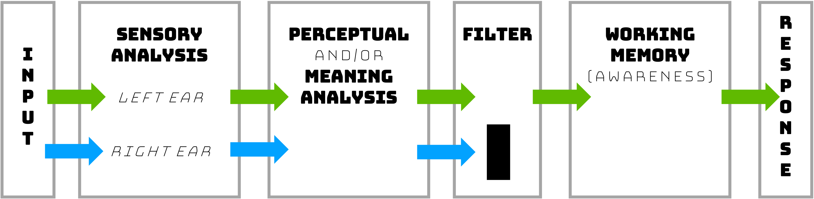
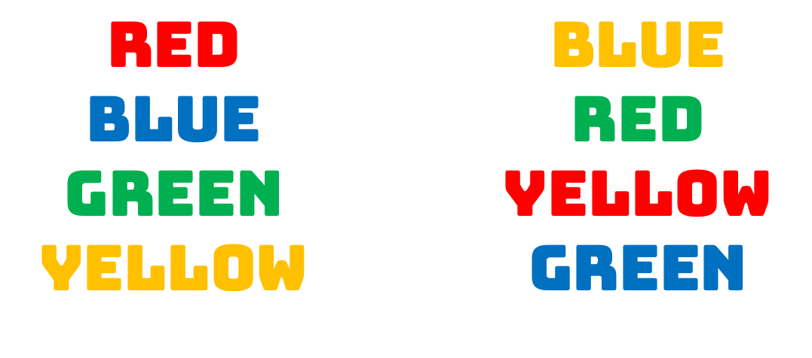

# Attention

We use the term “attention“ all the time, but what processes or abilities does that concept really refer to? This chapter will focus on how attention allows us to select certain parts of our environment and ignore other parts, and how effectively we can control our attentional resources. A key concept is the idea that we are limited in how much we can do at any one time. So we will also consider what happens when someone tries to do several things at once, such as driving while using electronic devices. Chapter 3 License and Attribution

:::learningobjectives
##### LEARNING OBJECTIVES {-}
1. Understand early dichotic listening experiments that informed how we think about selective attention, and models that have since been proposed to describe how we selectively attend to some things over others. 
2. Appreciate that our cognitive system can control our attentional resources, while recognizing the limits and constraints we face. 
:::

### What is Attention? {-}

(\#fig:fig3.1)Are you reading these words right here right now? If so, it’s only because you directed your attention toward them. [Image: CC BY 2.0,  HYPERLINK "https://goo.gl/BRvSA7%5D"https://goo.gl/BRvSA7]

Before we begin exploring attention in its various forms, take a moment to consider how you think about the concept. How would you define attention, or how do you use the term? We certainly use the word very frequently in our everyday language: “ATTENTION! USE ONLY AS DIRECTED!” warns the label on the medicine bottle, meaning be alert to possible danger. “Pay attention!” pleads the weary seventh-grade teacher, not warning about danger (with possible exceptions, depending on the teacher) but urging the students to focus on the task at hand. We may refer to a child who is easily distracted as having an attention disorder, although we also are told that Americans have an attention span of about 8 seconds, down from 12 seconds in 2000, suggesting that we all have trouble sustaining concentration for any amount of time (from www.Statisticbrain.com). How that number was determined is not clear from the website, nor is it clear how attention span in the goldfish—9 seconds!—was measured, but the fact that our average span reportedly is less than that of a goldfish is intriguing, to say the least.

American psychologist and philosopher William James wrote extensively about attention in the late 1800s. An often quoted passage (James, 1890/1983) beautifully captures how intuitively obvious the concept of attention is, while it remains very difficult to define in concrete and measurable terms:

> Everyone knows what attention is. It is the taking possession by the mind, in clear and vivid form, of one out of what seem several simultaneously possible objects or trains of thought. Focalization, concentration of consciousness are of its essence. It implies withdrawal from some things in order to deal effectively with others. (pp. 381–382)

Notice that this description touches on the conscious nature of attention, as well as the notion that what is in consciousness is often controlled voluntarily but can also be determined by external events that capture our attention. These events are often sensory in nature, such as the check engine light turning on in your car or the sound of someone calling your name from across the room. Implied in James' description is the idea that we seem to have a **limited capacity** for information processing, and that we can only attend to or be consciously aware of a small amount of information at any given time. If someone captures your attention by calling your name, you are - at least momentarily - pulled away from what you were doing before they called you. This relates to the concept of **selective attention**; some information can be attended to while other information is blocked out or ignored. The first part of this chapter will address selective attention and some models that have been proposed to explain how we selectively attend to different sensory inputs. 

As noted above, we often voluntarily **control** our attention. Sometimes we may need to have *sustained attention* or *vigilance* to complete a particular task. For example, a crucial issue in World War II was how long an individual could remain highly alert and accurate while watching a radar screen for enemy planes, and this problem led psychologists to study how attention works under such conditions. When watching for a rare event, it is easy to become distracted or allow concentration to lag. However, there are other times when we may need to be flexible and *switch our attention* to something else. For example, if you are reading while your partner is cooking dinner and the smoke alarm goes off, you should probably switch from paying attention to your book to helping him put out the fire. The second part of this chapter addresses how and how effectively we control our attention, including the consequences of overestimating our ability to attend to multiple sources of information or tasks at the saame time, such as texting and driving. 

### Selective Attention {-}

#### The Cocktail Party {-}
Selective attention is *the ability to select certain stimuli in the environment to process, while ignoring distracting information*. One way to get an intuitive sense of how attention works is to consider situations in which attention is used. A party provides an excellent example for our purposes. 

Imagine many people may be milling around, a dazzling variety of colors and sounds and smells, the buzz of many conversations. When walking around, you don't have to be looking at the person talking; you may start listening with great interest to some gossip while pretending not to hear, and may easily switch to listening to another conversation that grabs your attention as new people walk by. However, once you are engaged in conversation with someone, you quickly become aware that you cannot keep listening to other conversations at the same time. You  are also probably *not* aware of how tight your shoes feel or of the smell of a nearby flower arrangement. 

(\#fig:fig3.2)Beyond just hearing your name from the clamor at a party, other words or concepts, particularly unusual or significant ones to you, can also snag your attention. [Image: Ross,  HYPERLINK "https://goo.gl/TVDfTn,"https://goo.gl/TVDfTn, CC BY-NC-SA 2.0,  HYPERLINK "https://goo.gl/Toc0ZF%5D"https://goo.gl/Toc0ZF]

On the other hand, if someone behind you mentions your name, you typically notice it immediately and may start attending to that (much more interesting) conversation. This situation highlights an interesting set of observations. We have an amazing ability to select and track one voice or visual object, even when many things are competing for our attention. But at the same time, we seem to be limited in how much we can attend to at one time, which in turn suggests that attention is crucial in selecting what is important. How does it all work?

#### Dichotic Listening Studies {-}

This cocktail party scenario is the quintessential example of selective attention, and it is essentially what some early researchers tried to replicate under controlled laboratory conditions as a starting point for understanding the role of attention in perception (e.g., @Cherry1953; @Moray1959). In particular, they used [dichotic listening] and [shadowing tasks] to evaluate the selection process. Dichotic listening simply refers to the situation when two messages are presented simultaneously to an individual, with one message in each ear. In order to control which message the person attends to, the individual is asked to repeat back or “shadow” one of the messages as he hears it. For example, let’s say that a story about a camping trip is presented to John’s left ear, and a story about Abe Lincoln is presented to his right ear. The typical dichotic listening task would have John repeat the story presented to one ear as he hears it. Can he do that without being distracted by the information in the other ear?

People can become pretty good at the shadowing task, and they can easily report the content of the message that they attended to. But what happens to the message they ignored? Typically, people can tell you if the ignored message sounded masculine or feminine, or other physical characteristics of the speech, but they cannot tell you what the message was about. In fact, many studies have shown that people in a shadowing task were not aware of a change in the language of the message (e.g., from English to German; @Cherry1953), and they didn't even notice when the same word was repeated in the unattended ear more than 35 times [@Moray1959]! Only the basic physical characteristics, such as the pitch of the unattended message, could be reported.

On the basis of these types of experiments, we clearly have a limited capacity for processing information for meaning, making the selection process all the more important. How does this selection process work?

#### Models of Selective Attention {-}

##### Broadbent’s Filter Model {-}

Many researchers have investigated how selection occurs and what happens to ignored information. Donald Broadbent was one of the first to try to characterize the selection process. His Filter Model was based on the dichotic listening tasks described above as well as other types of experiments [@Broadbent1958]. He found that people select information on the basis of *physical features*: e.g., the sensory channel (or ear) that a message was coming in, the pitch of the voice, the color or font of a visual message. People seemed vaguely aware of the physical features of the unattended information, but had no knowledge of the meaning. As a result, Broadbent argued that selection occurs *very early*, with no additional processing for the unselected information. A flowchart of the model might look like this:

(\#fig:fig3.3)Figure 1: Broadbent Filter Model. This figure shows information coming in both the left and right ears. Some basic sensory information, such as pitch, is processed, but an internal filter only allows the information from one ear to be processed further. Only the information from the left ear is transferred to short-term memory (STM) and conscious awareness, and then further processed for meaning. Under this model, ignored information never makes it beyond a basic physical analysis.

##### Treisman’s Attenuation Model {-}

Broadbent’s model intuitively makes sense, but you may have noticed that one problem is that it cannot account for all aspects of the Cocktail Party Effect. What doesn’t fit? The fact is that you tend to hear your own name when it is spoken by someone, even if you are deeply engaged in a conversation. We mentioned earlier that people in a shadowing experiment were unaware of a word in the unattended ear that was repeated many times — and yet many people noticed their own name in the unattended ear even it occurred only once.

Anne @Treisman1960 carried out a number of dichotic listening experiments in which she presented two different stories to the two ears. In line with the standard procedure, she asked people to shadow the message in one ear. As the stories progressed, however, she switched the stories to the opposite ears. Treisman found that individuals spontaneously followed the story, or the content of the message, when it shifted from the left ear to the right ear. Then they realized they were shadowing the wrong ear and switched back.

Results like this, and the fact that you tend to hear meaningful information even when you aren’t paying attention to it, suggest that we *do* monitor the unattended information to some degree on the basis of its meaning. Therefore, Broadbent's Filter Model can’t be right because it suggests that unattended information is completely blocked at the sensory analysis level. Instead, Treisman suggested that selection starts at the physical or perceptual level, but that the unattended information is not blocked completely, it is just weakened or *attenuated*. As a result, highly meaningful or pertinent information in the unattended ear will get through the filter for further processing at the level of meaning. A flowchart of her model might look like this: 

(\#fig:fig3.4)Figure 2: Treisman Attenuation Model, an early selection model. This figure shows information coming in both ears, but in contrast to Figure 1, there is no filter that completely blocks nonselected information. Instead, selection of the left ear information strengthens that material, while the nonselected information in the right ear is weakened. However, if the preliminary analysis shows that the nonselected informatio is especially pertinent or meaningful (such as your own name) then the Attenuation Control will instead strengthen the more meaningful information.

##### Late Selection Models {-}

Other selective attention models have been proposed as well. A *late selection* or *response selection* model proposed by @Deutsch1963 suggests that all information in the unattended ear is processed on the basis of meaning, not just the selected or highly pertinent information. However, only the information that is relevant for the task response gets into conscious awareness. This model is consistent with ideas of subliminal perception; in other words, that you don’t have to be aware of or attending a message for it to be fully processed for meaning.

(\#fig:fig3.5)Figure 3: Deutsch and Deutsch late selection model. This figure shows a similar structure to the early selection model in Figure 2, with the major difference being that the location of the selective filter has changed, here being later on in the process. Here, the model makes the assumption that analysis of meaning occurs before selection occurs, but only the selected information becomes conscious.

##### Multimode Model {-}

Why did researchers keep coming up with different models? Because no model really seemed to account for all the data, some of which indicates that nonselected information is blocked completely, whereas some suggests that it can be processed for meaning. The multimode model addresses this apparent inconsistency, suggesting that the stage at which selection occurs can change depending on the task. @Johnston1978 demonstrated that under some conditions, we can select what to attend to at a very early stage and we do not process the content of the unattended message very much at all. Analyzing physical information, such as attending to information based on whether it sounds like a masculine or feminine voice, is relatively easy; it occurs automatically, rapidly, and doesn’t take much effort. Under the right conditions, we can select what to attend to on the basis of the meaning of the messages. However, the late selection option—processing the content of all messages before selection—is more difficult and requires more effort. The benefit, though, is that we have the flexibility to change how we deploy our attention depending upon what we are trying to accomplish, which is one of the greatest strengths of our cognitive system.

##### Selective Attention Beyond the Auditory Domain {-}

This discussion of selective attention has focused on experiments using auditory material, but the same principles hold for other sensory systems as well. Neisser investigated some of the same questions with visual materials by superimposing two semi-transparent video clips and asking viewers to attend to just one series of actions [@Neisser1979]. As with the auditory materials, viewers often were unaware of what went on in the other video, despite it being clearly visible. Twenty years later, @Simons1999 explored and expanded these findings using similar techniques, and triggered a flood of new work in an area referred to as *inattentional blindness*. In the original study, participants were instructed to complete a task that required paying close attention to certain features of a video clip; in doing so, many of them completely missed other features, such as a man in a gorilla costume walking into the scene [@Simons1999].

:::fyi
#### Subliminal Perception {-}
The idea of *subliminal perception* — that stimuli presented below the threshold for awareness can influence thoughts, feelings, or actions — is a fascinating and kind of creepy one. Can messages you are unaware of, embedded in movies or ads or the music playing in the grocery store, really influence what you buy? Many such claims of the power of subliminal perception have been made. One of the most famous came from a market researcher who claimed that the message “Eat Popcorn” briefly flashed throughout a movie increased popcorn sales by more than 50%, although he later admitted that the study was made up [@Merikle2004]. Psychologists have worked hard to investigate whether this is a valid phenomenon. But studying subliminal perception is more difficult than it might seem, because of the difficulty of establishing what the threshold for consciousness is or of even determining what type of threshold is important. For example, @Cheesman1984 made an important distinction between objective and subjective thresholds (see also @Cheesman1986). The bottom line is that there is some evidence that individuals can be influenced by stimuli they are not aware of, but how complex the stimuli can be or the extent to which unconscious material can affect behavior is not settled (e.g., @Bargh2014; @Greenwald1992; @Merikle2004).
:::

### Controlling Attention {-}

As mentioned in the previous section, one of the greatest strengths of our cognitive system is the ability to control how we deploy our cognitive resources to achieve our goals, also known as **cognitive control**.In the attention domain, we can try to devote all our attention to one thing or we can try to switch our attention to something else. But how good are we at each of these processes? And what happens when we try to do too much at once? 

#### Sustaining Attention {-}

Imagine trying to do your homework with many external and internal distractors: your phone buzzes from an incoming text message, a thought pops into your head about what you want to eat for dinner, a colorful hummingbird flies by your window. If you have a goal to finish your homework assignment before the deadline, you may have to actively focus your attention on your homework despite these distractors. One part of cognitive control is *inhibitory control*, or the suppression of goal-irrelevant stimuli (*attentional inhibition*) or responses (*response inhibition*) [@Tiego2018]. Attentional inhibition is thought to be an important aspect of sustaining attention.  

##### Stroop Experiments {-}

A common task used to study attention is the Stroop task, named for J.R. Stroop who described it in one of the most highly cited experimental psychology papers ever [@Stroop1935]. In the classic Stroop task, participants are shown words in different colors, and instructed to say out loud the color of the word (not the word itself) as quickly and accurately as they can. That is, their task is to pay attention to the ink color, and ignore anything else that might distract them. Sometimes words match the color they are printed in, such as the words on the left below. Other times words are printed in a color that differs from their meanings, such as the words on the right. 

(\#fig:fig 3.6)Example of congruent (left) and incongruent (right) stimuli in a classic Stroop paradigm.

When the word meaning matches its ink color, or they are *congruent*, the task is pretty easy and participants respond relatively quickly and accurately. However, when the word meaning doesn’t match its ink color, or they are *incongruent*, participants tend to respond slower and make more errors (often by reading out the word, rather than its color). Try it yourself! Even with the simple example above, you might notice that you get tripped up with the incongruent stimuli. One key idea is that with incongruent stimuli there is **interference** between processing the physical features of the word (color) and its semantics (meaning), and we need to inhibit the irrelevant yet salient semantic information to succeed at the task. Even if we try to attend to just one thing, we can still be thrown off if other things are distracting enough. 

#### Switching Attention {-}

In our previous example about doing homework, we called attention-grabbing items or events “distractors.” However, sometimes our goals change or important new information comes up, and we *want* or *need* to switch our attention to something else. In this case, such inputs aren’t distractions, but rather helpful cues to switch our attention. Up until now, it may have sounded like having your attention pulled away or actively switching attention is quite easy and natural. But it turns out that switching itself is cognitively demanding and can impair performance. 

##### Task Switching Experiments {-}

A large body of work studies cognitive flexibility, or how we adapt our cognition to new or changing environments or goals. A typical task switching experiment involves first training participants to complete two or more simple tasks that relate to the same set of stimuli, and then having them switch back and forth between them [@Monsell2003]. For example, researchers can train participants to classify the number (e.g., odd or even) *or* the letter (e.g., vowel or consonant) when shown a number-letter pair. If a subject had to complete the number classification task for these stimuli – E1, 8Z, D3, 7U – the correct responses would be “odd”, “even”, “odd”, “odd”. But if they were cued to switch back and forth between the two tasks for the same stimuli in this example, the correct responses would be “odd”, “consonant”, “odd”, “vowel”.  

In order to successfully switch in a task switching experiment, it is thought that some mental process(es) of task-set reconfiguration much happen, which can include switching attention between stimuli or concepts, retrieving different goal states and task-set rules, and activating or adjusting responses [@Monsell2003]. Many different task switching paradigms have been used in psychology and cognitive neuroscience to understand how we switch between doing different tasks. One reliable behavioral finding is that on switch trials compared to non-switch trials, participants are slower and less accurate in their responding. This suggests that switching is cognitively demanding and comes at a cost. 

#### Multitasking {-}

In spite of the evidence of our limited capacity, many of us like to think that we can do several things at once. Some people claim to be able to *multitask* without any problem: reading a textbook while watching television or talking with friends, talking on the phone while playing video games, even texting while driving. The fact is that sometimes we *seem* to juggle several things at once, particularly when some or all of the tasks are “easy.” For example, as we talk to someone while walking down the street, we don’t need to think consciously about what muscle to contract to take our next step. In fact, paying attention to automated skills can lead to a breakdown in performance, or “choking” (e.g., @Beilock2001). But what about higher level, more mentally demanding tasks? Is it possible to perform multiple complex tasks *at the same time*? 

In one study, two participants were trained to take dictation for spoken words while reading unrelated material for comprehension [@Spelke1976]. First, they performed each task separately, to determine baseline performance when allocating as many cognitive resources as necessary. Then they performed the two tasks simultaneously. They received a lot of practice: 1 hour each day, 5 days a week, for 17 weeks. These two participants were able to learn dictation for lists of words and read for comprehension without impairing performance in either task. The authors suggested that perhaps there are not fixed limits on our attentional capacity. However, changing the tasks, such as reading aloud rather than silently, impaired performance initially, so this multitasking ability was likely specific to the tasks being well-learned. 

Unless a task is fully automated, many researchers suggest that “multitasking” doesn’t exist – even when you think you are multitasking, you are just rapidly switching your attention back and forth. A body of research using dual-task paradigms suggests that earlier estimates of our capacity for doing two or more things at the same time were overly optimistic; some cognitive operations cause “bottlenecks” that require exclusive use of a cognitive resource and therefore cannot be done concurrently [@Pashler1993]. This has been supported in experimental psychology and applied to real-world situations, including distracted driving (see next section) and emergency medicine. One review paper argued that it is impossible to multitask unless behaviors are completely automatic, and that in emergency medicine, physicians are instead rapidly switching between small tasks, which can come at a cost [@Skaugset2016]. 

#### Distracted Driving {-}

Relevant to our current lifestyles are questions about multitasking while texting or having cell phone conversations. Research designed to investigate, under controlled conditions, multitasking while driving has revealed some surprising results. There are many possible types of distractions that could impair driving performance, such as applying makeup using the rearview mirror, attempting (usually in vain) to stop the kids in the backseat from fighting, fiddling with the CD player, trying to negotiate a handheld cell phone, a cigarette, and a soda all at once, eating a bowl of cereal while driving (!). But we tend to have a strong sense that we CAN multitask while driving, and cars are being built with more and more technological capabilities that encourage multitasking. How good are we at dividing attention in these cases?

(\#fig:fig3.7)If you look at your phone for just 5 seconds while driving at 55mph, that means you have driven the length of a football field without looking at the road. [Image: CC0 Public Domain, https://goo.gl/m25gce] 

Most people acknowledge the distraction caused by texting while driving and the reason seems obvious: Your eyes are off the road and your hands and at least one hand (often both) are engaged while texting. However, the problem is not simply one of occupied hands or eyes, but rather that the cognitive demands on our limited capacity systems can seriously impair driving performance [@Strayer2011]. The effect of a cell phone conversation on performance (such as not noticing someone’s brake lights or responding more slowly to them) is just as significant when the individual is having a conversation with a hands-free device as with a handheld phone; the same impairments do not occur when listening to the radio or a book on tape [@Strayer2001]. Moreover, studies using eye-tracking devices have shown that drivers are less likely to later recognize objects that they did look at when using a cell phone while driving [@Strayer2007]. These findings demonstrate that cognitive distractions such as cell phone conversations can produce inattentional blindness, or a lack of awareness of what is right before your eyes (see also, @Simons1999). Sadly, although we may think that we can multitask while driving, in fact the percentage of people who can truly perform cognitive tasks without impairing their driving performance is estimated to be only about 2% [@Watson2010]. 

:::fyi
#### Attention-Deficit/Hyperactivity Disorder (ADHD) {-}
By the end of their first decade of life, typically developing children have mastered the complex cognitive operations required to comply with the rules, such as stopping themselves from acting impulsively, [paying attention to parents and teachers in the face of distraction], and sitting still despite boredom. For children with Attention-Deficit/Hyperactivity Disorder (ADHD), exercising self-control is a unique challenge. Some people used to believe that children with ADHD were willfully noncompliant due to moral or motivational deficits [@Still1902]. However, scientists now know that noncompliance observed in ADHD can be explained by many factors, including neurological dysfunction. 

ADHD is the most commonly diagnosed childhood behavior disorder, affecting 3% to 7% of children in the United States, according to the American Psychiatric @APA2000. The core symptoms of ADHD are organized into two clusters: hyperactivity/impulsivity and inattention. Hyperactive and impulsive symptoms are closely related, the former involving moving perpetually (even when stillness is expected) and the latter including acting without considering repercussions. Inattentive symptoms describe difficulty with organization and task follow-through, as well as a tendency to be distracted by external stimuli. Broadly speaking, boys are more likely than girls to experience symptoms from the hyperactive and impulsive cluster [@Hartung1998], while girls are more likely to experience symptoms from the inattentive cluster [@Quinn2014]. Gender differences in how ADHD presents, combined with other factors such as how parents, teachers, or clinicians notice and interpret ADHD symptoms, have contributed to many women and girls with ADHD not being diagnosed or treated [@Quinn2014]. 

:::

It may be useful to think of attention as a mental resource, one that is needed to focus on and fully process important information, especially when there is a lot of distracting “noise” threatening to obscure the message. Our selective attention system allows us to find or track an object or conversation in the midst of distractions. Whether the selection process occurs early or late in the analysis of those events has been the focus of considerable research, and in fact how selection occurs may very well depend on the specific conditions. With respect to controlling our attention, in general we can only perform one cognitively demanding task at a time, and even then, we can be distracted from performing that task if the conditions are right. Switching back and forth between different tasks also comes at a cost. When we focus our attention on one task or source of information, we may not even be aware of unattended events even though they might seem too obvious to miss. This type of inattention blindness can occur even in well-learned tasks, such as driving while talking on a cell phone. Understanding how attention works is clearly important, including for our everyday lives. 

:::takeaways
##### Key Takeaways {-}
- a
- b
:::

:::exercises
##### Exercises {-}
1. a
2. b
:::

## Glossary
