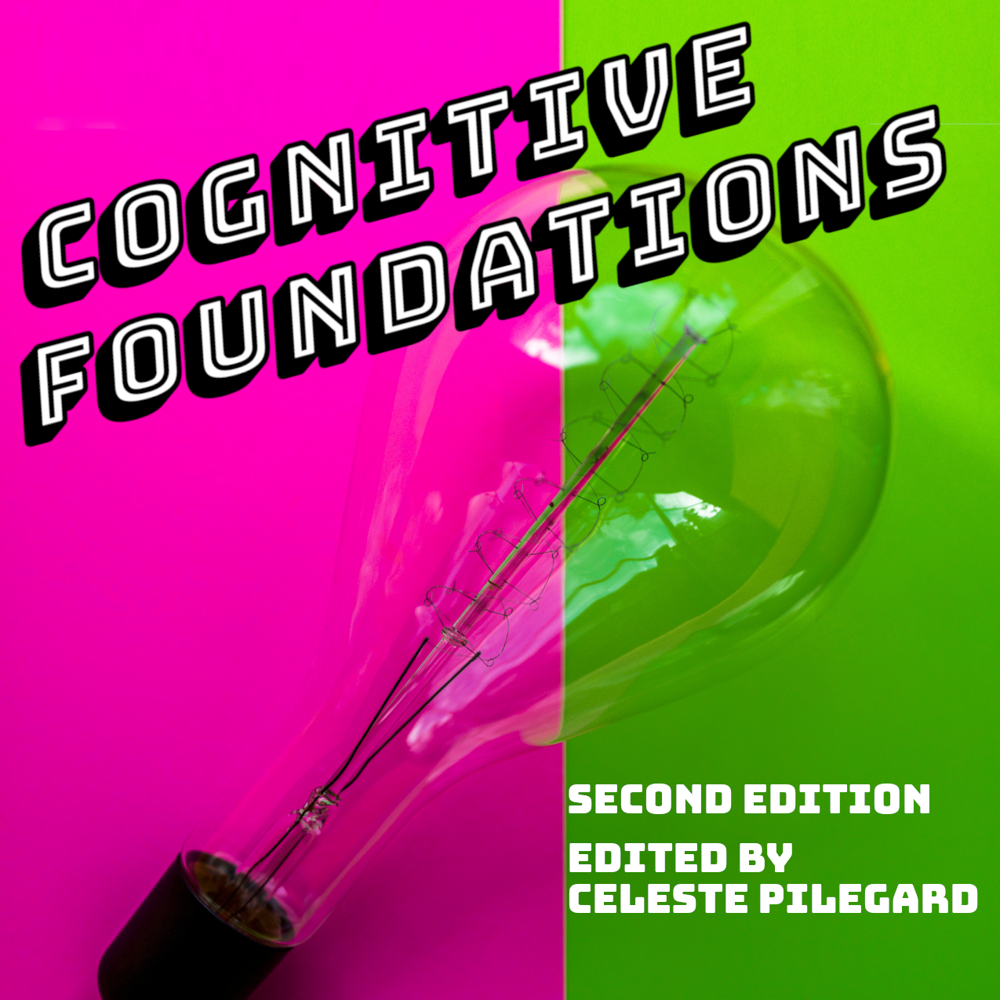

--- 
title: "Cognitive Foundations"
author: "Edited by Celeste Pilegard"
date: "Current version rendered `r Sys.Date()`"
site: bookdown::bookdown_site
documentclass: krantz
bibliography: [book.bib, packages.bib]
csl: apa.csl
url: https://pilegard.github.io/cogfoundations/
favicon: images/favicon.ico
cover-image: images/cover.png
description: |
  This is a an OER textbook for introduction to cognitive psychology.
link-citations: yes
github-repo: pilegard/cogfoundations
---

# About {-}

## About the Book {-}
This collaborative book project is led by Celeste Pilegard, but represents the work of dozens of authors and collaborators listed below. Dr. Pilegard is an Associate Teaching Professor in the Department of Psychology at the University of California, San Diego. Correspondence can be sent to [Celeste Pilegard](mailto:pilegard@ucsd.edu). 

Please use this [Google form](https://forms.gle/83CBvAgLuJshRfz37) to let us know if you've used the book in your course. If you notice an error or would like to suggest an improvement, please do one of the following: (1) use the [GitHub site](https://github.com/pilegard/cogfoundations) to open an issue or submit a pull request with the suggested change, (2) use this [Google form](https://forms.gle/83CBvAgLuJshRfz37), or (3) [send an email](mailto:pilegard@ucsd.edu) with "Cognitive Foundations OER" in the subject line.

This book was formatted using [bookdown](https://bookdown.org/), an R package.

ISBN 979-8-9912306-0-5 corresponds to the PDF version of Cognitive Foundations v2.0, published July 25, 2024, permanently available at https://github.com/pilegard/cogfoundations/releases/tag/v2.0. The updated version of Cognitive Foundations is available at https://pilegard.github.io/cogfoundations/.

### Second Edition {-}
The second edition of this book builds on the first edition with updates, improvements, and edits by a team of UC San Diego graduate student content experts:

- Catherine Arnett (Language)
- Pria Daniel (Attention)
- Mohan Gupta (Long-Term Memory)
- Leo Kleiman-Lynch (Reasoning and Decision Making)
- Hayden Schill (Perception, Working Memory)
- Anne Yilmaz (Memory in Context)

Additionally, Annie S. Ditta (UC Riverside) completed the second edition edits to the Problem Solving chapter. M. Gupta and C. Pilegard converted the book to bookdown. C. Pilegard redesigned the book layout, updated figures throughout, updated the chapter on History, and edited all chapters. We thank John Wixted for his feedback on portions of the chapters on memory.

The second edition of this book was supported by a Course Development and Instructional Improvement Program grant awarded to C. Pilegard. The program is sponsored by the Division of Undergraduate Education at the University of California, San Diego.

### First Edition {-}
The first edition of this book was aggregated from multiple Open Educational Resources by Celeste Pilegard. All adaptations, revisions, and transformations of source material were completed by Celeste Pilegard.

The original authors of the work remixed for the first edition of the book are listed below:

- Mehgan Andrade, College of the Canyons
- Mara Aruguete, Lincoln University
- David B. Baker, University of Akron
- Laura Bryant, Eastern Gateway Community College
- Barbara Chappell, Walden University
- Kathryn Dumper, Bainbridge State College
- Frances Friedrich, University of Utah
- William J. Jenkins, Mercer University
- Arlene Lacombe, Saint Joseph’s University
- Cara Laney, Reed College
- Julie Lazzara, Paradise Valley Community College
- Elizabeth F. Loftus, University of California, Irvine
- Marilyn D. Lovett, Spelman College
- Tammy McClain, West Liberty University
- Richard Milich, University of Kentucky
- Gregory Murphy, New York University
- Barbara B. Oswald, Miami University
- Marion Perlmutter, University of Michigan
- Walter Roberts, University of Kentucky
- Christie Napa Scollon, Singapore Management University
- Heather Sperry, University of Akron
- Rose M. Spielman, Formerly of Quinnipiac University
- Charles Stangor, University of Maryland
- Mark D. Thomas, Albany State University
- Jennifer Walinga, Royal Roads University
- Neil Walker, College of the Canyons
- Authors of the [Cognitive Psychology and Cognitive Neuroscience Wikibook](https://en.wikibooks.org/wiki/Cognitive_Psychology_and_Cognitive_Neuroscience)
- Wikipedia authors

C. Pilegard authored original portions of the first edition where noted below.

Many thanks to the original authors for their work and for choosing open licenses.

## License and Attributions {-}
Unless otherwise noted, this work is licensed under the Creative Commons Attribution-NonCommercial-ShareAlike 4.0 International License. To view a copy of this license, visit http://creativecommons.org/licenses/by-nc-sa/4.0/ or send a letter to Creative Commons, PO Box 1866, Mountain View, CA 94042, USA.

Front cover photo by Nathan Dumlao on Unsplash.

Licenses and attributions for individual chapters are noted in the following sections.

### Chapter 1. History and Research Methods {-}
#### First edition {-}
Rise of Cognitive Psychology\
Source: Spielman, R. M., Dumper, K., Jenkins, W., Lacombe, A., Lovett, M., & Perlmutter, M. (2014). Psychology. Houston, Tx: OpenStax.\
Psychology by Spielman et al. is licensed under a Creative Commons Attribution License.\
Condensed from original

Source: Baker, D. B. & Sperry, H. (2019). History of psychology. In R. Biswas-Diener & E. Diener (Eds), Noba textbook series: Psychology. Champaign, IL: DEF publishers. Retrieved from http://noba.to/j8xkgcz5 \
History of Psychology by David B. Baker and Heather Sperry is licensed under a Creative Commons Attribution-NonCommercial-ShareAlike 4.0 International License.\
Condensed from original

Research Methods in Psychology\
Source: Scollon, C. N. (2019). Research designs. In R. Biswas-Diener & E. Diener (Eds), Noba textbook series: Psychology. Champaign, IL: DEF publishers. Retrieved from http://noba.to/acxb2thy \
Research Designs by Christie Napa Scollon is licensed under a Creative Commons Attribution-NonCommercial-ShareAlike 4.0 International License\
Condensed from original; Example experiment under “Experimental research” changed to Mueller and Oppenheimer (2014).

#### Second edition {-}
Paragraph on ongoing improvements to cognitive psychology added to Rise of Cognitive Psychology section. Example experiment under "Experimental Research" changed to Padilla et al. (2022).

### Chapter 2. Perception {-}
#### First edition {-}
Perception \
Source: Stangor, C. and Walinga, J. Introduction to Psychology – 1st Canadian Edition. Victoria, B.C.: BCcampus. Retrieved from: https://opentextbc.ca/introductiontopsychology/
Introduction to Psychology - 1st Canadian Edition by Charles Stangor is licensed under a Creative Commons Attribution-NonCommercial-ShareAlike 4.0 International License.\
Changes and additions (c) 2014 Jennifer Walinga, licensed under a Creative Commons Attribution-NonCommercial-ShareAlike 3.0 Unported License.\
Condensed from Walinga version; American spellings used; Imperial measurements used; some content adapted to suit course.

#### Second edition {-}
Revisions to first edition version: Structure and framing reorganized. More recent content on multisensory integration added. Computer vision added.

Cover photo by Mathilda Khoo on Unsplash.

### Chapter 3. Attention {-}
#### First edition {-}
Attention\
Source: Friedrich, F. (2019). Attention. In R. Biswas-Diener & E. Diener (Eds), Noba textbook series: Psychology. Champaign, IL: DEF publishers. Retrieved from http://noba.to/uv9x8df5 \
Attention by Frances Friedrich is licensed under a Creative Commons Attribution-NonCommercial-ShareAlike 4.0 International License.\
Condensed from original version; some content adapted to suit course. 

Source: Milich, R. & Roberts, W. (2022). Adhd and behavior disorders in children. In R. Biswas-Diener & E. Diener (Eds), Noba textbook series: Psychology. Champaign, IL: DEF publishers. Retrieved from http://noba.to/cpxg6b27 \
ADHD and Behavior Disorders in Children by Richard Milich and Walter Roberts are licensed under a Creative Commons Attribution-NonCommercial-ShareAlike 4.0 International License.
Condensed from original version; some content adapted to suit course. 

#### Second edition {-}
Revisions to first edition version: Chapter edited throughout for clarity. Section on Controlling Attention added. Sections on Divided Attention and Multitasking condensed and added to Controlling Attention. Box about Attention-Deficit/Hyperactivity Disorder (ADHD) added. Learning Objectives, Key Takeaways, Exercises, and Glossary added. 

Cover photo by chuttersnap on Unsplash.

### Chapter 4. Working Memory {-}
#### First edition {-}
Working Memory\
Source: Multiple authors. Memory. In Cognitive Psychology and Cognitive Neuroscience. Wikibooks. Retrieved from https://en.wikibooks.org/wiki/Cognitive_Psychology_and_Cognitive_Neuroscience \
Wikibooks are licensed under the Creative Commons Attribution-ShareAlike License.
Cognitive Psychology and Cognitive Neuroscience is licensed under the GNU Free Documentation License.\
Condensed from original version. American spellings used. Content added or changed to reflect American perspective and references. Context and transitions added throughout. Substantially edited, adapted, and (in some parts) rewritten for clarity and course relevance. Chapter introduction added. Content added including transition from STM to WM approach, description of episodic buffer, description and evidence for working memory components, addition of episodic buffer.

#### Second edition {-}
Revisions to first edition version: Edits for clarity and more examples added. Section on working memory and distinctiveness added. Language updated to reflect Wixted (2024) on the Atkinson/Shiffrin model.

Cover photo by Matt Briney on Unsplash.

### Chapter 5. Long-Term Memory {-}
#### First edition {-}
Long term memory\
Source: Stangor, C. and Walinga, J. (2014). Introduction to Psychology – 1st Canadian Edition. Victoria, B.C.: BCcampus. Retrieved from: https://opentextbc.ca/introductiontopsychology/
Introduction to Psychology - 1st Canadian Edition by Charles Stangor is licensed under a Creative Commons Attribution-NonCommercial-ShareAlike 4.0 International License.\
Changes and additions (c) 2014 Jennifer Walinga, licensed under a Creative Commons Attribution-NonCommercial-ShareAlike 3.0 Unported License.\
Condensed from Walinga version; American spellings used; Imperial measurements used; some content adapted to suit course.

Serial position curve information from: Andrade, M., & Walker, N. (n.d.) Cognitive Psychology. 
Cognitive Psychology by Mehgan Andrade and Neil Walker is licensed under a Creative Commons Attribution4.0 International License.

Encoding, Retrieval, and Consolidation\
Source: The following entries accessed from http:/www.en.wikipedia.org/ served as sources for this chapter: Memory Rehearsal; Levels-of-processing Effect; Testing Effect; Encoding Specificity Principle; Transfer-Appropriate Processing; Memory Consolidation.\
Wikipedia text is licensed under the Creative Commons Attribution-ShareAlike License.\
Chapter introduction added. Transitions and images added. Edited for content and clarity throughout.

Some encoding specificity principle information from: Andrade, M., & Walker, N. (n.d.) Cognitive Psychology.\
Cognitive Psychology by Mehgan Andrade and Neil Walker is licensed under a Creative Commons Attribution4.0 International License.\

#### Second edition {-}
Revisions to first edition version: Simplified the differences between computers and brains. Additional section of the testing effect and an explanation of a possible mechanism. Addition of the spacing effect and the current mechanisms that we know contribute to it. Clarification of memory consolidation and its relation to sleep. Sleep does not cause more learning, it only reduces interference from other memories. Addition of targeted memory reactivation box during sleep, where it is possible to increase the memory strength during sleep. Language updated to reflect Wixted (2024) on the Atkinson/Shiffrin model.

Cover photo by Julian Dik on Unsplash.

### Chapter 6. Memory in Context {-}
#### First edition {-}
Memory in Context\
Kinds of Memory Biases; Misinformation Effect\
Source: Laney, C. & Loftus, E. F. (2019). Eyewitness testimony and memory biases. In R. Biswas-Diener & E. Diener (Eds), Noba textbook series: Psychology. Champaign, IL: DEF publishers. Retrieved from http://noba.to/uy49tm37 \
Eyewitness Testimony and Memory Biases by Cara Laney and Elizabeth F. Loftus is licensed under a Creative Commons Attribution-NonCommercial-ShareAlike 4.0 International License.\
Condensed from original

Schematic Processing; Source Monitoring; Flashbulb Memories\
Stangor, C. and Walinga, J. (2014). Introduction to Psychology – 1st Canadian Edition. Victoria, B.C.: BCcampus. Retrieved from: [https://opentextbc.ca/introductiontopsychology/](https://opentextbc.ca/introductiontopsychology/) \
Introduction to Psychology - 1st Canadian Edition by Charles Stangor is licensed under a Creative Commons Attribution-NonCommercial-ShareAlike 4.0 International License.\
Changes and additions (c) 2014 Jennifer Walinga, licensed under a Creative Commons Attribution-NonCommercial-ShareAlike 3.0 Unported License.\
Condensed from original; American spellings used; cultural references updated for American audience

Forgetting\
Source: Spielman, R. M. OpenStax, Psychology. OpenStax CNX. [http://cnx.org/contents/4abf04bf-93a0-45c3-9cbc-2cefd46e68cc@12.2](http://cnx.org/contents/4abf04bf-93a0-45c3-9cbc-2cefd46e68cc@12.2).
Psychology by Spielman (+ multiple authors) is licensed under a Creative Commons Attribution 4.0 International License\
Condensed from original

#### Second edition {-}
Revisions to first edition version: Edits for clarity and additional context throughout. Added content on distinction between retrieval and recognition. Emphasis added to demonstrate role of memory contamination over time to reflect more recent research. Citations and characterization of eyewitness memory research substantially updated.

Cover photo by Alex Grodkiewicz on Unsplash.

### Chapter 7. Knowledge {-}
#### First edition {-}
Knowledge\
Introduction through Theories of Concept Representation\
Source: Murphy, G. (2019). Categories and concepts. In R. Biswas-Diener & E. Diener (Eds), Noba textbook series: Psychology. Champaign, IL: DEF publishers. Retrieved from http://noba.to/6vu4cpkt \
Categories and Concepts by Gregory Murphy is licensed under a Creative Commons Attribution-NonCommercial-ShareAlike 4.0 International License.\
Condensed from original version. 

Concept Organization\
Source: Multiple authors. Memory. In Cognitive Psychology and Cognitive Neuroscience. Wikibooks. Retrieved from https://en.wikibooks.org/wiki/Cognitive_Psychology_and_Cognitive_Neuroscience\
Wikibooks are licensed under the Creative Commons Attribution-ShareAlike License.
Cognitive Psychology and Cognitive Neuroscience is licensed under the GNU Free Documentation License.\
Condensed from original version. American spellings used. Content added or changed to reflect American perspective and references. Context and transitions added throughout. Substantially edited, adapted, and (in some parts) rewritten for clarity and course relevance.

Cover photo by Alli Elder on Unsplash.

### Chapter 8. Language {-}
#### First edition {-}
Language\
Source: Stangor, C. and Walinga, J. (2014). Introduction to Psychology – 1st Canadian Edition. Victoria, B.C.: BCcampus. Retrieved from: https://opentextbc.ca/introductiontopsychology/
Introduction to Psychology - 1st Canadian Edition by Charles Stangor is licensed under a Creative Commons Attribution-NonCommercial-ShareAlike 4.0 International License.\
Changes and additions (c) 2014 Jennifer Walinga, licensed under a Creative Commons Attribution-NonCommercial-ShareAlike 3.0 Unported License.\
Condensed from original; American spellings used; cultural references updated for American audience. Bilingualism reverted to Strangor version.

Sentence Processing section from Wikipedia entry (http:/www.en.wikipedia.org/), “Sentence Processing.”\
Wikipedia text is licensed under the Creative Commons Attribution-ShareAlike License.

#### Second edition {-}
Revisions to first edition version: Content added to "What is Language", "Linguistic Diversity", and "Language Acquisition" sections from source: Anderson, C., Bjorkman, B., Denis, D., Doner, J., Grant, M., Sanders, N., & Taniguchi, A. (2022). Essentials of Linguistics, 2nd edition. eCampusOntario.
Essentials of Linguistics, 2nd edition Copyright © 2022 by Catherine Anderson; Bronwyn Bjorkman; Derek Denis; Julianne Doner; Margaret Grant; Nathan Sanders; and Ai Taniguchi is licensed under a Creative Commons Attribution-NonCommercial-ShareAlike 4.0 International License, except where otherwise noted.\

Edited for clarity and restructured throughout. Citations and context updated. Figures added. "Language and Thought" section added. Original writing added throughout.

Cover photo by Sushil Nash on Unsplash.

### Chapter 9. Reasoning and Decision Making {-}
#### First edition {-}
Reasoning and Decision Making\
Source: Multiple authors. Memory. In Cognitive Psychology and Cognitive Neuroscience. Wikibooks. Retrieved from https://en.wikibooks.org/wiki/Cognitive_Psychology_and_Cognitive_Neuroscience
Wikibooks are licensed under the Creative Commons Attribution-ShareAlike License.
Cognitive Psychology and Cognitive Neuroscience is licensed under the GNU Free Documentation License.\
Condensed from original version. American spellings used. Content added or changed to reflect American perspective and references. Context and transitions added throughout. Substantially edited, adapted, and (in some parts) rewritten for clarity and course relevance. 

#### Second edition {-}
Revisions to first edition version: Sections 9.1 and 9.2 edited mostly for clarity, with subsection on confirmation bias edited for content as well. Section 9.3 on decision making entirely removed and rewritten from scratch, including new subsections on theories of decision making and constructed preferences.

Cover photo by Qurratul Ayin Sadia on Unsplash.

### Chapter 10. Problem Solving {-}
#### First edition {-}
Problem Solving\
Source: Multiple authors. Memory. In Cognitive Psychology and Cognitive Neuroscience. Wikibooks. Retrieved from https://en.wikibooks.org/wiki/Cognitive_Psychology_and_Cognitive_Neuroscience
Wikibooks are licensed under the Creative Commons Attribution-ShareAlike License.
Cognitive Psychology and Cognitive Neuroscience is licensed under the GNU Free Documentation License.\
Condensed from original version. American spellings used. Content added or changed to reflect American perspective and references. Context and transitions added throughout. Substantially edited, adapted, and (in some parts) rewritten for clarity and course relevance. 

#### Second edition {-}
New sections added: Creativity, Fixation on Examples, Overcoming Mental Fixation, Curse of Expertise. All figures updated.

Cover photo by Zoe Holling on Unsplash.
